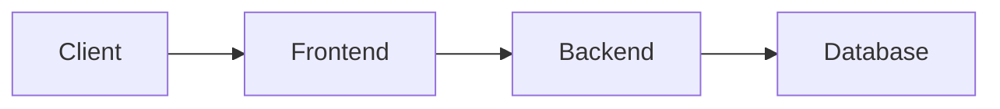

# Voxt Documentation Guide

Use this skill when creating or editing documentation in the `/docs` folder.

## Documentation Structure

The `/docs` folder contains VitePress-based documentation for Voxt:

| Path | Contents |
|------|----------|
| `index.md` | Homepage with hero section and feature highlights |
| `architecture/` | Architecture docs: overview, project structure, service design |
| `ui/` | UI docs: component guidelines, virtual list, safe areas, splash screens |
| `live-video/`, `live-audio/` | The two streaming pipelines, end to end |
| `development/` | Full-stack feature implementation guide |
| `plans/` | The task tracker (`plans/index.md`) plus one file per open plan |
| `testing/` | Testing documentation and guides |
| `tests/` | Test scripts (e.g., Playwright scripts) |
| `releases/` | Per-release notes |
| `running-voxt.md` | Development environment setup guide |
| `CODING_STYLE.md` | Coding conventions and style guidelines |
| `AGENTS.md` | AI agent instructions for the repository |
| `.vitepress/` | VitePress configuration and theme |

A plan is deleted from `plans/` once its work ships or the approach is dropped —
`plans/index.md` tracks what is still open, and `git log` keeps the rest.

## Essential Rules

### 1. Use Mermaid Diagrams (Not ASCII Art)

Always prefer Mermaid diagrams over ASCII art for visualizations. Mermaid renders beautifully in VitePress and is easier to maintain.

For Mermaid syntax details and gotchas, use the `/docs-mermaid` skill.

**Good:**


**Avoid:**
```
Client --> Frontend --> Backend --> Database
```

### 2. Link Source Code to GitHub

When referencing Voxt/ActualChat source code, always link to the file in the GitHub repository so readers can easily view the source.

**Repository URL:** `https://github.com/Actual-Chat/actual-chat`

**Format:** `[DisplayName](https://github.com/Actual-Chat/actual-chat/blob/main/path/to/file.cs)`

**Examples:**

| Reference | Link Format |
|-----------|-------------|
| File | `[IChatsBackend.cs](https://github.com/Actual-Chat/actual-chat/blob/main/src/dotnet/Chat.Contracts/IChatsBackend.cs)` |
| Specific line | `[ChatsBackend.cs:42](https://github.com/Actual-Chat/actual-chat/blob/main/src/dotnet/Chat.Service/Chats/ChatsBackend.cs#L42)` |
| Line range | `[ChatsBackend.cs:42-50](https://github.com/Actual-Chat/actual-chat/blob/main/src/dotnet/Chat.Service/Chats/ChatsBackend.cs#L42-L50)` |
| Directory | `[Chat.Service/](https://github.com/Actual-Chat/actual-chat/tree/main/src/dotnet/Chat.Service)` |

**Do NOT** use relative file paths like `../../src/dotnet/...` - these won't work in the rendered docs.

### 3. Use VitePress Conventions

- Frontmatter at the top of pages (title, description, etc.)
- Use `[[toc]]` for auto-generated table of contents
- Use containers for callouts: `::: info`, `::: tip`, `::: warning`, `::: danger`

**Example:**
```markdown
::: tip
This is a helpful tip for developers.
:::

::: warning
Be careful when modifying this configuration.
:::
```

### 4. Keep Navigation Updated

When adding new pages, update `.vitepress/config.mts` to include them in the sidebar navigation.

### 5. Text Formatting

- Use sentence case for headings (not Title Case or ALL CAPS)
- Keep paragraphs concise
- Use tables for structured data
- Use code blocks with language hints (```csharp, ```typescript, etc.)

## Running the Docs Site Locally

```bash
cd docs
npm install
npm run docs:dev
```

The site will be available at `http://localhost:5174`.

## Building for Production

```bash
cd docs
npm run docs:build
```

Output goes to `docs/.vitepress/dist/`.

## Task

$ARGUMENTS
