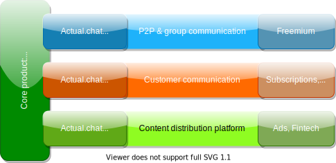

---

---
<!-- _class: highlight center invert -->

<h1>💸 Let's make a bet: 
 
15 more minutes,  
and you'll be asking yourself, 
"WTF no one did this yet?"
<h1>

---
<!-- _class: highlight center -->

<h2>True or false: 
 
"Modern-day communication experience is good enough - 
there isn't much to improve."
</h2>

---

← This is called "call history" 🤔

---
<!-- _class: center -->

          
<h3>
Looks good, right? 
Q: Why this isn't shown in real-time?  
Why I can't respond right there? 
</h3>

---
<!-- _class: invert center -->

<h1>Wait, but people love phone calls! 
They do, right?</h1>

<footer style="font-size: 24px">
Hang tight, loading my meme gun.
</footer>

---
<!-- _class: highlight center -->

---
<!-- _class: highlight -->

---
<!-- _class: invert highlight -->

<h3>On a serious note:</h3>

☎ = talk + demand other party to answer
📧 = no demand, but you have to type it

That's why calling or receiving calls is a stressful activity for a fair share of population.

**But do you really have to choose?**

---
<!-- _class: invert highlight -->

<h3>∞ of other issues:</h2>

- Phone numbers are so 🦕
- Voice Mail = 🤮, Google Voice = a duct tape
- No transcripts by default = no history
- Group calls are so 💩 that only experts know how to start them.

Finally, **"call" itself is a 145-years old concept 
invented to keep the parties wire-connected!**

---
<!-- _class: invert highlight -->

<h2>What about voice messages 📢?</h2>

- F*ck transcripts, let's learn the barcode language!
- ⏹Stop recording to "send" it → no real-time talks
- 🎧 No "listen mode" / auto-play for new voice messages
- Voice messages are dots ·, not ⇠⇢ spans
- ...

Overall, you can't use this feature for real-time conversations.

<strong>→ It's another attempt to duct-tape the real problem.</strong>

---
<!-- _class: invert highlight -->

<h1>A daily routine where you really  
miss a real-time audio chat?</h1>

---

---
<!-- _class: invert highlight  -->

According to Google, this is the #1 solution to a real problem most of us face every day.  And 3.8 stars is an ok rating!

**Pay close attention to what you see here.**

---
<!-- _class: invert highlight -->
<h1>And an area where all missing features 
would make a *huge* difference?</h1>

---
<!-- _class: highlight -->

---
<!-- _class: invert -->

---
<!-- _class: -->

 
 
 
<h1 style="color: #fff; font-weight: bold; text-shadow: 0 0 3px #000, 0 0 10px #000">
PRESS 1 FOR ROBOT 1 
PRESS 2 FOR ROBOT 2 
PRESS 3 FOR... 
</h1>

---
<!-- _class: highlight -->

---
<!-- _class: highlight -->

---
<!-- _class: highlight invert -->

---
<!-- _class: highlight invert -->

<h2>The reason this UX sells?</h2>

The Q. isn't specifically about Riptide &ndash; it's about every customer communication product on the market, standalone or embedded.

---
<!-- _class: invert highlight -->

<h1 style="color: #fff">It sells because this is the baseline.</h1>

---
<!-- _class: invert highlight -->

<h2>We know people LOVE to hear each other!</h2>

- Most of us prefer to talk when the subject is either important or sensitive
- "Hinge adds voice notes and voice prompts to dating profiles"
- The meteoric raise of Discord and Clubhouse
- etc.

---
<!-- _class: invert highlight -->

And that's why...

<h2>Voice communication is duct-taped to every product on the market</h2>

- "Voice messages" plaguing every chat app
- Slack copycats Discord voice channels
- And "Huddle" isn't bad after all: others offer just P2P calls!
- Google Meet gets real-time STT. But sorry, no history.

---
<!-- _class: highlight -->

---
<!-- _class: highlight -->
<h2>Actual.chat</h2>

No more duct taping. We're here to reimagine.

- **Use voice, text, or both** - any piece of content is text + audio/video. You decide whether to read or listen, talk or type, to respond now or later.
- **No more "audio messages"** - you've got 100% real-time speech-to-text everywhere
- **No more "calls"** - any conversation is synchronous and asynchronous.
- **Every conversation is stored** - history matters, and we're working on a revolutionary UX here as well.
- **Privacy matters,** and we're taking it to the next level with built-in anonymity.

---
<!-- _class: highlight center -->
 
<h2>THE GRAND PLAN</h2>

---
<!-- _class: highlight -->
<h3>We want to create:</h3>

- The best communication channel / UX
- A naturally viral freemium product relying on it
  - The world needs it anyway
  - And we certainly hope that if it's a truly valuable product, it will help us to dramatically decrease the cost of marketing...
- Its corporate / B2C offering targeting both internal and customer communications
- An API enabling third-party integrations - CRM and productivity scenarios first, but IoT seems to be another interesting case. Imagine all of your Ring & Blink cameras are "sitting" in the same chat channel & you can talk in real-time with a person on another end right there. In fact, we can provide a perfect communication backbone for such products.

---
<!-- _class: highlight -->
<h3>And the end goal is...</h3>

To become your #1 communication software and your #1 option to re-engage with any business you've ever contacted.

To conquer every B2C market by offering a truly next level communication experience there.

**To become a part of every B2C transaction.**

---
<!-- _class: highlight -->
<h3>Monetization</h3>

- **Freemium:** phone redirection, HQ transcribers, storage
- **Social:** ads
- **Corporate communication:** subscriptions, integrations
- **Customer communication:** subscriptions, integrations, fintech
- **API / integrations:** pay-per-use.

---
<!-- _class: highlight -->

---
<!-- _class: highlight -->
<h1>Appendix</h1>

---
<!-- _class: highlight -->
<h2>Why messaging kings won't do this?</h2>

- Every message in every chat app you know = a dot on the timeline
- The experience described above requires it to be a span + a fair amount of extra
- The upload, download & playback logic should be redesigned to work in "streaming + blob" rather than "blob only" mode
- 1 message per user per minute vs 20 messages per user per second = 1200x = very different scalability assumptions.

In fact, it's easier for Google Meet or Zoom to implement this than to a regular chat app. But they also miss a number of critical components &ndash; they're designed for streaming only, there is no "replay like it's happening now", no history, etc.

**The gist: if you're WhatsApp, Discord, or Slack, you need a major redesign to deliver this experience. And if you know how big companies operate, you know they're 10x more likely to buy you vs take the "major redesign" path.**

---
<!-- _class: highlight -->
<h2>Isn't it expensive to store audio?</h2>

No: **< $0.04 per user-month.**

- We use [Opus codec](https://en.wikipedia.org/wiki/Opus_(audio_format)) with 32kbps bitrate
- An average user will probably **talk** less than 1 hour per day
-  ~= 3kB/s × 3600 ~= 10MB/day or **3.6GB/year.**
- Google bills $0.02/GB*mo, so it's < 0.07/mo after 1 year assuming the price will exponentially decrease over time, and the amount of data per user grows ~ linearly.
- There are tons of options to decrease this price, e.g. switching to Nearline storage will decrease it by 2x immediately.

So even 24 hours of audio per person per day are fine to store.

---
<!-- _class: highlight -->
<h2>Isn't it expensive to transcribe audio?</h2>

No: **~ $0.08 per user-month.**

We plan to support multiple transcription engines, but the free ones are based on Silero models. Their a bit outdated performance benchmarks: https://tinyurl.com/4rsptfae

The gist:
- Tesla T4-like GPU + 12-core CPU transcribes ~= 150 audio streams in real time
- $804.35/mo preemptive [a2-highgpu-1g with a single NVidia A100](https://cloud.google.com/compute/docs/accelerator-optimized-machines) ~ ×3 to this
- Assuming ~ 1 hour of recorded audio per user per day, we need 1 machine for ~10K users, so 1 user costs us ~ $0.08/mo.
- Tons of ways to save here as well.

Overall, our infrastructure cost should be **~ $2 per user per year.**

