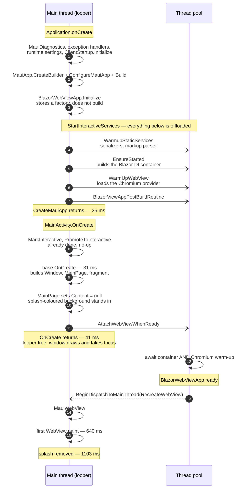
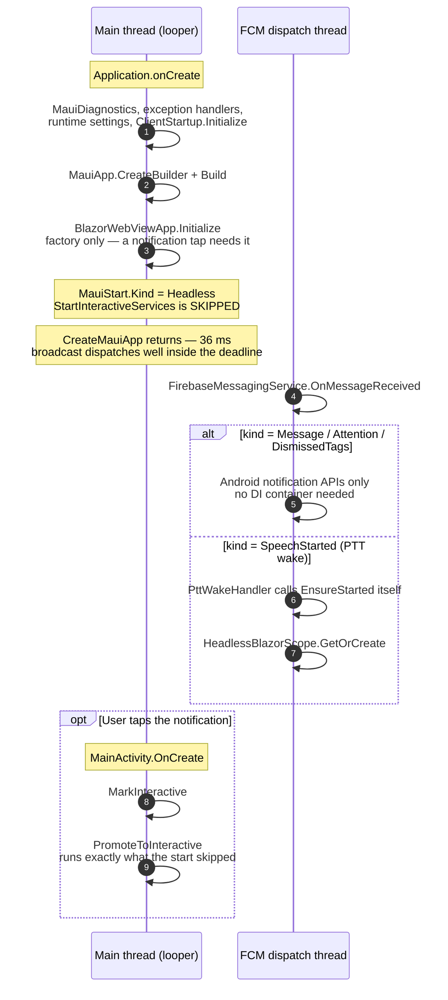

# Android-specific behavior

How to profile the Android app, how to read what comes back, and what the last round of
startup profiling actually found. Android is our only mobile target with a real JIT, so
several conclusions here do **not** transfer to iOS — see [ios-specific.md](./ios-specific.md).

The same traces also drive our R2R exclusion list, which is a size question rather than a
startup-time one — see [app-bundles.md](./app-bundles.md) for that and for everything else
that makes up the app packages.

**For `.mibc` profiles, ReadyToRun settings and tiered-compilation settings, see
[startup-profiling.md](./startup-profiling.md)** — that's where the recording workflow, the
partial-R2R configuration and the measured numbers live. This page covers CPU profiling:
where time goes at startup, and how to read the traces without being misled.

## Startup: what runs where

Startup is shaped by one constraint: an ANR is caused by the length of a **single
uninterrupted main-thread block**, not by total work. So the goal is to keep the main
looper free to dispatch, even when the same work still happens. Everything below follows
from that.

### Two kinds of start

[`MauiStart`](https://github.com/Actual-Chat/actual-chat/blob/main/src/dotnet/App.Maui/MauiStartKind.cs)
reads `RunningAppProcessInfo.Importance` through
[`AndroidUtils.GetProcessInfo`](https://github.com/Actual-Chat/actual-chat/blob/main/src/dotnet/App.Maui/Platforms/Android/AndroidUtils.cs)
and splits the process into two:

| Kind | How it starts | Importance |
|------|---------------|------------|
| Interactive | User taps the launcher or a notification | `Foreground` — AMS marks the process top-bound at bind time, before any Activity exists |
| Headless | An FCM broadcast or a PTT wake starts the process for a *service* | receiver / cached |

::: tip
Detection is fail-safe: an unknown importance takes the full interactive path, so a broken
check costs startup time rather than correctness.
:::

### Interactive cold start



The two things that used to block the main thread and no longer do:

- **The Blazor DI container.** `EnsureStarted` now runs at the end of `CreateMauiApp`, so
  the container builds on the pool *alongside* MAUI's own startup and is typically ready
  before `MainActivity.OnCreate` finishes.
- **The Chromium provider.** Constructing `BlazorAndroidWebView` loads it on whatever
  thread constructs the view and blocks on Chromium's provider lock. `MainPage` therefore
  does not construct it until the warm-up has already taken that lock.

::: warning
Nothing may block the main thread on the warm-up task. Chromium posts its native init back
to the main thread, so waiting there deadlocks — see the comment on
[`AndroidUtils.WarmUpWebView`](https://github.com/Actual-Chat/actual-chat/blob/main/src/dotnet/App.Maui/Platforms/Android/AndroidUtils.cs).
:::

### Headless (push-woken) start

A push starts the process for the FCM service. There is no Activity, no Window and no UI,
so `CreateMauiApp` does the minimum and returns.



What the headless path skips is only ever *work*, never a prerequisite:
`WarmupStaticServices`, `BlazorViewAppPostBuildRoutine`, `LoadingUI.MarkAppBuilt`,
`EnsureStarted` and the Chromium warm-up. None of it serves the FCM handler, and the
ThreadPool spin-up alone competes with the broadcast the process was started to deliver.

::: info
The skip is safe because the container is already built **on demand by whoever needs it** —
[`PttWakeHandler`](https://github.com/Actual-Chat/actual-chat/blob/main/src/dotnet/App.Maui/Platforms/Android/Audio/PttWakeHandler.cs)
calls `BlazorWebViewApp.EnsureStarted()` before touching the scope, and `PttSession` awaits
`WhenAppReady`. Ordinary notification display touches Android APIs only.
:::

### What is awaited, and where

| Work | Started on | Awaited by | Blocks the main thread? |
|------|-----------|------------|--------------------------|
| Blazor DI container (`EnsureStarted`) | pool | `MainPage.AttachWebViewWhenReady` | no — awaited off-thread |
| Chromium provider (`WarmUpWebView`) | pool | `MainPage.AttachWebViewWhenReady` | no — awaited off-thread |
| `WarmupStaticServices` | pool | nothing | no — fire and forget |
| `BlazorViewAppPostBuildRoutine` | pool | nothing | no — fire and forget |

The one remaining main-thread wait is in
[`CustomBlazorWebViewHandler.SetMauiContext`](https://github.com/Actual-Chat/actual-chat/blob/main/src/dotnet/App.Maui/CustomBlazorWebViewHandler.cs),
and it is reached only via `MainPage.MaxAttachDelay` (10 s) — the safety valve for a
container build that never completes. It blocks rather than spins: the old
`while (!IsCompleted) Thread.Sleep(5)` poll burned the core that would have finished the
very build it was waiting on. When it does wait, it warn-logs
`Awaiting BlazorWebViewApp readiness blocked the UI thread for …`; that line appearing in
logcat means the deferral failed and is worth investigating.

### Measured on device

Samsung `SM-S948U1` (`m3q`), Android 16, Release + composite ReadyToRun, from
[`MauiStartupBreadcrumbs`](https://github.com/Actual-Chat/actual-chat/blob/main/src/dotnet/Maui/MauiStartupBreadcrumbs.cs)
and `@trace` marks.

**Main-thread block durations.** Each region below is synchronous on the main thread, so
nothing else dispatches while it runs.

| Region | Interactive | Headless | Headless + notification tap |
|--------|-------------|----------|------------------------------|
| `CreateMauiApp` | 35 ms | 36 ms | 36 ms |
| `base.OnCreate` | 31 ms | — | 30 ms |
| `MainActivity.OnCreate` (total) | 41 ms | — | 33 ms |

**Elapsed since process start** — timestamps, not durations.

| Milestone | Interactive | Headless + notification tap |
|-----------|-------------|------------------------------|
| WebView constructed | 231 ms | 128 ms after promote |
| Splash removed | 1103 ms | 794 ms after promote |
| `SetMauiContext` had to wait | no | no |

::: tip
The last row is a single point check, not a sampled one: `SetMauiContext` tests
`WhenAppReady.IsCompleted` **once**, on the one call per `RecreateWebView`, and warn-logs a
duration only if it then has to block. "No" means the container was already built at that
moment. For actual block durations, see below.
:::

### Longest main-thread block

Measured with `MauiSettings.Diagnostics.EnableMainThreadMonitor` on and its threshold at
30 ms, three runs each, same device and build.

| Block | Interactive (launcher tap) | Headless (push) |
|-------|---------------------------|-----------------|
| `Application.onCreate` | 51–53 ms | **46–48 ms** |
| Activity launch transaction (`ActivityThread$H … 159`) | 64–86 ms | — |
| Posted C# action (`android.os.Handler … RunnableImplementor`) | 123–139 ms | — |
| MAUI dispatcher (`PlatformDispatcher … RunnableImplementor`) | 34–53 ms | — |
| First WebView raster frame (`Choreographer$FrameHandler`) | **224–285 ms** | — |
| **Longest single block** | **285 ms** | **48 ms** |
| Blocks over 30 ms, per run | 7–9 | **1** |

Two things this says:

- **On the push path, `Application.onCreate` is the only main-thread block over 30 ms at
  all** — the FCM handler itself runs on an FCM dispatch thread, and nothing the headless
  start does reaches the looper. 48 ms against a broadcast deadline measured in seconds.
- **On the launch path the longest block is the first WebView raster frame**, not our
  startup code. That corroborates the note on `SplashExitAnimator`: a long WebView frame
  starves the splash animation. The largest block we actually control is the ~130 ms posted
  C# action, which is the same shape as the `mono.java.lang.RunnableImplementor.n_run`
  cluster in Play Vitals.

::: warning
`AndroidMainThreadMonitor` cannot see the dispatch that contains `Application.onCreate`:
`Activate()` runs from inside `CreateMauiApp`, i.e. inside that very looper message, so the
`>>>>>` it would pair with has already gone by and the `<<<<<` is dropped. That row comes
from an explicit `CpuTimestamp` in
[`MainApplication`](https://github.com/Actual-Chat/actual-chat/blob/main/src/dotnet/App.Maui/Platforms/Android/MainApplication.cs)
instead, logged with the same wording so one grep finds both.

The monitor also perturbs what it measures — any `Looper` printer makes `loopOnce` build two
strings per main-thread message and adds two JNI upcalls — so treat these as upper bounds.
It is off by default for that reason.
:::

Exactly one `MauiWebView` is created per launch (`Current = #1`). The foreground handler in
[`MauiProgram.Android.cs`](https://github.com/Actual-Chat/actual-chat/blob/main/src/dotnet/App.Maui/MauiProgram.Android.cs)
recreates the WebView when it finds `Content: null`, which is also the state during the
initial attach — so it checks `MainPage.IsWebViewAttachPending` to tell "not attached yet"
from "went away while backgrounded" and leave the first attach alone.

## Recording a CPU profile

### 1. Build a tracing-enabled APK

Diagnostics are off by default (`IsTracingEnabled=false` in `App.Maui.csproj`). When it's
on, `android-tracing-env.txt` is packaged as an `AndroidEnvironment` file, which bakes
`DOTNET_DiagnosticPorts` into the app — **and makes the app suspend at launch until a
tracer attaches**. That's what lets a trace cover process startup rather than starting
somewhere in the middle.

A normal build has no diagnostic port at all, so `dotnet-trace` simply won't find it.
If the app appears to hang on launch, check whether you're running a tracing build with
nothing attached — that's the intended behavior, not a bug.

### 2. Collect

`scripts/Record-AndroidStartupProfiles.ps1` builds, installs and records in one go; it
handles the port mapping (the app connects to **device** 9000, the dsrouter listens on
**host** 9001) and gives the collector time to bind before `am start`.

```bash
pwsh scripts/Record-AndroidStartupProfiles.ps1 -Runs 3 -Mode Sampling -Build
```

`-Mode Sampling` is the one for "where is time going". The other modes record method events
instead and feed the `.mibc` pipeline — see [startup-profiling.md](./startup-profiling.md).

### Choosing the profile

- **`dotnet-sampled-thread-time`** — samples .NET thread stacks (~100 Hz). This is the one
  that answers "where is time going", and what `-Mode Sampling` selects.
- **`cpu-sampling` does not work here.** `dotnet-trace list-profiles` marks it
  `(collect-linux)`: it's kernel-event based and is rejected by `collect` with
  *"The specified profile 'cpu-sampling' does not apply to `dotnet-trace collect`"*.
- The `--providers` line is Loader (`0x8`) + JIT (`0x10`) + Type (`0x80000`) at Verbose.
  Without it most frames don't symbolicate — managed method names come from
  `MethodLoadVerbose` and from the rundown emitted at session stop. Adding it took
  unresolved frames from ~77% to ~66% in the same scenario.

A 5-second sampled capture is roughly 210-230 MB; 10 s is enough to cover startup, since
the app is up in ~1 s and the `*ServiceStarter` work is done by ~6 s.

### Measuring startup time

`scripts/Measure-AndroidStartup.ps1` runs N cold starts against a **non-tracing** build and
reports three numbers: `am start` TotalTime, and the app's own `LoadingUI` markers
`MarkChatListLoaded` (this is `LoadingUI.ChatListLoadTime`, the figure the app displays) and
`MarkRendered`. Report the minimum — the spread is device noise.

Don't measure startup on a tracing build: EventPipe emits hundreds of MB per run and swamps
what you're measuring.

## Reading the trace: two traps

### Blocked threads swamp everything

Thread-time sampling samples *every* thread, including idle pool threads. In a typical
capture ~90% of samples sit in `LowLevelThreadBlocker.TimedWait` or
`WaitSubsystem.ThreadWaitInfo.Wait`. `dotnet-trace report <file> topN` shows exactly that
and is close to useless as a result — you have to filter to non-blocked samples yourself.

### A thread parked in native code looks like 100% CPU

This one cost real time, so it's worth stating plainly. Filtering on *managed* wait
primitives is not enough. In every capture there was a thread like this:

```
tid 5515   3738 samples   3738 unresolved   (no name)

  [3738]  <no-module>!0x76c24b54c4
      <- <no-module>!0x76c24ca14c
      <- system.private.corelib!System.Threading.Thread.StartCallback
```

It never blocks by the managed definition, so a naive filter counts it as ~65% of all CPU.
It isn't. **The tell is that the stack never varies** — same two frames, same addresses,
every sample. A thread doing work produces varying stacks; a thread parked in a blocking
native call produces one. Frames with no resolvable module under `Thread.StartCallback`
mean the wait is happening below the managed layer.

Exclude such threads before computing any percentage, or every number you derive will be
understated by ~3x.

## Findings: startup CPU, 2026-07

Measured on a Samsung `R3GL1033P2M`, `net11.0-android` Release, composite ReadyToRun,
`EmbedAssembliesIntoApk=true`, 5 s from process launch. Single run, so treat these as
proportions rather than precise values.

Of ~61,000 samples, ~5,700 were non-blocked by the managed-wait filter, and ~3,700 of
those were the parked native thread above — leaving **~2,000 samples of real CPU work**.

| cost | samples | ~share of real CPU |
|---|---|---|
| `GenericsHelpers.ClassWithSlotAndModule` | 180 | ~9% |
| `InitHelpers.CallClassConstructor` | 130 | ~6% |
| `GenericsHelpers.MethodWithSlotAndModule` | 101 | ~5% |
| `RuntimeTypeHandle.Instantiate` | 65 | ~3% |
| `DynamicMethod.CreateDelegate` | 54 | ~3% |
| `RuntimeAssembly.GetExportedTypes` (Blazor route table) | 41 | ~2% |
| `X509Chain.Build` | 25 | ~1% |

**The dominant identifiable cost is generic-dictionary lookup plus static-constructor
init — roughly 20% combined.** That's the price of shared `__Canon` generic code resolving
types at runtime, and composite R2R can't precompile those instantiations. It matches an
earlier JIT-keyword trace where the JIT'd-method bulk was `AsyncTaskMethodBuilder<__Canon>`
and `RuntimeTypeCache<__Canon>`.

Runtime codegen (`DynamicMethod.CreateDelegate`) is ~3%, spread across three call sites:

```
RpcOutboundCall.GetFactory   <- RpcMethodDef.InitializeOverridableProperties
                             <- RpcServiceDef.BuildMethods <- RpcServiceRegistry..ctor
ActivatorUtilities.CreateFactory <- DefaultComponentActivator.GetObjectFactory
                                 <- ComponentFactory.InstantiateComponent
ActivatorExt.GetConstructorDelegate <- MessagePackByteSerializer.Read
```

Note the first one is built **eagerly** in `RpcServiceRegistry..ctor`, not lazily on first
call.

### What we tried, and why it didn't pay off

We pre-registered constructor delegates for every client-side RPC result type (392 of
them) via a generated `IAotSource.RegisterFactories`, so Fusion wouldn't have to emit them.
An A/B on device — identical builds, only the registration switched on and off — came out
**inconclusive**: ~475 ms best, ~480-485 ms typical either way.

The profile explains it: the work being eliminated was ~3% of CPU, and eagerly registering
392 delegates at module-init time costs something too. The two roughly cancel. The approach
wasn't wrong, it was aimed at the wrong 3%.

The Fusion-side building blocks from that work are still shipped and available if a future
case needs them — `ActivatorExt.RegisterConstructorDelegate`, and
`RuntimeCodegen.OnCreateDelegate`, which fires on every delegate cache miss and is the
cheapest way to find out what an app generates at runtime.

If startup is revisited, generic instantiation and cctor init are the ~20% worth attacking,
not codegen.

## Building in a fresh worktree

A new git worktree isn't ready to produce an APK. Three things bite, in order:

1. **`google-services.json.dev` / `.prod` are committed as placeholders** (`// Add Google
   Service Json.`). The real files are local-only. Without them the build fails inside
   `ProcessGoogleServicesJson` with `Encountered unexpected character '/'`. Copy them from
   a checkout that has them — and don't commit them.
2. **`node_modules` doesn't exist.** Run `npm ci`.
3. **`r-android-dev.cmd` only runs `dotnet publish`** — it does not build the frontend. Run
   `npm run build:Release` first, or the app starts and then dies on
   `Could not find 'ui.KeepAwakeUI.setKeepAwake' ('ui' was undefined)`, which looks like a
   startup hang.
