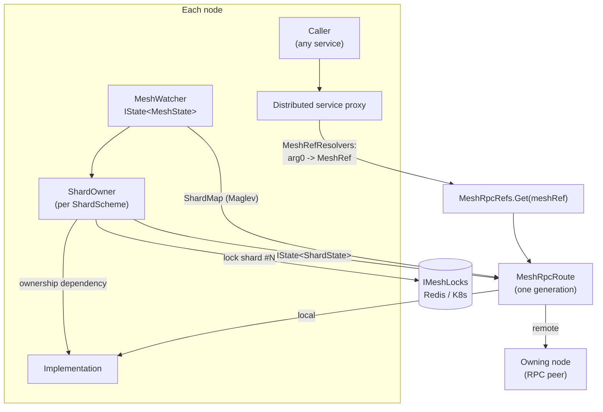
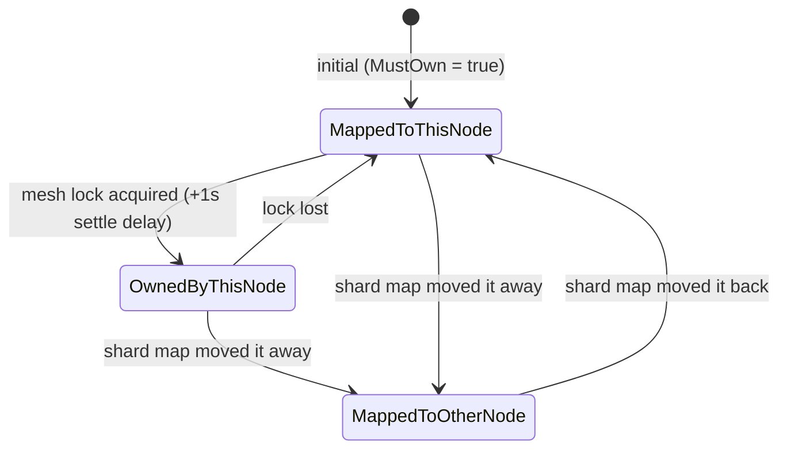

# Distributed services

[[toc]]

This is the guide for writing (or converting) a backend service that runs in
`ServiceMode.Distributed` — one whose calls are routed across the mesh by shard key, so
every key has exactly one owning node at a time.

It deliberately does **not** re-explain Fusion. Compute methods, `Invalidation.Begin()`,
command handlers, the operation framework, `ConsolidationDelay`, `MinCacheDuration` and
`RemoteComputed` are all documented in the Fusion docs and reachable through the
`fusion-docs` MCP server. What follows is only what Voxt adds on top, and the places where
the Fusion habits you already have produce a service that is subtly wrong once it is
sharded.

Related reading: [Service design patterns](./service-design.md) for the two-tier
frontend/backend split, and the
[compute-method invalidation map](../invalidation-map.md) for where invalidations
originate and amplify in this codebase.

## 1. What "distributed" means here

A backend service can be registered in one of five modes
([`ServiceMode`](https://github.com/Actual-Chat/actual-chat/blob/main/src/dotnet/Core/Hosting/ServiceMode.cs)):

| Mode | The host gets | Calls execute |
|---|---|---|
| `Disabled` | nothing | — |
| `Local` | the implementation, no RPC | always in-process |
| `Server` | the implementation, exposed over RPC | in-process; other hosts call in as clients |
| `Client` | a client proxy only | on whichever host is a `Server` for it |
| `Distributed` | the implementation **and** a routing client proxy | on the node that owns the call's shard — which may be this one |

`Server`/`Client` is a two-role split: one fixed set of hosts runs the service, everyone
else calls it. `Distributed` is different: **every** host carrying the service's role runs
the implementation, and each call is routed by its shard key to the single node that
currently owns that shard. Ownership is exclusive and enforced by a distributed lock, so a
key's mutable state has one writer at a time even though N pods run the same code.

That last property is the whole point. A distributed service can hold per-key state in
Redis or in RAM and still be correct under concurrency, because only one node is allowed
to touch a given key. The price is that shard ownership moves — on deploy, scale-out,
scale-in, pod death, or a lost lock — and everything you cache must react to that move.
Section [6. Invalidation: the part that differs from plain Fusion](#6-invalidation-the-part-that-differs-from-plain-fusion) is
about paying that price correctly.

### The moving parts



| Piece | File | Role |
|---|---|---|
| `MeshWatcher` | [MeshWatcher.cs](https://github.com/Actual-Chat/actual-chat/blob/main/src/dotnet/Core.Server/Mesh/MeshWatcher.cs) | Announces this node, discovers the others, publishes `IState<MeshState>` |
| `MeshState` | [MeshState.cs](https://github.com/Actual-Chat/actual-chat/blob/main/src/dotnet/Core.Server/Mesh/MeshState.cs) | All nodes, live nodes by role, and a cached `ShardMap` per scheme |
| `ShardMap` | [ShardMap.cs](https://github.com/Actual-Chat/actual-chat/blob/main/src/dotnet/Core.Server/Sharding/ShardMap.cs) | Maglev-hashed shard index → node, so a topology change moves as few shards as possible |
| `ShardOwner` | [ShardOwner.cs](https://github.com/Actual-Chat/actual-chat/blob/main/src/dotnet/Core.Server/Sharding/ShardOwner.cs) | Per scheme: takes the mesh lock for each shard mapped here, publishes `IState<ShardState>` per shard |
| `MeshRpcRefs` / `MeshRpcRef` / `MeshRpcRoute` | [Core.Server/Rpc/](https://github.com/Actual-Chat/actual-chat/tree/main/src/dotnet/Core.Server/Rpc) | A stable `RpcRef` per `MeshRef`; shard refs re-route per generation, node refs never do |
| `MeshRefResolvers` / `ShardKeyResolvers` | [Core.Server/Sharding/](https://github.com/Actual-Chat/actual-chat/tree/main/src/dotnet/Core.Server/Sharding) | Turn the call's first argument into a `MeshRef` |

## 2. Declaring a distributed service

Three attributes decide everything.

```csharp
// src/dotnet/Streaming.Contracts/ILiveSessionsBackend.cs
[BackendService(nameof(HostRole.LiveBackend), ServiceMode.Distributed)]
[BackendShardScheme(nameof(HostRole.LiveBackend))]
public interface ILiveSessionsBackend : IComputeService, IBackendService
{
    [ComputeMethod]
    Task<LiveSessionState?> GetState(ChatId chatId, CancellationToken cancellationToken);

    Task SetRules(ChatId chatId, SessionRules rules, CancellationToken cancellationToken);
}
```

- `[BackendService(hostRole, serviceMode)]` — "a host that has *this* role runs the service
  in *that* mode". It can be repeated, and it can also sit on the **assembly**.
- `[BackendShardScheme(hostRole, Scheme = ...)]` — which `ShardScheme` the service is
  sharded by. Also assembly-placeable. `Scheme` overrides the scheme derived from the role
  ([`IMaintenancesBackend`](https://github.com/Actual-Chat/actual-chat/blob/main/src/dotnet/Core.Server/Maintenance/IMaintenancesBackend.cs)
  is hosted by `UsersBackend` but sharded by `MaintenanceBackend`, which has a different
  shard count).
- Registration: `rpcHost.AddBackend<IFooBackend, FooBackend>()` in the module. The mode is
  resolved per host from the attributes, so the same line produces an implementation on one
  pod and a routing client on another.

::: warning Interface attributes replace assembly attributes, they don't merge
[`HostRolesExt.GetBackendServiceMode`](https://github.com/Actual-Chat/actual-chat/blob/main/src/dotnet/Core.Server/HostRolesExt.cs)
falls back to the assembly attributes **only when the interface has none**. So the moment
you put a single `[BackendService]` on an interface, that interface stops seeing the
assembly's `OneServer → Local` line, and a single-server dev host will run it in
`Distributed` mode too. That is intentional for the existing distributed services — it
means routing, ownership and reroutes are exercised in ordinary local development with one
node owning all shards — but it is a real behavior change when you convert a service.
:::

### Which shard scheme, and what a host role buys you

[`ShardScheme`](https://github.com/Actual-Chat/actual-chat/blob/main/src/dotnet/Backend/Sharding/ShardScheme.cs)
pairs a shard count with the `HostRole` that hosts those shards. `MeshState.GetShardMap`
builds the map from the *live nodes carrying that role*, so the role is what determines the
candidate pods:

| Scheme | Shards | Host role |
|---|---|---|
| `ChatBackend`, `ContactsBackend`, `UsersBackend`, `LiveBackend`, `StreamingBackend`, `MediaBackend`, `NotificationBackend`, `SearchBackend`, `TranscriptionBackend`, `FlowsBackend`, `DiagnosticsBackend` | 12 | the matching `*Backend` role |
| `InviteBackend` | 1 | `InviteBackend` |
| `MaintenanceBackend` | 16 | `UsersBackend` |
| `Queue`, `SlowQueue` | 12 | `EventQueue` |

Roles expand: `OneServer` implies `OneApiServer` + `OneBackendServer`, which imply every
`*Backend` role
([`HostRoles`](https://github.com/Actual-Chat/actual-chat/blob/main/src/dotnet/Core/Hosting/HostRoles.cs)).
Note that `OneApiServer` also pulls in `StreamingBackend` — API pods host the streaming
backend so that a browser's media socket terminates on the pod it is already connected to.

Don't invent a shard count per service. 12 is the house default; a scheme with a different
count exists only where the key shape demands it (see
[4.4 Hierarchical keys (head routing)](#4-4-hierarchical-keys-head-routing)).

## 3. Reuse before you write

Before adding anything, check what already exists:

- [`docs/api-index.md`](../api-index.md) and
  [`api-index-full.md`](../api-index-full.md).
- `ShardComputeService` / `ShardedDbServiceBase<TDbContext>` / `ShardedDbWorkerBase<TDbContext>` /
  `ShardWorker` — base classes that wire `ShardOwner` for you
  ([Core.Server/Sharding/](https://github.com/Actual-Chat/actual-chat/tree/main/src/dotnet/Core.Server/Sharding)).
- `LockingComputeMethodPrimer<TKey,TValue>` and
  `VersionedComputeMethodPrimer<TKey,TVersion,TValue>`
  ([Core.Server/Priming/](https://github.com/Actual-Chat/actual-chat/tree/main/src/dotnet/Core.Server/Priming)) —
  hand a freshly written value to the compute method that is about to recompute it.
- `RedisScope<T>` and `RedisMultiHashMap<T>`
  ([Redis/](https://github.com/Actual-Chat/actual-chat/tree/main/src/dotnet/Redis)) — the
  standard per-key and per-key-hash stores with TTLs.
- `IMeshLocks` + `MeshLocksExt.LockAndRun` for "exactly one runner" work that isn't
  shard-scoped.
- `MeshWatcher.State` + `StreamEnumerableExt.WhereAlive` to drop records that belong to a
  node that is gone.

Anything genuinely new and generic belongs in `ActualChat.Core.Server`, not in the feature
project.

## 4. Routing: the first-parameter rule

**The first parameter of an RPC method decides where the call goes.** No other parameter is
looked at. This comes from
[`RpcBackendHelpers.RouterFactory`](https://github.com/Actual-Chat/actual-chat/blob/main/src/dotnet/Core.Server/Rpc/Internal/RpcBackendHelpers.cs),
which builds a router from `methodDef.Parameters[0]`, resolves it to a `MeshRef` via
`MeshRefResolvers`, and then to a stable `MeshRpcRef`.

### 4.1 How arg0 becomes a target

| arg0 type | Target | Registered by |
|---|---|---|
| anything implementing `IHasShardKey` | `MeshRef.Shard(x.ShardKey)` | `ShardKeyResolvers` |
| `string`, `Symbol`, `int`, `uint`, `ShardKey` | `MeshRef.Shard(...)` | `ShardKeyResolvers` |
| `Session`, `ISessionCommand`, `UserIdentity` | shard of the session/identity id | `ShardKeyResolvers` |
| `NodeRef`, `NodeRef?`, `IHasNodeRef`, `StreamId?` | that exact node | `MeshRefResolvers` |
| `ThisNodeRef` / `IRequiresThisNode` | this node, always local | `MeshRefResolvers` |
| `ZeroShardRef` / `IRequiresZeroShard` | shard 0 — a single node for the whole mesh | `MeshRefResolvers` |
| `RandomShardRef` / `IRequiresRandomShard` | a random shard, **re-picked per call** | `MeshRefResolvers` |
| no parameters / `Unit` | `MeshRef.ZeroShard` | `RpcBackendHelpers.TypedRouterFactory` |
| anything else | `GetHashCode()`-derived shard, with a warning | `ShardKeyResolvers.NewNotFound` |

That last row is a bug waiting to happen: `GetHashCode()` is not stable across processes
for most reference types, so two nodes can route the same logical key to different shards.
In production `ShardKeyResolvers.MustThrowOnNotFound` is off (warn + hash), everywhere else
it throws. Never rely on it — give arg0 a real `ShardKey`.

### 4.2 Shard keys and co-location

`ISymbolIdentifier` gives every id a default `ShardKey = ShardKey.New(Value)` (xxHash3 of
the string). Composite ids **override** it to co-locate with their parent, and this is the
single most important modelling decision in a distributed service:

```csharp
// src/dotnet/Api/Identifiers/AuthorId.cs
public override ShardKey ShardKey => ChatId.ShardKey;
```

| Id | Routes with |
|---|---|
| `AuthorId`, `ChatEntryId`, `RoleId`, `ConversationId`, `TranslationSourceId` | its `ChatId` |
| `NotificationId`, `ExplicitNotificationId` | its `UserId` |
| `ContactId`, `UserDeviceId` | its `OwnerId` |
| `ExternalContactId` | its `UserDeviceId` → `OwnerId` |
| `MentionRef`, `TranslationId`, `ContentRef` | its target/source |

When you add an id type that belongs to an aggregate, override `ShardKey` to the
aggregate's. Otherwise a single logical operation fans out across shards, and the state it
needs is spread over nodes that can't see each other's caches.

### 4.3 Node-pinned resources

Some state cannot be moved by rebalancing: an in-flight media stream lives in the RAM of
the node that is receiving it. Those are addressed by node, not by shard:

```csharp
// StreamId embeds the NodeRef of the node that minted it
public sealed partial class StreamId : StringIdentifier
{
    public NodeRef NodeRef { get; }
}
```

`MeshRefResolvers` maps `StreamId?` → `MeshRef.Node(x.NodeRef)`, so every call about a
stream lands on its origin node. Node refs use a **static** route: they never reroute, and
if the node dies the peer fails with `RpcReconnectFailedException` rather than silently
retargeting — which is right, because the stream is gone with the node. Filter such records
with `WhereAlive(meshState, ...)` before returning them.

`IHasNodeRef` with `NodeRef.ThisNodeAlias` pins a command to the local node and lets it
carry non-serializable payload, because it will never be sent anywhere:

```csharp
// src/dotnet/Core.Server/Flows/IFlowBackend.cs
public sealed record Flows_Store(FlowId FlowId, long? ExpectedVersion = null)
    : IDelegatingCommand<long>, IBackendCommand, IHasNodeRef
{
    public Flow? Flow { get; init; }           // not serializable - and never serialized
    NodeRef IHasNodeRef.NodeRef => NodeRef.ThisNodeAlias;
}
```

`RandomShardRef` is for stateless fan-out work only. Never use it as arg0 of a compute
method: the target is re-picked on every call, so the computed and its invalidations belong
to an arbitrary node each time.

### 4.4 Hierarchical keys (head routing)

`ShardKey` is a hex-digit key of a given `Size`. `Head(n)` takes the top `n` digits. When a
scheme's shard count equals `16^n`, a key's `Head(n)` and the key itself agree on the shard
index, which lets one key carry several nesting levels.
[`MaintenanceKey`](https://github.com/Actual-Chat/actual-chat/blob/main/src/dotnet/Core.Server/Maintenance/MaintenanceKey.cs)
is the worked example:

```csharp
public const int ShardKeySize = 1;          // 16 shards - matches ShardScheme.MaintenanceBackend
public const int PartitionKeySize = 2;      // 256 partitions
public const int FullPartitionKeySize = 4;  // the DB row-id prefix

public ShardKey ShardKey => FullPartitionKey.Head(ShardKeySize);
public ShardKey PartitionKey => FullPartitionKey.Head(PartitionKeySize);
```

Routing uses `ShardKey`; the service internally batches by `PartitionKey`; the DB row id is
prefixed with the full key so a partition is one indexed range scan. `MaintenanceShardTest`
asserts the scheme's shard count still matches `MaintenanceKey.ShardCount` — if you build
something like this, write the equivalent test, because the two constants live in different
projects and nothing else ties them together.

### 4.5 Commands

Backend commands route exactly like methods: the command **is** arg0, so implement
`IHasShardKey` on it.

```csharp
public sealed partial record UserPresencesBackend_CheckIn(
    [property: DataMember, Key(0)] UserId UserId,
    [property: DataMember, Key(1)] Moment At,
    [property: DataMember, Key(2)] bool IsActive
) : IDelegatingCommand<Unit>, IBackendCommand, IHasShardKey
{
    [JsonIgnore, Newtonsoft.Json.JsonIgnore, IgnoreDataMember, IgnoreMember]
    public ShardKey ShardKey => UserId.ShardKey;
}
```

`RpcCommandHandler` in CommandR does the routing and the reroute retry loop. A command that
mutates a key **must** carry the same shard key as the compute methods that read it —
otherwise its `Invalidation.Begin()` block runs on a node that holds none of the affected
computeds. See [Rule 1: invalidate on the owner](#6-3-rule-1-invalidate-on-the-owner).

Queues shard independently, by the same `ShardKey`, into the `Queue`/`SlowQueue` schemes on
`EventQueue` hosts
([`QueueShardRef`](https://github.com/Actual-Chat/actual-chat/blob/main/src/dotnet/Core.Server/Queues/QueueShardRef.cs)).
An event enqueued for a key is processed by the queue shard owner, which then calls the
backend and gets routed to the backend shard owner — these are two different mappings, so
don't assume an event handler runs on the node that owns the data.

### 4.6 Rerouting

A `MeshRpcRef` is stable per `MeshRef`; what changes is its `MeshRpcRoute` — one generation
of "where does this go right now". A route marks itself changed when the shard map moves the
shard, or when this node's ownership of a locally-routed shard ends. Anything in flight on
that route is aborted with `RpcRerouteException`, and the caller retries against the new
generation.

`RpcRerouteException` **derives from `OperationCanceledException`**. Consequences you will
meet:

- `catch (Exception e) when (e is not OperationCanceledException)` already swallows it —
  usually what you want.
- A retry policy must exclude it explicitly, or it will retry locally forever instead of
  letting the call reroute:
  ```csharp
  // src/dotnet/Flows.Service/FlowBackend.cs
  RetryOn = (e, transiency) => e is not RpcRerouteException && transiency is not Transiency.Terminal,
  ```
- `Computed.Capture` will not capture a computed that "stores" it — the exception
  propagates out of the capture instead
  ([`ShardComputeServiceTest`](https://github.com/Actual-Chat/actual-chat/blob/main/tests/Core.Server.IntegrationTests/Sharding/ShardComputeServiceTest.cs)).

How aggressively a local call is fenced is `RpcLocalExecutionMode`, resolved per method:
compute methods get `ConstrainedEntry` (the ownership gate is awaited before the call, but
the call isn't aborted mid-flight), other methods get `Constrained` (the cancellation token
is linked to the route, so a reroute aborts them immediately). Override with
`[RpcMethod(LocalExecutionMode = RpcLocalExecutionMode.Unconstrained)]` when a method must
run to completion regardless — `IFlowBackend.OnScheduleResume` does this because it only
touches node-local scheduling state.

::: warning Routing is off during host initialization
`AppHost.EnableRouting()` is called after DB initializers and module initializers finish.
Until then `RouterFactory` returns `RpcRef.Local` for everything: calls execute in-process,
get no ownership gate and never reroute. Do not call a distributed compute method that
requires shard ownership from an initializer — it will either block waiting for a lock that
the mesh hasn't announced yet, or produce a computed with no ownership dependency.
:::

## 5. Shard ownership

`ShardOwner` runs one state machine per shard of its scheme:



| `ShardOwnershipStatus` | Meaning | What a call does |
|---|---|---|
| `MappedToOtherNode` | the map points elsewhere | throw `RpcRerouteException` |
| `MappedToThisNode` | the map points here, lock not held yet | wait for the lock |
| `OwnedByThisNode` | lock held and live | proceed |

The one-second `LockToUseDelay` between acquiring the lock and declaring ownership exists so
the previous owner's workers have stopped before the new owner's start. `HasLiveOwnership`
is false the instant the lock token is cancelled, so a node that loses its lock stops
claiming ownership immediately instead of serving reads under a dead lock
([`ShardLockLossTest`](https://github.com/Actual-Chat/actual-chat/blob/main/tests/Core.Server.IntegrationTests/Sharding/ShardLockLossTest.cs)).

### The two APIs you call

```csharp
// Gate + dependency. Throws RpcRerouteException if this node isn't mapped to the shard;
// awaits the lock if it is mapped but not yet owning.
await ShardOwner.RequireShardOwnership(chatId, addDependency: true, cancellationToken);

// Dependency only, no gate, no await - for helper computeds that are already
// reached through a gated public method.
ShardOwner.GetShardStateComputed(chatId, addDependency: true);
```

Both accept any `T` that `ShardKeyResolvers` can resolve, so pass the domain id directly.

### Background work bound to a shard

`ShardWorker` runs `OnRun(ShardOwnership, CancellationToken)` once per owned shard, started
when ownership is acquired and cancelled when it ends — while the lock is still held, so the
old and new owners never overlap. `MasterFlowStarter` is the canonical example: it starts a
singleton flow on whichever node owns the flow id's shard.

For one-off exclusive work that isn't shard-shaped, use `IMeshLocks.LockAndRun(key, ...)`
directly (`AppHost.RunInitializers` does).

## 6. Invalidation: the part that differs from plain Fusion

In a non-distributed Fusion service there is one answer to "how does a cached value learn it
is stale": the command that changed the data runs an invalidation block, and the operation
log replays it on every host. In a distributed service that answer is only one of five
transports, and the one you most often *can't* use.

### 6.1 The five transports

| # | Transport | Reaches | Use it for |
|---|---|---|---|
| 1 | **Operation log** — a DB command with `MustStore(true)` (the default) writes a `DbOperation`; every other host's `DbOperationLogReader` replays its invalidations | every host in the cluster | DB-backed state |
| 2 | **Node-local `Invalidation.Begin()`** | only the node that runs it | Redis- or RAM-backed state, *provided reads and writes route to the same node* |
| 3 | **RPC invalidation push** | remote holders of a `RemoteComputed` on the owner's computed | automatic — it is what carries #2 out to callers |
| 4 | **Shard-ownership dependency** | every computed on this node that depends on `ShardState` | handover: gain, loss, lock loss |
| 5 | **Self-invalidation timer** — `computed.Invalidate(delay)` | the computed itself | time-derived values, TTLs, staleness cutoffs |

Rules 6.3 – 6.11 are the consequences.

### 6.2 What the runtime does for you

When a distributed compute method is invoked through its interface and the route resolves to
this node, `MeshRpcRoute.LocalExecutionAwaiter` runs *inside* the new computed's
`BeginCompute` scope with `addDependency: true`. It awaits shard ownership and adds the
`ShardState` computed as a dependency. So a plain distributed compute method already has
transport #4, for free:

```csharp
// tests/Core.Server.IntegrationTests/Sharding/ShardMigrationComputedTest.cs
public class TestPresences : ITestPresences
{
    private static readonly ConcurrentDictionary<string, Moment> Store = new();

    [ComputeMethod] // no explicit ownership call - the route adds the dependency
    public virtual Task<Moment?> GetLastCheckIn(string key, CancellationToken cancellationToken)
        => Task.FromResult(Store.TryGetValue(key, out var at) ? (Moment?)at : null);
}
```

It does **not** happen for:

- `protected`/`private` compute methods — they aren't on the RPC interface, so there is no
  route and no gate;
- calls made before `EnableRouting()`;
- node-ref routes (static routes carry no awaiter);
- plain (non-compute) methods, which get the abort-on-reroute token but no dependency.

There was also a sixth case, now fixed: a route created in the window between "the mesh maps
the shard here" and "`ShardOwner` sets `MustOwn`" used to get no awaiter at all, so values
computed through it were never invalidated. That is what froze presence in production on
2026-07-01. `MeshRpcRoute` now decides on `ConnectionKind` rather than on an ownership
snapshot, and
[`ShardMigrationComputedTest`](https://github.com/Actual-Chat/actual-chat/blob/main/tests/Core.Server.IntegrationTests/Sharding/ShardMigrationComputedTest.cs)
reproduces the one-, two- and multi-wave rebalances that used to trigger it.

Since the runtime's guarantee has this many holes, don't rely on it alone. Hence the next
rule.

### 6.3 Rule 1: invalidate on the owner

An `Invalidation.Begin()` block only reaches the node it runs on. For it to mean anything,
the write must have been routed to the same node as the reads. Concretely:

- the write method's arg0 and the read method's arg0 must resolve to the **same shard key**;
- a command must implement `IHasShardKey` with that key;
- a write triggered from somewhere else (a queue handler, a flow, a timer) must call the
  service *through its interface* so it gets routed, not reach into the implementation.

If you find yourself invalidating a key you didn't route by, the invalidation is a no-op on
every node that matters.

### 6.4 Rule 2: every locally computed value depends on shard ownership

Public compute methods of the existing services call it explicitly anyway:

```csharp
// src/dotnet/Streaming.Service/Backend/LiveVideoBackend.cs
public virtual async Task<ApiArray<VideoStreamInfo>> List(ChatId chatId, CancellationToken cancellationToken)
{
    // Adds a dependency on this node's shard ownership state for chatId.
    // Invalidates this computed on any ownership transition (gain/loss/handover),
    // so bound RPC clients get pushed invalidations and reroute to the new owner.
    // Throws RpcRerouteException if the call landed on a node not mapped to this shard.
    await ShardOwner.RequireShardOwnership(chatId, addDependency: true, cancellationToken).ConfigureAwait(false);
    ...
}
```

That is redundant on the routed path and necessary on every other one listed in
[6.2 What the runtime does for you](#6-2-what-the-runtime-does-for-you). For **protected
helper computeds it is not optional** — they are never routed, so nothing else will ever
add the dependency:

```csharp
// src/dotnet/Streaming.Service/Backend/LiveAudioBackend.cs
[ComputeMethod]
protected virtual async Task<State> ListRaw(ChatId chatId, CancellationToken cancellationToken)
{
    // List's own ownership dependency doesn't cover this cache - invalidating List just re-reads it.
    // Without this, a shard that leaves and comes back serves a view missing the other node's writes.
    ShardOwner.GetShardStateComputed(chatId, addDependency: true);
    ...
}
```

The failure this prevents is worth spelling out, because it is not "a stale value for a few
seconds". Shard S moves from node A to node B; B serves it and accepts writes; S moves back
to A. A's cached computed for S was never invalidated — it is *consistent* as far as Fusion
is concerned — so A now serves a value that predates everything B wrote, forever. A frozen
computed does not heal on its own and does not show up as an error anywhere.

Use `RequireShardOwnership` when the method should refuse to run on a non-owner, and
`GetShardStateComputed` when it is an internal helper of a method that already refused.

### 6.5 Rule 3: `MustStore(false)` turns off the operation log

`context.Operation.MustStore(false)` makes the operation framework write a `DbEvent` instead
of a `DbOperation`. No `DbOperation` means no replay on other hosts: the invalidation is
node-local, i.e. transport #2, not #1. That is the right choice for a sharded service — the
owner is the only node whose caches matter, and skipping the log saves a row per check-in —
but it is only correct *because* reads and writes route to the same node.

```csharp
// src/dotnet/Users.Service/UserPresencesBackend.cs
context.Operation.MustStore(false);
...
context.Operation.AddCompletionHandler(scope => {
    using (Invalidation.Begin())
        _ = GetLastCheckIn(userId, default);
    return Task.CompletedTask;
});
```

`MaintenancesBackend.OnSet` does the same, and additionally checks `scope.IsCommitted` before
invalidating. Two things to keep in mind:

- if you ever need a value of such a service to be visible to a non-owner's cache, you must
  either drop `MustStore(false)` or stop caching it off-owner;
- completion handlers of concurrent commands can run in any order relative to each other,
  so a handler that also *primes* a value must gate the prime on a version — see
  [Rule 6: prime, not just invalidate](#6-8-rule-6-prime-not-just-invalidate).

### 6.6 Rule 4: consolidation only works on locally computed methods

`ConsolidationDelay` splits a compute method in two: a *source* computed that keeps the real
invalidation behavior, and a `ConsolidatingComputed` target that everyone else depends on.
When the source is invalidated the target waits out the delay, recomputes the source, and
compares; if the new value is `Equals` to the old one the target stays consistent and **the
cascade stops there**. It is value-level dedup with a debounce, not a throttle, and it costs
one extra computed per key plus one recompute per source invalidation. The full mechanics are
in
[Consolidation: what it does and when it silently does nothing](../invalidation-map.md#2-consolidation-what-it-does-and-when-it-silently-does-nothing);
what follows is what changes in a distributed service.

#### It is a startup error on an RPC-exposed method

Putting `ConsolidationDelay` on a compute method of the *interface* of a `Distributed`
service throws at startup (`Errors.ConsolidationOnDistributedServiceMethod`). Two reasons,
both worth understanding:

- Even when routing resolves to the local node, such a call is served by
  `RemoteComputeMethodFunction`, which always produces a plain `ComputeMethodComputed` — so
  the consolidation would be silently ignored on the owner as well as on the callers.
- It could not be routed anyway: consolidation recomputes its source through a local
  `ComputeMethodFunction`, bypassing routing entirely, and its shape is fixed when the
  method def is built — while routing is per-call and flips when a shard moves.

`Local`, `Server`, `Client` and `ServerAndClient` services are unaffected, which is why the
API-layer contracts (`IChats`, `ILiveSessions`, `IUserPresences`) carry it directly.

#### The shape: consolidate in a protected method, delegate from the public one

```csharp
// src/dotnet/Streaming.Service/Backend/LiveSessionsBackend.cs
[ComputeMethod]
public virtual Task<ApiArray<AuthorId>> ListParticipants(ChatId chatId, CancellationToken cancellationToken)
    => GetConsolidatedParticipants(chatId, cancellationToken);

[ComputeMethod(ConsolidationDelay = 0.2, ConsolidationComparer = typeof(ApiArrayComparer<AuthorId>))]
protected virtual async Task<ApiArray<AuthorId>> GetConsolidatedParticipants(
    ChatId chatId, CancellationToken cancellationToken)
{
    var computed = Computed.GetCurrent();
    await ShardOwner.RequireShardOwnership(chatId, addDependency: true, cancellationToken).ConfigureAwait(false);
    ...
}
```

And then **invalidate the consolidating method, not the public one**:

```csharp
private void InvalidateListParticipants(ChatId chatId)
{
    // The consolidating methods, not the public ones: IHasInvalidationTarget redirects to the
    // consolidation source, while invalidating a plain derived computed can't reach it.
    using (Invalidation.Begin())
        _ = GetConsolidatedParticipants(chatId, default);
}
```

`ConsolidatingComputed` is an `IHasInvalidationTarget` whose target is its source, and
`Invalidation.Begin()` follows that. Invalidating the public delegator instead drops only
that derived computed, which then re-reads the still-consistent consolidated one and keeps
serving the stale value — a silent no-op, and an easy one to ship.

#### When it pays

All three conditions have to hold:

1. **The source is invalidated far more often than its value changes.** In a distributed
   service the usual causes are the ones Rules 5 and 6 introduce: a self-heal timer
   re-reading Redis every `SelfHealDelay`, a heartbeat-shaped write, or a hub value such as
   `GetState` that several narrower projections derive from.
2. **The result compares equal when nothing changed** — see the next subsection.
3. **The suppressed invalidation is expensive.** On a shard owner it is: each one is pushed
   over RPC to every subscribed API pod, and from there to every subscribed client. That
   multiplier is what makes an extra computed per key worth paying for here, where the same
   method in a single-process service might not justify it.

Worked example: `LiveSessionsBackend.GetState` self-invalidates every 30 s so a dropped
stream eventually surfaces, and re-reads Redis each time. `GetVisibleStartLid`,
`GetLiveConversation`, `ListParticipants` and `HasRecorder` are projections of it whose
values almost never move between ticks. Consolidating each projection turns a guaranteed
once-per-30-s fan-out per open chat into fan-out only when something actually changed.

#### When it does nothing

Consolidation can suppress an invalidation only when the recomputed value is `Equals` to the
old one. A method that materializes a fresh object each time — a DB read, a `.ToApiArray()`,
a `new Xxx(...)` — never compares equal by default, and its `ConsolidationDelay` becomes a
pure delay with extra allocation. `ApiArray<T>` is the trap worth naming: it compares its
backing array **by reference**, so every rebuild differs.

The fix is an explicit `ConsolidationComparer` — a parameterless-constructible
`IEqualityComparer<T>`:

| Result type | Comparer |
|---|---|
| `bool`, `long?`, ids, enums, other value types | none needed |
| `ApiArray<T>` | `ApiArrayComparer<T>` |
| `Conversation` | `ConversationContentComparer` |
| `AuthorRules` | `AuthorRulesComparer` |

A comparer without a delay is a startup error too, so the two always travel together.

If the value genuinely changes on every invalidation, consolidation is the wrong knob: use
`InvalidationDelay` to batch the bursts, or — always cheaper — stop the write from happening
at all, per [Rule 6: prime, not just invalidate](#6-8-rule-6-prime-not-just-invalidate).
Write-side dedup beats read-side dedup every time.

#### Picking the delay

The delay is how long the target waits before recomputing the source and comparing. It is a
latency budget for the *changed* case, paid on every real change:

| Delay | Use for | In the codebase |
|---|---|---|
| `0` | pure dedup, no added latency — the churn is the problem, not its rate | `GetConsolidatedVisibleStartLid`, `GetConsolidatedLiveConversation`, `ILiveSessions.GetCallStatus` (a ring/accept path, with no latency to spare) |
| `0.2` – `0.5` | dedup plus a small debounce for bursty sources | `GetConsolidatedParticipants`, `GetConsolidatedHasRecorder` (0.2); `ILiveSessions.HasActivity`, `GetAudioStreamingAuthorIds` (0.5) |
| `~1` | slow-moving state where a second of staleness is invisible | `IUserPresences.Get` (1) |

Start at 0. Raise it only when the source is invalidated in bursts and the recompute is
expensive enough to be worth batching; anything above ~1 s on a UI-visible value gets
noticed.

#### Where to put it in the three-layer stack

The same logical value passes through up to three compute layers, and each consolidates
differently:

| Layer | Mode | Consolidation |
|---|---|---|
| Distributed backend (`ILiveSessionsBackend`) | `Distributed` | only on a `protected` method; on the interface method it is a startup error |
| API service (`ILiveSessions`, `IChats`) | `Server` | on the interface method — it is computed locally on the API host |
| Client replica of an API method | client | **impossible** — a `RemoteComputed` ignores it; consolidate a client-local wrapper instead (`LiveSessionUI.GetConversation`, `ChatUI`) |

Consolidating at more than one layer is normal, not redundant: the backend suppresses churn
that never leaves the shard owner, the API layer suppresses churn its own session-scoped
joins introduce, and the client wrapper suppresses whatever still arrives over RPC.
Consolidate at the layer where the churn originates.

### 6.7 Rule 5: time-derived state must invalidate itself

Nothing invalidates a Redis TTL, a staleness cutoff, or "this stream is dead if it hasn't
been renewed in 90 seconds". If a computed's value depends on the clock, it must schedule its
own re-check, and the schedule should be derived from the data rather than a fixed tick:

```csharp
// GetCallState: age the observed value out alongside the Redis key it came from
var expiresIn = callState.ChangedAt + CallStateTtl(callState.Status) - Clocks.SystemClock.Now;
if (expiresIn <= TimeSpan.Zero)
    return null;
computed.Invalidate(expiresIn);
```

```csharp
// GetConsolidatedParticipants: only re-check while there is something that can go stale
if (authorIds.Count > 0)
    computed.Invalidate(SelfHealDelay);
```

Two details that are easy to get wrong:

- Capture `Computed.GetCurrent()` **before** the first `await`. After an await inside a
  compute method, `Computed.Current` may no longer be the one you want; every
  `LiveSessionsBackend` method that self-invalidates does this and says so in a comment.
- Only self-invalidate when there *is* something to expire. An unconditional timer on a
  quiet key turns every idle chat into a permanent invalidation source, and the cost is
  multiplied by the number of subscribed clients.

Self-healing is also what makes the system survive a lost "off" signal — a crashed client
never sends `SetParticipation(false)`, and the staleness pass is what eventually removes it.
That is a deliberate substitute for reliable delivery, not a fallback.

### 6.8 Rule 6: prime, not just invalidate

A writer that invalidates and returns leaves the next reader to re-read the store. In a
distributed service the writer *already has* the new value, and the read it saves is a Redis
round trip inside a lock that the reader will contend on. Both primers in
[Core.Server/Priming](https://github.com/Actual-Chat/actual-chat/tree/main/src/dotnet/Core.Server/Priming)
stash the value, invalidate, and immediately recompute so the stash is consumed:

```csharp
// src/dotnet/Streaming.Service/Backend/LiveVideoBackend.cs
using var isolation = Computed.BeginIsolation();
using var primer = await _listRawPrimer.LockAndPrepare(chatId, cancellationToken).ConfigureAwait(false);

var prev = await List(chatId, cancellationToken).ConfigureAwait(false);
// ... compute `next`, write to Redis ...
await primer.Prime(new ApiArray<VideoStreamInfo>(next), cancellationToken).ConfigureAwait(false);
```

```csharp
[ComputeMethod]
protected virtual async Task<ApiArray<VideoStreamInfo>> ListRaw(ChatId chatId, CancellationToken cancellationToken)
{
    ShardOwner.GetShardStateComputed(chatId, addDependency: true);
    if (_listRawPrimer.TryUsePrimed(chatId, out var primed))
        return primed;
    // ... fall back to reading Redis ...
}
```

Which primer:

| | `LockingComputeMethodPrimer` | `VersionedComputeMethodPrimer` |
|---|---|---|
| Ordering | a per-key `AsyncLockSet` serializes writers | a monotonic version per key; a lower version is rejected |
| Lifecycle | reservation held until `Dispose` | entries self-evict after `EntryLifetime` |
| Use when | the write path can hold a lock across read-modify-write | producers can fire out of order — e.g. `AddCompletionHandler` handlers for concurrent commits |

`ChatTypingActivitiesBackend` goes one step further: the primed computed **is** the storage.
There is no Redis at all; typing state lives in the `ListRaw` computed, a pending expiry
task keeps it in RAM, and a shard handover starts the new owner off empty — the right
behavior for state that expires in seconds anyway.

Two more things a writer should do:

- **Skip the write when nothing changed.** Heartbeat-shaped APIs (`Register`, `SetTyping`,
  `RegisterMember`, `UpdateSummary`) are called on a timer by every client. If an identical
  value re-invalidates, every subscriber re-reads for nothing.
  `LiveVideoBackend.Register` compares the record and only touches the Redis TTL;
  `UpdateSummary` compares field by field.
- **Refresh the TTL even on the no-op path**, or a steady-state key expires under a live
  session (`_redisScope.Refresh(chatId.Value)`).

### 6.9 Rule 7: isolate the write path

A write method that reads compute methods while producing a value will otherwise register
those reads as dependencies of whatever computed happens to be current. Every distributed
write path in the codebase opens `using var _ = Computed.BeginIsolation();` first.

The same applies to a fallback read inside a compute method when you don't want the fallback's
dependencies:

```csharp
// LiveAudioBackend.ListRaw, Redis-outage fallback
// Isolated so the entry tiles it reads never become dependencies of this method -
// otherwise a Redis outage would leave every chat invalidating on ordinary text traffic.
using var _1 = Computed.BeginIsolation();
var entries = await ChatsBackend.ListEntries(chatId, cutoff, cancellationToken).ConfigureAwait(false);
```

`MaintenancesBackend.Get` isolates for the opposite reason: depending on the whole partition
would make one key's write invalidate all 256 keys in it, so `Get` reads `GetPartition`
isolated and `OnSet` invalidates both explicitly.

### 6.10 Rule 8: node-local state must not be cached by the caller

If a value lives in one node's RAM, a caller must never serve it from its own remote
computed cache: after a reconnect or a restart there is nothing on the other side to
validate that cache against.

```csharp
// src/dotnet/Streaming.Contracts/IAudioStreamingBackend.cs
[ComputeMethod]
[RemoteComputeMethod(CacheMode = RemoteComputedCacheMode.NoCache)]
Task<Transcript?> GetTranscriptSnapshot(StreamId streamId, CancellationToken cancellationToken);
```

Conversely, a value that survives handover (DB- or Redis-backed) should keep the default
cache mode, and is a good candidate for `MinCacheDuration` on the contract.

### 6.11 Rule 9: keep the value stable when nothing changed

Every distributed invalidation crosses the network to every subscribed client, so a result
that is "equal but not identical" costs far more than in a single-process service. Recurring
mistakes, all of them fixed in the current code with a comment attached:

- **`Clocks.Now` in a returned value.** `LiveSessionsBackend.Get` falls back to
  `state.SessionStartedAt ?? state.StartedAt` for stream-only members rather than "now",
  precisely so consecutive recomputes compare equal.
- **Unstable ordering.** Redis `HGETALL` order changes between reads; sort by a total order
  (`OrderBy(Group).ThenBy(JoinedAt).ThenBy(AuthorId.Value, StringComparer.Ordinal)`).
- **A version field bumped on a no-op write.** Bail out before assigning a new version if
  the payload is unchanged.
- **A reference-typed result with no consolidation comparer** — see
  [Rule 4: consolidation only works on locally computed methods](#6-6-rule-4-consolidation-only-works-on-locally-computed-methods).

### 6.12 The decision table

| Where the state lives | Invalidation transport | Survives handover? | Must depend on shard ownership? |
|---|---|---|---|
| DB, command with default `MustStore` | operation log, all hosts | yes | yes — otherwise a re-acquired shard serves a pre-handover cache |
| DB, command with `MustStore(false)` | node-local, completion handler | yes (data), no (cache) | yes |
| Redis | node-local `Invalidation.Begin()` + primer | yes (data), no (cache) | yes |
| RAM inside the computed | node-local `Invalidation.Begin()` + primer | no — the new owner starts empty | yes |
| Node-pinned (stream buffers) | node-local; route by `NodeRef` | n/a — dies with the node | no; filter with `WhereAlive` instead |

## 7. The frontend side

The API-host service in front of a distributed backend is an ordinary compute service, with
two distributed-specific habits:

```csharp
// src/dotnet/Users.Service/UserPresences.cs
public virtual async Task<ApiNullable8<Moment>> GetLastCheckIn(UserId userId, CancellationToken cancellationToken)
{
    try {
        return await Backend
            .GetLastCheckIn(userId, cancellationToken)
            .WaitAsync(ServerConstants.Backend.Timeout, cancellationToken)
            .ConfigureAwait(false);
    }
    catch (TimeoutException) {
        Computed.GetCurrent().Invalidate(ServerConstants.Backend.RetryDelay);
        return ApiNullable8<Moment>.Null;
    }
}
```

- **Bound the backend call.** A shard in the middle of a handover can take seconds to answer.
  `ServerConstants.Backend.Timeout` (1s) / `LongTimeout` (10s) with a degraded value and a
  scheduled retry beats blocking a UI-facing computed.
- **Derive presentation-level state on the frontend, not the backend.** `UserPresences.Get`
  turns a timestamp into `Online`/`Away`/`Offline` and self-invalidates exactly when the next
  transition is due. Doing that on the backend would make one shard push a state change to
  every observer of every user.

## 8. Failure modes and how to spot them

| Symptom | Cause | Fix |
|---|---|---|
| A value is stale forever, `IsConsistent() == true` | a computed without a shard-ownership dependency survived a handover | [Rule 2: every locally computed value depends on shard ownership](#6-4-rule-2-every-locally-computed-value-depends-on-shard-ownership) |
| A write "disappears" after a rebalance | reader and writer routed by different keys, or a cache on a re-acquired shard | [Rule 1: invalidate on the owner](#6-3-rule-1-invalidate-on-the-owner) and [Rule 2: every locally computed value depends on shard ownership](#6-4-rule-2-every-locally-computed-value-depends-on-shard-ownership) |
| `RpcRerouteException` storms | a retry policy retrying a reroute locally | exclude it from `RetryOn` |
| Reroute logged on every call | arg0 resolves to `RandomShardRef`, or to the hash fallback | give arg0 a stable `ShardKey` |
| "ShardKeyResolver not found for type X" warning | no resolver for arg0's type | register one, or implement `IHasShardKey` |
| Two nodes writing the same key | work started without `RequireShardOwnership` / outside `ShardWorker` | gate it |
| Invalidation fan-out spikes | a no-op write bumping a version, or an unconditional self-invalidation timer | [Rule 6: prime, not just invalidate](#6-8-rule-6-prime-not-just-invalidate) and [Rule 9: keep the value stable when nothing changed](#6-11-rule-9-keep-the-value-stable-when-nothing-changed) |
| `LiveSessionsBackend`'s `GetState: waited Nms for shard ownership` warnings | a handover in progress, or a lost lock being re-acquired | usually informational; persistent means lock churn |

Built-in diagnostics:

- [`ShardRoutingMonitor`](https://github.com/Actual-Chat/actual-chat/blob/main/src/dotnet/Chat.Service/ShardRoutingMonitor.cs)
  probes every `DiagnosticsBackend` shard once a minute. It compares a direct call, a
  long-lived probe computed, and the local shard map; a mismatch on the computed is reported
  as `the probe computed shows 'X', expected 'Y' - likely frozen`. That log line is the
  cluster-wide canary for [Rule 2: every locally computed value depends on shard ownership](#6-4-rule-2-every-locally-computed-value-depends-on-shard-ownership)
  violations.
- `IDiagnosticsBackend.GetShardHostId` / `GetShardHostIdNonComputed` are the probes it uses,
  and are callable by hand.
- `ShardOwner` logs `Shards @ {node}: {bitmap} +[added] -[removed]` on every rebalance, and
  `Shard #N: -- {node} - lost the lock` on lock loss.
- `Constants.DebugMode.ShardOwners` enables per-shard debug logging.
- `MeshRpcRoute` logs `'{Route}': rerouted from {old} to {new}` at warning level.

## 9. Converting a `ServiceMode.Server` service to `Distributed`

Six assemblies carry a `// TBD: -> Distributed` marker on their `ServiceMode.Server` line —
Chat, Contacts, Users, Notifications, Search, Invite — and two more are `Server`-mode
without the marker: Media and MLSearch. The checklist:

1. **Pick the granularity.** Move the whole assembly (edit `AssemblyAttributes.cs`) or one
   interface at a time (add `[BackendService]` to the interface). Per-interface is safer and
   is how the existing distributed services were introduced. Remember that an interface-level
   attribute also removes that interface's `OneServer → Local` behavior
   ([2. Declaring a distributed service](#2-declaring-a-distributed-service)).
2. **Audit every method's arg0.** Each one must resolve to the right shard key. Methods with
   no natural key need an explicit `ShardKey`, `Unit`, `ZeroShardRef` or `IRequiresThisNode`
   first parameter — adding a parameter changes the RPC method hash, so check
   [RPC method hashes](./rpc-method-hashes.md) and add a `[LegacyName]` overload if clients
   call it.
3. **Audit every command.** Implement `IHasShardKey` with the same key as the reads it
   invalidates.
4. **Check id co-location.** Any id type used as arg0 whose aggregate lives elsewhere needs a
   `ShardKey` override ([4.2 Shard keys and co-location](#4-2-shard-keys-and-co-location)).
5. **Add ownership dependencies.** `RequireShardOwnership(..., addDependency: true)` in public
   compute methods; `GetShardStateComputed(..., addDependency: true)` in every protected
   compute method and in anything holding a process-lifetime cache keyed by a shard key.
6. **Re-home consolidation.** Move `ConsolidationDelay` onto protected methods and redirect
   the invalidation helpers to them ([Rule 4: consolidation only works on locally computed methods](#6-6-rule-4-consolidation-only-works-on-locally-computed-methods)).
7. **Decide `MustStore`.** Keep the operation log if non-owners legitimately cache the value;
   switch to `MustStore(false)` + a completion-handler invalidation if only the owner does.
8. **Move background workers onto `ShardWorker`** (or `ShardedDbWorkerBase`) so they start and
   stop with ownership instead of with the process.
9. **Check every in-memory cache in the implementation.** A `ConcurrentDictionary` field keyed
   by a domain id is now per-node, and a shard that leaves and returns will find it stale.
   Either key the cache's validity to `ShardState`, or hold the state in a computed so
   ownership invalidation drops it.
10. **Bound the frontend calls** ([7. The frontend side](#7-the-frontend-side)).
11. **Write the migration test** ([10. Testing](#10-testing)).

Run the whole app with `-distributed` (`HostRolesExt.ForceDistributedModeForServerModeServices`,
wired in
[`CommandLineHandler`](https://github.com/Actual-Chat/actual-chat/blob/main/src/dotnet/App.Server/CommandLineHandler.cs))
to force every `Server`-mode service into `Distributed` on a dev host — a cheap way to find
routing failures before changing any attribute.

## 10. Testing

The existing suites in
[tests/Core.Server.IntegrationTests/Sharding](https://github.com/Actual-Chat/actual-chat/tree/main/tests/Core.Server.IntegrationTests/Sharding)
are the templates. They spin up several `AppHost`s in one process, wait for the shard map to
balance via `ShardOwner.BitmapState`, then assert behavior.

| Test | What it pins down |
|---|---|
| `ShardComputeServiceTest` | ownership states, reroute on a non-owner, values flipping when the owner dies |
| `ShardMigrationComputedTest` | the frozen-computed regression: one-wave, two-wave and multi-wave rebalances must invalidate |
| `ShardLockLossTest` | a lost lock must stop ownership being handed out |
| `ShardWorkerTest` / `ShardOwnerTest` / `ShardMapTest` | worker lifecycle, ownership machinery, map stability |
| `ShardRoutingMonitorTest` | the probe that detects frozen computeds in production |
| `MaintenanceShardMigrationTest` | a scheme whose shard count differs from the default |
| `RoutingStressTest` | rapid topology churn; asserts no `RemoteComputeMethodCallFromTheSameService` |

For a new distributed service, the minimum is a migration test: capture a computed on node A,
add node B, wait for the rebalance, write through B, and assert the captured computed
converges. `ComputedTest.When(...)` and `IState.Use(ct)` are the tools; register the test
service with `rpcHost.AddBackend<IFoo, Foo>()` inside `TestAppHostOptions.ConfigureServices`,
and use `ShardScheme.TestBackend` (the `TestBackend` role is added automatically when
`isTested`). Test service interfaces and implementations must be top-level types — proxies
aren't generated for nested ones.

## 11. Current distributed services

| Service | Scheme | State | Invalidation shape |
|---|---|---|---|
| [`ILiveSessionsBackend`](https://github.com/Actual-Chat/actual-chat/blob/main/src/dotnet/Streaming.Contracts/ILiveSessionsBackend.cs) | `LiveBackend` | Redis (`RedisScope`, `RedisMultiHashMap`) | explicit invalidation + consolidating protected methods + self-heal timers |
| [`ILiveAudioBackend`](https://github.com/Actual-Chat/actual-chat/blob/main/src/dotnet/Streaming.Contracts/ILiveAudioBackend.cs) | `LiveBackend` | Redis, with a `ChatsBackend` reconstruction fallback | `VersionedComputeMethodPrimer` + TTL self-invalidation |
| [`ILiveVideoBackend`](https://github.com/Actual-Chat/actual-chat/blob/main/src/dotnet/Streaming.Contracts/ILiveVideoBackend.cs) | `LiveBackend` | Redis + per-chat RAM state | `LockingComputeMethodPrimer` + heartbeat-suppressed writes |
| [`IChatTypingActivitiesBackend`](https://github.com/Actual-Chat/actual-chat/blob/main/src/dotnet/Streaming.Contracts/IChatTypingActivitiesBackend.cs) | `LiveBackend` | the computed itself | primer-as-storage, expiry task |
| [`IAudioStreamingBackend`](https://github.com/Actual-Chat/actual-chat/blob/main/src/dotnet/Streaming.Contracts/IAudioStreamingBackend.cs), [`IVideoStreamingBackend`](https://github.com/Actual-Chat/actual-chat/blob/main/src/dotnet/Streaming.Contracts/IVideoStreamingBackend.cs) | `StreamingBackend` | node RAM | node-ref routing, `NoCache` on node-local values |
| [`IUserPresencesBackend`](https://github.com/Actual-Chat/actual-chat/blob/main/src/dotnet/Users.Contracts/IUserPresencesBackend.cs) | `UsersBackend` | DB | `MustStore(false)` + completion-handler invalidation |
| [`ISessionTemporalsBackend`](https://github.com/Actual-Chat/actual-chat/blob/main/src/dotnet/Users.Contracts/ISessionTemporalsBackend.cs) | `UsersBackend` | Redis | self-invalidating command |
| [`IMaintenancesBackend`](https://github.com/Actual-Chat/actual-chat/blob/main/src/dotnet/Core.Server/Maintenance/IMaintenancesBackend.cs) | `MaintenanceBackend` (16) | DB | head-routed hierarchical key, isolated partition read |
| [`IFlowBackend`](https://github.com/Actual-Chat/actual-chat/blob/main/src/dotnet/Core.Server/Flows/IFlowBackend.cs) | `FlowsBackend` | DB | `VersionedComputeMethodPrimer`, node-pinned commands, `Unit`-pinned admin queries |
| [`IDiagnosticsBackend`](https://github.com/Actual-Chat/actual-chat/blob/main/src/dotnet/Chat.Contracts/IDiagnosticsBackend.cs) | `DiagnosticsBackend` | none | routing/invalidation probe for `ShardRoutingMonitor` |
