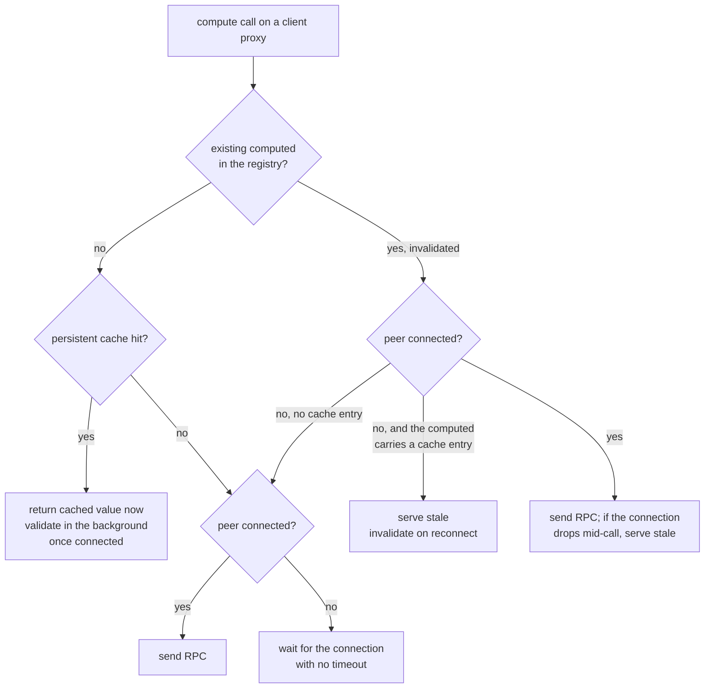

# Offline render path: the essential compute methods

This is the inventory behind the [offline mode plan](../plans/offline-mode.md). It answers three
questions for everything a user touches while *reading* Voxt - opening a chat, scrolling it, and
walking the left panel's "All chats", places and notifications tabs - and nothing else (no editor,
no search, no settings, no test pages):

1. Which remote calls happen on that path, and how often.
2. What the client does with each of them when there is no connection.
3. Which of them the routine prefetch warms, and which it doesn't.

Everything here was read from source at the time of writing; line numbers are deliberately
omitted because they rot, file links aren't.

[[toc]]

## How the client behaves without a connection

The client talks to the server through Fusion's RPC layer. Every call falls into one of the
kinds below, and the kind decides what happens offline far more than the call site does.

| Kind | What it is | Offline behaviour today |
|---|---|---|
| **cached** | `[ComputeMethod]` on a client proxy with the default `RemoteComputedCacheMode.Cache` | A cold-start call is answered from the persistent cache at once; a value that was invalidated while the peer is known to be disconnected is re-served stale. A call whose result was **never** cached parks until the peer connects. |
| **no-cache** | `[RemoteComputeMethod(CacheMode = NoCache)]` | Never persisted, never served stale. Parks until the peer connects, every time. |
| **rpc** | A plain (non-compute) RPC query, including `RpcStream` calls | Parks until the peer connects: queries have an infinite connect timeout. |
| **command** | `[CommandHandler]` sent via `UICommander` / `Commander` | Fails with `TimeoutException` after the 20 s connect timeout set in [ClientStartup.cs](https://github.com/Actual-Chat/actual-chat/blob/main/src/dotnet/UI.Blazor.App/ClientStartup.cs), unless the method is marked `ConnectTimeout = ∞` (message posts and uploads are). |
| **local** | `LocalSettings`, in-memory `*UI` state | Works. |

The persistent cache is [KvasarRemoteComputedCache](https://github.com/Actual-Chat/actual-chat/blob/main/src/dotnet/UI/Caching/KvasarRemoteComputedCache.cs)
on MAUI and `WebRemoteComputedCache` (IndexedDB) on WASM; Blazor Server has none. Both are
per-session folders keyed by the RPC cache key, versioned by `ApiConstants.VersionString`, and only
`IAccounts.GetOwn` is force-flushed - everything else is written with a 0.667 s flush delay.

The decision Fusion makes for a **cached** call, taken from
[RemoteComputeMethodFunction.cs](https://github.com/ActualLab/Fusion/blob/master/src/ActualLab.Fusion/Client/Interception/RemoteComputeMethodFunction.cs):

Four consequences shape everything below:

- **Nothing is invalidated by a disconnect.** In-flight calls are kept and resent on reconnect; a
  value already on screen stays on screen.
- **Cache misses hang, they don't fail.** `RpcCallTimeouts.Default.Query` is `(∞, ∞)`, so a
  `Computed` that depends on a never-cached call stays *Computing* forever, and so does every
  component and aggregate that awaits it. This is what a "stuck skeleton" is.
- **The peer learns about a dead link late.** Nothing disconnects the RPC peer when the OS reports
  offline; the app only parks reconnect attempts (`AppRpcClientPeerReconnectDelayer`). A silently
  dropped link is noticed after the keep-alive timeout, about 25-35 s, and only then do the
  serve-stale paths engage.
- **`no-cache` methods have nothing to fall back to.** The only defence is not awaiting them:
  `ComputedExt.UseIfReady` (used once, in `ChatListItem`) or a `ConnectivityUI.IsConnected` gate
  (used in `LiveStreamUI` and `TypingUI`).

::: tip Already verified on a device
Commit `6fcd74beab` measured an airplane-mode chat list: all 489 cache lookups hit, `IChats.GetNews`
52/52, and `ChatUI.Get` produced byte-identical output to the online run. The rows still rendered
title-only, because one `no-cache` call was awaited. Data was never the problem; awaiting was.
:::

## The routine prefetch

Three mechanisms warm the cache without the user doing anything. The coverage column in the
tables below refers to them by letter.

| Code | Mechanism | What it warms |
|---|---|---|
| **S** | Startup render. The shell, navbar badges, and chat list render on every launch and pull their own data; on MAUI [AppNonScopedServiceStarter.PreloadContacts](https://github.com/Actual-Chat/actual-chat/blob/main/src/dotnet/UI.Blazor.App/Services/AppNonScopedServiceStarter.cs) additionally preloads every contact of the selected place. The per-place unread badges call `ChatListUI.ListUnordered(placeId)` for every place, which runs `ChatUI.Get` for every chat the user has - so the whole chat-list model is warm a few seconds after launch. | `IAccounts.GetOwn`, `INotifications.ListActive`, `IContacts.ListPlaceIds/ListIds/GetForChat`, `IPlaces.Get`, `IChats.Get/GetNews`, `IMentions.GetLastOwn`, `IChatPositions.GetOwn`, `IUserSettings.Get(*)` |
| **T** | [ChatUI.PrefetchChatTails](https://github.com/Actual-Chat/actual-chat/blob/main/src/dotnet/UI.Blazor.App/Services/ChatUI.StateSync.cs). Starts 20 s after launch, rescans every minute, walks chats touched in the last 365 days newest-first in batches of 10 with a 10 s pause, and for each pulls the last 100 entries via `PrefetchLoadZone` + `PrefetchChatInfo`. Progress is stored in `ChatTailPrefetchState` so a chat is refetched only when it moves. | `IChats.GetTile` (per 5-entry tile, plus one preceding tile), `IConversations.GetTile`, `IChats.Get/GetIdRange/GetRules`, `IAuthors.ListAuthorIds` |
| **D** | Pointer-down [ChatUI.Prefetch](https://github.com/Actual-Chat/actual-chat/blob/main/src/dotnet/UI.Blazor.App/Services/ChatUI.Tiles.cs) (`data-prefetch` on every chat link). Mirrors exactly what the first `GetChatItems` build will ask for. Only helps when online - it is a latency trick, not an offline one - but it is the only place `IChats.GetChatRangeMeta` is ever warmed ahead of time. | everything in the first build of a chat view |
| **V** | Viewed. Warm only because the user had the thing on screen at some point in this install. | per-message, per-author, per-notification data |
| **—** | Not prefetched by anything. | |

## The map

### App shell and startup

Everything here is needed before the first screen is usable, on every launch.

| Remote call | Kind | Needed by | Coverage |
|---|---|---|---|
| `IMobileSessions.CreateSession` | rpc | [MauiSession.Acquire](https://github.com/Actual-Chat/actual-chat/blob/main/src/dotnet/App.Maui/Services/MauiSession.cs) - only when no session is stored; a stored one is used as-is without asking the server | n/a (first launch must be online) |
| `IAccounts.GetOwn(session)` | cached, force-flushed | `AccountUI.WhenReady`, and nearly every component through `AccountUI.OwnAccount` | S |
| `IAccounts.GetSessionInfo`, `ISessionTemporals.Get` | cached | `AccountUI.StateSync` session-validity and pending-registration monitors (background) | S |
| `ISystemProperties.GetServerApiInfo` | **no-cache** | [ClientUpgradeCover](https://github.com/Actual-Chat/actual-chat/blob/main/src/dotnet/UI.Blazor.App/Components/ClientUpgradeCover/ClientUpgradeCover.razor) around the whole app. Renders children while the value is unknown, so a pending call is harmless. | n/a |
| `IUserSettings.Get(session, key)` for `UserNavbarSettings`, `UserPttSettings`, `UserAppSettings`, `UserLanguageSettings`, `UserBubbleSettings`, `UserOnboardingSettings`, `UserReplaySettings` | cached | `NavbarUI`, `ChatAudioUI`, `Features`, `LanguageUI`, `BubbleUI`, `OnboardingUI` - each one is a live `SyncedState` subscription | S |
| `INotifications.ListActive(session)` | cached | Badges, the notifications tab, `ChatUI.GetUnreadState` for every row, `AppIconBadgeUpdater`, `NotificationReconciler`, `SeenNotificationDismisser` | S |
| `IUserPresences.Get(ownUserId)` | cached | Own avatar in the account dropdown | S |
| `IContacts.ListPlaceIds(session)` | cached | Navbar place buttons, `ChatListUI.ListAllUnordered` | S |
| `IPlaces.Get(session, placeId)` per place | cached | Navbar, place headers, `ChatUI.SelectNavbarGroup` | S |
| `IChats.GetRules(session, chatId)` per active chat | cached | `ActiveChatsUI` corrector on first read of the stored active-chat list | S |
| `IAccounts.GetOwn` | cached | `ChatUI.FixChatId`, the corrector of the stored `SelectedChatId` | S |

Startup workers that are **not** on the render path but talk to the server: `ServerTimeSync`
(`ISystemProperties.GetTime`, 0.5 s connect timeout), `RpcEndpointMonitor` (HTTP probes with 3-30 s
timeouts), `AppPresenceReporter` (`UserPresences_CheckIn`, guarded by a bounded
`WhenClientPeerConnected`), `ContactSync`. All run under `RetryForever` and only cost log noise.

### Left panel: "All chats"

The list root is `ChatListUI.ListUnordered(placeId, filter)` → `IContacts.ListIds` → `ChatUI.Get`
per contact. [ChatUI.Get](https://github.com/Actual-Chat/actual-chat/blob/main/src/dotnet/UI.Blazor.App/Services/ChatUI.cs)
builds the `ChatInfo` every row, badge and sort order depends on; note its `GetNews` await is bounded
by a 20 s `WaitAsync` that turns a cold miss into a `TimeoutException`, logged as an error and
rethrown.

| Remote call | Kind | Needed by | Coverage |
|---|---|---|---|
| `IContacts.ListIds(session, placeId)` for `null` and every place | cached | List root, unread badges | S |
| `IContacts.GetForChat(session, chatId)` | cached | `ChatUI.Get` | S |
| `IChats.GetNews(session, chatId)` | cached | `ChatUI.Get` (20 s bound), `ChatUI.GetPreview` | S |
| `IMentions.GetLastOwn(session, chatId)` | cached | `ChatUI.Get` | S |
| `IChatPositions.GetOwn(session, chatId, Read)` | cached | `ChatUI.GetReadEntryLid`, unread counts | S |
| `IChats.Get(session, chatId)` | cached | `ChatUI.GetReadEntryLid`, `ActiveChats`, read-position state | S |
| `IUserSettings.Get(ChatUserSettings:{chatId})` | cached | `ChatUI.Get` (notification mode), translation | S |
| `IChats.Get(threadChatId)` + `IChatThreads.GetThreadCreator` | cached | `ChatUI.GetPreview` when the last entry starts a thread | S for the selected place, V otherwise |
| `IAuthors.Get` / `IAuthors.GetOwn` | cached | `AuthorName` of the last entry, per visible group row | V |
| `IAccounts.Get(peerUserId)` + `IUserPresences.Get` | cached | `ChatIcon` of every visible peer row | V |
| `IAuthors.ListAuthorIds`, `IChats.GetReadPositionsStat` | cached | "Read by others" tick on rows whose last entry is yours | T / V |
| `ISharedLocations.Get` | cached | Rows whose last entry is a location | V |
| `ILiveSessions.Get`, `ILiveSessions.GetAudioStreamingAuthorIds`, `ILiveSessions.HasRecorder` | **no-cache** | `ChatActivityUI.GetCallActivity` - the one call site already guarded by `UseIfReady`, so the row renders without it | n/a |
| `ILiveSessions.HasActivity/HasRecorder` (gated on `IsConnected`), `ILiveVideoStreams.List` (**not** gated) | **no-cache** | `ChatActivityUI.HasOngoingCall`, awaited directly for PTT-armed rows | n/a |
| `IChatTypingActivities.ListTypingAuthorIds` | **no-cache**, gated | Typing indicator in the row | n/a |

The tab and sort settings (`ChatListSettings`) are local. The "Threads" tab adds
`IChatThreads.ListIdsForPlace/ListIdsForChat` and `IChats.Get` per thread (cached, V).

### Left panel: places

| Remote call | Kind | Needed by | Coverage |
|---|---|---|---|
| `IContacts.ListPlaceIds`, `IPlaces.Get` per place, `ChatListUI.ListUnordered(placeId)` chain | cached | Navbar place buttons and their unread badges | S |
| `IUserSettings.Get(UserNavbarSettings)` | cached | Place order, pinned chats | S |
| `IPlaces.ListAuthorIds(session, placeId)` | cached | Place header ("invite" / member count), only when the rules allow it | V |
| `IPlaces.ListUserIds` + `ChatUI.Get` per member | cached | The place's "People" tab | V |
| `IPlaces.GetWelcomeChatId` | cached | Place-root route | V |
| `IAccounts.GetOwn` (+ `UserAppSettings` for admins) | cached | `Features.IsIncompleteUIEnabled` read by the always-mounted place search overlay | S |
| `IContacts.ListIds(placeId)` + `IChats.Get` | cached | `ChatUI.GetLastUsedChatId` on a place button click | S |

### Left panel: notifications

| Remote call | Kind | Needed by | Coverage |
|---|---|---|---|
| `INotifications.ListActive(session)` | cached | Every list and badge in the tab; three permanent `ChatListUI.ListUnordered` subscriptions in `NotificationsPanelUI` | S |
| `IChats.Get(session, chatId)` per reaction notification | cached | `ReactionNotificationItem` | V |
| `IAuthors.Get` / `IAuthors.GetOwn` per reacting author (up to 3) | cached | Avatars in `ReactionNotificationItem` | V |
| `Notifications_Dismiss`, `Notifications_DismissAll` | command | Seen-reaction dismissal (background, logged), "Dismiss all" (toast on failure) | n/a |

### Chat view: opening a chat

`ChatPage` resolves the chat with a 1 s bound and keeps the previous page state on a timeout.
`ChatView` then leases the read position **before its first render** - a cold miss on
`IChatPositions.GetOwn` means the chat never appears.

| Remote call | Kind | Needed by | Coverage |
|---|---|---|---|
| `IChats.Get(session, chatId)` | cached | `ChatPage`, `ChatView`, every message | S, T |
| `IChatPositions.GetOwn(session, chatId, Read)` | cached | `ChatUI.LeaseReadPositionState` - awaited before first render | S |
| `IChats.GetIdRange(session, chatId)` | cached | `ChatView.GetData`, `UpdateReadState`, `ChatUI.IsEmpty` | T |
| `IChats.GetNews(session, chatId)` | cached | `UpdateReadState`, `NavigateToUnreadOrEnd` | S |
| `IAuthors.GetOwn(session, chatId)` | cached | `UpdateReadState`, author badges, `LiveBlockUI` | — |
| `IChats.GetRules(session, chatId)` | cached | Pinned bar, hover and context menus | T |
| `IChats.ListPinnedEntries` + `IChats.GetEntry` per pin | cached | `ChatPinnedBar` | — |
| `IUserSettings.Get(UserAppSettings)`, `IUserSettings.Get(ChatUserSettings:{chatId})` | cached | Author colours and translation state, read per message | S |
| `INotifications.ListActive` | cached | `NavigateToUnreadOrEnd` unread count | S |
| `IPlaces.Get`, `IPlaces.GetWelcomeChatId`, `IAliases.*` | cached | Place chats, place-root and alias routes | S / V |
| `ChatUsages_RegisterUsage` | command | Recency list; fire-and-forget, logged at Debug | n/a |

### Chat view: every rebuild (each scroll step, each new message)

[ChatUI.GetChatItemsInternal](https://github.com/Actual-Chat/actual-chat/blob/main/src/dotnet/UI.Blazor.App/Services/ChatUI.Tiles.cs)
issues all of these before its first `await`, then awaits them in order. One cold miss stalls the
whole build, and with it every scroll request until the peer reconnects.

| Remote call | Kind | Needed by | Coverage |
|---|---|---|---|
| `IChats.Get`, `IChats.GetIdRange` | cached | Every build | S, T |
| `IChats.GetChatRangeMeta(session, chatId, metaTileStart)` × meta tiles covering the load zone ± `LoadLimit` | cached | Every build. `UseRangeMetaOrLastKnown` stands in only after a first successful read. | **D only** |
| `IConversations.GetTile(session, chatId, metaTileRange)` × meta tiles | cached | Every build, unconditionally | T |
| `IChats.GetTile(session, chatId, idTileRange)` × id tiles (+1 preceding) | cached | Every tile in the zone, plus a speculative second copy for the adjacent zone | T (last 100 entries only) |
| `ILiveSessions.GetState(session, chatId)` via `LiveSessionUI.GetConversation`, `LiveSessionUI.GetBlockSnapshot` and `LiveBlockUI.GetBlockState` | **no-cache** | Every build. `UseConversationOrLastKnown` / `UseSnapshotOrLastKnown` **await the first read** - a chat opened for the first time in this process never renders offline. | n/a |
| `IChats.GetIdRange` + `IChats.GetTile` scan (`ChatUI.IsEmpty`) | cached | Only when a build yields no items | T |

### Chat view: per rendered message

| Remote call | Kind | Needed by | Coverage |
|---|---|---|---|
| `IChats.GetEntry(session, entryId)` → the entry's `GetTile` | cached | `ChatEntryMessageInternalView` for every message, `TranscriptUI`, `DateVisor` on every scroll | T (same tiles) |
| `IAuthors.Get(session, chatId, authorId)` | cached | Every author badge: name and avatar per message group, per reaction avatar, per thread and conversation card | **—** |
| `IAuthors.GetOwn(session, chatId)` | cached | Every author badge | — |
| `IAuthors.GetPresence(session, chatId, authorId)` | cached | Presence dot on every message-group avatar | — |
| `ILiveSessions.GetAudioStreamingAuthorIds` | **no-cache**, not gated | `AuthorPresenceIndicator` with `ShowRecording` on every message-group avatar; the indicator keeps its initial state while it pends | n/a |
| `IChats.GetEntry(repliedEntryId)` | cached | Reply quotes | T if the quoted entry is in the tail, — otherwise |
| `IReactions.ListSummaries`, `IReactions.Get` | cached | Entries with reactions | — |
| `IChats.IsEntryReadByMentionedUser` per mention; `IAuthors.GetByUserId`, `IAccounts.GetOwn`, `IContacts.Get` for `@u:` mentions | cached | Mention chips | — |
| `IChats.GetReadPositionsStat`, `IAuthors.ListAuthorIds` | cached | Read ticks on own messages | — / T |
| `INotifications.HasNotifiedMentionedMembers` | cached | Own messages with mentions | — |
| `IChats.Get(threadChatId)`, `IChatThreads.GetThreadCreator`, `IChatThreads.GetThreadStat`, thread `GetIdRange` + `GetTile` | cached | Thread cards | — |
| `IUserSettings.Get(ChatUserSettings)`, `ITranslations.GetLanguageTile`, `ITranslations.Get` | cached | Translation on; one `ITranslations.Get(translateIfMissing: true)` per missing translation is a server-side write bounded by a 60 s timeout | S / — |
| `ISharedLocations.Get` | cached | Location messages | — |
| `IChats.Get(forwardedChatId)`, `IChats.GetForwardChatReplacement`, `IAuthors.Get` | cached | Forwarded messages | — |
| `LinkPreviewUI` chain: `IChats.Get`, `IChats.GetEntry`, `IAuthors.Get`, `IPlaces.Get`, `IAccounts.Get`, `IInvites.GetInviteChatLinkPreview` | cached | Every Voxt link inside a message | — |
| Conversation cards: `ITranslations.Get` ×3, `ILiveSessions.GetState` ×3 (**no-cache**), `IAuthors.Get` per participant, `LiveBlockUI.GetBlockState` | mixed | Summarised conversations | T for the tile, — for the rest |
| `ILiveAudioStreams.GetTranscriptStream` | rpc stream | Entries still marked as streaming; `RetryForever` with 3-60 s backoff | n/a |
| `ILiveAudioStreams.GetReplayStream` | rpc stream | Play button | n/a |
| `IInvites.GetOrGenerateChatInvite` | cached, side-effecting | Welcome block of an empty chat | n/a |

Media - avatars, image and video attachments, link-preview thumbnails - is plain HTTP through
`UrlMapper.ContentUrl` / `ImagePreviewUrl`. Content responses are marked immutable for 30 days, so
what was on screen once usually survives in the WebView's HTTP cache; what wasn't never loads, and
`image-skeleton.lit.ts` already retries with backoff instead of looping.

### Writes on the read path

These leave the client while the user is only reading. None of them blocks rendering; the
question is what they do while offline.

| Call | Where | Offline behaviour |
|---|---|---|
| `ChatPositions_Set` | Read-position `SyncedState` writer in `ChatUI`, debounced 1 s, `Commander.Run` with `CancellationToken.None` | Times out after 20 s, error not surfaced, **position advanced offline is lost** |
| `ChatUsages_RegisterUsage` | `ChatView` on open | Times out, logged at Debug |
| `UserPresences_CheckIn` | `AppPresenceReporter` timer | Skipped while the peer isn't connected |
| `Notifications_Dismiss` | `SeenNotificationDismisser` | Times out, un-marks and logs a warning |
| `UserSettings_Set` | Any `SyncedState` write (navbar pins, PTT toggle) | Retried by `SyncedState.LazyWrite` |
| `ITranslations.Get(translateIfMissing: true)` | `ThrottledTranslations` queue | Occupies one of 10 queue slots for 60 s each |

## What the routine prefetch leaves cold

Reading the coverage columns together, this is what a chat that the tail prefetcher has fully
processed still lacks when opened cold, ordered by how visibly it breaks the screen:

| Gap | Effect offline | Cost to close |
|---|---|---|
| `IChats.GetChatRangeMeta` for the meta tiles around the tail | **The chat view never renders** - every build awaits it | One extra call per meta tile in `PrefetchLoadZone`, using the same tile arithmetic as `GetChatItemsInternal` |
| `ILiveSessions.GetState` first read in `LiveSessionUI` | **The chat view never renders** - not a prefetch gap, a `no-cache` await | Stand in `null` when nothing is known yet (see the plan) |
| `IAuthors.Get` for the tail's authors | Every message group shows an empty name and avatar | One call per distinct author in the fetched tiles |
| `IAuthors.GetOwn` | Own-message detection in badges and `UpdateReadState` | One call per chat |
| `IReactions.ListSummaries` for entries that have reactions | Reactions render blank | One call per reacted entry in the tail |
| Thread cards: `IChats.Get(thread)`, `GetThreadCreator`, `GetThreadStat`, the thread's own tail | Thread cards render empty | Three calls plus a tile per thread start in the tail |
| `IChats.ListPinnedEntries` + the pinned entries' tiles | Pinned bar empty | One call plus a tile per pin |
| `IAuthors.Get` / `IAccounts.Get` / `IUserPresences.Get` for list rows never scrolled into view | Row name or avatar missing | Already partly covered by `PreloadContacts`; cheap to extend |
| `IChats.Get` + `IAuthors.Get` per reaction notification | Notification rows empty | Walk `INotifications.ListActive` once |
| Reply quotes, mention chips, link previews, forwards, locations, translations older than the tail | The affected fragment stays blank | Out of proportion to their frequency; accept as component-local pending state |

Everything in the "chat list" and "shell" tables is already warm after a normal launch, because
the badges and the list render it. The gaps are concentrated in the chat view, and two of them are
blockers rather than blemishes.
