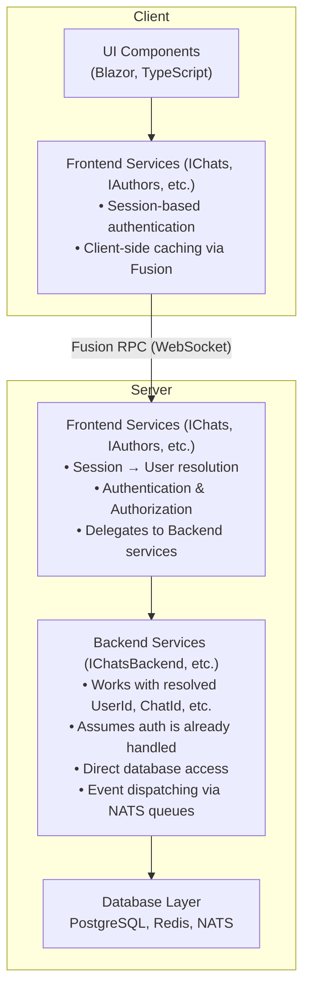

# Architecture Overview

Voxt is a real-time communication platform built on [ActualLab.Fusion](https://github.com/ActualLab/Fusion), which provides transparent real-time state synchronization between server and clients.

## Core Concepts

### Fusion: Real-Time State Synchronization

Fusion is the foundation of Voxt's architecture. It enables:

1. **Computed Services** - Methods decorated with `[ComputeMethod]` that automatically track dependencies and invalidate when underlying data changes
2. **Transparent Caching** - Results are cached and automatically invalidated when dependencies change
3. **Real-time Updates** - Clients automatically receive updates when server state changes
4. **RPC with Caching** - Remote computed methods maintain cache consistency across network boundaries

### Two-Tier Service Architecture

Voxt uses a **Frontend/Backend service split**:



### Frontend Services (API Layer)

Frontend services are the **public API** exposed to clients. They:

- Take `Session` as the first parameter for authentication
- Handle authorization checks
- Resolve session to user identity
- Delegate to backend services for actual data operations
- Are defined in `*.Contracts` projects (e.g., `Api.Contracts`)

Example:
```csharp
public interface IChats : IComputeService
{
    [ComputeMethod]
    Task<Chat?> Get(Session session, ChatId chatId, CancellationToken cancellationToken);

    [CommandHandler]
    Task<Chat> OnChange(Chats_Change command, CancellationToken cancellationToken);
}
```

### Backend Services

Backend services contain the **core business logic**. They:

- Work with already-resolved identifiers (UserId, ChatId, etc.)
- Assume authentication and authorization is handled
- Access the database directly
- Dispatch events via the command/event system
- Are defined in `*.Contracts` projects (e.g., `Chat.Contracts`)

Example:
```csharp
public interface IChatsBackend : IComputeService, IBackendService
{
    [ComputeMethod]
    Task<Chat?> Get(ChatId chatId, CancellationToken cancellationToken);

    [CommandHandler]
    Task<Chat> OnChange(ChatsBackend_Change command, CancellationToken cancellationToken);
}
```

## Commands and Events

### Command Pattern

Commands represent write operations. They follow this naming convention:
- Frontend commands: `{ServiceName}_{Action}` (e.g., `Chats_Change`)
- Backend commands: `{ServiceName}Backend_{Action}` (e.g., `ChatsBackend_Change`)

Commands must implement:
- `ICommand<TResult>` - For commands with return values
- `ISessionCommand<TResult>` - For frontend commands (includes Session)
- `IBackendCommand` - For backend commands

```csharp
[DataContract, MemoryPackable(GenerateType.VersionTolerant)]
public sealed partial record Chats_Change(
    [property: DataMember, MemoryPackOrder(0)] Session Session,
    [property: DataMember, MemoryPackOrder(1)] ChatId? ChatId,
    [property: DataMember, MemoryPackOrder(2)] long? ExpectedVersion,
    [property: DataMember, MemoryPackOrder(3)] Change<ChatDiff> Change
) : ISessionCommand<Chat>, IApiCommand;
```

### Event System

Events are dispatched via NATS queues for asynchronous processing:

1. Commands add events: `context.Operation.AddEvent(new AuthorUpsertedEvent(...))`
2. Events are queued to NATS after the operation completes
3. Event handlers process events asynchronously

Event handlers are registered via `[EventHandler]` attribute on interfaces:
```csharp
public interface IContactsBackend : IComputeService, IBackendService
{
    [EventHandler]
    Task OnAuthorChangedEvent(AuthorUpsertedEvent eventCommand, CancellationToken cancellationToken);
}
```

## Computed Methods and Invalidation

### ComputeMethod

Methods marked with `[ComputeMethod]` are automatically cached and invalidated:

```csharp
[ComputeMethod]
public virtual async Task<Chat?> Get(ChatId chatId, CancellationToken cancellationToken)
{
    var dbChat = await DbChatResolver.Get(chatId.Value, cancellationToken).ConfigureAwait(false);
    return dbChat?.ToModel();
}
```

### Invalidation

When data changes, related computed methods must be invalidated:

```csharp
if (Invalidation.IsActive) {
    _ = Get(chat.Id, default);  // Invalidate Get for this chat
    _ = ListIds(ownerId, placeId, default);  // Invalidate list
    return null!;
}
```

### Dependency Tracking

Computed methods automatically track dependencies. When method A calls method B:
- A depends on B
- When B is invalidated, A is also invalidated
- Clients subscribed to A receive updates automatically

## Domain Model

### Key Entities

| Entity | Description |
|--------|-------------|
| `Account` | User account with profile information |
| `Session` | Client session for authentication |
| `Chat` | A conversation (group, peer, or place chat) |
| `ChatEntry` | A message or event in a chat |
| `Author` | A user's presence in a specific chat |
| `Place` | A workspace containing multiple chats |
| `Contact` | A user's contact list entry |

### ID Types

Strong typing is used for all identifiers:
- `UserId` - User identifier
- `ChatId` - Chat identifier (with subtypes: `GroupChatId`, `PeerChatId`, `PlaceChatId`)
- `AuthorId` - Author in a specific chat
- `PlaceId` - Place (workspace) identifier
- `ContactId` - Contact entry identifier

## Infrastructure

### Databases

- **PostgreSQL** - Primary data store for all entities
- **Redis** - Caching, distributed locks, session storage
- **NATS** - Event queuing and pub/sub messaging

### Sharding

Backend commands implement `IHasShardKey<T>` for distributed processing:

```csharp
public sealed partial record ChatsBackend_Change(...) : ICommand<Chat>, IBackendCommand, IHasShardKey<ChatId>
{
    public ChatId ShardKey => ChatId;
}
```

### Queues

Events are processed via queues:
- Commands call `context.Operation.AddEvent(event)`
- Events are sent to NATS queues
- Queue processors handle events asynchronously
- `WhenProcessing()` can be called to wait for queue processing (useful in tests)

## UI Architecture

### Blazor Components

The UI is built with Blazor, with components organized by feature:
- `UI.Blazor` - Core UI infrastructure
- `UI.Blazor.App` - Application-specific components
- TypeScript files (`.ts`) accompany Blazor components for JavaScript interop

### State Management

UI components use Fusion's computed services directly:
1. Components call computed methods
2. Fusion tracks subscriptions
3. When server data changes, components re-render automatically

### Client/Server Rendering

Voxt supports multiple rendering modes:
- **Server** - Full server-side rendering with SignalR
- **WebAssembly** - Client-side execution
- **MAUI** - Native mobile apps

## Testing

### Integration Tests

Tests use a shared `AppHostFixture` that provides:
- Full application stack with in-memory or NATS queues
- Test database (PostgreSQL)
- Unique user creation for test isolation

Key patterns:
- `ComputedTest.When()` - Wait for computed values to satisfy conditions
- `services.Queues().WhenProcessing()` - Wait for event queue processing
- Tests must call `WhenProcessing()` before assertions that depend on events

### Test Infrastructure

```csharp
[Collection(nameof(ChatCollection))]
public class ChatOperationsTest(ChatCollection.AppHostFixture fixture, ITestOutputHelper @out)
    : SharedAppHostTestBase<AppHostFixture>(fixture, @out)
{
    [Fact]
    public async Task CreateChat()
    {
        await using var tester = AppHost.NewBlazorTester(Out);
        await tester.SignInAsUniqueAlice();

        var (chatId, _) = await tester.CreateChat(true);

        // Wait for queue processing before assertions
        await services.Queues().WhenProcessing();

        await ComputedTest.When(services, async ct => {
            var chat = await chats.Get(session, chatId, ct);
            chat.Should().NotBeNull();
        });
    }
}
```

## Key Design Principles

1. **Frontend services handle auth, backend services handle data** - Clear separation of concerns
2. **Computed methods for reads, commands for writes** - Consistent patterns
3. **Events for cross-service communication** - Loose coupling via NATS
4. **Strong typing for IDs** - Compile-time safety
5. **Invalidation-based caching** - Automatic cache consistency
6. **ConfigureAwait(false)** - Required in service code for performance
