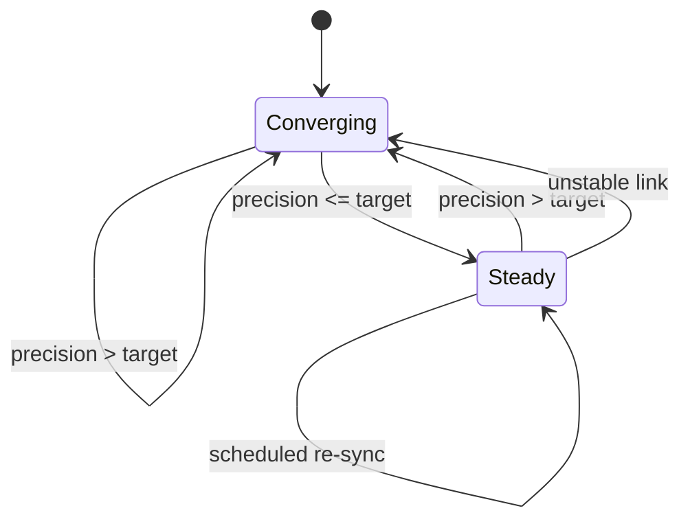
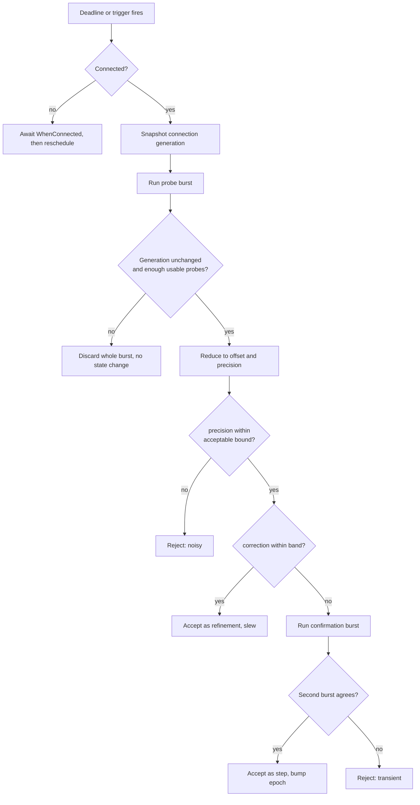

# Server clock sync

`ServerClock` is the client's estimate of server time. It is a wall clock plus a
measured offset, maintained by
[ServerTimeSync.cs](https://github.com/Actual-Chat/actual-chat/blob/main/src/dotnet/UI.Blazor/Services/ServerTimeSync.cs).

This document specifies how that offset should be measured, accepted, and
applied. It is a design spec, not a description of current behaviour — the
"Current behaviour" section below records what exists today and why it needs to
change.

[[toc]]

## Why the precision target is 50 ms

`ServerClock` is not a convenience. Two pipelines anchor on it:

| Consumer | Uses it for | Source |
|---|---|---|
| Audio stream origin | `ClientStartAt`, becomes the chat entry's `BeginsAt` | [audio-streamer.ts](https://github.com/Actual-Chat/actual-chat/blob/main/src/dotnet/UI.Blazor.App/Components/AudioRecorder/workers/audio-streamer.ts) |
| Video stream origin | `sourceStartedAtMs` | [recorder-worker-host.ts](https://github.com/Actual-Chat/actual-chat/blob/main/src/dotnet/UI.Blazor.App/Services/Video/sender/recorder-worker-host.ts) |
| Presentation lag | A/V sync signal, reported at ~2 Hz | [feeder-audio-worklet-processor.ts](https://github.com/Actual-Chat/actual-chat/blob/main/src/dotnet/UI.Blazor.App/Components/AudioPlayer/worklets/feeder-audio-worklet-processor.ts) |

Both stream origins are stamped from the **same** `ServerClock` on the **same**
device, so a constant offset error is common-mode and cancels when audio and
video are aligned against each other. What does *not* cancel is the offset
**moving between the two stamps** — then the two anchors sit on different
offsets and A/V drifts by the size of the step.

50 ms is the threshold below which that drift is not perceptible. Everything in
this spec follows from treating 50 ms as a precision target and deriving cadence
from it, rather than picking a cadence and accepting whatever precision falls
out.

::: tip
Live audio playback used to read `ServerClock` too: `skipTo` discarded the head
of every incoming message, and an offset reading high could discard the whole
message. That path no longer reads absolute time at all — see
[Open questions](#open-questions).
:::

## Current behaviour, and what is wrong with it

Measured on production over seven days (2 022 accepted syncs):

```
precision  p50= 96  p90=144  p99= 241  max=2926 ms
rtt ema    p50=194  p90=303  p99= 725  max=5851 ms
|offset|   p50=617  p90=2159 p99=24895 max=25039 ms
```

The offsets are real and large — median 617 ms of browser-vs-server
disagreement — so the sync is doing necessary work. The problem is the
**precision of the correction**: p50 96 ms and p90 144 ms, against a 50 ms
target. One accepted sync read `Offset = -356.789ms ± 2.926s (rtt ema 5.851s)`
and then governed client-side time for the next five minutes.

Six specific defects:

1. **`precision = 0.5 × avgRtt` cannot reach the target.** 50 ms precision needs
   RTT ≤ 100 ms; production p50 RTT is 194 ms. More than half of all syncs
   mathematically cannot hit the target with this estimator.
2. **`avgRtt` is computed over the wrong denominator** — burst wall time divided
   by the count of *usable* probes, so a timed-out probe keeps its time in the
   numerator but is dropped from the count.
3. **Nothing sanity-checks the offset itself.** The accept gate filters on RTT
   only; a single bad burst can walk the offset arbitrarily.
4. **The offset is applied as an instantaneous step**, no slew, no clamp — so a
   correction lands as a discontinuity in the middle of a stream.
5. **`MaxRejectStreak = 3` forces the gate open** regardless of RTT, so a client
   on a degraded link admits a low-confidence burst every fourth attempt.
6. **Probes park across disconnects.** `GetTime` declares no timeouts, and the
   `.WaitAsync(...)` wrapper abandons the await while the call stays in flight.
   A probe that resumes after a reconnect returns a server reading taken near
   `after` rather than the midpoint, biasing the offset **positive** by roughly
   half the outage — and a reconnect is exactly when a client is most likely to
   probe.

## Design goals

- Reach and hold ≤50 ms precision, syncing more often only while below target.
- Never accept a low-precision sample as if it were good.
- Distinguish **measurement noise** from **real clock movement**, and only let
  the second produce a large correction.
- Apply routine corrections without downstream discontinuities.
- Make a real discontinuity explicit, so consumers can rebase deliberately.

## The two-clock problem

Elapsed time is not reliably measurable on a client. Monotonic clocks freeze
across suspend on most platforms — as
[ClientStartup.cs](https://github.com/Actual-Chat/actual-chat/blob/main/src/dotnet/UI.Blazor.App/ClientStartup.cs)
already documents for `CpuClock` — but not all: `CLOCK_MONOTONIC` excludes
suspend while `CLOCK_BOOTTIME` includes it, and .NET exposes no portable
boot-time clock. A wall-clock *step* and a *sleep* both produce wall-vs-monotonic
divergence and are indistinguishable from each other.

The design therefore **never relies on knowing true elapsed time**:

```
elapsedSafe() = max(wallNow - lastAcceptedWall, monoNow - lastAcceptedMono)
```

Over-estimating elapsed time only shortens intervals and widens the staleness
relaxation — both fail safe. Wall-vs-monotonic divergence is used **only as a
trigger** to re-measure, never as evidence that a correction is legitimate.

## State

| Field | Purpose |
|---|---|
| `offset`, `offsetTarget` | applied offset; slew destination |
| `precision` | uncertainty of the current offset |
| `epoch` | incremented only on a confirmed discontinuity |
| `lastAcceptedWall`, `lastAcceptedMono` | last accepted sync, on both clocks |
| `connectedElapsed` | staleness, accrued only while connected |
| `mode` | `Converging` or `Steady` |
| `driftRate` | measured, evidence-gated, decays when quiet |
| `attempt` | backoff counter within `Converging` |

The learned `driftRate` only ever *shortens* the cadence, on evidence beyond
measurement noise; the assumed rate remains the model. See
[Why drift is assumed, not measured](#why-drift-is-assumed-not-measured).

## Workflow





### 1. Scheduling

The next attempt runs from an explicit deadline, not a polling tick.

```
Converging:  next = backoff(attempt)     // 1s, 2s, 4s ... capped at 60s
Steady:      next = SteadyInterval       // shortened while measured drift exceeds the assumption
```

Triggers that preempt the deadline:

- explicit `EnsureSynced()` — called before the first recording
- wall-vs-monotonic divergence detected
- app resume or foreground
- connection re-established

These triggers, not the timer, are what catch real clock movement. The timer is
a backstop for the slow residual.

### 2. Preconditions

Never fire probes while disconnected — they park and resume post-reconnect with
a poisoned midpoint.

```csharp
await peer.WhenConnected(ConnectWait, cancellationToken);
var s0 = peer.ConnectionState.Value; // generation snapshot
```

### 3. The burst

`BurstSize` probes — larger while converging — spaced `ProbeSpacing` apart so
they do not all sample the same queuing event. The current implementation runs
them back-to-back, which makes them highly correlated.

```csharp
using var cts = CancellationTokenSource.CreateLinkedTokenSource(cancellationToken);
cts.CancelAfter(ProbeTimeout);
var t0 = offsetBaseClock.Now;
var remote = await SystemProperties.GetTime(cts.Token);
var t1 = offsetBaseClock.Now;
// rtt    = t1 - t0
// offset = isServer ? (t0 + t1) / 2 - remote : remote - (t0 + t1) / 2
```

::: warning
Use a linked `CancellationTokenSource`, not `.WaitAsync(timeout)`. `WaitAsync`
abandons the await while the RPC stays in flight; a linked CTS cancels the call
itself, so no orphan resumes after a reconnect.

Do **not** rely on `[RpcMethod(RunTimeout = ...)]` for this. `RunTimeout` is
enforced by a sweep over in-flight calls every `CallTimeoutCheckPeriod`
(5 s ± 20%), so sub-5-second bounds are inexpressible — and the sweep skips
enforcement entirely while keep-alive is stale, which is exactly the half-dead
connection a probe needs to abandon.
:::

Drop an individual probe when:

- the call fails on `ConnectTimeout` or the probe CTS fires (connected but slow)
- `t1 < t0` — the wall base stepped mid-probe
- `rtt > MaxProbeRtt`
- `rtt < PhysicalRttFloor` — unmeasurable, **not** excellent

### 4. Burst validity

Checked before any reduction. Failure discards the whole burst with no state
change.

```csharp
var s1 = peer.ConnectionState.Value;
// require s0.Kind == Connected && s1.Kind == Connected
// require s1.ConnectionAttemptIndex == s0.ConnectionAttemptIndex
// require s1.Handshake.GetPeerChangeKind(s0.Handshake) == None
// require usableProbes >= MinUsableProbes
```

The peer-change check earns its place independently: a reroute can land on a
different server instance, hence a different clock domain, regardless of how
good the RTT looked.

### 5. Reduction

```
minRtt     = min(rtt_i)
subset     = { i : rtt_i <= minRtt * RttSelectionFactor }
candidate  = median(offset_i for i in subset)
bound      = 0.5 * minRtt                       // worst-case asymmetry
dispersion = spread(offset_i for i in subset)   // agreement = stability
precision  = max(bound, dispersion, timerGranularity)
```

Min-RTT selection is the single biggest improvement over the current estimator:
the lowest-RTT sample has the least queuing in both directions and therefore the
least asymmetry. A link whose *average* RTT is 194 ms routinely has a *minimum*
near 60–90 ms, which brings 50 ms into reach on the same connection.

::: danger
The `timerGranularity` floor is not optional. An earlier attempt at min-RTT was
reverted because browser `performance.now()` granularity lets a fast probe read
~0 RTT, and min-RTT then latches onto it and reports zero precision. The fix is
to floor the claim — never assert precision finer than the clock you measured
with — and to discard sub-physical readings as unmeasurable rather than treating
them as excellent.
:::

### 6. Classification

```
correction = |candidate - offset|
band       = SmallCorrectionFactor * max(precision, currentPrecision)

precision > acceptablePrecision()  -> reject, noisy
correction <= band                 -> accept as refinement
otherwise                          -> confirm
```

### 7. Confirmation

Large corrections are never classified by inspecting local clocks. The question
is whether the correction is **persistent or transient**, and that is answerable
by repeating the measurement:

```
wait ConfirmSpacing, run a second full burst (steps 3-5, all validity checks apply)
  agrees within ConfirmFactor * max(p1, p2)  -> accept as step
  lands near the old offset                  -> reject, transient
  a third distinct value                     -> unstable link: reject, enter Converging
```

A genuine clock step is persistent by definition; a bad sample is not. This also
catches discontinuities that local inspection could never explain — a
server-side clock step, or a reroute to a pod with a different clock.

### 8. Application

| Outcome | Applied as | Epoch |
|---|---|---|
| Refinement | slew over `SlewWindow` | unchanged |
| Step | immediately | incremented |

Both paths update `offset`, `precision`, `lastAcceptedWall`, `lastAcceptedMono`,
and push `(offsetMs, epoch)` to JS.

::: tip
The slew rate cap is a correctness requirement, not a comfort setting. A rate
below 100% guarantees `ServerClock.Now` never moves backwards even for a
negative correction. At 10%, a 200 ms correction completes in 2 s while time
still advances, just slower. NTP-style 500 ppm would take 400 s — far too slow
here.
:::

### 9. Anti-lockout

A client that can never produce a 50 ms sample must not freeze on a stale offset
forever. Because drift is negligible, there is no physical justification for
widening the *correction* band with time — the confirmation burst is the only
path to a large correction, unconditionally. What relaxes is the **precision**
requirement:

```
staleness = connectedElapsed since last accept
effectiveTarget()     = max(targetPrecision, LinkFloorHeadroom * 0.5 * minRttEma)
acceptablePrecision() = min(PrecisionCeiling,
                            effectiveTarget() * (1 + staleness / StalenessRelaxTime))
```

`effectiveTarget` exists because a fixed 50 ms target is *unattainable* on any
link whose RTT exceeds 100 ms — the single-measurement floor is `0.5 * minRtt`.
Without it, such a link (measured in the field: a 152 ms-RTT dev client) rejects
every sound ±76 ms burst as "noisy" for the entire relaxation window, accepts
one, resets the relaxation, and repeats — the offset free-runs in ~15-minute
reject cycles on exactly the clients that need syncing most. The same effective
target governs Steady-mode entry, so those links reach the steady cadence
instead of looping through Converging forever. `LinkFloorHeadroom` (1.2) keeps
the mode from flapping when bursts land exactly on the floor.

Two hard rules:

- never accept precision worse than `PrecisionCeiling`
- staleness accrues **only while connected**

The second matters: if staleness accrued in wall time, a client returning from an
hour offline would arrive fully relaxed and swallow the first sample it got —
which is the one most likely to be reconnect-poisoned.

A client stuck above the ceiling stays in `Converging`, keeps its old offset, and
is surfaced through metrics. Visibly unsynced beats silently wrong.

## Why drift is assumed, not measured

Oscillator drift cannot be measured at this cadence and precision:

| | ppm | per minute | per hour | per day |
|---|---|---|---|---|
| Typical spec @ 25°C | ±20 | 1.2 ms | 72 ms | 1.7 s |
| Bad but normal, temperature swing | ±50 | 3 ms | 180 ms | 4.3 s |
| Ugly worst case | ±100 | 6 ms | 360 ms | 8.6 s |

At 20 ppm a five-minute interval accumulates 6 ms — against a measurement
precision of 30–50 ms. Resolving that would need ~25 minutes of baseline per
sample pair and many pairs, so hours, during which an NTP step almost certainly
contaminates the fit.

It is also the wrong model for the population we serve. Clients are online by
construction, hence NTP-disciplined continuously, so what moves between syncs is
the OS's own corrections — steps and slews, i.e. discontinuities that the
confirmation burst handles and that no cadence would have caught earlier.

So the spec **assumes 50 ppm** and derives the steady interval from a fixed
budget:

```
SteadyInterval = clamp(DriftBudget / AssumedDriftRate, MinSteady, MaxSteady)
               = clamp(20 ms / 50 ppm, 5 min, 30 min)
               ~ 6.7 min
```

::: tip
Deriving from `targetPrecision - achievedPrecision` would be wrong: at 45 ms
achieved precision the margin is 5 ms, giving a ~100 s interval as a reward for
barely meeting target. The budget is deliberately independent of achieved
precision.
:::

Being wrong here is safe in the only direction that matters — a conservative rate
syncs more often than needed, never less.

### The escape hatch: correction-driven cadence

The "NTP-disciplined by construction" model failed in the field within a day of
deployment: a dev box with broken Windows time sync (13.8 s standing wall error)
drifted at **2000 ppm** — 40× the assumption — accruing ~0.8 s per steady
interval. Worse than a telemetry artifact: the inflated video-lag readings pumped
the receiver-side A/V hold into *real* audio delay.

So the assumed rate stays the model, but each accepted sync cross-checks it for
free: `correction / elapsed-since-last-accept` is a drift-rate sample. Only the
part of the correction that measurement noise cannot explain counts as evidence
(`correction − max(burstPrecision, precision)`), samples taken under
`MinSteadyInterval` are ignored entirely (expected drift sits below the noise
floor there, so they can neither confirm nor refute), and quiet syncs decay the
estimate by `DriftRateDecay` back toward zero. While the estimate exceeds
`AssumedDriftRate`, the steady interval follows it:

```
SteadyInterval' = clamp(DriftBudget / measuredDriftRate, MinSteadyInterval, SteadyInterval)
```

At the 20 s floor even a 2000 ppm machine accrues only ~40 ms per interval —
inside the small-correction band, so every correction stays a slewed refinement
and never a step. A healthy machine never produces evidence above noise, so its
cadence never changes. `EnsureSynced` applies the same estimate: predicted drift
beyond `targetPrecision` forces a re-measure even when the last accepted
precision was good.

::: info
Path changes are not drift and must not influence this number. A Wi-Fi to
cellular handover shifts the *measured* offset by tens of milliseconds through
asymmetry, but the clock has not moved. That is a corrupted measurement, handled
by min-RTT, dispersion and confirmation — not by syncing more often.
:::

## Epoch contract

`epoch` is a monotonically increasing integer, incremented only on an accepted
step, exposed to C# consumers and pushed to JS alongside the offset.

Consumers holding absolute anchors — A/V anchors, presentation lag — rebase when
it changes. This mirrors what the video pipeline already does: `MonotonicClock`
in [clocks.ts](https://github.com/Actual-Chat/actual-chat/blob/main/src/nodejs/src/clocks.ts)
bumps an epoch on divergence, and the sender's epoch travels on the wire as
`OffsetEpoch` so the receiver can reset its decode anchors.

## Host modes

| | WASM / MAUI | Blazor Server |
|---|---|---|
| Probe direction | client → server, over RPC | server → browser, over the circuit |
| Validity guard | `RpcPeer` connection generation | circuit generation |
| Offset applies to | `Clocks.ServerClock` | browser only — server-side stays zero |

The zero-offset rule for server mode is set in
[BlazorUICoreModule.cs](https://github.com/Actual-Chat/actual-chat/blob/main/src/dotnet/UI.Blazor/Module/BlazorUICoreModule.cs).
An SSB listener therefore has **zero receiver-side clock error**, which makes
host kind a useful discriminator whenever a symptom might be clock-related: if
it skews toward WASM and MAUI, clocks are in play; if SSB listeners hit it
equally, the receiver clock is exonerated.

Blazor circuit reconnection parks JS interop the same way RPC parks calls, so the
server-mode branch needs its own generation guard rather than relying on
`JSDisconnectedException` alone.

## Contract changes

[ISystemProperties.cs](https://github.com/Actual-Chat/actual-chat/blob/main/src/dotnet/Api.Contracts/Users/ISystemProperties.cs)
declares `GetTime` with no timeouts, so it inherits `TimeSpan.MaxValue` for both
and parks indefinitely across a disconnect:

```csharp
[RpcMethod(ConnectTimeout = 0.5)]
Task<double> GetTime(CancellationToken cancellationToken);
```

`ConnectTimeout` is kept because it is enforced precisely — `RpcOutboundCall`
awaits `WhenConnectedOrReroute(ConnectTimeout, ct)` directly. `RunTimeout` is
deliberately **not** set; the probe CTS bounds the call instead.

If other callers depend on `GetTime`'s current forgiving behaviour, add a
dedicated probe method rather than changing shared semantics.

## Observability

None of this is verifiable in the field today.
[ServerClockSyncStats.cs](https://github.com/Actual-Chat/actual-chat/blob/main/src/dotnet/UI.Blazor/Services/ServerClockSyncStats.cs)
holds an in-memory snapshot that is never exported, and for WASM and MAUI clients
the sync log lines never leave the device.

Export, and get off the device: `offset`, `precision`, `minRtt`, `dispersion`,
`correction`, `epoch`, `mode`, `staleness`, and an outcome enum — `Refinement`,
`Step`, `RejectNoisy`, `RejectTransient`, `BurstDiscarded` with reason.

Treat this as part of the same change, not a follow-up. Without it there is no
way to tell whether the 50 ms target is being met.

## Constants

| Knob | Value | Notes |
|---|---|---|
| `targetPrecision` | 50 ms | A/V perceptibility threshold |
| `LinkFloorHeadroom` | 1.2 | on `0.5 * minRttEma`, forms the effective target |
| `PrecisionCeiling` | 250 ms | never accepted above this |
| `AssumedDriftRate` | 50 ppm | assumption, not measured |
| `DriftBudget` | 20 ms | of the 50 ms target |
| `SteadyInterval` | derived, clamped to 5–30 min | ~6.7 min at the values above |
| `MinSteadyInterval` | 20 s | cadence floor under measured drift |
| `DriftRateDecay` | 0.7 | per quiet sync, back toward the assumption |
| Converging backoff | 1 s → 60 s | exponential |
| `BurstSize` | 8 converging / 4 steady | |
| `ProbeSpacing` | 50–100 ms | decorrelates queuing |
| `MinUsableProbes` | 3 | below this the burst is discarded |
| `RttSelectionFactor` | 1.5 | relative to `minRtt` |
| `SmallCorrectionFactor` | 2 | multiplies precision to form the band |
| `ConfirmFactor` | 2 | agreement tolerance |
| `ConfirmSpacing` | 250 ms | |
| `SlewWindow` | 2–5 s | |
| max slew rate | 10% | must stay below 100% |
| `StalenessRelaxTime` | 30 min | |
| `ProbeTimeout` | 300–500 ms | enforced by CTS |
| `PhysicalRttFloor` | 1 ms | below this the probe is unmeasurable |
| `MaxProbeRtt` | 2 s | |

## Open questions

1. **What should an in-flight stream do when the epoch bumps mid-playback** —
   rebase its anchor, or ride out on the old one? Video has an answer; audio has
   no concept of an epoch today. Still open, but narrower than it was: audio's
   only remaining `ServerClock` consumer is the presentation-lag signal, and the
   A/V-sync correction built on it is a *difference* of two lags measured against
   the same clock, so a step is common-mode. What is left is making sure an EMA
   never straddles one — i.e. tagging lag samples with the epoch.
2. **Does the 50 ms target apply to Blazor Server?** That branch measures circuit
   latency rather than network-to-server, and it is also the mode where receiver
   clock error is already zero.
3. ~~**`skipTo` should stop reading absolute time entirely.**~~ **Done.** The
   receiver no longer trims: the server serves a stream from the producer's
   current position when a listener's muxer first sees it, and whole afterwards.
   "Live edge" is the memoizer's tail — a position, not an arithmetic result — so
   no clock is involved on either side. The listener's only remaining lever is
   the queue depth of its own demuxer channel, which bounds how far a track may
   lag and is likewise clock-free.
