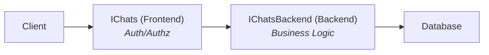

# Service Design Patterns

This document describes the patterns and conventions for designing services in Voxt.

## Service Layer Structure

### The Two-Tier Pattern

Every domain has two service interfaces:

1. **Frontend Service** (`I{Domain}`) - Public API, session-based
2. **Backend Service** (`I{Domain}Backend`) - Internal API, works with resolved identities



### When to Use Which

| Use Frontend Service When | Use Backend Service When |
|--------------------------|-------------------------|
| Called from UI/client code | Called from other backend services |
| Need session-based auth | User identity already resolved |
| Command originates from user action | Processing events or background jobs |
| Public API exposure needed | Internal cross-service calls |

## Frontend Services

### Interface Definition

Frontend services:
- Extend `IComputeService`
- Take `Session` as first parameter
- Are defined in `Api.Contracts` project

```csharp
// File: src/dotnet/Api.Contracts/Chat/IChats.cs
public interface IChats : IComputeService
{
    // Read methods (ComputeMethod)
    [ComputeMethod]
    Task<Chat?> Get(Session session, ChatId chatId, CancellationToken cancellationToken);

    [ComputeMethod]
    Task<AuthorRules> GetRules(Session session, ChatId chatId, CancellationToken cancellationToken);

    // Write methods (CommandHandler)
    [CommandHandler]
    Task<Chat> OnChange(Chats_Change command, CancellationToken cancellationToken);
}
```

### Command Definition

Frontend commands:
- Derive from `ApiCommand<TResult>`, which carries `Uuid` (`Key 0`) and `Session` (`Key 1`)
- Declare their own members as `required init` properties from `Key(2)` on — no positional constructor
- Named as `{ServiceName}_{Action}`

```csharp
[DataContract, MessagePackObject]
public sealed partial record Chats_Change : ApiCommand<Chat>
{
    [DataMember(Order = 2), Key(2)] public required ChatId? ChatId { get; init; }
    [DataMember(Order = 3), Key(3)] public required long? ExpectedVersion { get; init; }
    [DataMember(Order = 4), Key(4)] public required Change<ChatDiff> Change { get; init; }
}
```

See [Command idempotency](./command-idempotency.md) for why `Uuid` occupies `Key 0` and how the
server dedups on it.

### Implementation Pattern

```csharp
// File: src/dotnet/Chat.Service/Chats.cs
public class Chats(IServiceProvider services) : IChats
{
    // DI-injected services (lazy pattern preferred)
    private IChatsBackend Backend => field ??= services.GetRequiredService<IChatsBackend>();
    private IAccounts Accounts => field ??= services.GetRequiredService<IAccounts>();
    private ICommander Commander => field ??= services.Commander();

    // Read method: resolve session, check permissions, delegate to backend
    public virtual async Task<Chat?> Get(Session session, ChatId chatId, CancellationToken cancellationToken)
    {
        // Get chat from backend (no auth check yet)
        var chat = await Backend.Get(chatId, cancellationToken).ConfigureAwait(false);
        if (chat == null)
            return null;

        // Get rules to check permissions
        var rules = await GetRules(session, chatId, cancellationToken).ConfigureAwait(false);
        return rules.CanRead() ? chat : null;
    }

    // Command handler: validate session, delegate to backend command
    public virtual async Task<Chat> OnChange(Chats_Change command, CancellationToken cancellationToken)
    {
        if (Invalidation.IsActive)
            return null!; // Nothing to invalidate at frontend level

        var (session, chatId, expectedVersion, change) = command;

        // Resolve session to account
        var account = await Accounts.GetOwn(session, cancellationToken).ConfigureAwait(false);
        account.Require(AccountFull.MustBeActive);

        // Delegate to backend with resolved user
        var backendCommand = new ChatsBackend_Change(chatId, expectedVersion, change, account.Id);
        return await Commander.Call(backendCommand, true, cancellationToken).ConfigureAwait(false);
    }
}
```

## Backend Services

### Interface Definition

Backend services:
- Extend `IComputeService` and `IBackendService`
- Work with resolved identifiers (UserId, ChatId, etc.)
- Are defined in `{Domain}.Contracts` project

```csharp
// File: src/dotnet/Chat.Contracts/IChatsBackend.cs
public interface IChatsBackend : IComputeService, IBackendService
{
    [ComputeMethod]
    Task<Chat?> Get(ChatId chatId, CancellationToken cancellationToken);

    [CommandHandler]
    Task<Chat> OnChange(ChatsBackend_Change command, CancellationToken cancellationToken);

    // Event handlers
    [EventHandler]
    Task OnChatChangedEvent(ChatChangedEvent eventCommand, CancellationToken cancellationToken);
}
```

### Command Definition

Backend commands:
- Implement `ICommand<TResult>` and `IBackendCommand`
- Implement `IHasShardKey<T>` for sharding
- Named as `{ServiceName}Backend_{Action}`

```csharp
[DataContract, MemoryPackable(GenerateType.VersionTolerant)]
public sealed partial record ChatsBackend_Change(
    [property: DataMember, MemoryPackOrder(0)] ChatId? ChatId,
    [property: DataMember, MemoryPackOrder(1)] long? ExpectedVersion,
    [property: DataMember, MemoryPackOrder(2)] Change<ChatDiff> Change,
    [property: DataMember, MemoryPackOrder(3)] UserId? OwnerId
) : ICommand<Chat>, IBackendCommand, IHasShardKey<ChatId?>
{
    [IgnoreDataMember, MemoryPackIgnore]
    public ChatId? ShardKey => ChatId;
}
```

### Implementation Pattern

```csharp
// File: src/dotnet/Chat.Service/ChatsBackend.cs
public class ChatsBackend(IServiceProvider services) : DbServiceBase<ChatDbContext>(services), IChatsBackend
{
    private IAuthorsBackend AuthorsBackend => field ??= Services.GetRequiredService<IAuthorsBackend>();

    // Read method with caching
    [ComputeMethod]
    public virtual async Task<Chat?> Get(ChatId chatId, CancellationToken cancellationToken)
    {
        var dbChat = await DbChatResolver.Get(chatId.Value, cancellationToken).ConfigureAwait(false);
        return dbChat?.ToModel();
    }

    // Command handler with invalidation
    public virtual async Task<Chat> OnChange(ChatsBackend_Change command, CancellationToken cancellationToken)
    {
        var (chatId, expectedVersion, change, ownerId) = command;
        var context = CommandContext.GetCurrent();

        // Invalidation phase - runs after successful command
        if (Invalidation.IsActive) {
            var invChat = context.Operation.Items.KeylessGet<Chat>();
            if (invChat != null)
                _ = Get(invChat.Id, default);  // Invalidate cached Get
            return null!;
        }

        // Main logic
        var dbContext = await DbHub.CreateOperationDbContext(cancellationToken).ConfigureAwait(false);
        await using var _ = dbContext.ConfigureAwait(false);

        // ... perform database operations ...

        await dbContext.SaveChangesAsync(cancellationToken).ConfigureAwait(false);

        // Store for invalidation phase
        context.Operation.Items.KeylessSet(chat);

        // Raise event for other services
        context.Operation.AddEvent(new ChatChangedEvent(chat, oldChat, change.Kind));

        return chat;
    }
}
```

## Computed Methods

### Basic Pattern

```csharp
[ComputeMethod]
public virtual async Task<Chat?> Get(ChatId chatId, CancellationToken cancellationToken)
{
    // Query database
    var dbChat = await DbChatResolver.Get(chatId.Value, cancellationToken).ConfigureAwait(false);
    return dbChat?.ToModel();
}
```

### With Cache Duration

```csharp
[ComputeMethod(MinCacheDuration = 60)]
[RemoteComputeMethod(MinCacheDuration = 600)]  // Longer cache for remote calls
public virtual async Task<Chat?> Get(Session session, ChatId chatId, CancellationToken cancellationToken)
```

### Dependency Tracking

Dependencies are automatically tracked when one computed method calls another:

```csharp
[ComputeMethod]
public virtual async Task<ChatWithRules> GetWithRules(Session session, ChatId chatId, CancellationToken cancellationToken)
{
    // This method depends on both Get and GetRules
    var chat = await Get(session, chatId, cancellationToken).ConfigureAwait(false);
    var rules = await GetRules(session, chatId, cancellationToken).ConfigureAwait(false);
    return new ChatWithRules(chat, rules);
}
```

## Invalidation

### Manual Invalidation

When data changes, related computed methods must be invalidated:

```csharp
public virtual async Task<Chat> OnChange(ChatsBackend_Change command, CancellationToken cancellationToken)
{
    var context = CommandContext.GetCurrent();

    // Invalidation phase
    if (Invalidation.IsActive) {
        var chat = context.Operation.Items.KeylessGet<Chat>();
        if (chat != null) {
            _ = Get(chat.Id, default);  // Invalidate Get
            _ = GetPublicChatIdsFor(chat.PlaceId, default);  // Invalidate list
        }
        return null!;
    }

    // ... main logic ...
}
```

### Invalidation via `Computed.Invalidate`

For programmatic invalidation outside command handlers:

```csharp
using (Computed.Invalidate()) {
    _ = await Backend.Get(chatId, default);
}
```

## Events

### Defining Events

Events extend `EventCommand` and implement `IHasShardKey<T>`:

```csharp
// File: src/dotnet/Backend/Events/ChatChangedEvent.cs
[DataContract, MemoryPackable(GenerateType.VersionTolerant)]
public sealed partial record ChatChangedEvent(
    [property: DataMember, MemoryPackOrder(0)] Chat Chat,
    [property: DataMember, MemoryPackOrder(1)] Chat? OldChat,
    [property: DataMember, MemoryPackOrder(2)] ChangeKind ChangeKind
) : EventCommand, IHasShardKey<ChatId>
{
    [IgnoreDataMember, MemoryPackIgnore]
    public ChatId ShardKey => Chat.Id;
}
```

### Raising Events

Events are added during command execution:

```csharp
// In command handler, after successful database operation
context.Operation.AddEvent(new ChatChangedEvent(chat, oldChat, change.Kind));
```

### Handling Events

Event handlers are defined on backend service interfaces:

```csharp
// Interface
[EventHandler]
Task OnChatChangedEvent(ChatChangedEvent eventCommand, CancellationToken cancellationToken);

// Implementation
public virtual async Task OnChatChangedEvent(ChatChangedEvent eventCommand, CancellationToken cancellationToken)
{
    if (Invalidation.IsActive)
        return;  // Events typically spawn other commands

    var (chat, oldChat, changeKind) = eventCommand;
    // React to event...
}
```

## Service Registration

Services are registered in module classes:

```csharp
// File: src/dotnet/Chat.Service/Module/ChatServiceModule.cs
public class ChatServiceModule : HostModule
{
    protected override void InjectServices(IServiceCollection services)
    {
        // Backend services
        services.AddFusion().AddService<IChatsBackend, ChatsBackend>();
        services.AddFusion().AddService<IAuthorsBackend, AuthorsBackend>();

        // Frontend services (for API)
        services.AddFusion().AddService<IChats, Chats>();
        services.AddFusion().AddService<IAuthors, Authors>();
    }
}
```

## Common Patterns

### Checking Permissions

```csharp
public virtual async Task<Chat?> Get(Session session, ChatId chatId, CancellationToken cancellationToken)
{
    var rules = await GetRules(session, chatId, cancellationToken).ConfigureAwait(false);
    if (!rules.CanRead())
        return null;  // Or throw if appropriate

    return await Backend.Get(chatId, cancellationToken).ConfigureAwait(false);
}
```

### Isolated Operations

Use `isolate: true` for nested commands that should have their own operation scope:

```csharp
// Events from this command will be dispatched when it completes
var chat = await Commander.Call(backendCommand, true, cancellationToken).ConfigureAwait(false);
```

### Waiting for Queue Processing (Tests)

```csharp
// In tests, wait for events to be processed before assertions
await services.Queues().WhenProcessing();
```

## Best Practices

1. **Always use `ConfigureAwait(false)`** in service code
2. **Frontend validates, backend executes** - Auth checks in frontend, business logic in backend
3. **Invalidate precisely** - Only invalidate what actually changed
4. **Use events for cross-service communication** - Don't call other backends directly when you need eventual consistency
5. **Implement `IHasShardKey`** on commands and events for proper distribution
6. **Keep compute methods pure** - No side effects in read methods
7. **Use lazy DI injection** - `field ??= Services.GetRequiredService<T>()` pattern
