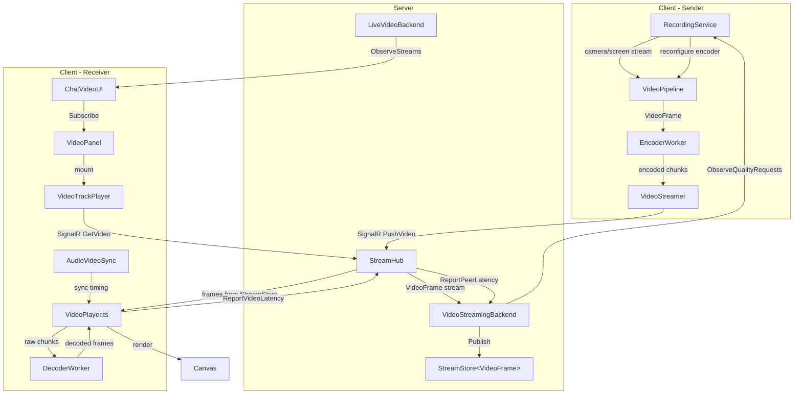
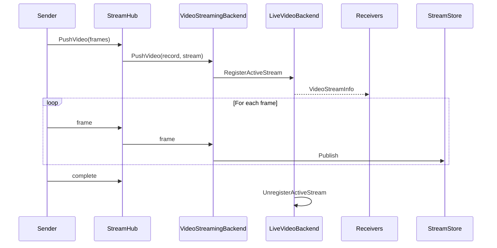

# Video System Architecture

## Overview

Real-time video streaming in ActualChat using a custom SignalR-based pipeline (no WebRTC/SFU). Key characteristics:

- **Off-main-thread encoding & decoding** via Web Workers with typed RPC contracts
- **Sharded backend** using ActualLab Mesh (`HostRole.VideoBackend`)
- **Adaptive quality** — sender quality stepping, per-peer skip-to-live, codec negotiation
- **VAD-based adaptive framerate** — reduces fps when speaker is silent in group calls

## Architecture

### Streaming Flow



### Signaling Sequence



### Backend Split

The video backend is split into two interfaces with distinct responsibilities:

- **`IVideoStreamingBackend`** — frame-level streaming: push/get video, quality adaptation, latency tracking
- **`ILiveVideoBackend`** — discovery & membership: stream listing, member tracking, codec negotiation

Both are decorated with `[BackendService(HostRole.VideoBackend)]` and sharded via `ShardScheme.VideoBackend`.

## Server-Side Components

### Core Types

| Type | File | Description |
|------|------|-------------|
| `VideoFrame` | `src/dotnet/Api/Video/VideoFrame.cs` | Encoded frame with Offset, Duration, IsKeyFrame, Width, Height, Description (SPS/PPS), Codec |
| `VideoFormat` | `src/dotnet/Api/Video/VideoFormat.cs` | Stream format: Codec (default "avc1"), Width, Height, CodecSettings |
| `VideoSource` | `src/dotnet/Api/Video/VideoSource.cs` | Memoizing source wrapper with keyframe-based seeking |
| `VideoQualityPreset` | `src/dotnet/Api/Video/VideoQualityPreset.cs` | Full (1920×1080, 8 Mbps), High (1280×720, 4 Mbps), Medium (960×540, 2.5 Mbps), Low (640×360, 1 Mbps) |
| `VideoStreamInfo` | `src/dotnet/Streaming.Contracts/VideoStreamInfo.cs` | Stream metadata: StreamId, ChatId, AuthorId, Format, StartedAt |
| `VideoRecord` | `src/dotnet/Streaming.Contracts/VideoRecord.cs` | Push metadata: StreamId, Session, ChatId, ClientStartOffset, Format |

### IVideoStreamingBackend

**File:** `src/dotnet/Streaming.Contracts/IVideoStreamingBackend.cs`

Handles the actual video frame streaming and quality adaptation:

```csharp
public interface IVideoStreamingBackend : IRpcService, IBackendService
{
    Task<RpcStream<VideoFrame>?> GetVideo(StreamId streamId, TimeSpan skipTo, string peerId, CancellationToken cancellationToken);
    Task PushVideo(VideoRecord record, RpcStream<VideoFrame> videoStream, CancellationToken cancellationToken);
    Task<RpcStream<VideoQualityPreset>> ObserveStreamQualityRequests(StreamId streamId, CancellationToken cancellationToken);
    Task ReportPeerLatency(StreamId streamId, string peerId, double streamOffsetMs, CancellationToken cancellationToken = default);
}
```

### ILiveVideoBackend

**File:** `src/dotnet/Streaming.Contracts/ILiveVideoBackend.cs`

Handles stream discovery, member tracking, and codec negotiation:

```csharp
public interface ILiveVideoBackend : IComputeService, IBackendService
{
    // Stream discovery
    Task<ApiArray<VideoStreamInfo>> ListActiveStreams(ChatId chatId, CancellationToken cancellationToken);        // [ComputeMethod]
    Task<RpcStream<VideoStreamInfo>> ObserveStreams(ChatId chatId, CancellationToken cancellationToken);

    // Author tracking
    Task<ApiArray<AuthorId>> GetVideoStreamingAuthorIds(ChatId chatId, CancellationToken cancellationToken);     // [ComputeMethod]

    // Stream registration
    Task RegisterActiveStream(ChatId chatId, VideoStreamInfo streamInfo, CancellationToken cancellationToken);
    Task UnregisterActiveStream(ChatId chatId, StreamId streamId, CancellationToken cancellationToken);

    // Member tracking
    Task RegisterVideoStreamMember(ChatId chatId, string sessionId, ApiArray<string> supportedDecoderCodecs, CancellationToken cancellationToken);
    Task UnregisterVideoStreamMember(ChatId chatId, string sessionId, CancellationToken cancellationToken);
    Task<int> GetVideoStreamMemberCount(ChatId chatId, CancellationToken cancellationToken);                     // [ComputeMethod]

    // Codec negotiation
    Task<ApiArray<string>> GetSupportedDecoderCodecs(ChatId chatId, CancellationToken cancellationToken);        // [ComputeMethod]
    Task<RpcStream<ApiArray<string>>> ObserveSupportedDecoderCodecs(ChatId chatId, CancellationToken cancellationToken);
}
```

### Implementations

#### VideoStreamingBackend (`src/dotnet/Streaming.Service/Backend/VideoStreamingBackend.cs`)

Owns the frame-level streaming infrastructure:

- **`StreamStore<VideoFrame>`** — memoized frame buffer with 30s expiration and 150-frame retention
- **`StreamLatencyState`** (per-stream) — evaluates quality every 5s; steps down if >50% peers are slow, steps up after 15s hysteresis if all peers are fast. Publishes `VideoQualityPreset` via `ObserveQualityDirectives()`.
- **`PeerLatencyState`** (per-peer) — sliding window of latency samples; triggers one-shot skip-to-live when latency exceeds 5s, jumping to the latest buffered keyframe

#### LiveVideoBackend (`src/dotnet/Streaming.Service/Backend/LiveVideoBackend.cs`)

Manages stream registry and membership:

- **`ChatState`** (per-chat, in `LiveVideoBackend.ChatState.cs`) — tracks active streams, registered members with their supported codecs, and computes intersection of decoder codecs across all viewers
- Codec negotiation: maintains `_currentSupportedDecoderCodecs` with hysteresis (`CodecSwitchHysteresisWindow = 10s`) to avoid codec flapping

#### VideoBackendWarmup (`src/dotnet/Streaming.Service/Backend/VideoBackendWarmup.cs`)

`IHostedService` that resolves `ShardOwner` at startup and waits for all `VideoBackend` shards to settle (~1s due to `LockToUseDelay`).

### StreamHub Video Methods

**File:** `src/dotnet/Streaming.Service/Services/StreamHub.cs`

| Method | Description |
|--------|-------------|
| `PushVideo(sessionToken, chatId, codec, width, height, codecSettings, clientStartOffset, videoStream)` | Accepts `IAsyncEnumerable<byte[]>` of MessagePack-encoded VideoFrameDto, converts to `VideoFrame` stream |
| `GetVideo(sessionToken, streamId, skipToMs)` | Returns `IAsyncEnumerable<byte[]>` with MessagePack-serialized frames, applies per-peer skip-to-live |
| `ReportVideoLatency(sessionToken, streamId, streamOffsetMs)` | Forwards peer latency to `VideoStreamingBackend.ReportPeerLatency()` |

### Permission Layer

**`ILiveVideoStreams`** (`src/dotnet/Api.Contracts/Streaming/ILiveVideoStreams.cs`) — session-based frontend interface exposing stream listing, member registration, codec queries, video retrieval, and quality observation.

**`LiveVideoStreams`** (`src/dotnet/Streaming.Service/Services/LiveVideoStreams.cs`) — implementation that checks `ChatPermissions.Read` (or Write) via `Chats.GetRules()` before delegating to `ILiveVideoBackend` and `IVideoStreamingBackend`.

## Client-Side Components

### Recording Pipeline

#### RecordingService (`src/dotnet/UI.Blazor.App/Services/Video/services/recording-service.ts`)

High-level recording lifecycle manager:
- Stream acquisition (webcam/screen), configuration, state tracking
- `start()`, `stop()`, `toggleBlur()`, `updateSegmentationBackend()`, `switchCodec()`
- `RecordingConfig` includes mode, codec, bitrate, resolution, camera device, VAD-based adaptive framerate settings

#### VideoPipeline (`src/dotnet/UI.Blazor.App/Services/Video/services/video-pipeline.ts`)

Encode-only pipeline coordinating workers:
- Captures frames via `MediaStreamTrackProcessor` (canvas fallback for Safari)
- Optional segmentation worker for background blur
- Encoder worker via RPC — serializes chunks in-worker to keep main thread free
- Streams encoded chunks via VideoStreamer
- **VAD adaptive framerate**: when audio is silent (via `RecorderStateHub`), reduces framerate to `conservedFps` with reduced bitrate; forces keyframe on resume

### Streaming

#### VideoStreamer (`src/dotnet/UI.Blazor.App/Services/Video/video-streamer.ts`)

SignalR-based streaming with MessagePack protocol:
- `VideoStreamer.init(hubUrl)` — establishes connection
- `VideoStreamer.addStream(token, chatId, config)` — creates a `VideoStream`
- Frames are MessagePack-encoded with offset (in .NET ticks), duration, keyframe flag, resolution, codec
- Sequential streaming via `lastStream.whenDisposed` chaining

### Playback

#### VideoPlayer (`src/dotnet/UI.Blazor.App/Components/VideoPanel/video-player.ts`)

Remote video playback on the receiver side:
- `startPull(streamId, skipToMs)` calls `StreamHub.GetVideo()` via SignalR
- Sends raw bytes to DecoderWorker for off-main-thread decoding
- Renders decoded `VideoFrame` objects to canvas via `requestAnimationFrame`
- Latency measurement: computes stream offset vs. wall-clock time, reports every 5s
- Integrates with `AudioVideoSync` for lip-sync timing

#### AudioVideoSync (`src/nodejs/src/audio-video-sync.ts`)

Registry-based audio-video synchronization:
- `update(authorId, playingAtSec, recordedAtMs, playbackState)` — called by AudioPlayer
- `interpolatePlayingAt(state)` — extrapolates current audio position
- `get(authorId)` — used by VideoPlayer in render loop
- Tracks playback states: playing, paused, ended, starving

### Workers

| Worker | File | Key RPC Methods |
|--------|------|-----------------|
| Encoder | `Services/Video/workers/encoder-worker.ts` | `initialize()`, `encodeFrame()`, `reconfigure()`, `switchCodec()`, `forceKeyFrame()`, `getStats()` |
| Decoder | `Services/Video/workers/decoder-worker.ts` | `initialize()`, `decodeRawChunk()`, `resetDecoder()`, `configureDecoder()`, `toggleDecoderType()`, `getStats()` |
| Segmentation | `Services/Video/workers/segmentation-worker.ts` | `initialize()`, `processFrame()`, `updateConfig()`, `stop()`, `getStats()` |

Worker communication uses a custom RPC framework (`rpc.ts`) with `rpcClient()`, `rpcServer()`, `rpcClientServer()` and support for transferable objects (`VideoFrame`, `MessagePort`).

Contracts defined in matching `*-worker-contract.ts` files.

### Codec Support

| File | Purpose |
|------|---------|
| `Services/Video/codec-support.ts` | Runtime codec detection with hardware acceleration probing. Priority: AV1 HW > H.264 HW High > H.264 HW > H.264 SW. Also `detectSupportedDecoderCodecs()` for server-side codec negotiation. |
| `Services/Video/hevc-parser.ts` | HEVC/H.265 bitstream parser — extracts VPS/SPS/PPS, builds HVCC descriptor per ISO/IEC 14496-15 |

### GPU & Segmentation

| File | Purpose |
|------|---------|
| `Services/Video/webgpu-manager.ts` | Centralized singleton GPUDevice ownership shared between ONNX, tensors, and blur |
| `Services/Video/webgpu-blur.ts` | GPU-accelerated background blur via mipmapped Gaussian blur pyramids + temporal mask smoothing |
| `Services/Video/gpu-support.ts` | ONNX Runtime backend detection (WebGPU, WebGL, WASM) |
| `Services/Video/tensor-utils.ts` | WebGPU buffer-backed tensors for zero-copy ONNX inference; VideoFrame → tensor conversion |
| `Services/Video/webgpu-yuv-converter.ts` | GPU-accelerated RGBA → I420 (YUV) conversion for codec input |

## Blazor Components

| Component | File | Purpose |
|-----------|------|---------|
| `VideoPanel` | `Components/VideoPanel/VideoPanel.razor` | Container: recording controls, preview, remote streams |
| `VideoRecorder` | `Components/VideoPanel/VideoRecorder.razor` | Local camera preview with settings, quality directive subscription |
| `VideoTrackPlayer` | `Components/VideoPanel/VideoTrackPlayer.razor` | Single remote stream player; registers viewer; implements `IVideoPlayerBackend` |
| `IVideoPlayerBackend` | `Components/VideoPanel/IVideoPlayerBackend.cs` | JS → Blazor callbacks: `OnPlaying(offset, isBufferLow)`, `OnEnded(errorMessage)` |
| `JoinVideoCallModal` | `Components/JoinVideoCallModal/JoinVideoCallModal.razor` | Camera/blur settings modal before joining |

All paths relative to `src/dotnet/UI.Blazor.App/`.

## State Services

| Service | File | Purpose |
|---------|------|---------|
| `ChatVideoUI` | `Services/ChatVideoUI.cs` | Video state orchestration per chat — compute methods (`GetState`, `GetActiveVideoStreams`, `GetFocusedSpeakerId`, etc.), state mutators (`SetRecordingChatId`, `SetSelectedCamera`, `SetBackgroundBlur`), JS callbacks |
| `ChatVideoUI.StateSync` | `Services/ChatVideoUI.StateSync.cs` | Background sync — monitors audio/video streaming, auto-focuses on active speaker (1.5s debounce) |
| `ChatVideoState` | `Services/ChatVideoState.cs` | Immutable record: `ChatId`, `IsRecording`, `SelectedCameraDeviceId`, `IsBackgroundBlurEnabled`, `HasError`, `ErrorMessage` |

## Adaptive Quality & Bandwidth Management

### Sender Quality Stepping

When multiple receivers report high latency, the sender's encoding quality is adjusted:

1. Each receiver's `VideoPlayer` measures playback latency (stream offset vs. wall-clock)
2. Latency reported to server every 5s via `StreamHub.ReportVideoLatency()`
3. `VideoStreamingBackend` forwards to `StreamLatencyState` which tracks per-peer sliding windows
4. Every `QualityDecisionInterval` (5s), quality is evaluated:
   - **Step down**: if >50% of peers (`PeerOutlierRatio`) have median latency > 500ms — or >34% (`PeerOutlierRatioSmallCall`) in small calls
   - **Step up**: if all peers below 200ms AND 15s hysteresis has elapsed
5. New `VideoQualityPreset` published via `ObserveStreamQualityRequests()`
6. `RecordingService` subscribes and calls `reconfigure(width, height, bitrate)` on the pipeline

### Per-Peer Skip-to-Live

For individual slow receivers without penalizing all viewers:

1. `PeerLatencyState` tracks each peer's latency independently
2. If raw latency exceeds 5000ms (`SkipToLiveThresholdMs`) and the peer is warmed up, the `SkipToLive` flag is set
3. `ApplySkipToLive()` in the per-peer stream pipeline detects the flag, consumes all synchronously-available (buffered) frames, and resumes from the latest keyframe at the live edge
4. One-shot operation: the flag is cleared after skip completes, full frame delivery resumes immediately
5. If latency grows past 5s again, another skip fires automatically

### Codec Negotiation

Dynamic codec selection based on all viewers' decoder capabilities:

1. When a viewer registers via `RegisterVideoStreamMember()`, they pass `supportedDecoderCodecs`
2. `LiveVideoBackend.ChatState` computes the intersection of all viewers' supported codecs
3. Changes are observable via `ObserveSupportedDecoderCodecs()`
4. Sender can switch to AV1 when all viewers support it (better compression)
5. `CodecSwitchHysteresisWindow` (10s) prevents rapid codec flapping

### VAD-Based Adaptive Framerate

Reduces bandwidth in group calls when the speaker is silent:

1. `VideoPipeline` monitors `RecorderStateHub` for voice activity
2. On silence timeout, framerate drops to `conservedFps` with reduced bitrate
3. On speech resume, forces a keyframe via `forceKeyFrame()` and restores full framerate

## Constants Reference

**File:** `src/dotnet/Api/Constants.Video.cs` — 14 constants:

| Constant | Value | Purpose |
|----------|-------|---------|
| `CancellationDelay` | 5s | Grace period before cancelling stream |
| `StreamExpirationDelay` | 30s | StreamStore retention for late joiners |
| `RetentionBufferSize` | 150 | ~5s at 30fps frame buffer |
| `ConsumerBufferSize` | 300 | ~10s before slow consumer disconnect |
| `LatencyReportInterval` | 5s | How often peers report latency |
| `HighLatencyThresholdMs` | 500 | Latency above this triggers quality step-down |
| `LowLatencyThresholdMs` | 200 | Latency below this allows quality step-up |
| `SkipToLiveThresholdMs` | 5000 | Per-peer skip-to-live trigger (one-shot jump to latest keyframe) |
| `QualityDecisionInterval` | 5s | How often quality is re-evaluated |
| `QualityHysteresisWindow` | 15s | Cooldown before stepping quality back up |
| `LatencyHistorySize` | 6 | Sliding window samples (~30s at 5s intervals) |
| `PeerOutlierRatio` | 0.5 | Fraction of slow peers for step-down (large calls) |
| `PeerOutlierRatioSmallCall` | 0.34 | Fraction of slow peers for step-down (small calls) |
| `CodecSwitchHysteresisWindow` | 10s | Cooldown before switching codecs |

## Technical Details

### Frame Batching

Frames are MessagePack-encoded for SignalR transmission. `PushVideo` accepts `IAsyncEnumerable<byte[]>` where each `byte[]` is a MessagePack-encoded `VideoFrameDto`. `GetVideo` returns `IAsyncEnumerable<byte[]>` with MessagePack-serialized frames.

### Keyframe-Based Seeking

`SkipToKeyFrame()` in VideoStreamingBackend drops frames until reaching a keyframe at or after the requested offset, ensuring decoders can initialize correctly.

### Stream Memoization

`StreamStore<VideoFrame>` caches frames for late joiners:
- 30-second expiration (`StreamExpirationDelay`)
- 150-frame retention buffer (`RetentionBufferSize`)
- Supports replay from memoized history

### Codec Description Handling

H.264 requires SPS/PPS data for decoder configuration:
1. Encoder extracts description from first keyframe
2. Description sent as `codecSettings` (Base64) on stream start
3. Also included in frame `Description` field for late joiners
4. VideoPlayer buffers delta frames until keyframe with description arrives

HEVC uses VPS/SPS/PPS extracted via `hevc-parser.ts` and packaged as HVCC descriptor.

### Browser Fallbacks

Safari lacks `MediaStreamTrackProcessor` and `MediaStreamTrackGenerator`. The pipeline uses canvas-based fallbacks:
- **Input**: `<canvas>` + `requestAnimationFrame` loop draws video frames and extracts them manually
- **Output**: Decoded frames drawn to canvas, `captureStream()` produces output MediaStream

### Default Codec Configuration

| Parameter | Default |
|-----------|---------|
| Codec | H.264 High 4.0 (`avc1.640028`) |
| Resolution | 1280×720 |
| Bitrate | 2 Mbps |
| Frame rate | 30 fps |
| Latency mode | `realtime` |
| Hardware acceleration | `prefer-hardware` |
| Keyframe interval | Webcam: count `framerate*3` frames or `maxKeyFrameIntervalMs=3000` (whichever fires first). Screencast: count `framerate*2` frames or `maxKeyFrameIntervalMs=10000` (long floor for static-content heartbeat). Source: `recording-service.ts:500-512`. |

### Background Blur / Segmentation

ONNX person-segmentation model producing a mask for background blur:
- **WebGPU backend** — GPU-accelerated inference with zero-copy buffer tensors
- **WASM backend** — CPU fallback for browsers without WebGPU
- Configurable blur radius, mask threshold (default 0.45), temporal smoothing (EMA, default 0.8)
- Frame skipping under load to maintain low latency

### RPC Worker Communication

Workers communicate via custom RPC framework (`rpc.ts`):
- `rpcClient()` — typed proxy for calling worker methods
- `rpcServer()` — message handler inside worker
- `rpcClientServer()` — bidirectional communication
- Supports transferable objects (`VideoFrame`, `MessagePort`) for zero-copy transfer

## File Reference

All paths relative to `src/dotnet/`.

### Server Layer

| File | Description |
|------|-------------|
| `Api/Video/VideoFrame.cs` | Encoded video frame with codec metadata |
| `Api/Video/VideoFormat.cs` | Stream format descriptor |
| `Api/Video/VideoSource.cs` | Memoizing video source with keyframe seeking |
| `Api/Video/VideoQualityPreset.cs` | Quality levels with resolution and bitrate |
| `Api/Constants.Video.cs` | 14 video constants |
| `Api/Streaming/VideoStreamInfo.cs` | Stream metadata record |
| `Streaming.Contracts/IVideoStreamingBackend.cs` | Frame streaming interface (4 methods) |
| `Streaming.Contracts/ILiveVideoBackend.cs` | Discovery & membership interface (10 methods) |
| `Streaming.Contracts/VideoRecord.cs` | Push metadata record |
| `Streaming.Service/Backend/VideoStreamingBackend.cs` | Frame streaming implementation (StreamStore, latency state) |
| `Streaming.Service/Backend/LiveVideoBackend.cs` | Stream registry & membership implementation |
| `Streaming.Service/Backend/LiveVideoBackend.ChatState.cs` | Per-chat state, codec negotiation |
| `Streaming.Service/Backend/VideoBackendWarmup.cs` | Shard warmup hosted service |
| `Streaming.Service/Services/StreamHub.cs` | SignalR hub: PushVideo, GetVideo, ReportVideoLatency |
| `Streaming.Service/Services/LiveVideoStreams.cs` | Permission-checked wrapper |
| `Api.Contracts/Streaming/ILiveVideoStreams.cs` | Session-based frontend interface |
| `Api.Contracts/Streaming/IStreamClient.cs` | Client interface (GetAudio, GetVideo, ObserveStreamQualityRequests) |

### Client Layer — TypeScript

| File | Description |
|------|-------------|
| `UI.Blazor.App/Services/Video/services/recording-service.ts` | Recording lifecycle manager |
| `UI.Blazor.App/Services/Video/services/video-pipeline.ts` | Encode-only pipeline with VAD adaptive framerate |
| `UI.Blazor.App/Services/Video/services/stats-service.ts` | Encoder/segmentation statistics aggregation |
| `UI.Blazor.App/Services/Video/video-streamer.ts` | SignalR video streaming (push to server) |
| `UI.Blazor.App/Services/Video/codec-support.ts` | Runtime codec detection with HW acceleration probing |
| `UI.Blazor.App/Services/Video/hevc-parser.ts` | HEVC/H.265 bitstream parser |
| `UI.Blazor.App/Services/Video/webcodecs-encoder.ts` | WebCodecs VideoEncoder wrapper |
| `UI.Blazor.App/Services/Video/webcodecs-decoder.ts` | WebCodecs VideoDecoder wrapper |
| `UI.Blazor.App/Services/Video/webgpu-manager.ts` | Centralized GPUDevice management |
| `UI.Blazor.App/Services/Video/webgpu-blur.ts` | GPU-accelerated background blur |
| `UI.Blazor.App/Services/Video/webgpu-yuv-converter.ts` | GPU RGBA → I420 conversion |
| `UI.Blazor.App/Services/Video/gpu-support.ts` | ONNX backend detection |
| `UI.Blazor.App/Services/Video/tensor-utils.ts` | WebGPU tensor utilities |
| `UI.Blazor.App/Services/Video/utils/mp4-muxer.ts` | MediaRecorder-based muxing |
| `UI.Blazor.App/Services/Video/workers/encoder-worker.ts` | WebCodecs encoder worker |
| `UI.Blazor.App/Services/Video/workers/decoder-worker.ts` | WebCodecs decoder worker |
| `UI.Blazor.App/Services/Video/workers/segmentation-worker.ts` | ONNX segmentation worker |
| `UI.Blazor.App/Services/Video/workers/encoder-worker-contract.ts` | Encoder RPC contract |
| `UI.Blazor.App/Services/Video/workers/decoder-worker-contract.ts` | Decoder RPC contract |
| `UI.Blazor.App/Services/Video/workers/segmentation-worker-contract.ts` | Segmentation RPC contract |
| `UI.Blazor.App/Components/VideoPanel/video-player.ts` | WebCodecs playback, SignalR pull, latency reporting |
| `UI.Blazor.App/Components/VideoPanel/video-recorder.ts` | Recording controller UI |
| `UI.Blazor.App/Components/VideoPanel/video-panel.ts` | Panel UI chrome |

### Client Layer — Blazor & State

| File | Description |
|------|-------------|
| `UI.Blazor.App/Components/VideoPanel/VideoPanel.razor` | Video panel container |
| `UI.Blazor.App/Components/VideoPanel/VideoRecorder.razor` | Local camera preview + controls |
| `UI.Blazor.App/Components/VideoPanel/VideoTrackPlayer.razor` | Remote stream player |
| `UI.Blazor.App/Components/VideoPanel/IVideoPlayerBackend.cs` | JS → Blazor callbacks |
| `UI.Blazor.App/Components/JoinVideoCallModal/JoinVideoCallModal.razor` | Pre-join settings modal |
| `UI.Blazor.App/Services/ChatVideoUI.cs` | Video state orchestration |
| `UI.Blazor.App/Services/ChatVideoUI.StateSync.cs` | Active speaker sync |
| `UI.Blazor.App/Services/ChatVideoState.cs` | Immutable video state record |

### Audio-Video Sync

| File | Description |
|------|-------------|
| `../nodejs/src/audio-video-sync.ts` | Registry-based A/V synchronization |

## Future Enhancements

1. **SFU-based routing** — multi-participant video via selective forwarding unit
2. **Cloud storage** — persist video for later playback
3. **Full adaptive bitrate** — bandwidth estimation beyond latency-based stepping
4. **Screen sharing** — extend pipeline to screen capture (foundation in place)
5. **Additional segmentation models** — virtual backgrounds, face tracking
6. **Picture-in-picture** — floating video overlay
