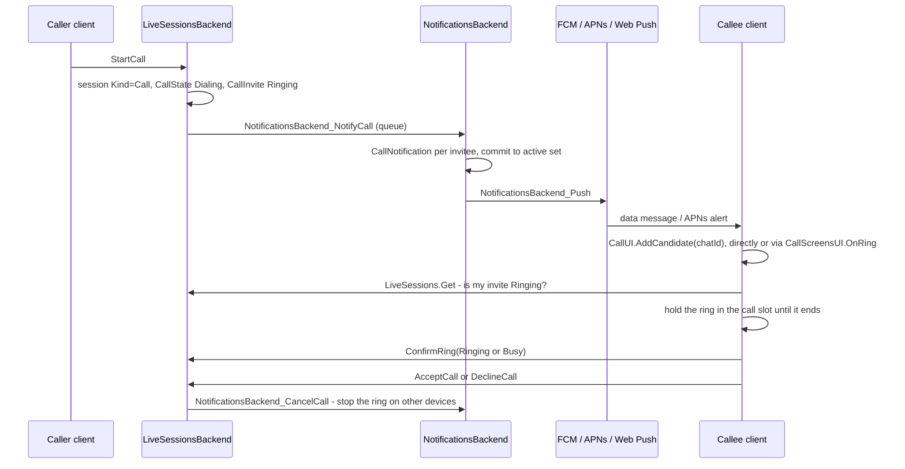

# Incoming call flow

How a ring gets from the caller's click to the callee's screen, and what each answer does on
both sides. What a finished call leaves in the chat is covered separately, in
[Call entries](./call-entries.md).

**The short version.** `StartCall` writes the call into the chat's live session in Redis and
queues a notification. The notification pipeline turns it into one `CallNotification` per
invitee and pushes it to every device. On the client, every delivery path only records the
chat as a *candidate* in `CallUI`, through `CallScreensUI.OnRing(chatId)` or straight
through `CallUI.AddCandidate(chatId)`. Whether the device
actually rings is decided by the reactive live session: the call is still unanswered, the
reader isn't its host, and the reader's invite is `Ringing`. The first candidate that passes
claims the client's call slot and is held there until its ring ends: answered elsewhere,
canceled, declined or timed out. A ring that arrives meanwhile gets `Busy`, so a lost or stale
push can neither start a ring nor leave one stranded, and a second ring never takes over the
first.

[[toc]]

## Overview

## Starting a call

`CallUI.StartCall` asks for the microphone first: a caller who can't be heard doesn't
ring anyone. The public `LiveSessions.StartCall` then checks that:

- the caller is a member of the chat;
- in a peer chat the caller has `CanWriteAudio`. This is the same anti-spam gate as peer
  messaging, so the callee must have added the caller to contacts or replied to them.
  Otherwise the call fails with a constraint error whose text is shown to the caller;
- an empty invitee list means every other member of the chat.

`LiveSessionsBackend.StartCall` does the rest under the chat's change lock:

- **Live session state.** `Kind = Call`, `CallerId` and `Host` are the caller, and
  `SessionStartedAt` stays `null`. A call with no `SessionStartedAt` is dialing
  (`IsDialing`); the first accept sets it. Promoting an already-latched ambient session keeps
  its `SessionStartedAt`, so that call doesn't go back to dialing.
- **`CallState` with `Dialing`.** This is the caller-facing status, and only the caller can
  read it, through `GetCallStatus`.
- **The caller as a participant.**
- **One `CallInvite { Status = Ringing, RingingAt = now }` per invitee.** Each is stored with
  a Redis field TTL of `RingTtl`. The list is deduplicated and never contains the caller.

After the lock is released, it enqueues `NotificationsBackend_NotifyCall`.

## Delivering the ring

1. `OnNotifyCall` resolves the invitees' user ids in one batch, localizes the title and the
   text (voice or video call), and builds a `CallNotification` for each invitee. The id is
   `IncomingCall` plus the call's conversation id, so there is one notification per call per
   user. Its push tag is `call-<chatId>`. Each notification is enqueued as a
   `NotificationsBackend_Notify`.
2. `OnNotify` → `ApplyHardUpdate` commits the notification to the user's active set, which is
   what `INotifications.ListActive` returns. An open client therefore sees the ring
   reactively even when no push arrives. It also emits `NotificationsBackend_Push` as an
   operation event.
3. `OnPush` re-reads the active set, skips a notification that is no longer active, and hands
   it to `FirebaseMessagingClient.SendMessage` for every device that was recently active.

| Platform | What goes out |
|---|---|
| Android | Data-only message, `High` priority. The app builds the notification itself. |
| iOS | APNs alert, `apns-priority: 10`, sound `attention_ringtone.caf`. |
| Web | Data-only message. The service worker builds the notification. |

`IncomingCall` and `Attention` are the two ringer kinds: they get elevated priority and are
never downgraded to a silent update.

**Stopping a ring on devices** goes through `DismissRing`. It enqueues
`NotificationsBackend_CancelCall` for the given invitees, which dismisses the same
notification id. The notification leaves the active set, and a dismissal push carrying the
`call-<chatId>` tag goes to the user's devices.

## How the client learns about the ring

Pushes and taps on the call notification go through `CallScreensUI.OnRing(chatId)`, which
adds the chat to `CallUI`'s candidates and, for a ring shown over the lock screen, sets the
over-lock flag. The two notification lists, the system's on start and `ListActive`, call
`CallUI.AddCandidate(chatId)` directly, with no over-lock flag. Answer skips the candidates
and goes straight to `CallScreensUI.Accept`.

| Situation | Path |
|---|---|
| Android, app in the foreground and unlocked | `FirebaseMessagingService` dispatches `OnRing` straight into Blazor. No system notification is shown, because the in-app modal and ringer already own the ring. |
| Android, backgrounded, killed or locked | `IncomingCallNotifications.Show` posts a `CallStyle` notification with Answer/Decline and a full-screen intent, and `IncomingCallRinger` starts the ringtone with it. Neither happens when another chat's call notification is shown or the slot is held by another chat. If the Blazor scope is alive, `OnRing` is dispatched as well. |
| Android, opened from that notification | `NotificationHandler` → `IncomingCallNotifications.HandleViewIntent`. A full-screen intent passes `overLockScreen: true`; Answer goes straight to `CallScreensUI.Accept`. |
| Android, opened from the launcher after a push | `CallUI`'s search loop (`SearchRings`) picks the ring up from the still-active system notifications on start (`Bridge.ListActiveCallChatIds` → `AddCandidate`). |
| Web, tab in the foreground | Firebase `onMessage` → `NotificationUI.OnIncomingCall`. |
| Web, tab in the background or closed | The service worker posts `INCOMING_CALL` to every open tab and shows an OS notification. |
| Every platform | `CallUI.SyncActiveCallNotifications` watches `Notifications.ListActive` and calls `CallUI.AddCandidate` for every `CallNotification`. Off Android this is the primary trigger; on Android it covers a dropped push while the app is alive. |

::: info The push is only a hint
`AddCandidate` only appends the chat to a list of candidates. `GetRingingCall` reads
`LiveSessionUI.Get(chatId)` and returns a call only when all of these hold:

- `Kind == Call`;
- the reader's invite is `Ringing`.

Only the reader's own invite decides. The caller is never invited, so their own call
never rings them; someone else answering a group call leaves the reader's invite
`Ringing`, while the reader answering on another device moves it on. A stale push, or a
call the reader already answered elsewhere, produces nothing, and dead candidates are
pruned.
:::

## The call slot

`CallUI` holds the one call this client is in, incoming or outgoing: `_activeCall` names its
chat, origin and phase (`Ringing`, `Dialing`, `Active`), and an empty `_activeCall` is a free
slot. While the slot is held, every other ring is answered `Busy` and doesn't ring, and no
new outgoing call can start. Ambient live sessions never hold it. Besides searching and
holding, `CallUI` runs `SyncActiveCallNotifications`, which feeds `Notifications.ListActive`
call notifications into the candidates.

**Searching.** Whenever the candidate list, a candidate's ring or the slot changes, the
search walks the ringing candidates newest first:

| Slot | Outcome |
|---|---|
| free | take it as `Incoming/Ringing` and send `ConfirmRing(Ringing)` — the ring was just read from the session |
| held by this chat | nothing |
| held by another chat | `ConfirmRing(Busy)` once per chat, and close its Android notification |

Candidates that aren't ringing on a pass are dropped.

**Holding.** While the slot is held, a second loop follows that chat's session and releases
the slot when the call ends:

| Held call | Released when |
|---|---|
| `Incoming/Ringing` | the ring ends — canceled, timed out, answered or declined elsewhere |
| `Outgoing/Dialing` | no answer, declined, canceled, the session vanished; an answer joins the call and moves it to `Active` |
| `Active` | the session stops being a call, or I was in the conversation and left it |

`StartCall` claims the slot as `Outgoing/Dialing` before its RPC; `Accept` commits the ring to
`Active` before its RPC, claiming a free slot itself when Answer on a notification beat the
search. Hanging up releases the slot right away.

Everything that shows a call reads the slot: the modal, the island, the over-lock and narrow
full-screen views, the ringtone, the ringback. `GetIncomingCall` is the slot filtered to
`Incoming/Ringing`.

## Presenting the ring

`CallScreensUI` is a UI worker; it runs these reactive loops:

- **`SyncRingtone`** plays the ringtone while the slot holds an Incoming/Ringing call the user
  hasn't muted; muting or collapsing the ring only changes that state.
- **`SyncIncomingCallModal`** shows `IncomingCallModal`, except when the ring is shown over
  the lock screen or collapsed into the island.
- **SyncCallScreens** follows the slot: an outgoing call that starts dialing gets its modal
  or full-screen view, and a released call gets its screens closed and its audio stopped.

`ConfirmRing` is telemetry only. The server stores it on the invite (`CallInvite.Ack`) and
changes nothing else.

**Ringtone.** On Android it is the native `IncomingCallRinger`, reached through
`AndroidIncomingCallsBridge`, playing the system default ringtone. When no audio is live, the
bridge first gives up the `InCommunication` audio mode, which would otherwise route the ring
to the earpiece. Everywhere else it is the looping JS `IncomingCallRingtone`.

| Surface | When it shows |
|---|---|
| `IncomingCallModal` | The default foreground ring. |
| `FullScreenCallView` | An Android full-screen intent over the keyguard. On narrow screens it is also the full-screen call view: in a call or dialing out. |
| `CollapsedCallView` | The draggable island, after the user collapses the modal; my own dialing call collapses into the same one. Collapsing a ring also mutes the ringtone. |

**Showing over the lock screen.** On a cold start the activity is put over the keyguard
straight away, behind a splash-colored cover, because the WebView would otherwise flash the
restored route. On a warm start the call screen renders first, and
`OnOverLockScreenRendered` then triggers `RevealCallScreen`, which shows the app over the
keyguard and removes the cover.

## Answering

### Accept

On the callee's client, `CallScreensUI.Accept`:

1. Re-verifies the ring through `GetRingingCall`. If it is gone, shows a "Call ended" toast
   instead of joining.
2. Commits the ring to `Active` in the slot (refusing with "You're already in a call" if
   another chat holds it), then ends the local ring and cancels the Android system
   notification. Both happen before the RPC, so the call screen doesn't blink between "ring
   ended" and "audio started".
3. Calls `AcceptCall`.
4. On Android, dismisses the keyguard, unless the call was accepted over the lock screen.
   Then audio starts without unlocking: the activity shown over the lock counts as
   foreground, which is what the microphone foreground service needs. A wide screen then
   opens the chat; a narrow one shows the full-screen call view.
5. Starts listening unconditionally, then requests the microphone and starts recording.
   Listening comes first so that an unanswered OS permission prompt can't fail the connect
   check below.

On the server, `AcceptCall`:

- sets the invite to `Accepted`;
- on the first accept, latches the call: `SessionStartedAt = now`, `VisibleStartLid` at the
  chat's end, and the invitee added to `AuthorIds`. `RecomputeCallStatus` moves the caller's
  status to `Connecting`;
- deliberately doesn't register the invitee's presence. Presence comes only from real
  streams, which is what lets the next check tell "accepted" from "accepted and connected";
- calls `DismissRing` for this invitee, which clears the ring on their other devices;
- `CallConnectGrace` (3 s) later, runs `EnforceCallConnectGrace`. Fewer than two fresh
  participants close the call; otherwise the status is recomputed.

From there the call runs on presence. The client's streams drive
`LiveSessionUI.RunParticipationSync`, which reports `SetParticipation` with a heartbeat.
`GetState`'s self-heal runs `SyncCallParticipantActivity`, which marks the caller and the
invitee `Active`, and the status becomes `Active`. The caller's holding loop in `CallUI` sees
that and joins the conversation, moving the slot to `Active`.

### Decline

The callee declines from the modal, the island, the over-lock screen, or the Decline button
of the Android notification (`CallActionReceiver`). The client ends the local ring, moves the
app back behind the lock screen if the ring was shown over it, and calls `DeclineCall`. The
Message action declines the call and opens the chat.

On the server, `DeclineCall`:

- sets the invite to `Declined`;
- records the `Declined` outcome. Recording is first-writer-wins, see
  [Call entries](./call-entries.md);
- calls `DismissRing` for this invitee;
- if no other invite is still ringing and fewer than two people are present
  (`IsCallAbandoned`), recomputes the status and closes the call.

### The caller cancels

`CancelCall` is accepted only while the call is `Dialing` or `Connecting`. It:

- sets every ringing invite to `Missed`;
- removes the caller from the participants;
- clears `CallState`;
- records the `Canceled` outcome;
- calls `DismissRing` for the invitees that were still ringing;
- closes the session.

On the callee's side two paths race, and either one ends the ring:

- **The dismissal push.**
  - Android cancels the system notification and, when the app is in the foreground, calls
    `CallScreensUI.OnCallDismissed` through `ClearForegroundCallRings`.
  - The web service worker closes the OS notification and posts `INCOMING_CALL_CANCELLED` to
    every open tab.
- **The reactive session.** `LiveSessions.Get` is invalidated, `GetRingingCall` returns
  nothing, and the ringtone and the modal stop on their own.

### Nobody answers

While someone observes the session, `GetState`'s self-heal runs `ExpireRings`. Once a ringing
invite is older than `RingTimeout`:

1. The invite becomes `Missed`, and `DismissRing` is called.
2. If the call is abandoned and still dialing, it gets the `NoAnswer` status and outcome, and
   the call closes.

A dialing call with no fresh ring left is finalized the same way. When nobody observes the
session, two backstops remain: the Redis TTL on the invite (`RingTtl`) and the Android
notification's own `SetTimeoutAfter(RingTimeout)`.

## Timers

| Constant | Value | Role |
|---|---|---|
| `Constants.Call.RingTimeout` | 20 s | How long an invite rings before it becomes `Missed`. |
| `Constants.Call.RingTtl` | 60 s | Redis field TTL on a ringing invite: the backstop when nobody observes the session. |
| `CallConnectGrace` | 3 s | After the first accept, both sides must be present by then, or the call closes. |

## Known gaps

- **`RingTimeout` is 20 s only for testing.** It was lowered from 40 s to test call
  statuses, and the code still carries a TODO to restore it.
- **`RingAck.Received` is never sent.** The ack for a held ring goes out after the session
  confirms it, not when the push arrives, so it can't show "the push arrived but the session
  read failed".
- **Only one over-lock ring.** If two rings arrive together on a locked device and the search
  claims the other one, the over-lock screen the first one asked for shows nothing.
- **iOS has no call-specific path**, neither CallKit nor PushKit. A ring is an ordinary alert
  with a ringtone, and the in-app ring appears only once the app is open, through
  `ListActive`.
- **The web OS notification has no Answer/Decline.** Clicking it just opens the chat.
- **A ring during an active call doesn't ring at all.** It gets `Busy`; answering it means
  hanging up first. Holding the current call to take another is a later feature.
- **The slot is per client scope.** Each app instance — and on the web each browser tab —
  holds its own, so the same user can still be in a call in one tab and take another in a
  second tab.

## Related

- [Call entries](./call-entries.md): what a call leaves in the chat once it ends.
- [Notifications](../notifications.md): the active set, dismissal pushes, and per-platform
  rendering that the ring rides on.
