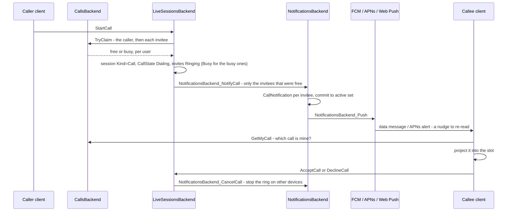

# Incoming call flow

How a ring gets from the caller's click to the callee's screen, and what each answer does on
both sides. What a finished call leaves in the chat is covered separately, in
[Call entries](./call-entries.md).

**The short version.** `StartCall` first claims the **user call** of the caller and of every
invitee - one per user, kept on that user's own shard - and only then writes the call into the
chat's live session and queues a notification. A user already in a call isn't claimed: their
invite is closed as `Busy` and they are left out of the notification batch, so no device of
theirs is pushed at all. Every client then follows one reactive answer,
`ILiveSessions.GetMyCall`, and shows the call it names. Pushes, notification lists and the
Android ring only nudge a client to re-read that answer - none of them decides anything.

[[toc]]

## Overview

## Starting a call

`CallUI.StartCall` asks for the microphone first: a caller who can't be heard doesn't
ring anyone. The public `LiveSessions.StartCall` then checks that:

- the caller is a member of the chat;
- in a peer chat the caller has `CanWriteAudio`. This is the same anti-spam gate as peer
  messaging, so the callee must have added the caller to contacts or replied to them.
  Otherwise the call fails with a constraint error whose text is shown to the caller;
- an empty invitee list means every other member of the chat.

`LiveSessionsBackend.StartCall` claims the user calls first - before the chat's change lock,
since each claim is an RPC to that user's shard:

- **the caller's own**, as `Caller/Dialing`. A refused claim fails the call with "You're
  already in a call", however many devices that other call is spread across.
- **one per invitee**, as `Callee/Ringing`. A refused one drops that invitee out of the ring:
  their invite is written `Busy` straight away and they are left out of the notification batch.
  If that leaves nobody to answer, the call is closed at once with `CallStatus.Busy` and
  `CallOutcome.Busy`, so the caller isn't left dialing.

Then, under the lock:

- **Live session state.** `Kind = Call`, `CallerId` and `Host` are the caller, and
  `SessionStartedAt` stays `null`. A call with no `SessionStartedAt` is dialing
  (`IsDialing`); the first accept sets it. Promoting an already-latched ambient session keeps
  its `SessionStartedAt`, so that call doesn't go back to dialing.
- **`CallState` with `Dialing`.** This is the caller-facing status, and only the caller can
  read it, through `GetCallStatus`.
- **The caller as a participant.**
- **One `CallInvite { Status = Ringing, RingingAt = now }` per invitee.** Each is stored with
  a Redis field TTL of `RingTtl`. The list is deduplicated and never contains the caller.

After the lock is released, it enqueues `NotificationsBackend_NotifyCall`.

## Delivering the ring

1. `OnNotifyCall` resolves the invitees' user ids in one batch, localizes the title and the
   text (voice or video call), and builds a `CallNotification` for each invitee. The id is
   `IncomingCall` plus the call's conversation id, so there is one notification per call per
   user. Its push tag is `call-<chatId>`. Each notification is enqueued as a
   `NotificationsBackend_Notify`.
2. `OnNotify` → `ApplyHardUpdate` commits the notification to the user's active set, which is
   what `INotifications.ListActive` returns. An open client therefore sees the ring
   reactively even when no push arrives. It also emits `NotificationsBackend_Push` as an
   operation event.
3. `OnPush` re-reads the active set, skips a notification that is no longer active, and hands
   it to `FirebaseMessagingClient.SendMessage` for every device that was recently active.

| Platform | What goes out |
|---|---|
| Android | Data-only message, `High` priority. The app builds the notification itself. |
| iOS | APNs alert, `apns-priority: 10`, sound `attention_ringtone.caf`. |
| Web | Data-only message. The service worker builds the notification. |

`IncomingCall` and `Attention` are the two ringer kinds: they get elevated priority and are
never downgraded to a silent update.

**Stopping a ring on devices** goes through `DismissRing`. It enqueues
`NotificationsBackend_CancelCall` for the given invitees, which dismisses the same
notification id. The notification leaves the active set, and a dismissal push carrying the
`call-<chatId>` tag goes to the user's devices.

## How the client learns about the ring

`CallUI` follows `ILiveSessions.GetMyCall` and shows whatever it names. Pushes and taps go
through `CallScreensUI.OnRing(chatId)`, which calls `CallUI.Touch()` - "re-read now" - and, for
a ring shown over the lock screen, sets the over-lock flag. Answer skips all of it and goes
straight to `CallScreensUI.Accept`.

| Situation | Path |
|---|---|
| Android, app in the foreground and unlocked | `FirebaseMessagingService` dispatches `OnRing` straight into Blazor. No system notification is shown, because the in-app modal and ringer already own the ring. |
| Android, backgrounded, killed or locked | `IncomingCallNotifications.Show` posts a `CallStyle` notification with Answer/Decline and a full-screen intent, and `IncomingCallRinger` starts the ringtone with it. No local arbitration: a ring that shouldn't be shown was never pushed. If the Blazor scope is alive, `OnRing` is dispatched as well. |
| Android, opened from that notification | `NotificationHandler` → `IncomingCallNotifications.HandleViewIntent`. A full-screen intent passes `overLockScreen: true`; Answer goes straight to `CallScreensUI.Accept`. |
| Android, opened from the launcher after a push | Nothing special: the first `GetMyCall` on start returns the call, if it is still ringing. |
| Web, tab in the foreground | Firebase `onMessage` → `NotificationUI.OnIncomingCall`. |
| Web, tab in the background or closed | The service worker posts `INCOMING_CALL` to every open tab and shows an OS notification. |
| Every platform | `GetMyCall` is a compute method, so it arrives on its own when the claim or the session changes - no notification list is involved. |

::: info The push is only a hint
A push can't make a client ring: `Touch()` invalidates the `GetMyCall` computed and nothing
more. The answer comes from `CallsBackend.GetUserCall`, which returns the claim only while the
chat's session still backs it - the reader's invite is `Ringing`, or they are the dialing
caller, or they are present in the conversation. A stale push, or a call already answered on
another device, therefore produces nothing.
:::

## The user's call, and the client slot

**The user's call** is the server's: `CallsBackend` keeps one record per user, keyed by
`UserId` so it lives on that user's shard - `ChatId`, `AuthorId`, `Role` (`Caller` / `Callee`),
`Phase` (`Ringing`, `Dialing`, `Active`), with a two-minute TTL.

The record is a **claim, not the truth**. `GetUserCall` answers with it only while the chat's
live session still backs it: the invite is `Ringing` for a `Ringing` claim, `CallState` is
still dialing for a `Dialing` one, and for `Active` the invite is accepted or the user is a
live member. A claim the session no longer backs is released on the spot, so a crashed client
can't stay busy. Two exceptions keep that rule workable:

- a claim younger than `ClaimGrace` (10 s) backs itself, because `StartCall` has to know who
  is free *before* it writes the session the claim would be checked against;
- a live claim re-checks itself every `ClaimSelfHeal` (10 s), since nothing invalidates a
  claim that lapsed with its Redis TTL or outlived its call.

Ambient live sessions never claim anything: recording or listening in a chat without a call
doesn't make anyone busy.

**The client slot** is `CallUI._activeCall`, and it is a projection of `GetMyCall` plus the
intent of a gesture this client just made - `StartCall` sets `Caller/Dialing`, `Accept` sets
`Active`, hanging up clears it, each before its RPC, so the screens follow the tap and not the
round trip. `CallUI.Reconcile` decides between the two:

| Server says | Intent | Slot |
|---|---|---|
| nothing | fresh, wants a call | the intent - "no call" is also what a disconnected client reads |
| nothing | stale or none | empty |
| this chat | fresh, just left it | empty, until the server catches up |
| this chat | fresh, already `Active` | keep `Active` - a just-accepted ring must not blink back to ringing |
| this chat | otherwise | the server's |
| another chat | any | the server's - it arbitrated, and the local claim lost |

An intent expires on its own timer (`IntentGrace`, 10 s), because the answer that ignores it
may never change again.

Everything that shows a call reads the slot. The modal, the island and the full-screen view
read it through `CallScreensUI.GetCallView`; the ringtone through `GetIncomingCall`, the slot
filtered to `Callee/Ringing`; the ringback through `CallUI`.

## Presenting the ring

`CallScreensUI.GetCallView` decides the one screen the call in the slot gets. It is a function
of the call's origin and phase, the screen width, and three chat-scoped flags; the rule itself is
the pure `DecideView`, and a flag counts only while the slot holds its chat.

| Flag | Set by | Counts for |
|---|---|---|
| over-lock | `OnRing(showOverLockScreen: true)` | an incoming call, any phase |
| collapsed | the modal's collapse button, dismissing the modal, collapsing the full-screen view while dialing | ringing and dialing |
| in chat | "go to chat" in the full-screen view of an active call | active |

The first matching row wins:

| Call | Wide | Narrow |
|---|---|---|
| Incoming, over the lock screen (any phase) | full-screen view | full-screen view |
| Ringing, collapsed | island | island |
| Ringing | modal | modal |
| Dialing, not yet confirmed by the server | nothing | nothing |
| Dialing, collapsed | island | island |
| Dialing | modal | full-screen view |
| Active, in chat | nothing | nothing |
| Active | nothing — the call is in the chat | full-screen view |

The width is reactive: narrowing the window mid-call brings up the full-screen view, widening it
swaps the dialing full-screen view for the modal.

| Surface | What it shows |
|---|---|
| `CallModal` | Decline, Mute, Message and Accept for a ring; Hang up while dialing. |
| `FullScreenCallView` | The ring over the keyguard, and dialing or the call on a narrow screen. |
| `CollapsedCallView` | The draggable island. Collapsing a ring also mutes its ringtone. |

`CallScreensUI` is a UI worker; it runs two reactive loops:

- **`SyncRingtone`** plays the ringtone while the slot holds a `Callee/Ringing` call the user
  hasn't muted.
- **`SyncCallView`** follows `GetCallView`. It opens `CallModal` when the view switches to it;
  the modal closes itself once the view moves on. When the slot is released it tears the
  screens down: it clears the chat's flags, moves the app back behind the lock screen if the
  call was shown over it, otherwise opens the chat if the call had the full-screen view, and
  stops an active call's audio. This is the only place that tears down a call the slot held.
  It keeps the last view across restarts of the loop and skips a failed read, so a release
  can't slip through a gap. Decline, Hang up and the other actions don't tear the screens
  down; the one exception is a ring that ends before the slot ever held it, whose flags
  `EndRing` clears itself, since there is no release to do it.

`ConfirmRing` is telemetry only. The server stores it on the invite (`CallInvite.Ack`) and
changes nothing else - the arbitration it used to feed now happens before the ring is sent.

**Ringtone.** On Android it is the native `IncomingCallRinger`, reached through
`AndroidIncomingCallsBridge`, playing the system default ringtone. When no audio is live, the
bridge first gives up the `InCommunication` audio mode, which would otherwise route the ring
to the earpiece. Everywhere else it is the looping JS `IncomingCallRingtone`.

**Showing over the lock screen.** On a cold start the activity is put over the keyguard
straight away, behind a splash-colored cover, because the WebView would otherwise flash the
restored route. On a warm start the call screen renders first, and
`OnOverLockScreenRendered` then triggers `RevealCallScreen`, which shows the app over the
keyguard and removes the cover.

## Answering

### Accept

On the callee's client, `CallScreensUI.Accept`:

1. Re-verifies the ring through `GetRingingCall`. If it is gone, shows a "Call ended" toast
   instead of joining.
2. Commits the ring to `Active` in the slot (refusing with "You're already in a call" if
   another chat holds it), then clears the ring's collapsed and muted flags and cancels the
   Android system notification. All of it happens before the RPC, so the call screen doesn't
   blink between "ring ended" and "audio started".
3. Calls `AcceptCall`.
4. On Android, dismisses the keyguard, unless the call was accepted over the lock screen.
   Then audio starts without unlocking: the activity shown over the lock counts as
   foreground, which is what the microphone foreground service needs. The chat then opens,
   unless the call was accepted over the lock screen; on a narrow screen the full-screen call
   view covers it.
5. Starts listening unconditionally, then requests the microphone and starts recording.
   Listening comes first so that an unanswered OS permission prompt can't fail the connect
   check below.

On the server, `AcceptCall`:

- moves the invitee's user call to `Active`;
- sets the invite to `Accepted`;
- on the first accept, latches the call: `SessionStartedAt = now`, `VisibleStartLid` at the
  chat's end, and the invitee added to `AuthorIds`. `RecomputeCallStatus` moves the caller's
  status to `Connecting`;
- deliberately doesn't register the invitee's presence. Presence comes only from real
  streams, which is what lets the next check tell "accepted" from "accepted and connected";
- calls `DismissRing` for this invitee, which clears the ring on their other devices;
- `CallConnectGrace` (3 s) later, runs `EnforceCallConnectGrace`. Fewer than two fresh
  participants close the call; otherwise the status is recomputed.

From there the call runs on presence. The client's streams drive
`LiveSessionUI.RunParticipationSync`, which reports `SetParticipation` with a heartbeat.
`GetState`'s self-heal runs `SyncCallParticipantActivity`, which marks the caller and the
invitee `Active`, and the status becomes `Active`. The caller's holding loop in `CallUI` sees
that and joins the conversation, moving the slot to `Active`.

### Decline

The callee declines from the modal, the island, the over-lock screen, or the Decline button
of the Android notification (`CallActionReceiver`). The client ends the local ring and calls
`DeclineCall`. The Message action declines the call and opens the chat. If the ring was shown
over the lock screen, it is moved back behind it as part of the release teardown once the slot
is released. A ring the slot never held, declined from the notification before the search
claimed it, has no release, so `Decline` moves it back itself.

On the server, `DeclineCall`:

- sets the invite to `Declined`;
- records the `Declined` outcome. Recording is first-writer-wins, see
  [Call entries](./call-entries.md);
- calls `DismissRing` for this invitee;
- if no other invite is still ringing and fewer than two people are present
  (`IsCallAbandoned`), recomputes the status and closes the call.

### The caller cancels

`CancelCall` is accepted only while the call is `Dialing` or `Connecting`. It:

- sets every ringing invite to `Missed`;
- removes the caller from the participants;
- clears `CallState`;
- records the `Canceled` outcome;
- calls `DismissRing` for the invitees that were still ringing;
- closes the session.

On the callee's side two paths race, and either one ends the ring:

- **The dismissal push.**
  - Android cancels the system notification and, when the app is in the foreground, calls
    `CallScreensUI.OnCallDismissed` through `ClearForegroundCallRings`.
  - The web service worker closes the OS notification and posts `INCOMING_CALL_CANCELLED` to
    every open tab.
- **The reactive session.** `LiveSessions.Get` is invalidated, `GetRingingCall` returns
  nothing, and the ringtone and the modal stop on their own.

### Nobody answers

While someone observes the session, `GetState`'s self-heal runs `ExpireRings`. Once a ringing
invite is older than `RingTimeout`:

1. The invite becomes `Missed`, and `DismissRing` is called: the callee's ring stops on time.
2. For `AnswerGrace` (10 s) after that the call stays open, and the caller keeps dialing. An
   Answer tapped at the very end of the ring reaches the server only after a cold start and the
   RPC connect, and `AcceptCall` still takes it: a `Missed` invite within
   `RingTimeout + AnswerGrace` of its ring counts as answerable, as long as the call is still
   dialing and wasn't canceled. The callee's user call, released with the missed ring, is
   claimed again as `Active`.
3. `ExpireRings` runs once more when the grace is over (`ScheduleAnswerGraceEnd`). If the call
   is abandoned and still dialing by then, it gets the `NoAnswer` status and outcome, and the
   call closes.

A dialing call with no fresh ring left is finalized the same way. When nobody observes the
session, two backstops remain: the Redis TTL on the invite (`RingTtl`) and the Android
notification's own `SetTimeoutAfter`. That timeout counts from the moment the push was sent, not
from when it was shown, so the Answer button doesn't outlive the server's ring by the delivery
time. Before the server clock is synced (a cold start) the device clock is used, and the ring
never shrinks below half of `RingTimeout`.

A refused answer - past the grace, or after a cancel - shows the "Missed call" toast.

## Timers

| Constant | Value | Role |
|---|---|---|
| `Constants.Call.RingTimeout` | 20 s | How long an invite rings before it becomes `Missed`. |
| `AnswerGrace` | 10 s | How long past `RingTimeout` a `Missed` invite can still be answered, and the call stays open for it. |
| `Constants.Call.RingTtl` | 60 s | Redis field TTL on a ringing invite: the backstop when nobody observes the session. |
| `CallConnectGrace` | 3 s | After the first accept, both sides must be present by then, or the call closes. |
| `CallsBackend.ClaimTtl` | 2 min | Redis TTL on a user call, refreshed while the call lives. |
| `CallsBackend.ClaimGrace` | 10 s | How long a fresh claim backs itself, before the session has to. |
| `CallsBackend.ClaimSelfHeal` | 10 s | How often a live claim re-checks itself against the session. |
| `CallUI.IntentGrace` | 10 s | How long a gesture's own view of the slot outlives an answer that ignores it. |

## Known gaps

- **`RingTimeout` is 20 s only for testing.** It was lowered from 40 s to test call
  statuses, and the code still carries a TODO to restore it.
- **`RingAck.Received` is never sent.** The ack for a held ring goes out after the session
  confirms it, not when the push arrives, so it can't show "the push arrived but the session
  read failed".
- **Only one over-lock ring.** If two rings arrive together on a locked device and the search
  claims the other one, the over-lock screen the first one asked for shows nothing.
- **iOS has no call-specific path**, neither CallKit nor PushKit. A ring is an ordinary alert
  with a ringtone, and the in-app ring appears only once the app is open, through
  `ListActive`.
- **The web OS notification has no Answer/Decline.** Clicking it just opens the chat.
- **A ring during a call doesn't ring at all** - on any device, and the caller is told "busy"
  right away. Answering it means hanging up first; holding the current call to take another is
  a later feature. An *unanswered* ring counts the same way, so the first ring wins and a
  second caller is turned away while it is still going.
- **A hang-up frees the user only as fast as presence travels.** The claim goes when the
  session stops backing it, which follows the participation the client drops on hang-up; the
  self-heal bounds the worst case at `ClaimSelfHeal`.

## Related

- [Call entries](./call-entries.md): what a call leaves in the chat once it ends.
- [Notifications](../notifications.md): the active set, dismissal pushes, and per-platform
  rendering that the ring rides on.
