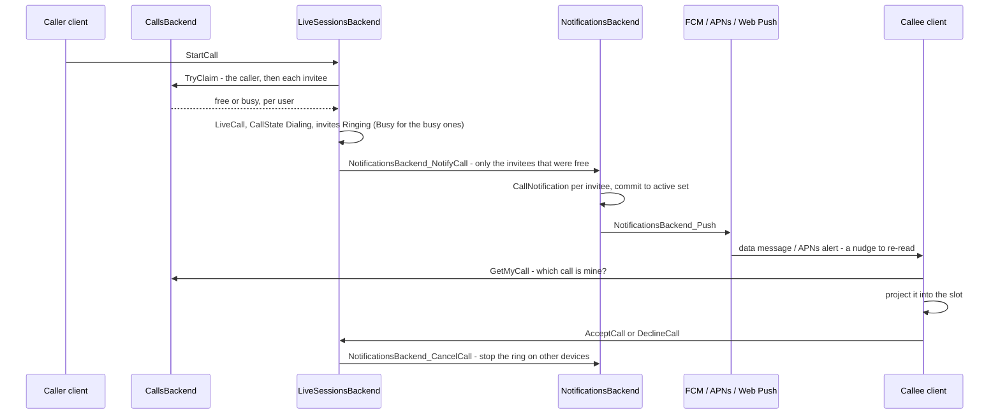

# Incoming call flow

How a ring gets from the caller's click to the callee's screen, and what each answer does on
both sides. What a finished call leaves in the chat is covered separately, in
[Call entries](./call-entries.md).

**The short version.** `StartCall` first claims the **user call** of the caller and of every
invitee - one per user, kept on that user's own shard - and only then writes the chat's
`LiveCall` and queues a notification. The call has no live session until it is answered: the
answer starts one, or joins the session already going in the chat. A user already in a call
isn't claimed: their invite is closed as `Busy` and they are left out of the notification batch,
so no device of theirs is pushed at all. Every client then follows one reactive answer,
`ILiveSessions.GetMyCall`, and shows the call it names. Pushes, notification lists and the
Android ring only nudge a client to re-read that answer - none of them decides anything.

[[toc]]

## Call identity

Every call has a `CallId`: the chat it is placed in plus a local id no other call to that chat
shares (`<chatId>:<localId>`). `LiveSessionsBackend.StartCall` issues it, and everything that
refers to the call carries it - the chat's `LiveCall`, its `CallState` and `CallInvite`s,
each party's `UserCall` claim, the ring notification's id and push tag, and the client's slot. So
"the same call" and "a later call to the same chat" are never confused:

- a claim is backed only by *its* call, and `ReleaseCall` frees a user only from the
  call it names, so a late release can't free someone who is in the next call by then;
- `AcceptCall`, `DeclineCall` and `CancelCall` take the id of the call they are about. If the chat
  is in another call when the request lands, decline and cancel are dropped and accept is refused;
- a dismissal push names one call's banner, not "whatever rings in this chat".

The local id is opaque to everything but the server. Today it is the call's start time in
milliseconds, bumped so two calls never share it: it reads in a log, and sorts.

A `StartCall` into a call that is already answered **joins** it and keeps its id: the people in
it hold claims naming that id, and a new one would drop them. So does a `StartCall` repeated by
the caller of a call that is still dialing - an RPC resent after a reconnect. Every other
`StartCall` places a new call, whatever session the chat has - none, or an ambient one. A new
call starts with no outcome and none of the previous call's invites. While another call is still
dialing in the chat, `StartCall` fails with "There's already a call in this chat".

`ConversationId` is *not* a call id: it names a chat block, which an unanswered call doesn't
have at all, and a call into an ongoing session shares with that session.

The id is required in all three: there is no "whatever call the chat is in". A callee always has
it - the ring's `GetMyCall` answer and its push both carry it. A caller gets it from `StartCall`,
so a call hung up before `StartCall` answered is cancelled once it has: `CallUI.CancelCall` frees
the slot on the click and sends the request when the id arrives (never, if `StartCall` failed).
`CallUI` sends its `StartCall`s and `CancelCall`s in the order they were made, so a redial right
after a cancel can't reach the server first.

## Overview

```mermaid
sequenceDiagram
    participant Caller as Caller client
    participant CB as CallsBackend
    participant LS as LiveSessionsBackend
    participant NB as NotificationsBackend
    participant Push as FCM / APNs / Web Push
    participant Callee as Callee client

    Caller->>LS: StartCall
    LS->>CB: TryClaim - the caller, then each invitee
    CB-->>LS: free or busy, per user
    LS->>LS: LiveCall, CallState Dialing, invites Ringing (Busy for the busy ones)
    LS->>NB: NotificationsBackend_NotifyCall - only the invitees that were free
    NB->>NB: CallNotification per invitee, commit to active set
    NB->>Push: NotificationsBackend_Push
    Push->>Callee: data message / APNs alert - a nudge to re-read
    Callee->>CB: GetMyCall - which call is mine?
    Callee->>Callee: project it into the slot
    Callee->>LS: AcceptCall or DeclineCall
    LS->>NB: NotificationsBackend_CancelCall - stop the ring on other devices
```

## Starting a call

`CallUI.StartCall` asks for the microphone first: a caller who can't be heard doesn't
ring anyone. The public `LiveSessions.StartCall` then checks that:

- the caller is a member of the chat;
- in a peer chat the caller has `CanWriteAudio`. This is the same anti-spam gate as peer
  messaging, so the callee must have added the caller to contacts or replied to them.
  Otherwise the call fails with a constraint error whose text is shown to the caller;
- an empty invitee list means every other member of the chat.

`LiveSessionsBackend.StartCall` decides the `CallId` - a new one, or the connected call's when it
joins one - and claims the user calls with it. That happens before the chat's change lock, since
each claim is an RPC to that user's shard; the lock then re-checks that no other call took the
chat meanwhile, and the claims are released if one did.

- **the caller's own**, as `Caller/Dialing`. A refused claim fails the call with "You're
  already in a call", however many devices that other call is spread across.
- **one per invitee**, as `Callee/Ringing`. A refused one drops that invitee out of the ring:
  their invite is written `Busy` straight away and they are left out of the notification batch.
  If that leaves nobody to answer, the call is closed at once with `CallStatus.Busy` and
  `CallOutcome.Busy`, so the caller isn't left dialing.

Then, under the lock:

- **The `LiveCall`** - its id, the caller, whether it has video, when it started - with a
  Redis TTL of `RingTtl + AnswerGrace`: an unanswered call outlives its ring and the late-answer
  window, then lapses on its own. It is the call's own record, kept apart from the chat's live
  session, which `StartCall` doesn't touch: a call has no session until it is answered, and a
  session already going in the chat stays exactly as it was.
- **`CallState` with `Dialing`.** This is the caller-facing status, and only the caller can
  read it, through `GetCallStatus`.
- **One `CallInvite { Status = Ringing, RingingAt = now }` per invitee.** Each is stored with
  a Redis field TTL of `RingTtl`. The list is deduplicated and never contains the caller.

After the lock is released, it enqueues `NotificationsBackend_NotifyCall` and starts the ring
timer (see [Nobody answers](#nobody-answers)).

`LiveSessionsBackend.GetCall` is the call's compute method, and `ListInvites` lists its invites,
ordered by `RingingAt`; both are backend-only. `Get` - the `LiveSession` the clients read - shows
the call only as `Kind = Call`: a call with no session yet reads as a `Kind = Call` session with the
caller in `Members` and no `Conversation`, and a call into an ongoing session overlays `Kind = Call`
on that session's own view until it ends. A client learns its own part in a call - ringing, dialing,
in it, and who the other side is - from its `UserCall` claim, not from the session.

## Delivering the ring

1. `OnNotifyCall` resolves the invitees' user ids in one batch, localizes the title and the
   text (voice or video call), and builds a `CallNotification` for each invitee. The id is
   `IncomingCall` plus the `CallId`, so there is one notification per call per user. Its push
   tag is `call-<callId>`, and the push data carries `callId` next to `chatId`. Each
   notification is enqueued as a `NotificationsBackend_Notify`.
2. `OnNotify` → `ApplyHardUpdate` commits the notification to the user's active set, which is
   what `INotifications.ListActive` returns. An open client therefore sees the ring
   reactively even when no push arrives. It also emits `NotificationsBackend_Push` as an
   operation event.
3. `OnPush` re-reads the active set, skips a notification that is no longer active, and hands
   it to `FirebaseMessagingClient.SendMessage` for every device that was recently active.

| Platform | What goes out |
|---|---|
| Android | Data-only message, `High` priority. The app builds the notification itself. |
| iOS | APNs alert, `apns-priority: 10`, sound `attention_ringtone.caf`. |
| Web | Data-only message. The service worker builds the notification. |

`IncomingCall` and `Attention` are the two ringer kinds: they get elevated priority and are
never downgraded to a silent update.

**Stopping a ring on devices** goes through `DismissRing`. It enqueues
`NotificationsBackend_CancelCall` for the given invitees, which dismisses the same
notification id. The notification leaves the active set, and a dismissal push carrying the
`call-<callId>` tag goes to the user's devices. Every client ends only the ring that tag names:
a dismissal that arrives late finds the next call to the chat ringing, and leaves it alone.

## How the client learns about the ring

`CallUI` follows `ILiveSessions.GetMyCall` and shows whatever it names. Pushes and taps go
through `CallScreensUI.OnRing(chatId)`, which calls `CallUI.Touch()` - "re-read now" - and, for
a ring shown over the lock screen, sets the over-lock flag. Answer skips all of it and goes
straight to `CallScreensUI.Accept`.

| Situation | Path |
|---|---|
| Android, app in the foreground and unlocked | `FirebaseMessagingService` dispatches `OnRing` straight into Blazor. No system notification is shown, because the in-app modal and ringer already own the ring. |
| Android, backgrounded, killed or locked | `IncomingCallNotifications.Show` posts a `CallStyle` notification with Answer/Decline and a full-screen intent, and `IncomingCallRinger` starts the ringtone with it. No local arbitration: a ring that shouldn't be shown was never pushed. If the Blazor scope is alive, `OnRing` is dispatched as well. |
| Android, opened from that notification | `NotificationHandler` → `IncomingCallNotifications.HandleViewIntent`. A full-screen intent passes `overLockScreen: true`; Answer goes straight to `CallScreensUI.Accept`. |
| Android, opened from the launcher after a push | Nothing special: the first `GetMyCall` on start returns the call, if it is still ringing. |
| Web, tab in the foreground | Firebase `onMessage` → `NotificationUI.OnIncomingCall`. |
| Web, tab in the background or closed | The service worker posts `INCOMING_CALL` to every open tab and shows an OS notification. |
| Every platform | `GetMyCall` is a compute method, so it arrives on its own when the claim or the call changes - no notification list is involved. |

::: info The push is only a hint
A push can't make a client ring: `Touch()` invalidates the `GetMyCall` computed and nothing
more. The answer comes from `CallsBackend.GetUserCall`, which returns the claim only while the
chat's call still backs it - the reader's invite is `Ringing`, or they are the dialing
caller, or the call is answered and they are in it. A stale push, or a call already answered on
another device, therefore produces nothing.
:::

## The user's call, and the client slot

**The user's call** is the server's: `CallsBackend` keeps one record per user, keyed by
`UserId` so it lives on that user's shard - `CallId`, `ChatId`, `AuthorId`, `Role` (`Caller` /
`Callee`), `Phase` (`Ringing`, `Dialing`, `Active`), with a two-minute TTL.

The record is a **claim, not the truth**. `GetUserCall` answers with it only while the chat's
call still backs it (`CallsBackend.GetPhase`, which reads `GetCall`, the `Get` projection's members
and, for a callee, `ListInvites`):
the chat's `LiveCall` is the claim's call, and the invite is `Ringing` for a `Ringing` claim,
the call is unanswered and has no outcome yet for the caller's `Dialing` one, and for `Active`
the call is answered and the user is its caller, an invitee who accepted, or a live member. A
claim the call no longer backs is released on the spot, so a crashed client can't stay busy.
Two exceptions keep that rule workable:

- a claim younger than `ClaimGrace` (10 s) backs itself, because `StartCall` has to know who
  is free *before* it writes the call the claim would be checked against;
- a live claim re-checks itself every `ClaimSelfHeal` (10 s), since nothing invalidates a
  claim that lapsed with its Redis TTL or outlived its call.

Ambient live sessions never claim anything: recording or listening in a chat without a call
doesn't make anyone busy - nor does being in the session a call rang into, unless you are one of
the call's own parties.

**Whose call it is.** The claim is per user, but a call runs on one client: the one that placed
it or answered the ring. The claim names that client - `SessionHash` for the device, and
`ClientId` for the running app instance or browser tab, a random id `CallUI` makes at start
and sends with `StartCall`, `AcceptCall` and `GetMyCall`. `GetMyCall` answers with the claim
only on that client (`LiveSessions.IsOnClient`); every other client of the user reads "no call"
and behaves as it would without one - no screens, no ringback, no call audio mode, no audio
(#4929). A ring is the exception: its claim names no client, so it rings on all of them, and
answering it makes it the answering client's (`LiveSessionsBackend.ClaimAnswer`). The user
stays busy on every client all the same: `StartCall` is still arbitrated by the per-user claim.

A reloaded tab or a restarted app is a new client and doesn't see the call it had - the call's
audio died with it anyway, and the call closes on the missing presence. A claim that names no
session or no client - one taken through the backend directly, as tests do - is shown to every
client that could have made it.

**The client slot** is `CallUI._activeCall`, and it is a projection of `GetMyCall` plus the
intent of a gesture this client just made - `StartCall` sets `Caller/Dialing`, `Accept` sets
`Active`, hanging up clears it, each before its RPC, so the screens follow the tap and not the
round trip. `CallUI.Reconcile` decides between the two:

| Server says | Intent | Slot |
|---|---|---|
| nothing | fresh, wants a call | the intent - "no call" is also what a disconnected client reads |
| nothing | stale or none | empty |
| the call just left | fresh | what the intent wants - empty, or the call placed since - until the server catches up |
| another call to the chat just left | fresh, wants nothing | the server's - a call back must not wait the grace out |
| this call | fresh, already `Active` | keep `Active` - a just-accepted ring must not blink back to ringing |
| this call | otherwise | the server's |
| another call, or another chat | any | the server's - it arbitrated, and the local claim lost |

A gesture holds the slot before the server has named the call, so an intent's call has no id until
`StartCall` returns one or a `GetMyCall` answer brings it; until then it matches any call in its
chat. "The call just left" is
told by the id the slot held when it was released - or by chat alone, when it held none.

When the slot goes from one call straight to another in the same chat, the screens drop the first
call's collapsed and muted state and stop its audio, but don't hang up or leave the screen by
chat - that would do it to the new call. The over-lock flag stays, for the new call's release.

An intent expires on its own timer (`IntentGrace`, 10 s), because the answer that ignores it
may never change again.

Everything that shows a call reads the slot. The modal, the island and the full-screen view
read it through `CallScreensUI.GetCallView`; the ringtone through `GetIncomingCall`, the slot
filtered to `Callee/Ringing`; the ringback through `CallUI`.

## Presenting the ring

`CallScreensUI.GetCallView` decides the one screen the call in the slot gets. It is a function
of the call's origin and phase, the screen width, and three chat-scoped flags; the rule itself is
the pure `DecideView`, and a flag counts only while the slot holds its chat.

| Flag | Set by | Counts for |
|---|---|---|
| over-lock | `OnRing(showOverLockScreen: true)` | an incoming call, any phase |
| collapsed | the modal's collapse button, dismissing the modal, collapsing the full-screen view while dialing | ringing and dialing |
| in chat | "go to chat" in the full-screen view of an active call | active |

The first matching row wins:

| Call | Wide | Narrow |
|---|---|---|
| Incoming, over the lock screen (any phase) | full-screen view | full-screen view |
| Ringing, collapsed | island | island |
| Ringing | modal | modal |
| Dialing, not yet confirmed by the server | nothing | nothing |
| Dialing, collapsed | island | island |
| Dialing | modal | full-screen view |
| Active, in chat | nothing | nothing |
| Active | nothing — the call is in the chat | full-screen view |

The width is reactive: narrowing the window mid-call brings up the full-screen view, widening it
swaps the dialing full-screen view for the modal.

On a narrow screen the call has a second full-screen surface, the expanded video panel, which lives
in the chat under the full-screen view. The two hand the screen to each other through the collapsed
flag, and each stays up until the other covers it, so the chat between them doesn't show:

- **Video starts** — the own camera turned on from the full-screen view, or a remote stream arriving
  while it is up (`CallScreensUI.IsOnCallScreen`): the panel opens expanded, and
  `OnVideoExpanded` sets the flag once the panel reports it covers the screen.
- **The last video stops** while the panel is expanded: `VideoPanel` clears the flag
  (`CallScreensUI.Expand`) before it closes, so the full-screen view is back first.

A panel that is inline when its video stops leaves the user in the chat, and over the lock screen
the full-screen view stays: the chat, and the panel in it, are behind the keyguard.

| Surface | What it shows |
|---|---|
| `CallModal` | Decline, Mute, Message and Accept for a ring; Hang up while dialing. |
| `FullScreenCallView` | The ring over the keyguard, and dialing or the call on a narrow screen. |
| `CollapsedCallView` | The draggable island. Collapsing a ring also mutes its ringtone. |

`CallScreensUI` is a UI worker; it runs two reactive loops:

- **`SyncRingtone`** plays the ringtone while the slot holds a `Callee/Ringing` call the user
  hasn't muted.
- **`SyncCallView`** follows `GetCallView`. It opens `CallModal` when the view switches to it;
  the modal closes itself once the view moves on. When the slot is released it tears the
  screens down: it clears the chat's flags, moves the app back behind the lock screen if the
  call was shown over it, otherwise opens the chat if the call had the full-screen view, and
  stops an active call's audio. This is the only place that tears down a call the slot held.
  It keeps the last view across restarts of the loop and skips a failed read, so a release
  can't slip through a gap. Decline, Hang up and the other actions don't tear the screens
  down; the one exception is a ring that ends before the slot ever held it, whose flags
  `EndRing` clears itself, since there is no release to do it.

`ConfirmRing` is telemetry only. The server stores it on the invite (`CallInvite.Ack`) and
changes nothing else - the arbitration it used to feed now happens before the ring is sent.

**Ringtone.** On Android it is the native `IncomingCallRinger`, reached through
`AndroidIncomingCallsBridge`, playing the system default ringtone. When no audio is live, the
bridge first gives up the `InCommunication` audio mode, which would otherwise route the ring
to the earpiece. Everywhere else it is the looping JS `IncomingCallRingtone`.

**Showing over the lock screen.** On a cold start the activity is put over the keyguard
straight away, behind a splash-colored cover, because the WebView would otherwise flash the
restored route. On a warm start the call screen renders first, and
`OnOverLockScreenRendered` then triggers `RevealCallScreen`, which shows the app over the
keyguard and removes the cover.

## Answering

### Accept

On the callee's client, `CallScreensUI.Accept`:

1. Takes the `CallId` the answer came with (a notification action or CallKit carries it), or
   the slot's. With neither there is no ring to answer, and it ends as a refused answer does.
   The server is the one to refuse an answer to a ring that is gone - see below.
2. Commits the ring to `Active` in the slot (refusing with "You're already in a call" if
   another chat holds it), then clears the ring's collapsed and muted flags and cancels the
   Android system notification. All of it happens before the RPC, so the call screen doesn't
   blink between "ring ended" and "audio started".
3. Calls `AcceptCall`.
4. On Android, dismisses the keyguard, unless the call was accepted over the lock screen.
   Then audio starts without unlocking: the activity shown over the lock counts as
   foreground, which is what the microphone foreground service needs. The chat then opens,
   unless the call was accepted over the lock screen; on a narrow screen the full-screen call
   view covers it.
5. Starts listening unconditionally, then requests the microphone and starts recording.
   Listening comes first so that an unanswered OS permission prompt can't fail the connect
   check below.

On the server, `AcceptCall`:

- refuses an answer naming a call the chat is no longer in;
- moves the invitee's user call to `Active` and names the answering client in it, so the
  invitee's other clients stop seeing the call;
- sets the invite to `Accepted`;
- on the first accept, answers the call: `AnsweredAt = now` on the `LiveCall`, under the same
  lock that records outcomes, so an answer and a ring timing out can't both win. The answer
  gives the call its session (`JoinSession`):
  - with no session in the chat it starts one of `Kind = Call`, `SessionStartedAt = now`,
    `VisibleStartLid` at the chat's end and the caller and the invitee in `AuthorIds`, and
    registers the caller as present - their client joins only on hearing of the answer;
  - with a session already going it joins that one and changes nothing in it (see
    [A call into an ongoing session](#a-call-into-an-ongoing-session)).

  `RecomputeCallStatus` moves the caller's status to `Connecting`;
- deliberately doesn't register the invitee's presence. Presence comes only from the
  invitee's client once it listens or records, which is what lets the next check tell
  "accepted" from "accepted and connected";
- calls `DismissRing` for this invitee, which clears the ring on their other devices;
- `CallConnectGrace` (5 s) later, runs `EnforceCallConnectGrace`. Fewer of the call's own parties
  present than the call needs (see below) close it; otherwise the status is recomputed.

From there the call runs on presence. The client's listening and recording flags drive
`LiveSessionUI.SyncParticipations`, which reports `SetParticipation` with a heartbeat, and the
heartbeat also keeps the answered call's record alive. `GetCall`'s self-heal runs
`SyncCallParticipantActivity`, which marks the caller and the invitee `Active`, and the status
becomes `Active`. The caller's claim reads `Active` from the answer on, so their holding loop in
`CallUI` joins the conversation and moves the slot to `Active`. Only the client the call was
placed from sees it at all - see "Whose call it is" above.

**The call's parties** are its caller and the invitees who accepted. Everything that counts
presence for a call counts only them: someone else present in the session the call rang into
neither holds the call open nor makes anyone busy. The same self-heal ends a call whose parties
are gone without saying so - a crashed client - once `CallConnectGrace` after the answer is over.

Presence has exactly two sources: that client report, and `PeerParticipations` releasing what a
peer claimed once its connection stays down past `ParticipationDisconnectGrace`. The listening
stream itself doesn't touch it. It closes on every re-subscribe, and when it used to drop the
listener's presence, calls ended on their own (#4835).

How many present parties a call needs is `MinCallParties`: two in a peer chat, where the call is
its two parties, and one anywhere else, where a call goes on while anyone is in it and ends once the
last one leaves. Nobody is then left on a group call that ended under them without a word, their
mic still on: they are on the call until they hang up themselves.

Hanging up is a presence drop too. A leave that leaves the call with nobody closes it at once.
A leave that leaves it short of `MinCallParties` schedules `EnforceCallLeaveGrace`
`CallLeaveGrace` later, and the call closes only if it is still short then. `EndCall` counts once
more under the change lock, so a party back by then keeps the call.

### When the call ends, and its session

`EndCall` ends the call alone. The session goes on without it, whatever started it, and closes by
the one rule every session closes by: once nobody records. A session the call's answer started
(`Kind = Call`) then closes through `CloseCallSession`, which keeps its block as the call's card - a
call's card needs no summary to be kept. Any other session closes as an ambient one, summary and
all.

What decides when that happens is the clients' media. The hang-up button stops all of it: leaving a
call is stopping its audio. A call that ends without this client's hang-up goes through
`CallUI.EndCallMedia`:

- **In a peer chat** it takes the recording, the listening and the video along. One party leaving
  ends the call, the call's end stops the other's media, and with nobody recording the session
  closes for both. Whoever has more to say starts a new call, or records in the chat, which starts
  a new session.
- **Elsewhere** it touches nothing. Such a call ends only once its last party has hung up, so
  whatever media a client still runs there is its own.

Membership in a call and media are one and the same, so a recording that predates a group call
stops on one's own hang-up as well. Telling the two apart is #5053.

### A call into an ongoing session

A chat can already have a live session when a call is placed into it - two people talking in a
peer chat, say. The call doesn't take that session over:

- **While it rings** the session stays exactly as it was: its kind, its block, its host. The
  invitee gets the incoming-call modal like any other ring, even when they are already in the
  session, and answering is the same `AcceptCall`. The `Get` projection shows the ring on top of
  the session - `Kind = Call` over the session's own members and conversation.
- **Answered,** the call joins the session, and the session stays an ambient one: its block is
  the session's ordinary conversation, summarized as usual, never a call card. The call's parties
  hold the session open while the call lasts.
- **When the call ends** - unanswered, declined, cancelled or hung up - only the call goes. The
  session carries on by its own rule, a recorder keeping it open, and is re-evaluated at once. An
  answered peer call still ends it for both: its end stops both clients' media, as above. The call
  leaves its `CallEntry` in the chat, with the talk time when it was answered (see
  [Call entries](./call-entries.md)).

`LiveSessionState.Kind` is what started the session, never changed after: `Call` only for a
session a call's answer started. The `LiveSession` clients read reports `Kind = Call` while a call
overlays it, whichever session that is.

### Decline

The callee declines from the modal, the island, the over-lock screen, or the Decline button
of the Android notification (`CallActionReceiver`). The client ends the local ring and calls
`DeclineCall`. The Message action declines the call and opens the chat. If the ring was shown
over the lock screen, it is moved back behind it as part of the release teardown once the slot
is released. A ring the slot never held, declined from the notification before the search
claimed it, has no release, so `Decline` moves it back itself.

On the server, `DeclineCall`:

- does nothing when it names a call the chat is no longer in;
- sets the invite to `Declined`;
- records the `Declined` outcome. Recording is first-writer-wins, see
  [Call entries](./call-entries.md);
- calls `DismissRing` for this invitee;
- if no other invite is still ringing and the call can't have the parties it needs any more
  (`IsCallAbandoned`), recomputes the status and closes the call.

### The caller cancels

`CancelCall` is accepted only for the call it names, and only from that call's caller. On a call
that hasn't been answered it:

- sets every ringing invite to `Missed`;
- clears `CallState`;
- records the `Canceled` outcome;
- calls `DismissRing` for the invitees that were still ringing;
- ends the call. The session the chat may have had is left alone.

On an answered call - the client cancels while its slot still reads Dialing, which can outlast the
answer by a round trip (#4984) - it is the caller leaving: their presence is dropped, and the call
goes on or ends as any party leaving it would.

On the callee's side two paths race, and either one ends the ring:

- **The dismissal push.**
  - Android cancels the system notification and, when the app is in the foreground, calls
    `CallScreensUI.OnCallDismissed` through `ClearForegroundCallRings`.
  - The web service worker closes the OS notification and posts `INCOMING_CALL_CANCELLED` to
    every open tab.
- **The reactive call.** `LiveSessions.Get` is invalidated, `GetRingingCall` returns
  nothing, and the ringtone and the modal stop on their own.

### Nobody answers

`StartCall` starts a ring timer (`ScheduleRingTimeout`) that runs `ExpireRings` once
`RingTimeout` is over, and while someone observes the call, `GetCall`'s self-heal runs it too.
Once a ringing invite is older than `RingTimeout`:

1. The invite becomes `Missed`, and `DismissRing` is called: the callee's ring stops on time.
2. For `AnswerGrace` (10 s) after that the call stays open, and the caller keeps dialing. An
   Answer tapped at the very end of the ring reaches the server only after a cold start and the
   RPC connect, and `AcceptCall` still takes it: a `Missed` invite within
   `RingTimeout + AnswerGrace` of its ring counts as answerable, as long as the call is still
   dialing and wasn't canceled. The callee's user call, released with the missed ring, is
   claimed again as `Active`.
3. `ExpireRings` runs once more when the grace is over (`ScheduleAnswerGraceEnd`). If the call
   is abandoned and still dialing by then, it gets the `NoAnswer` status and outcome, and the
   call closes.

A dialing call with no fresh ring left is finalized the same way. The timer lives in memory, so
a restart or a shard move between the ring and its timeout loses it; then only an observer's
self-heal finalizes the call, and when nobody observes it, two backstops remain: the Redis TTLs on
the invite (`RingTtl`) and on the call itself, and the Android notification's own
`SetTimeoutAfter`. A call finalized only by its TTL leaves no `CallEntry` - a durable backstop is
#5045. That timeout counts from the moment the push was sent, not
from when it was shown, so the Answer button doesn't outlive the server's ring by the delivery
time. Before the server clock is synced (a cold start) the device clock is used, and the ring
never shrinks below half of `RingTimeout`.

A refused answer - past the grace, or after a cancel - shows the "Missed call" toast.

## Timers

| Constant | Value | Role |
|---|---|---|
| `Constants.Call.RingTimeout` | 20 s | How long an invite rings before it becomes `Missed`. |
| `AnswerGrace` | 10 s | How long past `RingTimeout` a `Missed` invite can still be answered, and the call stays open for it. |
| `Constants.Call.RingTtl` | 60 s | Redis field TTL on a ringing invite: the backstop when nobody observes the call. |
| `RingTtl + AnswerGrace` | 70 s | Redis TTL on an unanswered `LiveCall`. Answered, it takes the session's TTL and is refreshed by the same heartbeat. |
| `CallConnectGrace` | 5 s | After the first accept, both sides must be present by then, or the call closes. Long enough for the "Connecting" screen to read as a step, not a flash. |
| `CallLeaveGrace` | 2 s | After a leave that left a call short of `MinCallParties`, how long it has to fill back up before it closes. |
| `CallsBackend.ClaimTtl` | 2 min | Redis TTL on a user call, refreshed while the call lives. |
| `CallsBackend.ClaimGrace` | 10 s | How long a fresh claim backs itself, before the call has to. |
| `CallsBackend.ClaimSelfHeal` | 10 s | How often a live claim re-checks itself against the call. |
| `CallUI.IntentGrace` | 10 s | How long a gesture's own view of the slot outlives an answer that ignores it. |

## Known gaps

- **`RingTimeout` is 20 s only for testing.** It was lowered from 40 s to test call
  statuses, and the code still carries a TODO to restore it.
- **`RingAck.Received` is never sent.** The ack for a held ring goes out after the session
  confirms it, not when the push arrives, so it can't show "the push arrived but the session
  read failed".
- **Only one over-lock ring.** If two rings arrive together on a locked device and the search
  claims the other one, the over-lock screen the first one asked for shows nothing.
- **`ConfirmRing` and the `OnRing` hint name no call.** Both are by chat: the ack is telemetry
  written onto the chat's current invite, and the hint only makes `GetMyCall` re-read.
- **The screen flags are by chat.** Over-lock, collapsed and muted are keyed by `ChatId` and
  cleared when the slot's call changes, which is what keeps them from leaking into the next call.
- **The web OS notification has no Answer/Decline.** Clicking it just opens the chat.
- **A ring during a call doesn't ring at all** - on any device, and the caller is told "busy"
  right away. Answering it means hanging up first; holding the current call to take another is
  a later feature. An *unanswered* ring counts the same way, so the first ring wins and a
  second caller is turned away while it is still going.
- **A hang-up frees the user only as fast as presence travels.** The claim goes when the
  call stops backing it, which follows the participation the client drops on hang-up; the
  self-heal bounds the worst case at `ClaimSelfHeal`.
- **"Connecting" isn't shown yet.** Between the answer and both sides' presence the caller's
  status is `Connecting`, but neither side's screens tell it apart from a connected call.

## Related

- [Call entries](./call-entries.md): what a call leaves in the chat once it ends.
- [Notifications](../notifications.md): the active set, dismissal pushes, and per-platform
  rendering that the ring rides on.
