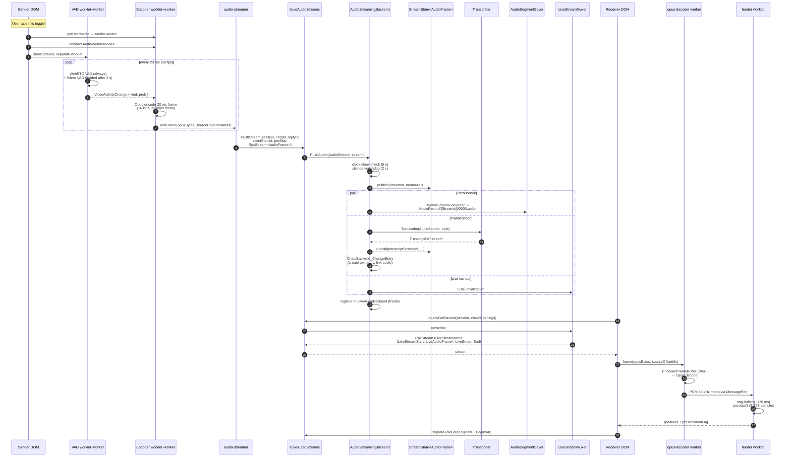

# 01 — End-to-end walkthrough

A "follow one packet across the system" tour. Each later doc zooms into a
single stage. References are to source paths under `/proj/ActualChat-C1`.

## Cast of characters

| Layer | Process | Entry point |
|---|---|---|
| Sender DOM | Main thread | `ChatAudioPanel.razor` (mic toggle) → `ChatAudioUI.SetRecordingChatId` → `AudioRecorder.cs` → `WebRecorderEngine.cs` → JS `OpusMediaRecorder` |
| Sender VAD worklet | AudioWorkletGlobalScope | `audio-vad-worklet-processor.ts` |
| Sender encoder worklet | AudioWorkletGlobalScope | `opus-encoder-worklet-processor.ts` |
| Sender VAD worker | Web Worker | `audio-vad-worker.ts` (WebRTC VAD + Silero ONNX) |
| Sender encoder worker | Web Worker | `opus-encoder-worker.ts` + `audio-streamer.ts` |
| API pod | .NET | `LiveAudioStreams` (`ILiveAudioStreams`) |
| Backend pod | .NET, sharded by `ChatId` | `AudioStreamingBackend`, `LiveAudioBackend` |
| Receiver DOM | Main thread | `ChatAudioUI` → `ChatListener` / `ChatReplayer` → `AudioTrackPlayer.cs` → JS `AudioPlayer` |
| Receiver decoder worker | Web Worker (one per app) | `opus-decoder-worker.ts` |
| Receiver feeder worklet | AudioWorkletGlobalScope | `feeder-audio-worklet-processor.ts` |

## End-to-end timeline (one mic burst → one speaker)



## Stage-by-stage data shapes

```
sender:
  Float32 PCM @ 16 kHz
        │ 20 ms windows = 320 samples
        ▼
  Opus encoder
        │ 20 ms frames (≈80–160 bytes typical)
        ▼
  AudioFrame { Data, Offset, Duration=20ms, IsKeyFrame=true }
        │ MessagePack (CachingAudioFrameFormatter)
        ▼  RpcStream<AudioFrame>      ← non-realtime, AckPeriod=5
  server VideoFrame ⇒ AudioFrame      ← same wire type as input
        │
        ├─▶ blob: WebMStreamConverter  (Opus passthrough, EBML container)
        │
        ├─▶ transcription: Google Speech v2 / Deepgram WebSocket
        │     → TranscriptDiff stream → text entry
        │
        └─▶ live fan-out:
              RpcStream<AudioFrame>            (per-stream pull)
              RpcStream<LiveStreamItem>         (per-chat multiplex)
              RpcStream<LiveStreamItem>         (replay, with speed)

receiver:
  AudioFrame → EncodedFrameBuffer → Opus decode → Float32 PCM 48 kHz
        │
        ▼
  feeder ring buffer 8192 samples (~170 ms)
        │
        ▼  process() @ 128 samples (~2.67 ms)
  WebAudio destination (or HTMLAudioElement on iOS Safari fallback)
```

## Two streams per recording

`ProcessAudio` always produces **two** logically separate streams:

1. **`audioStream` keyed by `streamId`** — raw `RpcStream<AudioFrame>`
   for receivers that want PCM (e.g. live listening, replay).
2. **`transcriptStream` keyed by `transcriptStreamId = streamId + "T"`** —
   `RpcStream<TranscriptDiff>` carrying interim and final text. Subscribers
   for text and audio are independent; a viewer can render captions without
   downloading audio.

Both streams flow through `StreamStore` and the same per-shard fan-out
machinery as video; the wire types differ but the lifecycle is the same.

## Why audio is structurally simpler than video

- **No simulcast.** One stream per author per chat. No layer ladder, no
  per-consumer quality filter, no PLI. Decoder always works at full
  fidelity.
- **No keyframe concept.** Every Opus frame is independently decodable, so
  `IsKeyFrame = true` is a constant.
- **Loss-preserving on the server.** No frames are dropped, ever — the
  server has to keep them for transcription and persistence. The recorder
  uses `AllowReconnect = true` so a peer-change replays buffered frames.
- **Server-side per-author merge.** When a publisher reconnects with a new
  `streamId`, `LiveStreamMuxer` evicts the older stream by `BeginsAt`. The
  client doesn't have to reconcile.
- **Single sender per author.** Microphone + screencast are separate paths
  in video; audio has just the microphone.

## Why audio is structurally trickier than video

- **Three wire-format converters** (`ActualOpus`, `OggOpus`, `WebM`) for
  three different roles (live RPC, transcription API input, persistent
  blob).
- **Two RPC subscription shapes** for the same data —
  `GetStream(streamId)` returns raw `RpcStream<AudioFrame>` for one stream,
  `LegacyGetStream(chatId)` returns `RpcStream<LiveStreamItem>` multiplexing
  every author in a chat.
- **AudioWorklet thread + Worker thread + Main thread** all participate in
  both recording and playback, with `MessageChannel` plumbing between them.
- **Transcription path** (Google / Deepgram / Fake) runs alongside the
  audio-frame path with its own throttling and finalisation.
- **Hard pacing on the playback side** because WASM decoding and JS
  scheduling can starve a `<audio>` element if frames aren't pushed fast
  enough at startup.
