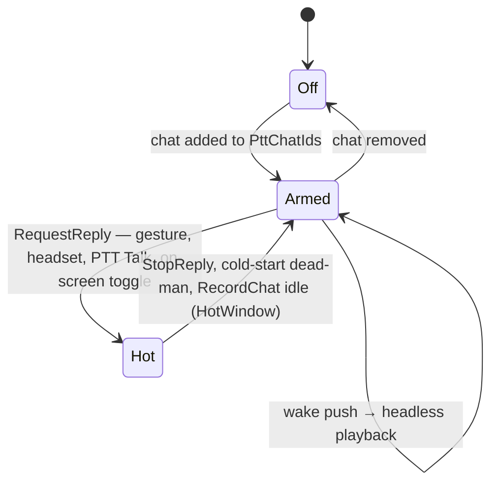
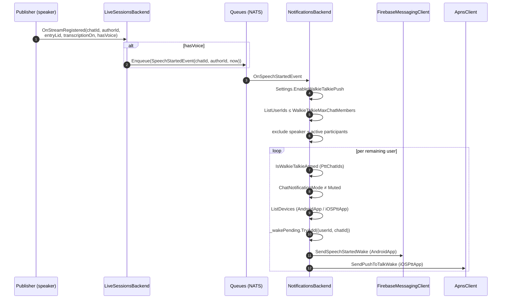
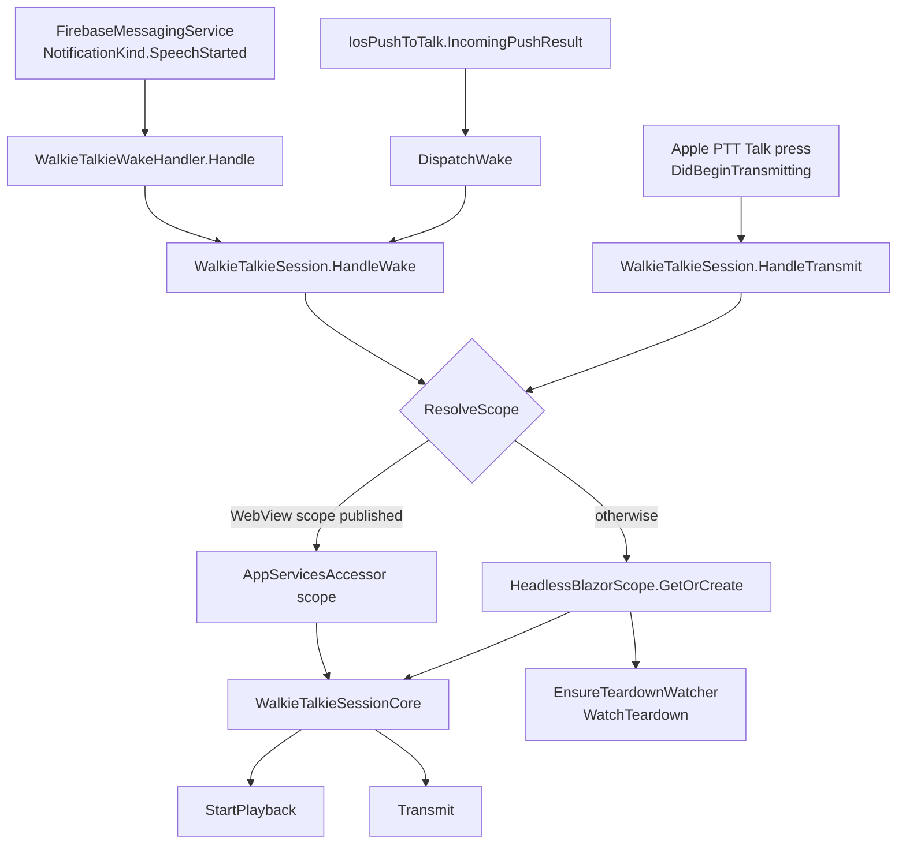

# 10 — Walkie-talkie

Walkie-talkie mode turns a chat into a hands-free voice channel on the mobile
apps: when someone starts speaking, the listener's device is woken by a push,
plays the utterance without any UI, and can answer with a push-to-talk reply
that never requires unlocking the phone. Once the reply's microphone is open,
everything downstream is the ordinary live-audio pipeline — capture and VAD
(doc 02), Opus framing (doc 03), `PushStream` and transcription (doc 05),
fan-out and replay (doc 06), playback (doc 07). Nothing in this doc changes a
frame's path through the system; it is about **who starts a stream, on which
device, and when**.

## States: off, armed, hot

A chat is in exactly one of three walkie states per user:

| State | Meaning | Source of truth |
|---|---|---|
| **off** | Ordinary chat. No wakes, no gestures, no reply button. | `UserWalkieTalkieSettings.PttChatIds` doesn't contain the chat |
| **armed** | The chat may wake this device and may be answered hands-free. | `PttChatIds` contains the chat |
| **hot** | The microphone is open for a walkie reply into this chat. | `WalkieTalkieReplyUI` holds a `WalkieTalkieReply` for it |

Arming is a **separate opt-in** from "keep listening" — `ServerKvasBackendExt.IsWalkieTalkieArmed`
reads `PttChatIds` and nothing else, because waking a killed device is a
materially stronger commitment than keeping a player alive. Arming a chat does
imply listening, though: `ChatAudioUI.GetChatsYouNeedToKeepListeningTo`
concatenates `UserListeningSettings.AlwaysListenedChatIds` with
`GetPttChatIds`, since arming alone starts no player.

Between armed and hot sits the **answer window** — the period after incoming
voice during which a gesture, a headset press or the Apple PTT Talk button may
open the mic without any further confirmation. `IncomingVoiceActivityUI` stamps
`_lastIncomingAt[chatId]` on the false→true edge of `HasIncomingVoice` (voice
from an author other than your own — `ShouldStamp`), and the wake path stamps
it explicitly via `NoteIncomingVoice` because a wake may arrive for an
utterance that is already over. `GestureActivationPolicy.HasAnswerWindow` /
`GetAnswerWindowChat` then ask whether any armed chat has a stamp newer than
`now - WalkieTalkieReplyRecencyWindow` (150 s).

## Server trigger

The wake originates in the streaming backend and is delivered by the
notifications backend.

**`LiveSessionsBackend.OnStreamRegistered`** enqueues
`SpeechStartedEvent(ChatId, AuthorId, StartedAt)` — an `EventCommand` sharded by
`ChatId`. Three properties matter:

- It is enqueued **before** the dedup/early-return of the session-state update,
  so it fires per utterance, not per session.
- It is gated on `hasVoice`, so text-only / transcript-only registrations never
  wake anyone.
- It is wrapped in a `try/catch` that logs and swallows everything but
  `OperationCanceledException` — a failing queue must never fail stream
  registration.

**`NotificationsBackend.OnSpeechStartedEvent`** is the fan-out side:

1. `Settings.EnableWalkieTalkiePush` — the kill switch, checked first.
2. `AuthorsBackend.ListUserIds(chatId)`; bail out if the member count exceeds
   `Settings.WalkieTalkieMaxChatMembers` (100). A wake is a device-waking push
   per member, so large chats are excluded outright.
3. Exclude the speaker's own `UserId` and everyone in
   `GetActiveParticipantUserIds` (resolved from
   `LiveSessionsBackend.ListParticipants` — they are already present and
   hearing it live).
4. Per remaining user, `SendWalkieTalkieWake` runs isolated in its own
   `try/catch` so one user's failure can't abort the fan-out.

`SendWalkieTalkieWake` applies the per-user gates in order:
`IsWalkieTalkieArmed(userId, chatId)`; `ChatNotificationMode.Muted` (a muted
chat never wakes you, even armed); `ListDevices` filtered to
`DeviceType.AndroidApp` (FCM) and `DeviceType.iOSPttApp` (APNs), both bounded by
`Constants.Notification.ActiveDevicePeriod`; and finally the dedup —
`_wakePending`, a `RecentlySeenMap<(UserId, ChatId), Unit>` of capacity 10 000
whose retention is `Settings.WalkieTalkieWakeTtl` (30 s), accessed under its own
lock. While an entry is present, further wakes for that (user, chat) are
dropped: one wake is presumed in flight and a second would only interrupt the
playback the first one started.

## Wake transports

The two platforms need different push types, so the same event produces two
different messages.

**Android — data-only FCM.** `FirebaseMessagingClient.SendSpeechStartedWake`
sends a `MulticastMessage` whose `Data` carries
`Constants.Notification.MessageDataKeys` `Kind` (`NotificationKind.SpeechStarted`),
`ChatId`, `AuthorId` and `Timestamp` (epoch ms). Its `AndroidConfig` sets
`Priority.High` (this is what buys the FGS-start exemption on the client),
`TimeToLive = 60 s` and `CollapseKey = "speech-started-{chatId}"` — a wake for
stale speech is useless, so at most the latest wake per chat stays queued per
device. Delivery failures are handled by the shared `HandleBatchResponse`,
which prunes dead tokens.

**iOS — direct APNs.** FCM cannot deliver `apns-push-type: pushtotalk`, so
`ApnsClient` talks to APNs itself: ES256 token auth with a JWT cached for
50 minutes (`CreateJwt` over `ApplePushKeyId` / `ApplePushTeamId`), one HTTP/2
`POST /3/device/{token}` per device with headers `apns-push-type: pushtotalk`,
`apns-topic: {ApplePushBundleId}.voip-ptt`, `apns-priority: 10` and a 60-second
`apns-expiration`. The payload carries an empty `aps` dictionary plus `Kind`,
`ChatId`, `Timestamp` and `chatTitle` — the PTT system UI needs a channel label
at push time, before any RPC can run, so `SendWalkieTalkieWake` reads the chat
title for this call alone. `IsConfigured` requires all four `ApplePush*`
settings (`ApplePushKeyId`, `ApplePushTeamId`, `ApplePushBundleId`,
`ApplePushPrivateKeyPath`; `ApplePushUseSandbox` selects the host); when they're
missing the client logs one warning and silently no-ops, so a dev environment
without an APNs key behaves as "iOS wakes disabled" rather than erroring.
`IsDeadTokenResponse` (410, or 400 with `BadDeviceToken`) triggers
`NotificationsBackend_RemoveDevices`.

`DeviceType.iOSPttApp` is a device type of its own, and it is **excluded from
ordinary message pushes**: `OnPush` and `OnPushDismissal` both filter
`d.DeviceType != DeviceType.iOSPttApp`. The PTT token is a Push-to-Talk
transport, not a general notification transport.

## Client wake handling

The client entry points are process-global; everything that touches app
services is scoped.

### The facade — `WalkieTalkieSession` (App.Maui)

A static class holding only what must be process-global: scope resolution,
app-ready waits, and headless-session teardown.

- **`HandleWake(chatId, startedAt, isForeground, platform)`** awaits
  `BlazorWebViewApp.WhenAppReady` and `TrueSessionResolver.SessionTask` (both
  under a 20 s `StartupTimeout`), resolves a scope, snapshots
  `core.AudioFocusDenialCount`, and calls `core.StartPlayback`. If the scope is
  headless it arms the teardown watcher; if the wake is a background one it
  starts `core.WatchAudioFocus` with `StopAndDisposeCurrent` as the denial
  action. Any failure logs, calls `platform.OnWakeFailed(chatId)` and disposes
  the headless scope.
- **`HandleTransmit(platform)`** shares **one** cancellation budget —
  `Constants.Audio.WalkieTalkiePttTransmitStartupTimeout` (8 s) — across the
  app-ready wait, the session wait and `core.Transmit`, because the
  microphone-permission check inside `RequestReply` cannot show a prompt from a
  locked screen and nothing may outlive it. Its `finally` arms the teardown
  watcher on every path that resolved a headless scope, including failures:
  `ResolveScope` may have created a scope that nothing else would ever
  dispose.
- **`ResolveScope()`** prefers the live WebView scope
  (`AppServicesAccessor.TryGetScopedServices`), falls back to
  `HeadlessBlazorScope.GetOrCreate()`, and re-checks the WebView scope once more
  to cover losing the creation race to a just-published scope.
- **`StopHeadless(platform)`** (user-initiated, e.g. the Android widget) detaches
  the current headless scope, stops replay, clears listening chats, then tears
  down and disposes.
- **`StopAndDispose(scope, onStopped)`** is the **only** disposal door for a
  headless scope: it first closes any hot reply via
  `core.StopReplyAndWaitForRecorder` under a 5 s budget, because disposing a
  scope out from under an open mic drops the entry with nothing recorded. The
  platform teardown callback runs *after* the mic close (stopping a
  microphone-typed foreground service first would revoke mic access mid-close).
- **`WatchTeardown`** polls every 5 s and disposes the headless scope once it
  has been idle for `TeardownIdleChecks` (2) consecutive checks — where "idle"
  means not recording, no listening chats and no `ReplayState`. Two checks are
  required because the replay-ended → listening-restored transition has a short
  gap that must not read as "session over".

### The core — `WalkieTalkieSessionCore` (UI.Blazor.App)

A scoped service over `AppUIHub`, so it works identically in a headless scope
and in the live WebView scope.

`StartPlayback(chatId, startedAt, isForeground, isHeadless, platform)`:

1. Sets `ChatAudioUI.IsWalkieTalkieHeadless` when headless, calls
   `ChatAudioUI.Enable()`, and stamps
   `IncomingVoiceActivityUI.NoteIncomingVoice(chatId, startedAt)` — without this
   an utterance that ended during the boot would never open an answer window.
2. **Foreground branch**: just `SetListeningState(chatId, true)` and
   `platform.OnForegroundWakeHandled` — the user is in the app and a forced
   replay would hijack their state.
3. **Background branch**: plays `Tune.NotifyOnNewAudioMessageAfterDelay`
   explicitly (the replay path bypasses `ChatListeningPlayer`, which normally
   plays it), then builds the **restore set** from
   `GetChatsYouNeedToKeepListeningTo` plus the trigger chat.
4. **Stale-wake branch**: `WalkieTalkie.IsStaleWake(startedAt, now)` — older than
   `WalkieTalkieStaleWakeAge` (60 s, matching the FCM TTL) — skips
   replay-from-start and simply resumes listening on every chat in the restore
   set. A fresh wake instead calls
   `ChatAudioUI.StartWalkieTalkieReplay(chatId, startedAt, restoreSet)`, the
   confirm-modal-free variant of `StartReplay` whose post-replay restore set is
   the one supplied here.
5. Fires `platform.OnPlaybackStarted(hub, chatId)`.

`Transmit(isHeadless, platform, cancellationToken)` refuses to open the mic when
`WalkieTalkie.MayTransmit(isPracticeMode, recordingChatId)` is false — rehearsing
in Settings must never transmit, and `RequestReply` is idempotent, so a
gesture-opened mic would otherwise make the transmission report success and
later close a reply it never started. It re-stamps `platform.LastWake` (the
persisted wake) before calling
`WalkieTalkieReplyUI.RequestReply(ReplyTargetResolver.UnboundedRecencyWindow, …)`,
and on any failure closes the reply **it** opened via `StopOrphanedReply` (an
identity-checked `StopReply(reply)`, never a blanket stop) and fires
`PlayFailureCue` as a background task.

`StopReplyAndWaitForRecorder` writes the stop intent and then waits for
`AudioRecorder.State.Computed` to report `ChatId is null` — `StopReply` only
records the intent, and `RecordChat`'s own teardown is what actually closes the
mic.

`WatchAudioFocus(baselineDenialCount, chatId, platform, onDenied)` polls
`ChatAudioUI.AudioFocusDenialCount` 10 times at 0.5 s. A denial makes
`ChatAudioUI`'s state sync silently drop the replay/listening state the wake just
set — nothing throws — so without this watch the wake would end in silence
instead of falling back to `platform.OnWakeFailed` plus teardown.

### `HeadlessBlazorScope`

A private DI scope over the app container, created only when no WebView scope is
published, and **never** published through `AppServicesAccessor` — the WebView
scope always wins. Creation marks the scope's `SafeJSRuntime` as disconnected so
every JS call fails with the `JSRuntimeDisconnected` that UI code already
tolerates on the page-reload path, then runs
`AppScopedServiceStarter.StartScopedServices`, whose failure is logged but never
costs the wake. `TryDetachCurrent(reason)` clears `Current` synchronously so
every reader sees the handoff immediately while the caller disposes on its own
schedule.

### Android — `WalkieTalkieWakeHandler`

`FirebaseMessagingService` routes `NotificationKind.SpeechStarted` here.
`Handle(data)` validates `ChatId`/`StartedAt`, and when the app is backgrounded
starts the foreground service **first and synchronously**
(`AndroidAudioWidgetForegroundService.TryStart` with `AudioWidgetMode.Listening`)
so the start lands inside the FCM high-priority exemption window; the service
self-guards the 5-second `startForeground` rule. Only then does it call
`BlazorWebViewApp.EnsureStarted()` and hand off to
`WalkieTalkieSession.HandleWake` on a background task. Its `AndroidPlatform`
implementation of `WalkieTalkiePlatform` maps
`OnWakeFailed` → fallback chat notification + hide the FGS *only if the wake
still owns it* (`AndroidAudioWidget.IsForegroundServiceWakeOwned` — a wake
failure must not take down a service the WebView widget has since taken over),
`OnHeadlessTeardown` → hide the FGS, and `OnPlaybackStarted` → re-show it with
the real chat title.

### iOS — `IosPushToTalk`

One aggregate channel named `"Voxt"` (fixed `ChannelUuid`) whose join survives
app kill and reboot via `PTChannelRestorationDelegate`. `IosPushToTalkUI`, a
scoped `UIWorkerBase`, watches `ChatAudioUI.GetPttChatIds` and calls
`IosPushToTalk.Leave()` when the armed set empties, or
`SetTransmitEnabled(settings.IsPttTransmitEnabled ?? true)` + `EnsureJoined()`
otherwise. `Initialize()` restores the transmit flag from `NSUserDefaults`
*before* `PTChannelManager.Create`, because a restoration join fires
`DidJoinChannel` in a process that never runs the WebView scope; requests made
before the manager exists (`EnsureJoined`, `StopTransmitting`) are latched and
re-driven from the create callback.

`IncomingPushResult` must return synchronously and fast, so it only parses the
payload, persists the wake (`SaveLastWake`), sets the channel descriptor title,
and either parks the wake in `_pendingWake` when
`AudioSession.Owner == AudioSessionOwner.App` — the session is still
App-owned, so an activation callback will follow and dispatch it then — or
dispatches it immediately otherwise, because a session that is already
PTT-owned gets no further activation callback to dispatch on.
`DidActivateAudioSession` → `OnAudioSessionActivated` then drains the pending
wake. An invalid payload still returns a `PTParticipant` and schedules
`ClearActiveParticipant` after `PhantomWakeClearDelay` (5 s), or the system UI
would show the channel as receiving forever.

### The background idle drop

`ChatAudioUI.StateSync`'s `StopListeningWhenIdleInBackground` runs only on
`AppKind.Android` / `AppKind.Ios` — the platforms that have a wake path able to
re-arm dropped listening. Every `WalkieTalkieIdleCheckPeriod` (15 s), while
`BackgroundStateTracker.IsBackground` or `IsWalkieTalkieHeadless` is set and
there is neither a replay nor a recording, it polls `LiveStreamUI.HasActivity`
across the listening set and feeds
`WalkieTalkie.ComputeIdleDropAt(hasAnyActivity, lastActiveAt, idleSince, WalkieTalkieIdleTimeout)`.
`HasActivity` is a **level**, not an edge, so the caller stamps `lastActiveAt`
on the observed active→idle transition and `idleSince` clamps a stamp leaked
from a prior session. Once `now` reaches the returned drop moment (5 minutes of
silence), `ClearListeningChats()` stops **all** listening — including
`ListeningMode.Forever` chats, which the ordinary watcher never stops. The next
wake push re-arms it, which is exactly why the drop is safe.

## Reply (transmit) pipeline

### `WalkieTalkieReplyUI`

The single owner of a walkie reply. `RequestReply(recencyWindow, ct)`:

1. `ChatAudioUI.Enable()`, then return `null` if a recording is already in
   progress — the method is **idempotent**, and `null` means "this call did not
   open the mic".
2. Resolve the target via `ReplyTargetResolver.Resolve(armed, snapshot, focused, now, recencyWindow)`;
   no target → failure cue, `null`.
3. `HasMicrophonePermission` — check, then `CheckOrRequest` only if
   `permission.CanPrompt`; a headless wake cannot prompt.
4. Lift any soft host mute for your own author (`LiveSessionUI.MutePeer(…, false)`),
   exactly like the ordinary recorder toggle.
5. Create `WalkieTalkieReply(chatId, StartedAt)` — the **identity** every trigger
   later uses to stop only what it started — take `WalkieTalkieMicCapability.Hold(reply)`
   *before* publishing it (so a competitor's `Release` always follows this
   `Hold` and the count never dips), swap it into `_reply` under the lock, kill
   the displaced reply's cold-start watcher inside that same lock, and release
   the displaced reply's hold outside it.
6. `ChatAudioUI.SetRecordingChatId(chatId, isPushToTalk: true, idleDuration: settings.HotWindow, mustPlayBeginTune: settings.AreAudibleCuesEnabled)`,
   then `StartColdStartWatch`.

`StopReply(reply)` is identity-checked and no-ops once anything else has
replaced the open reply; `StopReply()` closes whatever this service currently
owns. `CloseReply` plays `Tune.WalkieReplyEnded` or `Tune.WalkieReplyNothingHeard`
depending on `_everVoiced`, and releases the mic capability in a `finally`.

The **cold-start dead-man switch** (`ColdStartWatch`) has two phases. Phase 1
waits for the first `IsVoiceActive` on the target chat; if
`ShouldColdClose(false, elapsed, WalkieTalkieReplyColdStartTimeout)` (15 s)
fires first, it closes the mic with the "nothing heard" cue. Phase 2 just
follows `GetRecordingChatId` until the recording ends — the hot phase's close is
owned by `RecordChat`'s own idle logic (`HotWindow`, incoming-voice reset,
manual stop). `CloseFromWatcher` re-checks `ReferenceEquals(_coldStartCts, cts)`
so a superseded watcher can never close a reply that displaced its own.

`WalkieTalkieMicCapability` is the reference-counted host hook behind all of
this: `Hold` / `Release` / `HoldWhile`, with a platform handler that on Android
re-issues the foreground service with the microphone type. The hold must be
taken **synchronously inside the native callback** (media button, gesture) that
opens the reply, because that's where Android hands out the while-in-use
exemption a background mic start needs.

### `ReplyTargetResolver`

Given the armed chats, the `IncomingVoiceActivityUI` snapshot, the focused chat
and a recency window:

1. Pick the armed chat with the newest incoming-voice stamp inside the window.
2. If that best stamp is older than `WalkieTalkieReplyRecencyWindow`, treat it as
   stale and prefer the focused chat when it is armed — otherwise an unbounded
   window would let a days-old stamp outrank the chat you are looking at.
3. Fall back to the stale best, then to the single armed chat when there is
   exactly one; otherwise `null`.

`UnboundedRecencyWindow` (`TimeSpan.MaxValue`) is what the Apple PTT transmit
path passes: the Talk button is an explicit user action, so any stamp qualifies —
and the resolver special-cases it to `Moment.EpochStart` rather than computing
`now - TimeSpan.MaxValue`.

### Triggers

| Trigger | Path |
|---|---|
| Flip-to-talk, double-shake | `GestureUI.OnSample` → `GestureRecognizer` → `GestureActivationPolicy.Route` → `WalkieTalkieMicCapability.HoldWhile(RequestReply)` |
| Face-down | same, routed to `StopReply` |
| Android headset button | `AndroidAudioWidgetForegroundService` media session → `HeadsetButtonPolicy.Decide` |
| Apple PTT Talk button | `IosPushToTalk.OnTransmitBegan` → `WalkieTalkieSession.HandleTransmit` |

**Gestures.** `GestureUI` is a `UIWorkerBase` that owns the sensor subscription
lifecycle: `SensorFeed` (no-op base class — there are no sensors on the web),
`GestureRecognizer` over `FlipToTalkDetector`, `ShakeDetector` and
`FaceDownDetector`, with the stop gesture evaluated first (on a live mic,
closing always beats opening). Its `TrackActivation` loop recomputes
`GestureOptions` from `UserWalkieTalkieSettings` and
`GestureActivationPolicy.ShouldSenseStartGestures(areGesturesAlwaysOn, isPracticeMode, pttChatIds, lastIncomingVoiceAt, now, recencyWindow)`,
so **start** sensing is normally scoped to the answer window; `AreGesturesAlwaysOn`
and practice mode are the two documented exceptions. The loop's floor is
`WalkieTalkieGestureCheckMinPeriod` (0.25 s) — its inputs invalidate far more
often than the check period and it runs on battery-sensitive devices — and it
wakes early on `IncomingVoiceActivityUI.IncomingVoiceStamped`, the
`PttChatIds` / recording-chat / app-settings invalidations, or after
`WalkieTalkieIdleCheckPeriod`. `IsPracticeMode = false` disarms synchronously
rather than waiting for the next tick.

**Android headset button.** The media session's `OnMediaButtonEvent` maps
`Keycode.Headsethook` / `Keycode.MediaPlayPause` to `HeadsetKey` and asks
`HeadsetButtonPolicy.Decide(key, isDown, repeatCount, isEnabled, hasAnswerWindow, isReplyHot, isPracticeMode)`.
Only the first down edge acts (`repeatCount != 0` passes through — one press
delivers both edges plus auto-repeats, and acting twice would open and instantly
close the mic); a hot reply always maps to `StopReply` regardless of window or
practice mode, because leaving a live mic open is the unsafe direction.
`GestureUI.GetHeadsetButtonState` publishes `IsEnabled` / `HasAnswerWindow` with
`Volatile` reads/writes, since the native handler calls it off any of our
threads. `HeadsetButtonPolicy.GetState` deliberately uses `HasAnswerWindow`
rather than `ShouldSenseStartGestures` — the latter also reports a window for
`AreGesturesAlwaysOn` and practice mode, which would arm the button with nobody
talking.

**Apple PTT transmit.** `DidBeginTransmitting` → `OnTransmitBegan` latches a
`Transmission`, reads whether the session is already PTT-active under the lock
(the session stays active for the whole hot window, so a press landing inside it
gets no `DidActivateAudioSession`), and supersedes any previous transmission.
`StartTransmitReply` calls `PttPreRoll.Start()` **before** the app boots.

The **pre-roll** exists because the framework chimes and activates the session
when the user presses Talk, not when our recorder exists — so
`PttPreRoll` installs a tap on a temporary `AVAudioEngine` and fills a
`PreRollBuffer` (`Core.Audio`) of `WalkieTalkiePreRollCapacity` (8 s, bounded by
`AppleAudioCapture`'s 10 s output buffer). The buffer is a bounded one-shot ring:
`TryAppend` runs on the real-time audio thread and drops the *oldest* samples on
overflow (a slow boot must degrade to "lost the first words", not "lost
everything"), and `TryDrain(token, minSampleCount)` may be called once. The token
ties content to the capture that armed it, and `Start`/`Discard`/`TryTake` use
`_lastToken`/`_closedToken` so a raced-out engine never ends up on the hardware
input node with nobody left to stop it. `AppleAudioCapture` calls
`PttPreRoll.TryTake()` before touching `AudioEngines.Recording` — two
`AVAudioEngine` instances must never hold the hardware input node at once — and
drains the samples through the resampler in one-input-second chunks, only if the
buffered format still matches the current hardware format.
`WalkieTalkiePreRollMinDuration` (0.4 s) suppresses a drain too short to be
speech, and `WalkieTalkiePreRollFlushDelay` (1.5 s) holds a reply open when the
user released Talk before the app finished booting, so the buffered words still
reach the encoder.

**Typed audio-session ownership.** `AudioSessionOwner` is `App`, `PttPlayback`
or `PttTransmit`; `AudioSessionOwnership` decides transitions (`OnActivated`,
`OnReleased`) and permissions (`MayActivate` — App only; `MayConfigure` — App
always, `PttPlayback` only for `AudioFocusMode.Recording`). The asymmetry is the
point: raising the category to `PlayAndRecord` for the app's own mic is
compatible with a live PTT call, while lowering it to `Playback` or `Ambient`
would cut the incoming voice out. `AudioSession.Reconfigure` / `Reactivate`
therefore report `AudioSessionSetup(IsConfigured, IsActivated)` as two separate
bits. A **watchdog** (`ArmOwnerWatchdog` / `WatchOwner`, polling every 30 s)
reverts a non-`App` owner held longer than `WalkieTalkieIdleTimeout + 1 min`
with no PTT callback, because `MayActivate` is false for both PTT owners and a
stuck one disables every tune, playback and recording in the app. The revert
also runs `SetOwnerWatchdogRecovery`, which `IosPushToTalk` wires to
`StopTransmitting` + `ClearActiveParticipant` — reverting the app's view alone
would leave the framework still showing a transmit.

## Heard receipts

Walkie playback produces a third read-position kind. `ChatPlayer`'s
`OnPlaybackTrackStarted` fires for each `ChatAudioTrackInfo`, checks that the
chat is in `ChatAudioUI.GetPttChatIds`, and calls
`ILiveAudioStreams.ReportPlayback(session, chatId, streamId, entryId)`.

Server-side, `LiveAudioStreams.ReportPlayback` gates every report:
`ChatPermissions.ReadAudio` on the caller's rules, then
`ServerKvasBackend.IsWalkieTalkieArmed` for the caller's own account, then the
entry — the client-supplied `entryId` is accepted only after those gates and is
otherwise resolved from the `streamId`, and it must belong to the same chat.
The write is `ChatPositionsBackend_Set(accountId, chatId, ChatPositionKind.Heard, new ChatPosition(entryLid))`.

Two properties make this safe:

- **Forward-only.** `ChatPositionsBackend.OnSet` writes only when
  `position.EntryLid > dbChatPosition.EntryLid` (or `force`, or
  `ChatPositionKind.View`), and clamps the client's `long.MaxValue` sentinel to
  `ChatsBackend.GetMaxLid` for `Read` and `Heard` alike — a stored `MaxValue`
  would mark the chat permanently heard and suppress every notification.
- **Not client-settable.** `ChatPositions.OnSet` (the session-facing command)
  throws `StandardError.Constraint` for `ChatPositionKind.Heard`: it is owned by
  the server-side ack path above.

## Settings and gating

`UserWalkieTalkieSettings` (`Api/Users/StoredSettings/`) is a `StoredSettings`
record with `IHasOrigin`, so it round-trips through Kvas and syncs across
devices:

| Member | Default | Meaning |
|---|---|---|
| `PttChatIds` | `[]` | The armed chats. `MaxChatCount = 3`, matching `ActiveChatsUI.MaxActiveChatCount`, which also bounds server wake fan-out per speaker |
| `IsFlipToTalkEnabled` | `true` | Flip-to-talk start gesture |
| `IsDoubleShakeEnabled` | `true` | Double-shake start gesture |
| `ShakeSensitivity` | `Medium` | Ordered so `Medium` is the zero default; firing sets nest `Low ⊆ Medium ⊆ High` |
| `AreGesturesAlwaysOn` | `false` | Sense start gestures outside the answer window |
| `HotWindow` | 60 s | Idle duration handed to `SetRecordingChatId` for a walkie reply; clamped to `WalkieTalkieReplyBackgroundHotWindow` (15 s) when the reply starts in background or headless |
| `AreAudibleCuesEnabled` | `true` | Begin/end/nothing-heard tunes |
| `IsHeadsetButtonEnabled` | `null` → `true` | Headset hook / play-pause opens a reply |
| `IsPttTransmitEnabled` | `null` → `true` | Apple PTT transmission mode (`FullDuplex` vs `ListenOnly`) |

`WithPttChat` / `WithoutPttChat` are the arm/disarm helpers. The two nullable
flags are read as `?? true` on purpose: a blob written before the member existed
deserializes to `default`, not to the initializer's `true`.

**Gating.** The walkie UI is admin-only preview surface, hidden behind
`Features_EnableIncompleteUI` (which returns `false` for any non-admin account
and otherwise reads `UserAppSettings.IsIncompleteUIEnabled`). `SettingsModal`
shows the Push-to-Talk page only when `HostInfo.HostKind.IsMauiApp() && EnableIncompleteUI`.
There is no on-screen reply button — replies are triggered only through the
native paths below.

The **runtime paths are deliberately ungated**: the server wake fan-out, the
wake handlers, the gesture and headset triggers, and the heard-receipt path all
key off `PttChatIds` alone. A chat armed while the flag was on keeps working if
the flag is later turned off; only the UI for changing it goes away.

## Constants

`Constants.Audio` (`src/dotnet/Api/Constants.Audio.cs`) unless noted.

| Constant | Value | Meaning |
|---|---|---|
| `WalkieTalkieIdleTimeout` | 5 min | Background silence after which listening drops from hot to armed |
| `WalkieTalkieIdleCheckPeriod` | 15 s | Poll period of the idle-drop loop; also the answer-window expiry floor in `GestureUI` |
| `WalkieTalkieGestureCheckMinPeriod` | 0.25 s | Debounce floor for `GestureUI`'s activation loop |
| `WalkieTalkieStaleWakeAge` | 60 s | Older wakes skip replay-from-start and go straight to live listening |
| `WalkieTalkieReplyColdStartTimeout` | 15 s | Cold-start dead-man: no voice within this and the mic closes with the "nothing heard" cue |
| `WalkieTalkieReplyRecencyWindow` | 150 s | The answer window — how long after incoming voice a hands-free reply may start |
| `WalkieTalkiePttTransmitStartupTimeout` | 8 s | Whole-boot budget for an Apple PTT transmit |
| `WalkieTalkiePreRollCapacity` | 8 s | Pre-roll ring size; must stay ≤ `AppleAudioCapture`'s 10 s output buffer |
| `WalkieTalkiePreRollMinDuration` | 0.4 s | Below this the pre-roll isn't drained |
| `WalkieTalkiePreRollFlushDelay` | 1.5 s | Hold-open after an early Talk release, so the pre-roll reaches the encoder |
| `UserWalkieTalkieSettings.MaxChatCount` | 3 | Max armed chats per user |
| `NotificationsSettings.WalkieTalkieWakeTtl` | 30 s | Server-side per-(user, chat) wake dedup retention |
| `NotificationsSettings.WalkieTalkieMaxChatMembers` | 100 | Chats larger than this never wake anyone |
| `AndroidConfig.TimeToLive` in `SendSpeechStartedWake` | 60 s | FCM queue lifetime of a wake |
| APNs `apns-expiration` in `ApnsClient` | 60 s | Same, for the iOS PTT wake |

Cross-invariants worth keeping in mind when tuning these:

- **`WalkieTalkieIdleTimeout` > `WalkieTalkieWakeTtl`.** The client drops to
  armed after 5 minutes of silence and relies on the next wake to re-arm it; if
  the server's 30 s dedup window outlived the client's listening window, the
  re-arming wake would be suppressed as a duplicate.
- **`WalkieTalkieStaleWakeAge` = the push TTL (60 s).** A wake that outlives the
  transport's own queue lifetime is by definition stale, so it must not trigger
  a replay-from-start.
- **`AudioSession`'s owner watchdog > `WalkieTalkieIdleTimeout`.** It runs at
  `WalkieTalkieIdleTimeout + 1 min`; anything shorter would revert a live walkie
  session, during which the PTT owner legitimately persists with no callback in
  between.
- **`WalkieTalkiePreRollCapacity` ≤ `AppleAudioCapture`'s output buffer** (10 s
  at `RecordingSampleRate`), or the drain would be truncated.
