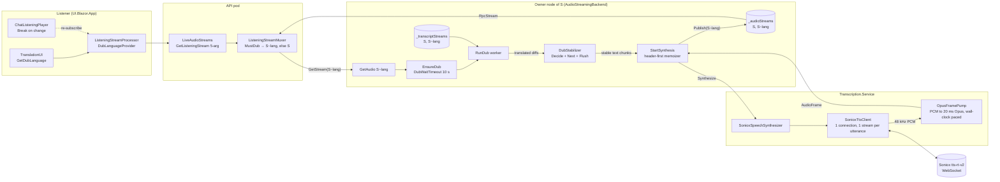

# 12 — Voice dubbing

A listener with **Translated voice** on hears, in a live session, every
speaker of another language dubbed into the listener's translation
language by a stock Soniox TTS voice. The dub is a derived audio stream
that rides the fan-out described in [doc 06](./06-server-fanout-and-replay.md):
no new stream type crosses the wire, the listening muxer just asks for a
different stream id.

This doc covers the server-side dub pipeline, the muxer substitution for
live listening, dubbing of replayed (historical) playback, and the
client settings that request both. See [Not yet](#not-yet) for what is
deliberately missing.

## Stream ids: `S` and `S~lang`

A live audio stream `S` already has a transcript stream under the same id
and a translated transcript under `S~lang` (`StreamId.Language`, delimiter
`~`, file: `src/dotnet/Api/Identifiers/StreamId.cs`). `GetTranscript(S~lang)`
starts the translation lazily on first request. Dubbing reuses the same
key: `GetAudio(S~lang)` starts the dub lazily and publishes it into the
same `StreamStore<AudioFrame>` as `S`, on the node that owns `S`. Every
dub-related lookup goes through `BaseStreamId`, which strips the language
suffix, so the chat id, author id and expiry of `S~lang` are those of `S`.

## Data flow



## Synthesis — `ISpeechSynthesizer`

File: `src/dotnet/Transcription.Contracts/ISpeechSynthesizer.cs`.

```csharp
Task Synthesize(string streamId, ChannelReader<string> text,
    SpeechSynthesisOptions options, ChannelWriter<AudioFrame> output,
    CancellationToken cancellationToken = default);
```

Text chunks in, 20 ms Opus `AudioFrame`s (48 kHz mono) out, emitted at
wall-clock pace with contiguous offsets from zero; a gap between chunks
comes out as silence. `SpeechSynthesisOptions(Language, VoiceId)` — the
voice defaults to `TranscriptionSettings.SonioxTtsVoice` (`"Adrian"`)
when `VoiceId` is null or empty; see [Voice](#voice) for where a
non-default one comes from. The interface also carries the two
preview-only members `ListVoices` and `SynthesizeMp3` described there.

Two implementations, both in `src/dotnet/Transcription.Service/Synthesis/`,
registered by `TranscriptionServiceModule`: `FakeSpeechSynthesizer` when
`UseFakeTranscriber` is set (one silent frame per four characters, so
tests get real pacing), otherwise `SonioxSpeechSynthesizer` — only when
`CoreSettings:SonioxKey` is configured. With neither, `EnsureDub` sees no
synthesizer and serves the original.

### `SonioxTtsClient` — one connection and one stream per utterance

File: `src/dotnet/Transcription.Service/Transcribers/SonioxTtsClient.cs`.

`SonioxSpeechSynthesizer` composes the client and the pump with
`TranscriberHelper.WhenPushAndRead`, the same push/read pairing the
transcribers use. One `Run` opens one `wss://tts-rt.soniox.com/tts-websocket`
connection, lazily on the first chunk, and keeps it for the whole
utterance; a reader task per connection demultiplexes responses (base64
PCM goes to the pump's channel as it comes, see
[TTS transport](#tts-transport-pcm-live-opus-on-replay); `terminated` and
`error_code` complete the stream they name — audio messages carry no
`stream_id`, so they go to the one open stream). A stream is opened with
the config (`tts-rt-v2`, `pcm_s16le`, 48 000 Hz, the language, the
voice and a fresh `stream_id`) on the first chunk, and every further chunk is sent at once as
`{ text, text_end: false }` — with a trailing space appended when the
chunk doesn't end in whitespace, since chunks are transcript increments
that may stop right before the next word and Soniox tokenizes on
whitespace. Soniox speaks clause-complete text at once and holds a
mid-clause fragment until more text or `text_end` (lookahead for
prosody), so one stream per utterance is what keeps sentence-final
intonation and the ~1–1.5 s inter-fragment gaps of the old
chunk-per-stream model out of the dub — and `DubStabilizer` only hands
the client text that ends at a clause boundary, so nothing is held (see
[`DubStabilizer`](#dubstabilizer)). The stream normally ends with the
translation: `RunDub` flushes the last fragment when the translation is
complete and closes the text channel, and the client sends
`{ text: "", text_end: true }` (accepted, verified live), reads until
`terminated`, then closes the socket normally.

Two things force a stream to end early, both at a chunk boundary and both
followed by a new stream on the same connection for the next chunk:

- **Idle rollover** — no new chunk for
  `Constants.Transcription.Soniox.TtsIdleFlush` (2.5 s). Soniox kills a
  stream after ~3–4 s without output (`408 Stream killed: output audio
  rate below minimum`) and loses the text it hasn't synthesized, so the
  client ends the stream first; any text held for lookahead gets spoken
  by the `text_end`. With clause-complete chunks this is a safety net —
  it fires during a long pause in the speech, when Soniox has already
  spoken everything it was sent — rather than what gets a fragment
  spoken, which is what it was before the stabilizer cut at boundaries
  (a mid-sentence first chunk then sat for the whole 2.5 s).
- **Duration rollover** — a stream older than
  `Constants.Transcription.Soniox.TtsStreamRollover` (100 s). Soniox caps
  a stream at 2 min (not raisable) while an utterance runs to
  `Chat.MaxEntryDuration` (3 min).

Errors: a stream `error_code` is logged at Warning and treated as the end
of that stream; on a 408 the chunks sent since the last audio message
(the cheap approximation of what was never spoken) are re-sent on the
next stream, once — a re-sent chunk is never re-sent again. A connection
that dies under a stream is reconnected once per run (the dead stream's
unspoken chunks move to the new one); a second loss fails the run. A
connection Soniox closed between streams is simply replaced before the
next stream opens. `TtsChunkTimeout` (30 s) bounds how long an open
stream may go without any message from Soniox. Measured live: a
connection stays open for at least 20 s with no stream on it, streams
reuse the connection (the client caps it at 5 per connection, Soniox's
documented limit), first audio arrives ~0.3–0.7 s after the first chunk
when that chunk ends a clause or a second chunk follows at once (PCM; it
was 2.5 s with Opus), and ~2.8 s (idle flush + ~0.3 s) for a lone
mid-clause fragment — the case the stabilizer's boundary rule removes
(2026-09-16: a 46-char complete sentence → 0.3 s; a 34-char fragment →
4.0 s, held until the idle flush).

The stream lifecycle is logged at Debug, one line per event, all
prefixed `Soniox TTS #{StreamId}:` — `opened, stream N of 5 on its
connection`; `sent|resent N chars, clause-complete|mid-clause` (a
`mid-clause` line names a chunk Soniox will hold); `first audio +X.Xs
after the first chunk`; `ending (Final|Idle|Rollover) X.Xs after it
opened`; `terminated X.Xs after it opened`, or the Warning `ended with
error 408 (…)` — so a live run's `tts first audio` reading explains
itself from the log.

### `OpusFramePump` — PCM to paced frames

File: `src/dotnet/Transcription.Service/Synthesis/OpusFramePump.cs`.

Encodes 48 kHz mono PCM with OpusSharp (`OPUS_APPLICATION_VOIP`,
`Constants.Audio.Bitrate` = 32 kbps, VBR, voice signal) into
`FrameLength` = 960-sample (20 ms, `Constants.Audio.OpusFrameDurationMs`)
frames. The loop drains whatever PCM is queued, takes one frame's worth
— or, when the buffer is short, encodes a frame of silence — and writes
frame `i` (offset `20 ms × i`) no earlier than `startedAt + 20 ms × (i + 1)`,
the end of its slot, so frame `Offset`s are contiguous from 0 and the
stream advances at real time regardless of how bursty Soniox's output is. Once the input completes, a
partial tail frame is zero-padded and the loop ends. PCM arrives as byte
chunks that need not be sample-aligned: a lone trailing byte waits for
the next chunk to pair up with, unless it is the last byte of the stream.
The pump serves every PCM producer: `SonioxTtsClient.Run` (the live
path, paced) and `FakeSpeechSynthesizer`, plus the PCM overload of
`SpeechSynthesizerExt.ToAudioSource` (unpaced).

### TTS transport: PCM live, Opus on replay

The live WebSocket path takes PCM: `SonioxTtsClient.Run` asks Soniox for
`audio_format: "pcm_s16le"` at 48 000 Hz, and every base64 `audio`
message goes straight to the `OpusFramePump` the synthesizer pairs it
with — one Opus encode per dub on the server, ~96 KB/s per dub from
Soniox. The reason is the first frame: Soniox emits Opus as Ogg pages of
one second of audio each, so the first frame of every stream landed ~1 s
later than PCM's ~256 ms chunks do (measured live, two sentences: first
frame 0.7 s after `Run` started and 0.3 s after the first text was sent,
against 2.5 s with Opus). The upcoming voice-over mixer needs PCM anyway
(decoded original + TTS PCM → one encode), so the bandwidth is spent
either way.

The REST path (`Generate`, replay dubs) keeps Opus: `audio_format:
"opus"` with `bitrate: 32000` = `Constants.Audio.Bitrate`, what every
other Opus stream here uses (Soniox's default is ~80 kbps), so a replay
dub never round-trips through PCM — ~4 KB/s on the wire instead of
96 KB/s, and no encoder on the server; the first-frame delay doesn't
matter there, nothing plays while it's made. What comes back is an
Ogg/Opus container — `OggS` pages, `OpusHead` (`PreSkip` = 312) and
`OpusTags` on the first two pages, then one Opus packet per 20 ms frame
(TOC config 31 = CELT fullband 20 ms, code 0), one page per second of
audio (50 packets), `EndOfStream` on the last page.

`OggOpusReader` (`src/dotnet/Api/Audio/Ogg/OggOpusReader.cs`, next to
the writer) is the incremental parser: `Append` any byte chunk, `TryRead`
frames. It finds the capture pattern, verifies each page's CRC
(`OggCRC32`, a mismatch is a `StandardError.Format`), reassembles
packets across 255-lacing values and page boundaries, takes `Head`
(`PreSkip`, channels) from the first packet, skips `OpusTags`, and
yields every further packet as an `AudioFrame` at `20 ms × index`.
`GetPacketDuration` reads the TOC (RFC 6716: config → 2.5/5/10/20/40/60
ms, code → frames per packet); a packet that is not one 20 ms frame is
rejected with a clear error, because `WebMStreamConverter` and every
player assume the fixed 20 ms step. A `BeginOfStream` page resets the
header state and keeps the frame counter, so concatenated logical
streams (a multi-part REST response) read as one. `GranulePosition` is
the last page's granule (48 kHz samples incl. pre-skip); Soniox trims
its encoder delay off the end, so it sits under one frame short of
`PreSkip + frames × 960`, which the fixture test checks. The same reader
backs `OggOpusStreamConverter.FromByteStream` (format
`AudioSource.DefaultFormat with { PreSkip = head.PreSkip }`, mono
required), and `AudioSource.ReadFromByteStream` now sniffs `OggS` next
to WebM and `A_OPUS_S`.

In `Generate` every REST part gets its own reader — each part is a
complete Ogg stream with its own headers — while frame offsets come from
one counter, so they stay contiguous across parts. `Generate` checks
that each part's reader holds no partial page at the end of the body and
fails the one-shot otherwise.

### `VoiceOverMixer` — ducking the original under the dub

File: `src/dotnet/Core.Server/Audio/VoiceOverMixer.cs`. Pure; a building
block for a future voice-over mode that plays the dub *over* the
original rather than substituting for it — not wired into the pipeline
yet.

Frame by frame (`FrameLength` = `Constants.Audio.PcmFrameLength`, 960
samples at 48 kHz), `Mix` sums the buffered dub PCM onto the original
and ducks the original's gain while the dub speaks: `VoiceOverDuckGain`
(0.25) is the original's gain floor, reached and left by a linear ramp
over `VoiceOverDuckRamp` (50 ms) so the level change isn't audible as a
click. `IsDubSpeaking` — and so the duck — stays true for
`VoiceOverDuckHold` (1 s) after the last buffered dub sample, so a gap
between TTS chunks doesn't pump the original up and down; a caller can
also force the duck via `isDubSpeakingElsewhere`, for a dub whose speech
this mixer instance doesn't itself receive as PCM.

## The dub worker — `AudioStreamingBackend.Dubbing.cs`

File: `src/dotnet/Streaming.Service/Backend/AudioStreamingBackend.Dubbing.cs`
(the `GetAudio` hook, `GetOrStartTranslation` and the author map are in
`AudioStreamingBackend.cs`).

### `GetAudio(S~lang)` → `EnsureDub`

When the requested id carries a language and `_audioStreams` has no such
stream, `GetAudio` calls `EnsureDub` before the normal lookup. `EnsureDub`
adds a `DubEntry` (a `FuncWorker` running `RunDub` + a `WhenDecided` task)
to `_dubs` once per dub id, starts it, and waits for the decision with
`Constants.Audio.DubWaitTimeout` (10 s). `true` means the dub stream is
published and the lookup proceeds; `false` (decided "no dub", failed, or
timed out — logged as a warning) makes `GetAudio` return `null`, which is
the muxer's cue to serve the original. The worker itself keeps running
past the timeout: a slow-to-decide dub can still be picked up by a later
request.

Two cool-downs make `EnsureDub` answer `false` at once, so the muxer
serves the original without the hold:

- a timed-out decision cools the `(authorId, language)` key down for
  `Constants.Audio.DubCooldown` (30 s), logged once per cool-down;
- a synthesis failure marks the synthesizer down for every dub for
  `Constants.Audio.DubSynthesizerDownDelay` (60 s) — a Soniox outage
  costs one warning per utterance, not a hold plus a failure each.

A dub that is already published is served regardless: the cool-down only
skips the wait.

### `RunDub`

1. **Wait for the source transcript.** The source transcript is published
   on the first non-empty STT result, which can trail the audio by more
   than the store's `ShareWaitDelay`, so `WaitForSourceTranscript` keeps
   re-asking `_transcriptStreams` for as long as the source audio is still
   running. The wait ends one `ShareWaitDelay` pass after the source audio
   has ended without one (a short or silent utterance): STT itself trails
   the audio, so a transcript that lands just after the audio's end must
   still get a chance, not zero. If that one extra pass also misses, the
   dub decides "no dub" at once instead of holding the listener for
   `DubWaitTimeout`. A miss is not a decision: the worker removes its own
   entry from `_dubs` so the next `GetAudio` retries instead of inheriting
   it.
2. **Start or join the translation** with `GetOrStartTranslation(S~lang)`
   — the same code `GetTranscript` uses, so a listener with captions on
   and one with dubbing on share one `TranslationsBackend_TranslateStream`.
   `ProcessAudio` creates the text entry the translation is keyed by
   ~100 ms *after* it publishes the transcript, so the dub's first request
   usually lands in that window: `GetOrStartTranslation` releases its
   `_translatingStreams` latch when the command starts nothing (or nothing
   gets published within `ShareWaitDelay`), and `WaitForTranslation`
   retries every `Constants.Audio.DubTranslationRetryDelay` (250 ms) for as
   long as the source transcript is live. A latch that outlived the miss
   used to make every later caller — the caption reader included — wait
   for a stream nobody published. The wait runs as a task: the worker
   does not block on it, because the source alone usually decides first.
3. **Decide on the source.** Concurrently with that wait, `DecideOnSource`
   replays the source transcript and calls
   `DubStabilizer.Decide(source, Transcript.Empty, language)` after each
   diff — the source-only form, which answers as soon as the source
   carries a language and ≥ 10 chars of text, stable or not. `NoDub` ends the worker (logged "already in
   {Language}"), the translation wait cancelled; `Dub` calls
   `StartSynthesis` at once, so the TTS connect overlaps the translator's
   first output. Measured before this: `decided +3.2 … 7.7 s` after the
   request, because the decision sat inside the translated loop and, with
   a configured chat language (Soniox then ran without language
   identification and tagged no token), needed 10 chars of *stable*
   translated text. A source that reaches 10 chars with no language at all (a
   transcriber that tags none) leaves the decision `Undecided` right
   away rather than holding the dub until the source ends, and step 4
   decides it. If the translation then turns out to be missing after a
   `Dub`, the text channel is completed with an error so `StartSynthesis`
   ends "without speech" and the muxer falls back to the original.
4. **Feed.** The worker awaits the translation and folds every translated
   diff into the running `Transcript`. While still undecided it calls
   `DubStabilizer.Decide(Fold(source), translated, language)` — the
   translated-text heuristic — with the same `NoDub`/`Dub` handling as
   step 3. Once dubbing, each `DubStabilizer.Next(translated)` chunk —
   the new stable text up to its last clause boundary — is written to
   the text channel, and once the read ends `DubStabilizer.Flush()` hands
   over the fragment held after that boundary as the last chunk (logged
   `speaking chunk #N (… chars, the tail)`). A stream that ends
   `Undecided` is logged "too short to decide" and not dubbed. A `Dub`
   that spoke nothing at all (and had no backlog to skip) fails the text
   channel with "no stable text to speak", so the muxer falls back to the
   original instead of serving a header-only track; this is judged after
   the flush, so a translation whose only stable text was a fragment
   still counts as spoken.
   **Late listener.** If, when the dub was requested, the source
   transcript already covered more than `Constants.Audio.DubBacklogThreshold`
   (5 s) of audio, the listener joined mid-utterance: the first translated
   transcript the dub sees — the translation of everything said so far —
   is handed to `DubStabilizer.Skip`, so only what is said after that
   point is spoken rather than the whole backlog read out first. This is
   the first transcript whichever step decided the dub; `isLate` itself
   is measured at the request, before either.
   **End.** The translated stream stays open until the entry is finalized,
   which waits for the re-transcription; the dub reads it only until the
   source transcript has ended *and* the whole of it is translated
   (`ReadTranslation`): the translated transcript is stable and its time map
   reaches the source's end — the translator scales each increment's time
   map from the source's, so the ends line up. A stable diff alone is not
   enough: with progressive finals one lands while the last increment is
   still with the translator. The check is re-asked once the source has
   actually ended, since the source can grow after the translation last
   caught up with it. Nothing more is spoken after that, and the author's
   next dub is chained behind this one.
5. `finally`: the decision defaults to `false`, the text channel is
   completed (with the error, if any), the translation wait is cancelled
   and awaited, and the synthesis task is awaited.

### `DubStabilizer`

File: `src/dotnet/Streaming.Service/Audio/DubStabilizer.cs`. Pure; depends
only on `Transcript`.

`Next(translated)` returns the text the TTS may speak now, or `null`. It
ignores unstable transcripts (`!IsStable`), then returns what extends
`SentText` **up to and including the last clause boundary** in it; the
fragment after that boundary waits for the next call. A clause boundary
is one of `. ! ? … , ; :` followed by whitespace or the end of the text
(so the dot in `3.5` or the colon in `10:30` is not), or one of the
fullwidth `。！？，；：`, which are never followed by a space (the
`ClauseEndRegex` `[GeneratedRegex]`). If the stable text no longer
starts with `SentText` — the translator revised something already spoken
— the chunk restarts from the common prefix, i.e. the divergent tail is
re-spoken; there is no way to un-say audio. Whitespace-only chunks are
skipped. `Skip(translated)` sets `SentText` without speaking, for the
late-listener case above. `Flush()` returns everything unsent of the
last stable text regardless of boundaries; `RunDub` calls it once the
translation read ends.

Why the boundary: Soniox `tts-rt-v2` speaks clause-complete text at
once but holds a mid-clause fragment until more text or `text_end`.
Measured on the PCM build (2026-09-16): a first chunk that was a
complete 46-char sentence → `tts first audio 0.3 s`; a 34-char
mid-sentence fragment (the first chunk of an 11 s utterance) → held by
Soniox until the client's `TtsIdleFlush` (2.5 s) ended the stream,
`tts first audio 4.0 s`, first word 7.8 s behind the speech. Ending the
stream per chunk isn't the fix (0.2–0.8 s to reopen, and choppy
prosody); sending only text Soniox will speak is. The cost is that a
clause's own tail waits for the next boundary, i.e. for the speaker to
finish the clause — which is when it could be spoken anyway. Two
guards: a run of more than `MaxUnpunctuatedLength` (120) chars after the
last boundary is sent whole — a long unpunctuated stretch (a list, a
transcriber that punctuates little) must not sit forever — and the
end-of-translation `Flush()`.

Stability reaches the dub through the translated diffs:
`TranslationsBackend.TranslateTranscriptStream` writes every diff off a
transcript that carries `IsStable`, and promotes the stable prefix even
when the newly stable text is unchanged — an empty diff with
`IsStable = true` folds to a stable transcript on the reader side. Before
that, no translated diff on the wire was ever stable and a dub had
nothing it could speak.

Where the stability comes from: Soniox streams `is_final` tokens
progressively (3–5 s behind the tail, and immediately at every pause with
endpoint detection on), and `SonioxTranscriptBuilder.Update` turns each
message that brings new finals into a stable finals-only transcript
followed, if there is a tail, by the unstable finals+tail one
(`src/dotnet/Transcription.Service/Transcribers/SonioxTranscriptBuilder.cs`).
Waiting for `is_final` alone put the first dubbed chunk 6–9 s behind the
speaker, past the muxer's hold, so the builder also **promotes by age**:
the leading non-final tokens that ended more than
`Constants.Transcription.Soniox.StableTokenAge` (1.5 s) before the
message's `total_audio_proc_ms` are appended to the finals as if they were
final — Soniox practically never revises a tail token older than ~1 s. A
promoted span is settled: the tail Soniox re-sends on every message and
the eventual `is_final` tokens for that span are dropped (any token
starting before the promoted end), so nothing is appended twice, and a
late revision of a promoted word is lost — offline re-transcription
fixes the stored text afterwards. A token straddling the age boundary
stays in the tail. This applies everywhere the transcript goes (captions,
stored text, translation, dub), not only to the dub.
The throttle passes stable transcripts through untouched, the translator
promotes per increment, and the dub speaks per increment — one TTS request
per stable phrase. Deepgram and Google mark their final results stable
the same way. Manual `finalize` is not used: endpoints give the phrase
granularity and forcing finals early degrades accuracy.

`Decide(source, translated, target)`:

| Condition | Result |
|---|---|
| Source transcript carries `Languages` and ≥ 10 chars of text | `NoDub` if any of them matches `target` by ISO code, else `Dub` |
| Otherwise, translated transcript not yet stable | `Undecided` |
| Normalized translated text < 10 chars | `Undecided` |
| Normalized source text starts with normalized translated text | `NoDub` |
| Else | `Dub` |

The first row is the one that decides in practice, and `RunDub` asks it
on the source alone (`translated = Transcript.Empty`, which falls through
the other rows as `Undecided`) before any translated text exists. The
source languages come from the transcriber, and are the languages it
*heard*: Soniox tags tokens only with `enable_language_identification`
on, so both Soniox transcribers send it unconditionally — the chat
language goes out as a `language_hints` nudge, not as a stamp — and
`SonioxTranscriptBuilder` collects the tags. A Russian message in an
English chat is therefore `[ru]`: translated for the readers, dubbed for
the English listeners, `NoDub` for a Russian one; and the entry's stored
`ChatEntryLanguage` reflects the speech. Google stamps its `LanguageCode`;
Deepgram in configured mode stamps nothing. They ride on the diffs:
`TranscriptDiff.Languages` (null = unchanged) is what lets the folded
source transcript carry them — a text diff alone never did, and the first
row was dead on the real path.

The last two rows are the verbatim-translation heuristic, the fallback
for a source that names no language: the translator hands the source
back unchanged when nothing needs translating. "Normalized" = whitespace
collapsed, trimmed, lower-cased.

### `StartSynthesis` and the per-voice chain

`StartSynthesis` builds the dub stream **header-first**: an
`ActualOpusStreamHeader(ServerClock.Now, AudioSource.DefaultFormat)` frame
at `Offset = -1 ms` prepended to the frame channel, memoized, and
published into `_audioStreams` under `S~lang` — that publish is what
`WhenDecided = true` means, so the muxer's `GetStream(S~lang)` can
succeed seconds before the first audio frame exists. If the id is already
published the memoizer is disposed and the call throws.

The synthesis runs as a background task. Before calling
`ISpeechSynthesizer.Synthesize` it awaits the previous dub of the same
`(authorId, language)` — `ChainDub` swaps `_dubChains[$"{authorId}~{lang}"]`
atomically, the author coming from `_authorIdByStream`, filled by
`ProcessAudio` via `RememberAuthorId` — and then reads the speaker's
voice once (`GetSpeakerVoice` → `SpeakerVoices`, [Voice](#voice)); a
lookup failure is logged and falls back to the default voice rather than
failing the dub. A dub outlives its source by the
translation lag plus the spoken length, so without the chain an author's
next utterance would talk over their still-draining previous one.

A synthesis failure completes the frame channel with the error (the
muxer falls back to the original, see below), marks the synthesizer down
for `DubSynthesizerDownDelay`, and is logged once as a warning. A failure
that arrives through the text channel — the translation errored, or the
language said "dub" but no stable translation ever came, so nothing was
spoken — ends the dub the same way for the muxer but does not touch the
synthesizer-down flag: only the provider's own failures cool every dub
down. The late-listener case is the exception: a dub that skipped its
backlog may legitimately have nothing left to say.

### Lifetime

`_transcriptStreams` expires entries after
`AudioSettings.StreamExpirationDelay` (60 s); its `OnStreamExpire` calls
`ForgetDubs`, which only drops the `_dubs` entries whose base id matches
— the worker ends on its own, since the transcript expires 60 s after it
completes while its dub may still be draining — and `ForgetChatIdIfUnused`,
which drops the chat/author maps once neither store holds the base
stream. The dub's own audio memoizer expires like any published stream,
`StreamExpirationDelay` after it completes.

The dub is **not** registered in `LiveAudioBackend` and **not** persisted:
the registry's records carry `DubLanguage = null`, no blob and no
`ChatEntry` field exist for it, and replay never sees it — a replay dub
is a separate, independently stored `Media`, made on demand; see
[Replay](#replay).

### Latency trace

A live utterance can end with up to two `Information` lines that say how
far behind the speech each stage ran, so the next optimization can be
aimed at the biggest number rather than guessed. The transcript line only
appears once a transcript carries non-empty text; the dub line only once
a dub was actually started — a `NoDub` decision still records
`streaming.dub.decision_delay`, but logs nothing:

```
Transcript latency #S: first text +1.1s at 0.6s of speech; text lag p50 0.9s max 1.4s (n=42); stable lag p50 3.2s max 5.1s (n=9)
Dub latency #S~en: decided +0.4s; requested at 0.6s of speech; translated lag p50 3.9s max 4.6s (n=8); spoken lag p50 4.1s max 4.8s (n=5); tts opened +0.3s after the first chunk; tts first audio p50 1.6s max 1.6s (n=1); first word 5.8s behind speech; voice stock
```

A *lag* is `ServerClock.Now − (recordedAt + TimeRange.End)`: the text's
own time map says which second of speech it covers, and `recordedAt` is
the source's server-synced capture moment (`AudioSource.CreatedAt`,
remembered per stream like the author id), so no stage needs a stamp
from another node. Every lag uses the source's raw client-reported
`recordedAt` as-is, so a source whose clock is skewed shifts every lag of
that stream by its delta; `ProcessAudio` logs that delta per stream
(`ProcessAudio: … delta=…ms`) for correlation. `TranscriptLatencyTrace`
(`src/dotnet/Streaming.Service/Audio/TranscriptLatencyTrace.cs`) observes
the transcript pipeline in `ProcessAudio` before it is memoized, so every
lag is stamped on arrival rather than at stream end — `text` is every
unstable transcript, `stable` every `IsStable` one (Soniox finals or the
`StableTokenAge` promotion, now 1.5 s instead of 2.5 s — the `stable`
p50 should drop by about a second); both are read after the 0.2 s
`Constants.Transcription.ThrottlePeriod` pacing, so every `text` lag
already carries up to that much of it. `DubLatencyTrace`
(`.../DubLatencyTrace.cs`) sits in `RunDub`: `requested at` is the
source's speech position when the dub was requested, `translated` is
every stable translated diff, `spoken` every chunk handed to the TTS
channel, `tts opened` is the wait from that first spoken chunk to the
first text actually sent on a TTS stream — `StartSynthesis` drains the
speaker's previous dub, resolves the voice and opens the WebSocket before
sending anything, and that wait is otherwise invisible — `tts first
audio` is first-text-sent → first-frame per TTS stream (reported by the
client through `ISpeechSynthesisListener` on
`SpeechSynthesisOptions.Listener`; `OnAudioStarted` fires on the PCM
chunk that completes a stream's first 20 ms frame — 1920 bytes,
`OpusFramePump.FrameByteLength` — not on Soniox's first `audio` message,
which may be shorter than a frame and encode to nothing yet). A stream Soniox kills before any
audio folds its open time into the replacement stream's sample instead of
being lost, so a resend still produces one `tts first audio` reading that
covers the whole outage. Expect `tts first audio` at ~0.3–0.7 s now that
every chunk ends at a clause boundary; a reading near 2.5–4 s means a
fragment reached Soniox and sat until the idle flush — check the
`Soniox TTS #…: sent … mid-clause` debug line and the stabilizer.
`first word` is the first stream's first audio
behind the speech the first chunk covered — the number a listener feels.
`voice` closes the line: the Soniox voice id the dub spoke with (a clone,
see [Own voice](#own-voice-cloning)) or `stock` when the speaker got the
stock voice, whether by choice or by fallback — the only place the Ready
path says which one it was. The same values go to the `App` meter as `streaming.transcript.lag{kind}`,
`streaming.dub.lag{stage}`, `streaming.dub.tts_open_delay`,
`streaming.dub.tts_first_audio` and `streaming.dub.decision_delay`
(seconds).

Not traced yet: the fan-out leg (dub frame published on the owner node →
served by `ListeningStreamMuxer` on the API pod) and the client leg
(served → audible); both ride the same `RpcStream` path as the original
audio, and a live-header diag row would be the place to show them.

## Muxer substitution — `ListeningStreamMuxer`

File: `src/dotnet/Streaming.Service/Services/ListeningStreamMuxer.cs`.

`ILiveAudioStreams.GetListeningStream` gained a 5-argument overload with
`Language? dubLanguage` (`src/dotnet/Api.Contracts/Streaming/ILiveAudioStreams.cs`);
the 4-argument one stays for older clients and forwards `null`.
`LiveAudioStreams` validates the language, canonicalizes it and passes it
into the muxer's constructor.

- **Validation.** A dub is a TTS stream per (source stream, language), so
  `LiveAudioStreams` serves one only in a language the listener reads or
  hears the chat in: the spoken languages of `UserLanguageSettings`, the
  chat's `ChatUserSettings.TranslationTargetLanguage` or its `Language`,
  matched by ISO code and read off `UserSettingsUI(session)` (a thread
  uses its outermost parent's settings, as `TranslationUI` does). The
  listening stream treats a mismatch as no dub (logged as a warning); a
  direct `GetStream("S~lang")` returns `null`. The language is then
  folded onto its canonical variant by `Languages.GetCanonical` — the
  `Languages.All` entry with the same ISO code that carries
  `LanguageSupport.UI`, else the first match — so `en-GB` and `en-US`
  listeners share one translation and one TTS stream. `IsTextOnly`
  compares the base stream id, so a dub of a JustText author is refused
  like the author's own stream is.
- **`MustDub(streamInfo, dubLanguage)`** decides per stream when its
  registry entry is first seen: dub only if a language was requested, the
  speaker's `LiveAudioStreamInfo.Languages` is non-empty, and none of them
  matches the listener's language by ISO code (`MaySpeak`). `Languages` is
  filled in `ProcessAudio`: the chat language if the chat has one, else
  the speaker's spoken languages from `UserLanguageSettings.ListSpoken()`
  — and left empty when the speaker isn't transcribed (JustVoice), since
  there is nothing to translate. An empty list means "never dub".
- **Stale backlog streams.** Before starting a dubbed entry the scanner
  checks whether a strictly fresher stream of the same author is listed
  or being processed; if so the entry is excluded outright, the way a
  merge loser is. A recorder reconnect flushing several streams would
  otherwise start a dub of each, and they would play in full, serialized,
  before the live one.
- **`GetStream`** for a dubbed entry asks `LiveAudioStreams.GetStream`
  for `S~lang` (the id carries the owner's `NodeRef`, so the request
  reaches the owner node's `GetAudio` locally or through
  `RemoteAudioStreamCache` exactly like `S`). `null` — no synthesizer,
  `NoDub`, a cool-down, or the 10 s wait ran out — falls back to `S`, and
  so does a request that throws (the source is remembered in
  `_undubbedStreamIds`). A successful dub returns the **source's** info
  `with { DubLanguage }`; nothing else in the start item changes.
- **Dub failure mid-relay.** When a dub track errors after its start item
  was emitted, the end item is emitted, the source goes into
  `_undubbedStreamIds`, and the same entry is retried at once with the
  original from the live edge (a fresh entry with a new index, marked
  resumed). The source's own retry counters are never touched by a dub
  failure, so a TTS outage cannot exclude a speaker.
- **Header held, timestamps re-stamped.** The dub's first frame is the
  header, published long before any audio. `ProcessStream` holds it, and
  when the first data frame arrives stamps `BeginsAt = SourceBeginsAt =
  ServerClock.Now − frame.Offset` on the start info (`StampDubStart`),
  emits `MuxedAudioStreamStart`, then the held header, then the frame. So
  the start item's time is the dub's timeline origin: for a listener
  joining at the start it is when dubbed audio actually started, and for
  one joining mid-dub (`SkipToLive`, first frame at a non-zero offset)
  `BeginsAt + Offset` is still now.
- **Merge exemption.** `TryRegister` runs after `GetStream` and skips the
  per-author merge for dub start infos: the author's next original
  utterance must not evict a dub that is still draining, and the backend
  chain above already serialises one voice. A dubbed entry that fell back
  to the original merges as usual.

## Client — requesting a dub language

- **Settings.** `UserLanguageSettings.IsTranslatedVoiceEnabled` (user
  level, the toggle under "Translated voice" in
  `Components/Settings/TranscriptionSettings.razor`) and
  `ChatUserSettings.IsTranslatedVoiceEnabled` (per chat, `bool?`, `null`
  = follow the user-level setting). The whole Translated Voice section —
  the toggle, the own-voice tiles and the stock-voice picker — is
  rendered only when `Features.IsIncompleteUIEnabled`
  (`Model.ShowTranslatedVoice`; the voice catalog and own-voice status
  RPCs are skipped otherwise), so until the Soniox TTS quota is settled
  nobody else can turn dubbing on; the own-voice tiles additionally need
  `account.IsAdmin`. The server side is ungated: a flag that is already
  on keeps working.
- **`TranslationUI.GetDubLanguage(chatId)`**
  (`Services/TranslationUI/TranslationUI.cs`, compute method): `null`
  unless translation is enabled for the chat and the effective flag —
  the per-chat override if set, else the user-level one — is on; then the
  chat's translation language (`GetTranslationLanguage`).
- **Listening.** `ChatListeningPlayer` gives `ListeningStreamProcessor` a
  `DubLanguageProvider` that calls `GetDubLanguage`; the processor's
  `ResilientStream` provider re-reads it on every (re)connect and passes
  it to the 5-arg `GetListeningStream`. `ChatListeningPlayer` also watches
  the computed `GetDubLanguage` and calls `streamProcessor.Break()` when
  the value changes, so a toggle mid-session re-subscribes with the new
  language (a dub already running at that moment is served from its live
  edge, like any pre-existing stream).
- **Per-chat chip.** `LiveConversationHeaderView.razor` shows a
  translated-voice chip only while the conversation is live, translation
  is on for the chat and the user-level flag is on; it reflects
  `GetDubLanguage != null`. Clicking the chip while it is on writes the
  per-chat override `false` (`TranslationUI.SetTranslatedVoice`); clicking
  it while it is off writes `null`, i.e. back to inheriting the user-level
  setting.

## Voice

Which stock voice a dub speaks in is the **speaker's** choice, not the
listener's: a dub is one TTS stream per (utterance, language) shared by
every listener, so there is exactly one voice per speaker to pick.

- **Setting.** `UserLanguageSettings.DubVoice` (key 7, `string`; the
  getter coalesces the `null` an older blob reads as). `""` means *the
  default*, and the default is the first voice suggested for the
  speaker's languages (below) — not a fixed id, so it follows a language
  change; `TranscriptionSettings.SonioxTtsVoice` is reached only when the
  catalog is empty. The tile "My voice in translations" under the
  Translated Voice toggle in `Components/Settings/TranscriptionSettings.razor`
  shows the chosen id, or the resolved default as "Adrian (default)"
  (`Transcription_DubVoiceDefault_Format`; plain "Default" when there is
  no catalog), and opens `Components/DubVoiceModal/DubVoiceModal.razor`:
  a `SearchBox` (free text over id, description, gender, accent, use
  case and style, case-insensitive; every word must match some facet, so
  "female calm" narrows rather than widens; while a query is typed the
  sections give way to the filtered catalog), a **Suggested** section
  (`ITranslations.ListSuggestedDubVoices`, the first row carrying a
  "Default" chip), and below it the collapsed **All voices** section
  (`Collapsed`) with gender and accent filters over the whole catalog. A
  row shows id, gender and accent, the provider's description and style
  tokens, and a preview button; the effective voice — the chosen one, or
  the default when nothing is chosen — is selected wherever it appears.
  Selecting the default row stores `""`, any other row stores its id
  (`LanguageUI.UpdateSettings`).
- **Suggestions.** `DubVoiceAccents` (`src/dotnet/Api/Chat/`) maps a
  spoken language to a catalog accent — the regional tag first (`es-MX`,
  `es-US` → `latin_american`; `pt-BR` → `brazilian`; `en-IN` → `indian`;
  `en-GB` → `british`), then the ISO code (`ru uk pl cs bg hr sr bs cnr`
  → `slavic`, `es` → `spanish`, `pt` → `portuguese`, `hi mr pa ta ur` →
  `indian`, `ja`, `ko`, `zh`, `fr`, `de`, `it`, `id ms th vi tl fil` →
  `southeast_asian`), anything else → `american`. `Suggest` walks the
  user's `UserLanguageSettings.ListSpoken()` (primary, secondary,
  tertiary): for each accent it takes that accent's voices, conversational
  `use_case` first, interleaving male and female in catalog order, up to
  4 per gender and 8 in total, never repeating a voice; if the languages
  alone yield fewer than 4, `american` voices pad it by the same rule.
  `Translations.ListSuggestedDubVoices(session)` (compute method,
  `MinCacheDuration` 60 s) applies it to `ListDubVoices` and the user's
  settings, so a language change re-suggests — and, since the default
  voice is the first suggestion, re-voices a speaker who never picked one.
  `DubVoiceAccentsTest` (`tests/Chat.UnitTests`) pins both rules on a
  hand-made catalog; `FakeSpeechSynthesizer.DefaultVoiceId` ("Adrian") is
  what they resolve to for a test user.
- **Resolving it on the server.** `SpeakerVoices`
  (`src/dotnet/Streaming.Service/Services/SpeakerVoices.cs`): author →
  `IAuthorsBackend.Get(RequestedAuthorKind.Full)` → `UserId` →
  `IServerKvasBackend.ForUser(userId).UserLanguageSettings()`, then
  `DubVoiceAccents.ResolveVoice(settings.DubVoice, catalog,
  settings.ListSpoken())`: the chosen id when
  `ITranslationsBackend.ListDubVoices` lists it — the setting is
  client-written and an id Soniox rejects would otherwise arm the live
  path's synthesizer-down cooldown for every dub on the node (an unlisted
  id is logged at Information) — otherwise the first suggestion for the
  speaker's languages; `null` (the synthesizer's default) for anonymous
  authors, guests, an empty catalog, and any lookup failure. Live dubs read it once per dub start, so a change applies
  from the speaker's next utterance; replay dubs read it per
  `GetOrCreate` and include it in the stored hash, so a change
  regenerates the dub (the superseded media is deleted by
  `TranslationsBackend.OnChange` like any replaced dub).
- **The catalog.** `ISpeechSynthesizer.ListVoices` returns
  `ApiArray<DubVoice>` (`src/dotnet/Api/Chat/DubVoice.cs`: `Id`,
  `Description`, `Gender`, `Age`, `Accent`, `UseCase`, `Style`), sorted
  by gender then id. `SonioxSpeechSynthesizer` pages
  `SonioxClient.ListSharedVoices` over `GET
  /v1/shared-voices?model=tts-rt-v2&limit=100[&cursor=…]` (verified live:
  the page size is `limit`, max 200, and the next page is `cursor` =
  the previous response's `next_page_cursor`; ~200 voices, every one
  speaks every language) and caches the list for an hour; on a fetch
  failure the last good list (or an empty one) is served and the next
  call retries. `FakeSpeechSynthesizer` returns three fixed voices.
  `ITranslationsBackend.ListDubVoices` (compute method, auto-invalidated
  hourly, retried in `ServerConstants.Backend.RetryDelay` while empty)
  fronts it for `ITranslations.ListDubVoices(session)`, which requires an
  active account.
- **Previews.** `ITranslations.GetDubVoicePreview(session, voiceId, language)`
  (compute method, requires an active account like `ListDubVoices`) answers
  the MP3 bytes — `ISpeechSynthesizer.SynthesizeMp3` of the localized
  `Transcription_DubVoicePreviewText` ("Hello! This is how others will
  hear you.") in that language and voice, via Soniox's REST TTS with
  `audio_format: "mp3"` (`SonioxTtsClient.GenerateMp3`). The backend
  compute method `ITranslationsBackend.GetDubVoicePreview` caches a preview
  for a day per (voice, language) — the catalog check runs under
  `Computed.BeginIsolation()` so the hourly catalog invalidation doesn't
  cut that to an hour — and returns `null` for an id that is not in the
  catalog; there is no "bad language" case any more, since `Language` is a
  validated RPC parameter type rather than a raw query string. There is no
  HTTP endpoint: the preview travels over the same RPC connection as the
  rest of the app, and Fusion caches the result on both the server and the
  client, so a warm-up call and the click that follows it share one round
  trip once the client cache is populated. The modal's `DubVoicePreview`
  (`dub-voice-modal.ts`) plays the bytes through one `HTMLAudioElement` via
  a `Blob`/`URL.createObjectURL`, revoking the object URL when playback
  stops or ends, in the user's primary language, stopping any previous
  preview. A cache miss costs ~2 s of synthesis, so the button shows a
  spinner from the click (rendered before the RPC call — a
  `ComputedStateComponent` doesn't re-render after an event on its own)
  until `onplaying` calls back `OnPreviewStarted`, then a stop button
  until `OnPreviewEnded` (also the answer to a load or playback failure);
  a click on the loading row is a no-op, a click on another row replaces
  it. To make the miss rare, `DubVoiceModal` calls `GetDubVoicePreview` as
  a warm-up — the suggested voices when the modal first renders them, and
  a row on `pointerenter` — so the Fusion client cache is filled before a
  click.
- **Cloning.** When the speaker has opted in to "Use my own voice",
  `SpeakerVoices` hands out a Soniox voice-clone id instead of resolving
  the stock catalog at all — see
  [Own voice (cloning)](#own-voice-cloning).

## Own voice (cloning)

An opted-in speaker is dubbed — live and in replay — in a clone of their
own voice instead of a stock one. The clone is a **transient pool**: a
Soniox voice exists only while it is being used, made on first demand and
dropped when idle, so it never becomes something to keep in sync or clean
up by hand. Making one takes seconds, and no dub ever waits for it: the
first utterance after opting in (or after a sample change) is spoken with
the stock voice while the clone is made, and the clone serves the next
one. Soniox charges no extra for a clone and it speaks every language
exactly like a stock voice, so nothing downstream of `SpeakerVoices` needs
to know a dub is cloned rather than stock: `SonioxSpeechSynthesizer`
passes the id straight through `SpeechSynthesisOptions.VoiceId` unchanged.

Rollout: the Translated Voice section is an incomplete-UI preview and the
own-voice tiles inside it are admin-only on top of that
(`account.IsAdmin && Features.IsIncompleteUIEnabled` in
`TranscriptionSettings.razor`, see [Client](#client--requesting-a-dub-language));
the server side (pool, sweeper, `SpeakerVoices`) is ungated. The admin gate
is meant to come off once Soniox raises the 20-voice-per-organization quota.

### Data

`UserLanguageSettings` (`src/dotnet/Api/Users/UserLanguageSettings.cs`)
carries two more keys: key 8 `IsOwnVoiceEnabled` (`bool`) — the consent —
and key 9 `OwnVoiceSampleEntryId` (`ChatEntryId?`) — the user's own voice
entry to use as the explicit reference recording; `null` means build one
automatically from the speaker's past recordings. It's an *entry* id, not
the entry's `MediaId`, on purpose: the setting is client-writable (kvas
`ServerKvas_Set` is an ordinary API command) and every chat member can see
every entry's `Audio.MediaId`, so a media id would let anyone clone anyone
else's voice. The builder resolves the entry and requires its author to be
this user before it reads a byte of audio (below).

`UserVoice` (`src/dotnet/Api/Users/UserVoice.cs`, array-form) is the
clone's own record: `UserId`, `Version`, `SampleHash` (`HashString` — what
the current clone, if any, was made from), `SonioxVoiceId` (`""` when
none), `Status` (`UserVoiceStatus`: `None | Creating | Ready | Failed`),
`FailedUntil` (`Moment?`, a cooldown), `LastUsedAt`, `CreatedAt`,
`ModifiedAt`. `UserVoiceDiff : RecordDiff` mirrors it for patch-based
writes. It's stored in Users.Service's `user_voices` table (`DbUserVoice`,
one row per user, `[ConcurrencyCheck] Version`) and exposed by
`IUserVoicesBackend` (`src/dotnet/Users.Contracts/IUserVoicesBackend.cs`):
`Get(userId)` (compute), `ListActive()` (plain — the sweeper's snapshot of
every `Creating`/`Ready` record, across all users), and the command
`OnChange(UserVoicesBackend_Change)` (`ExpectedVersion` +
`Change<UserVoiceDiff>`, the same create/update/remove shape
`ConversationsBackend` uses). `UserVoicesBackend`
(`src/dotnet/Users.Service/UserVoicesBackend.cs`) implements it with
`DiffEngine.Patch` over the DB row, `RequireVersion` on update/remove.

### Sample — `VoiceSampleBuilder`

File: `src/dotnet/Streaming.Service/Services/VoiceSampleBuilder.cs`.
`Build(userId, settings, ct)` returns a `VoiceSample(HashString Hash,
string BlobId, TimeSpan Duration)` or a `VoiceSampleFailure`
(`src/dotnet/Api/Users/VoiceSampleFailure.cs`: `None | NotEnoughRecordings
| SampleMissing`) — `settings.OwnVoiceSampleEntryId` decides which path:

- **Explicit** (`BuildExplicit`) — `GetOwnSampleEntry` loads the entry
  (`ChatsBackendExt.GetEntry`) and its author (`IAuthorsBackend.Get`), and
  requires `author.UserId == userId` plus a finished recording (not
  removed, not streaming, `Audio.BlobId` set); anything else — a missing
  entry, a deleted one, one still being recorded, **or someone else's** —
  is `SampleMissing`, and nothing is read. Then: download the entry's audio
  blob, decode Opus to PCM (`OpusToPcmDecoder`), write it as a WAV; an
  empty blob is `SampleMissing` too. No minimum duration is enforced. The
  hash is Blake3/base64 of the entry id.
- **Auto** (`BuildAuto`) — the speaker's own recent recordings, selected
  and hashed by `SelectEntries`/`HashOf` (`internal static`, unit-tested
  directly): candidate entries are the last
  `Constants.Audio.VoiceSampleWindow` (90 days) of the user's own audio
  entries — not removed, audio stored (`!IsStreaming`, non-empty
  `BlobId`) — across the user's `IChatUsagesBackend.GetRecencyList` for
  both `ChatUsageListKind.PeerChatsWroteTo` and `ViewedGroupChats` (10
  chats each, deduplicated, up to `Constants.Audio.VoiceSampleMaxChats`
  total), each chat scanned up to
  `Constants.Audio.VoiceSampleMaxEntriesPerChat` (500) entries via
  `ChatsBackendExt.ListEntries`, filtered to the user's own `AuthorId`.
  Entries shorter than `Constants.Audio.VoiceSampleMinEntryDuration`
  (5 s) are dropped; the rest are ordered longest-first (ties broken by
  entry id, for a deterministic selection regardless of input order) and
  taken until the running total reaches
  `Constants.Audio.VoiceSampleMaxDuration` (60 s — decoding trims the PCM
  to exactly that). The total must reach
  `Constants.Audio.VoiceSampleMinDuration` (30 s), else
  `NotEnoughRecordings`. The hash is a Blake3/base64 hash of the selected
  entry ids joined with `\n`, in selection order — so a hash change (and
  a rebuild) happens only when the *selection* changes, not on every new
  recording.

Either way, the clip is written as a 16 kHz mono WAV
(`Constants.Audio.RecordingSampleRate`, not 48 kHz — `OpusToPcmDecoder`
decodes at the capture rate and Soniox accepts it as-is) via `WavWriter`
(`src/dotnet/Core.Server/Audio/WavWriter.cs`) into
`BlobScope.AudioRecord`, path `voice-sample/<userId>/<hash8>.wav`
(`VoiceSampleBuilder.BlobIdOf`) — `<hash8>` is `ShortHashOf`, the hash's
first 6 bytes base64-alphanumeric-encoded to 8 characters, also what
names the Soniox voice (below). `Build` reuses the stored blob when its
hash is unchanged (`GetStored` reads just the 44-byte WAV header via
`WavWriter.GetPcmLength` to recover the duration, no decode); `Store`
writes a fresh one otherwise. `OpusToPcmDecoder` and `WavWriter` live in
`Core.Server/Audio` (not a `*.Service` project) because Streaming.Service
needed them and no `*.Service` project may reference another one.

`GetHash(userId, settings, ct)` is what the pool asks first: the hash
`Build` would key the sample by — the entry id's for an explicit sample,
the selection's for an auto one — or `null` when there's no sample
(`NotEnoughRecordings`). No blob is touched. The explicit hash is
deliberately the entry id's alone, with no ownership check: a `UserVoice`
record can only carry such a hash through a `Build` that passed the
check, so a `Ready` record whose `SampleHash` matches is proof enough —
and a `Ready` clone keeps serving after its sample entry is deleted, for
as long as the setting (and so the hash) is unchanged.

`Inspect(userId, settings, ct)` is `Build`'s read-only twin: the same
selection (`SelectOwnEntries`, shared with `BuildAuto`) or the same
explicit-entry check (`GetOwnSampleEntry`), but no blob is read, decoded
or written — just `(TimeSpan? Available, VoiceSampleFailure Failure)`,
`Available` null for an explicit sample. It backs the status API below.

Recording an explicit sample: "Record a sample" opens the user's **Notes**
chat with a prompt card; the recording is an ordinary voice entry there,
and its entry id is what gets stored — see [UI](#ui) below.

The sample WAV lives exactly as long as the clone it was made for: it's
written by `Build` right before `VoicePool.Create` and deleted
(`VoicePool.DeleteSample`, `IBlobStorage.Delete`) by `Release` (opt-out,
idle, sweep), by `Create` when the hash changed (the previous sample goes
with the previous clone), and by `MarkFailed` (the retry after the
cooldown rebuilds it). So a `None`/`Failed` record has no sample on disk,
and an opt-out with no active record has nothing to delete. The one leak
left is an attempt that ends between `Store` and the `Creating` update —
a host dying there, or losing the version race — which leaves a sub-2 MB
WAV under that user's `voice-sample/` folder until their next clone.

### Pool — `VoicePool`

File: `src/dotnet/Streaming.Service/Services/VoicePool.cs`.
`Task<string?> Acquire(UserId, CancellationToken)` returns a Soniox voice
id or `null` (stock voice) **without ever waiting for a clone**: a clone
that is `Ready` for the current sample is handed out at the cost of a
settings read, a record read and the sample hash; anything that needs
Soniox — a first clone, a replacement after a sample change, the release
of an opted-out speaker's clone — is started in the background (`Start`)
and the caller gets `null` at once, so this dub speaks with the stock
voice and the clone serves the speaker's next utterance. The background
work is single-flight per user — a `TaskCompletionSource` map like
`ReplayDubs`', where only the winner of the `TryAdd` race runs — on a
`HostLifetime().CreateStopTokenSource()` token, independent of the
caller: a clone is worth finishing after the dub that asked for it is
over. A second `Acquire` while it runs neither waits nor starts another
one (`null` again, until `Ready`). `Acquire` is a no-op `null` at once
when no `ISonioxVoices` is registered (no Soniox key) or the user is a
guest.

`Acquire`, in order:

1. Read `UserLanguageSettings` and the `UserVoice` record.
2. Not opted in (`IsOwnVoiceEnabled == false`) → start a `Release` of a
   `Ready`/`Creating` record if there is one, return `null`.
3. `Failed` with `FailedUntil` still in the future → `null` (the cooldown).
4. `Creating` and `ModifiedAt` younger than
   `Constants.Audio.VoiceCloneCreatingTimeout` (2 min) → this host's own
   background attempt or another host's is on it, `null`. Older than
   that, it's a crash leftover: fell through to step 5, and the version
   check on the update in `Create` makes taking it over safe.
5. `VoiceSampleBuilder.GetHash` for the current sample — no blob I/O.
   `null` (no sample) → `null`, nothing started.
6. `Ready` and `SampleHash` equal to that hash → touch `LastUsedAt`
   (throttled to once a minute) and return the id. This is the per-dub
   fast path: a settings read, a record read and (for an auto sample)
   the cached selection scan.
7. Otherwise start `MakeClone` in the background and return `null`; the
   start is logged once per creation at `Information` (`Acquire: making
   {UserId}'s clone, this dub uses the stock voice`), a call that finds
   one already running at `Debug`.

`MakeClone`, on the background token:

1. Quota check: `ListActive().Count(other users) >= Quota` → done, the
   pool is full. It comes before the build, so a full pool writes no
   sample blob.
2. `VoiceSampleBuilder.Build`. No sample (`NotEnoughRecordings` /
   `SampleMissing` — the hash said there'd be one, but e.g. the explicit
   entry turned out not to be this user's) → done, the record untouched;
   a builder *exception* → unless the record is `Ready` (its clone is
   still good, so it's left alone), the record is marked `Failed`.
3. Otherwise create: mark `Creating` (new hash, cleared `SonioxVoiceId`),
   delete the previous clone and — if the hash changed — the previous
   sample blob, `ISonioxVoices.Create` with the sample's WAV, store the
   new id on the still-`Creating` record right away (so a concurrent
   reconcile sees it as owned), poll `ISonioxVoices.Get` every 500 ms
   until ready — `IsFailed` or `Constants.Audio.VoiceCloneReadyTimeout`
   (30 s) both fail the attempt — then mark `Ready`.

   A **name collision** on create (`CreateSonioxVoice`) — the same name
   already exists at Soniox, e.g. an earlier delete that failed — deletes
   the same-named orphan and retries once; any other failure marks the
   record `Failed` with `FailedUntil = now + Constants.Audio.VoiceCloneFailureCooldown`
   (10 min) and deletes whatever this attempt itself created, the sample
   blob included. A `VersionMismatchException` at any step (another host
   or the sweeper changed the record concurrently) just deletes this
   attempt's own clone and returns `null` — whatever the winner of that
   race decided stands.

   The per-utterance outcomes that aren't errors — the cooldown, "still
   being made", no sample, a full pool — are logged at `Debug`; the start
   of a creation, a successful clone and every failure are
   `Information`/`Warning`.

The clone's Soniox name is `NameOf(userId, hash)` =
`voxt-<env>-<userId>-<hash8>` (`VoicePool.NamePrefix`), `<env>` being
`test` on a tested host, else `prod`/`dev`/`local`/`unknown` from
`HostInfo.BaseUrlKind` — every environment (and every test run) shares one
Soniox organization/project, so the prefix is what keeps one
environment's reconcile from ever touching another's clones or a manually
created voice. `Quota` is `StreamingSettings.SonioxVoiceQuota ??
Constants.Audio.VoiceCloneQuota` (20). **Soniox's 20-voice cap is per
organization, shared by every Voxt environment, but the quota check only
counts this environment's own `Ready`/`Creating` records** — `ListActive`
reads one environment's `user_voices` table, and nothing counts the
fleet. That's why the cap is partitioned by configuration rather than
left at 20 everywhere: `src/dotnet/App.Server/appsettings.json` sets 12
(read by every deployment; production layers nothing over it),
`appsettings.Staging.json` sets 4 (the dev deployment runs with
`ASPNETCORE_ENVIRONMENT=Staging`), `appsettings.Development.json` sets 1
(local runs, `launchSettings`/`b server run`) — 12 + 4 + 1 leaves 3 slots
for test runs and manual voices. Test hosts drop `appsettings.*` and
default to the constant, overriding it per test where it matters.

`Release(voice, ct)` resets the record to `None` (clears `SonioxVoiceId`
and `FailedUntil`, keeps `SampleHash`) — record first, so a concurrent
`Acquire` that already touched it wins the version race and keeps its
clone — then deletes the Soniox voice and the sample blob. Used for
opt-out and by the sweeper.

### Sweeper — `VoicePoolSweeper`

File: `src/dotnet/Streaming.Service/Services/VoicePoolSweeper.cs`, a
`WorkerBase` hosted service, one-minute period
(`AsyncChain.From(...).RetryForever(...).CycleForever()`, same shape as
`SonioxSweeper`). Each tick, `SweepOnce`:

- Every 10th tick (`ReconcilePeriod`), **`Reconcile`** first:
  `ISonioxVoices.List()`, delete every voice whose name `Pool.IsOwnName`
  (this host's own `voxt-<env>-` prefix) and whose id no active record
  references (a crash leftover, or a delete that previously failed);
  reset to `None` every `Ready` record whose voice is no longer listed
  (deleted directly at Soniox, or lost). Nothing outside the prefix is
  ever touched. A failing `List()` (Soniox down) is caught and logged
  inside `Reconcile`, so the releases below still run that pass; and the
  tick counter advances *before* the sweep, so a pass that throws is
  retried as a plain tick rather than as another reconcile — either way
  a Soniox outage never stalls the idle/opt-out/stale releases.
- Then, per active record, `GetReleaseReason` → `Pool.Release` for:
  a `Creating` record older than `Constants.Audio.VoiceCloneCreatingTimeout`
  (its creation never finished); a `Ready` record idle since
  `LastUsedAt + Constants.Audio.VoiceCloneIdleTimeout` (10 min); a `Ready`
  record whose speaker has since opted out.

`SweepOnce` no-ops when `ISonioxVoices` isn't registered (no Soniox key).

### Integration — `SpeakerVoices`

`SpeakerVoices.Get` (`src/dotnet/Streaming.Service/Services/SpeakerVoices.cs`,
[Voice](#voice)) is the single place both live and replay ask for a
speaker's voice, so this is the only place cloning had to plug in: when
`settings.IsOwnVoiceEnabled`, it calls `VoicePool.Acquire` first and
returns the clone id unchecked (a Soniox UUID, never something the stock
catalog would list, so it skips `DubVoiceAccents.ResolveVoice`); a `null`
(not opted in, pool full, no sample, a failure) falls through to the
existing stock-voice resolution unchanged.

- **Live** reads it once per dub start (`StartSynthesis`, [The dub
  worker](#the-dub-worker--audiostreamingbackenddubbingcs)): the acquire
  runs inside the existing per-utterance window and never waits, so a
  first opted-in utterance is spoken with the stock voice while its
  clone is made in the background — see [Follow-ups](#follow-ups) for
  giving that utterance the clone too.
- **Replay** reads it inside `ReplayDubs.GetOrCreate`'s existing 20 s
  wait ([Replay → `ReplayDubs`](#replaydubs--get-or-create)); the stored
  dub's hash already includes the voice id
  (`TranslationDubExt.GetDubContentHash(content, voiceId)`), so a clone
  that appears, disappears or changes regenerates the dub exactly like a
  stock-voice change does.

### Status — `IOwnVoices.GetOwnVoiceStatus`

File: `src/dotnet/Api.Contracts/Streaming/IOwnVoices.cs`, implemented by
`OwnVoices` (`src/dotnet/Streaming.Service/Services/OwnVoices.cs`),
registered with `rpcHost.AddApi` and exposed to the client as
`AppUIHub.OwnVoices`. `GetOwnVoiceStatus(session, ct)`
(`[ComputeMethod(MinCacheDuration = 10), RemoteComputeMethod(MinCacheDuration
= 10)]`) returns `OwnVoiceStatus(IsEnabled, Status, Failure,
MissingDuration, HasExplicitSample)` (`src/dotnet/Api/Users/OwnVoiceStatus.cs`,
`OwnVoiceStatus.Off` for a guest or an opted-out user).

It follows: `Accounts.GetOwn` (guest → `Off`), the user's
`UserLanguageSettings` (compute — off → `Off with { HasExplicitSample }`),
the `UserVoice` record (compute, `Status`), and
`VoiceSampleBuilder.Inspect` for `Failure`/`MissingDuration`
(`Constants.Audio.VoiceSampleMinDuration - available`, floored at zero,
`null` for an explicit sample). It deliberately does **not** invalidate
when the speaker records a *new* entry in an already-listed chat:
`Inspect`'s selection reads the chat tiles through
`ChatsBackendExt.ListEntries` under `Computed.BeginIsolation()` (the same
isolation the [Selection rule](#sample--voicesamplebuilder) scan always
used), so a fresh recording only shows up once the 10 s compute cache
expires on its own — there is no live countdown. This is a deliberate
scope cut, not a bug: see [Follow-ups](#follow-ups).

### UI

`Components/Settings/TranscriptionSettings.razor`, Translated Voice
section, above the stock-voice tile — the section is visible only for
`account.IsAdmin && Features.IsIncompleteUIEnabled` (`Model.OwnVoice` is
`null` otherwise, so a non-admin makes no `GetOwnVoiceStatus` RPC at all):

- **Toggle** "Use my own voice" (`icon-voice-01`) with a consent caption;
  `OnToggleOwnVoice` flips `IsOwnVoiceEnabled` through
  `LanguageUI.UpdateSettings`.
- **Status line** under the caption (`FormatOwnVoiceStatus`): `Off`;
  `Ready` (`Status == UserVoiceStatus.Ready`); "Your voice sample is
  gone — record a new one" for `Failure == VoiceSampleFailure.SampleMissing`;
  "Needs about *N* more seconds…" while `MissingDuration > 0` (`N`
  rounded up to a multiple of 5, so one "seconds" string works for every
  shipped language without a plural form); "Temporarily using a standard
  voice" for a `Failed` record or another non-`None` `VoiceSampleFailure`;
  "Preparing your voice…" while `Status == UserVoiceStatus.Creating`;
  otherwise "Ready to use on your next call" — enabled, sample fine, no
  clone made yet, so nothing is prepared until the first dub asks the
  pool.
- **While on:** "Record a sample" / "Re-record the sample" (depending on
  `HasExplicitSample`) — rendered only when the user has a Notes chat
  (`Model.NotesChatId`, from `ChatListUI.NotesChat`; the account-creation
  event creates one for every user, and there's no client API to create
  it later, so without one the row is simply absent) — and, only with an
  explicit sample, "Remove sample" (`OnRemoveSampleClick`, clears
  `OwnVoiceSampleEntryId` — the Notes entry itself stays).
- The stock-voice tile's caption switches to
  `Transcription_DubVoiceFallbackCaption` ("Used when your own voice
  isn't available") while own voice is on.

"Record a sample" (`OnRecordSampleClick`) calls
`LanguageUI.ShowOwnVoiceSamplePrompt(notesChatId)` — which shows a
`BannerUI` banner held on the scoped `LanguageUI` (so it survives the
settings modal closing/reopening) — closes the settings modal and
navigates to the user's Notes chat
(`ChatListUI.NotesChat`/`Links.Chat`). `OwnVoiceSampleBanner`
(`Components/Banners/OwnVoiceSampleBanner.razor`, registered in the
`IBannerView` type map) is a `ComputedStateComponent` that renders a
dismissible info `Banner` only while the chat currently open is that
Notes chat: body = "Read this aloud…"
(`Transcription_OwnVoiceReadAloud`) + a ~80-word localized paragraph
(`Transcription_OwnVoicePromptText`, first-person, gender-neutral in
every shipped language). Its state scans `Chats.ReadReverse` newest-first
— stopping at the first entry older than the banner's `ShownAt` — for a
finished voice entry by the user's own author
(`Hub.Authors.GetOwn(session, chatId)`) with `Audio: { IsStreaming: false,
MediaId: not null }`; once one exists, "Use this recording"
(`Transcription_OwnVoiceUseRecording`) appears, stores its id as
`OwnVoiceSampleEntryId`, toasts `Transcription_OwnVoiceSampleSaved`, and
dismisses the banner (`LanguageUI.DismissOwnVoiceSamplePrompt`).
Re-recording repeats the same flow; removing (above) just clears the
setting.

### Tests

Fake-backed throughout — `tests/Testing.Host/FakeSonioxVoices.cs`
(in-memory `ISonioxVoices`: `ReadyAfter` delays readiness, `FailCreate` /
`FailList` make those calls throw, `CreateCount`/`DeleteCount`, unique
names like the real API) and `AudioRecordingOperations.OptInOwnVoice`
(records an explicit sample entry, opts the tester in, returns the entry):

- `tests/Transcription.UnitTests/SonioxVoicesClientTest.cs` — the HTTP
  client against a fake handler (multipart create, get/list/delete,
  paging, per-model status → `IsReady`/`IsFailed`).
- `tests/Streaming.UnitTests/VoiceSampleBuilderTest.cs` — `SelectEntries`/
  `HashOf` unit-level: longest-first ordering, the 5 s/60 s/30 s bounds,
  filters (removed, streaming, no audio, outside the 90-day window),
  hash order-sensitivity and determinism, the 8-char short hash.
- `tests/Chat.IntegrationTests/VoiceSampleBuilderTest.cs` — `Build`
  against a real chat/blob stack: WAV header/length, blob reuse on an
  unchanged hash, `NotEnoughRecordings`, an explicit sample (and
  `GetHash` agreeing with it), `SampleMissing` for a nonexistent entry,
  and another user's entry → `SampleMissing` from both `Build` and
  `Inspect` with no blob written.
- `tests/Chat.IntegrationTests/VoicePoolTest.cs` — a `Ready` clone
  reused with no Soniox call, the first `Acquire` giving `null` within a
  second with the creation in flight and the clone on the next call, a
  second `Acquire` during the creation joining it (one create), a
  changed sample replacing the clone (`null` once, old sample blob
  deleted, new one present), a full pool returning `null`, a failed
  create cooling down, an idle sweep, the reconcile (orphan delete,
  someone-else's-environment voice kept, a `Ready` record reset when its
  voice is gone at Soniox), a sweep releasing an idle clone while
  `List()` throws, a `Ready` clone kept when the changed sample can't be
  built, a `Ready` clone outliving its sample entry, another user's
  entry never cloned (no Soniox call, no blob, no record), opt-out
  (clone and sample blob deleted), the name-collision retry. Tests that
  need the outcome of a background attempt use
  `VoicePoolOperations.AcquireSettled` (`tests/Testing.Host/`): `Acquire`,
  wait until nothing is in flight, `Acquire` again.
- `tests/Chat.IntegrationTests/SpeakerVoicesTest.cs` — opted-in +
  acquirable → the stock voice while the clone is made, then the clone
  id; not opted-in → stock voice, pool never touched; opted-in with the
  quota at zero → stock voice, no record ever reaches `Ready`.
- `tests/Chat.IntegrationTests/OwnVoicesTest.cs` — `GetOwnVoiceStatus`
  end to end, including over the RPC client (MessagePack round trip):
  off, `NotEnoughRecordings` with the right `MissingDuration`, an
  explicit sample reaching `Ready` once acquired, back to
  `NotEnoughRecordings` after the sample is removed.
- `tests/Chat.IntegrationTests/ReplayDubsTest.cs` /
  `DubbingTranslationFlowTest.cs` — an opted-in speaker's live and replay
  dub is synthesized with the clone id once the clone is ready (the test
  makes it with `AcquireSettled` first, as an earlier utterance would
  have; `RecordingSpeechSynthesizer` records `VoiceId`); opting out
  regenerates the dub with the stock voice.
- `tests/Users.IntegrationTests/UserVoicesBackendTest.cs` — the backend's
  create/get/version-mismatch/`ListActive` behavior directly.
- `tests/Users.UnitTests/StoredSettingsSerializationTest.cs` — a
  pre-key-8 blob deserializes with `IsOwnVoiceEnabled = false`,
  `OwnVoiceSampleEntryId = null`; the keys round-trip.

The one **live** test —
`tests/Transcription.IntegrationTests/SonioxVoicesClientTest.cs`'s
`CreateShouldCloneAUsableVoiceAndDeleteShouldRemoveIt` (create against the
real API, poll to ready, synthesize with the clone, delete, confirm
gone) — is `[Fact(Skip = "For manual runs only")]`: it burns one of the
shared organization's 20 voice slots, so it isn't part of the automated
suite.

### Follow-ups

- **Gender detection from the sample.** Nothing infers the speaker's
  gender from their recordings today; a clone simply sounds like them.
- **A dedicated sample recorder.** "Record a sample" reuses the Notes
  chat and the ordinary voice-entry flow rather than a purpose-built
  recorder UI.
- **A quota-raise request.** The 20-voice Soniox cap is shared by every
  environment and only partitioned by configuration; there's no in-app
  way to ask Soniox for more or to see how close the fleet is to it.
- **Speculative clone acquisition.** `VoicePool.Acquire` never waits,
  so a speaker's *first* opted-in utterance (and the first after a
  sample change) is spoken with the stock voice while the clone is made.
  Acquiring speculatively — e.g. the moment a speaker starts talking,
  ahead of the dub decision — would give most of those first utterances
  the clone too; the pool's single-flight and idle release already make
  it safe.
- **A live countdown of needed recordings.** The status API's
  `MissingDuration` only updates once the 10 s compute cache expires (see
  [Status](#status--iownvoicesgetownvoicestatus)); there's no push the
  moment a new recording actually clears the 30 s bar.

## Replay

A listener with the same "Translated voice" setting hears replayed voice
entries spoken in their language too. Unlike the live dub, a replay dub
is generated once, stored on the translation, and reused forever after —
there is no per-connection worker, no stabilizer and no chaining: the
whole entry's text is already known, so it is spoken in one request.

### Data model

`Translation` (`src/dotnet/Api/Chat/Translation.cs`) carries two more
fields, appended as keys 7 and 8 (array-form MessagePack — never
renumber): `DubMediaId` (`MediaId?`, `null` = not generated) and
`DubContentHash` (`HashString`, the hash of the `Content` the audio was
made from plus the voice it was spoken in). `TranslationDiff` mirrors
them as `Option<MediaId?>` and `HashString?`.
`TranslationDubExt.HasValidDub(voiceId = "")`
(`src/dotnet/Chat.Contracts/TranslationDubExt.cs`) — an extension method,
not a property — is `true` iff `DubMediaId != null` and
`DubContentHash` equals `GetDubContentHash(Content, voiceId)`: the hash
of `Content` alone for the default voice (so dubs stored before voices
existed stay valid), of `Content + "\n" + voiceId` otherwise. A
translation whose content changed after the dub was made, or whose
speaker has since picked another voice, reads as having no dub, without
touching the fields.

`DbTranslation` gets matching `dub_media_id`/`dub_content_hash` columns
via migration `Add_Translation_Dub`
(`src/dotnet/Chat.Service.Migration/Migrations/20260914133717_Add_Translation_Dub.cs`).
`TranslationsBackend.OnChange`'s `ApplyDiff`
(`src/dotnet/Chat.Service/TranslationsBackend.cs:108-196`) clears both
fields to `null`/`HashString.None` whenever the diff carries a `Content`
different from the current one — a re-translation invalidates the dub
without a separate cleanup step. After the write, if the previous
`DubMediaId` is no longer the current one, `OnChange` deletes the
orphaned media with a nested `Commander.Call(new MediaBackend_Change(orphan,
null, Change.Remove<MediaFull>()))`.

The dub media is an ordinary `MediaFull` (`ContentType = "audio/webm"`)
with a blob under `BlobScope.AudioRecord`, path
`BlobPath.Format(BlobScope.AudioRecord, mediaId.LocalId, "<lang>.webm")`
— keyed by the dub's own new `MediaId`, not the entry's stream id.
`BeginsAt = default` and `EndsAt = default + audio.Duration`: the media
only records how long the dub is: replay derives where an entry plays
from the muxer's own timeline (below), not from the media's timestamps.

### `ReplayDubs` — get-or-create

File: `src/dotnet/Streaming.Service/Services/ReplayDubs.cs`. A plain
in-process singleton (not an RPC-exposed backend): it only composes
`ITranslationsBackend`, `IMediaBackend`, `ISpeechSynthesizer` and
`AudioSegmentSaver`, and the muxer that needs it always runs on the same
node.

`GetOrCreate(entry, language, cancellationToken)` returns a `ReplayDub?`
— `record ReplayDub(Media? Stored, AudioSource? Live)` — or `null` for
"no dub, serve the original". `Stored` is the media of a dub that already
exists; `Live` is a dub being synthesized *right now*: an `AudioSource`
whose frames arrive as Soniox produces them; `ReplayDub.Pending` (both
`null`, `IsPending`) is what a caller gets when its own wait ran out
before the work decided anything — unlike `null`, it says nothing about
the dub, so the muxer asks again at the entry's turn (below).
Soniox's REST TTS streams its audio back at roughly the pace it is spoken
(28 s of speech over ~23 s), so waiting for the whole synthesis + upload
before serving anything would leave every entry longer than the caller's
wait undubbed on its first replay; `Live` lets the first replay play the
dub while the same frames are being stored for the next one.

The method dedupes concurrent callers for the same `(ChatEntryId, Language)`
with a `ConcurrentDictionary<key, Task<ReplayDub?>>` plus a
`TaskCompletionSource`: whichever caller's task is the one that lands in
the map (`ReferenceEquals` check, safe even if the work completes
synchronously) runs the work; every other caller just awaits the same task.

The wait and the work run on two independent budgets. Every caller waits
at most `Constants.Audio.ReplayDubTimeout` (20 s) — `dubTask.WaitAsync
(ReplayDubTimeout, cancellationToken)` — before giving up and returning
`ReplayDub.Pending`; since the task completes as soon as the synthesis has
*started*, that wait only spans the translation wait, the reuse lookup and
the time to acquire the synthesis slot, never the synthesis itself. The
work is not touched by that wait timing out; it keeps running on a token
linked to the host's shutdown (`IHostApplicationLifetime`) and capped by
the much longer `Constants.Audio.ReplayDubSynthesisTimeout` (5 min),
armed twice: once at the start, covering the translation wait and the
wait for a synthesis slot, and again — `CancelAfter` resets the timer —
the moment the slot is acquired, so the whole budget covers synthesis +
upload + stamp (synthesis runs at about spoken pace, so it has to clear
`Chat.MaxEntryDuration`, 3 min, with room for the upload) even when the
entry queued behind two other long ones first. So a slow entry that a
caller has already stopped waiting for still finishes, gets stored, and is
reused by the *next* replay instead of being re-synthesized every time. A genuine
cancellation of the caller's own `cancellationToken` still propagates as
`OperationCanceledException`, same as before. Inside `Run()`, a
cancellation/timeout of the work's own token is logged at Information
(message only, no exception object); any other failure is logged at
Warning with the exception; the message says whether the original is
served or whether a dub that was already streaming to its listeners just
won't be stored. The in-flight map entry is removed only after the whole
run — store, guard and stamp included — so a caller that finds no entry
re-reads the stamped translation and gets `Stored`; a caller that joins a
run past its `Live` hand-off gets that same `Live` source and replays it
from the start (below).

Inside, in order:

1. **Skip rules.** No dub without `entry.Audio`/`BlobId`, or when
   `!entry.SupportsTranslation(false)` (system entries, still-streaming
   content — the same guard `TranslationsBackend` uses to decide what to
   auto-translate). No dub when the entry's own detected languages
   (`IChatEntryLanguagesBackend.GetTile`, keyed by
   `Constants.Chat.EntryIdTiles`) already contain the listener's language
   by ISO code.
2. **The translation.** `Translations.Get(id, translateIfMissing: true)`
   kicks off translation if none exists; then
   `Computed.Capture(() => Translations.Get(id, translateIfMissing: false))`
   + `computed.When(t => t is { IsStreaming: false })` waits for it —
   `TranslationsBackend_Change`'s invalidation wakes this the moment the
   write lands, so it is a wait, not a poll. `null` or
   `translation.MatchesOriginal(entry.Content)` → no dub.
3. **Reuse.** The speaker's voice is read (`SpeakerVoices.Get(entry.ChatId,
   entry.AuthorId)`, [Voice](#voice)); `translation.HasValidDub(voiceId)`
   → look the media up with `MediaBackend.Get`; if it is still there,
   return it. If the record was
   deleted, fall through and make a new one (the comment in code: *"The
   media is gone; fall through and make it again"*).
4. **Synthesize, under the concurrency cap, and hand out `Live`.** A
   process-wide `SemaphoreSlim` sized
   `Constants.Audio.ReplayDubMaxConcurrentSynthesis` (2) is held from
   synthesis start until the upload finishes — not around the translation
   wait or the reuse lookup above — so at most that many entries synthesize
   at once, leaving headroom in Soniox's 3-concurrent-stream quota for live
   dubbing. `Synthesizer.Synthesize(translation.Content, new
   SpeechSynthesisOptions(language, voiceId), ct)` (the one-shot overload, below)
   returns an `AudioSource` whose frames are still arriving. The moment it
   does, the in-flight `TaskCompletionSource` is completed with
   `ReplayDub(null, Live: synthesized)`, so every waiting caller gets the
   dub as it is spoken. No extra tee is needed: `AudioSource` (via
   `MediaSource`) already memoizes its frames in an `AsyncMemoizer`, so
   each `GetFrames` call — the saver's, and every caller's — is an
   independent replay from the first frame. The memoizer is never disposed
   explicitly: it completes when the synthesis does, and the buffered chain
   is garbage-collected once the in-flight entry is dropped and the last
   replayer lets go of the source, so a late replayer can never see a
   truncated or detached stream. A fresh `MediaId.New(entry.ChatId.Value)`
   is minted *before* saving — so a losing racer's cleanup (next point)
   can never delete a blob a winner still depends on — and
   `AudioSegmentSaver.SaveAndCreateMedia(synthesized, mediaId, blobId, ct)`
   writes the webm blob as the frames come in and creates the `MediaFull`
   once the duration is known. If the synthesized `AudioSource.Duration`
   comes back zero (e.g. an empty translation), the just-created media is
   deleted the same way as the lost-race case below and the run ends
   without ever stamping the translation (the `Live` callers saw an empty
   source and fell back to the original themselves).
5. **Stamp, or lose the race.** `TranslationsBackend_Change` updates
   `DubMediaId`/`DubContentHash` (`GetDubContentHash(text, voiceId)`),
   pinned to the `Version` read in step 2.
   A concurrent re-translation makes this throw
   `VersionMismatchException` (caught, treated as "lost"), or simply
   stamps a different `Translation` (its own newer dub raced in first).
   Either way, when the stamped `DubMediaId` isn't the one just created,
   the just-created media is deleted
   (`MediaBackend_Change(mediaId, null, Change.Remove<MediaFull>())`) and
   the run ends with `null` — the callers that got `Live` already played
   what was spoken; a later request picks up the winner's dub through
   step 3. Both cleanup steps run on the same long-budget work token as
   the rest of `GetOrCreateImpl`, so — unlike with the old shared 20 s
   timeout — a slow stamp landing after a caller gave up does not leave
   the media orphaned: the window between `SaveAndCreateMedia` and the
   stamp is milliseconds against a 5-minute budget, not a race the
   timeout can realistically land in.

### One-shot synthesis

`ISpeechSynthesizer` (`src/dotnet/Transcription.Contracts/ISpeechSynthesizer.cs`)
gains a second method next to the streaming one used by live:

```csharp
Task<AudioSource> Synthesize(string text, SpeechSynthesisOptions options,
    CancellationToken cancellationToken = default);
```

`SpeechSynthesizerExt.ToAudioSource`
(`src/dotnet/Transcription.Service/Synthesis/SpeechSynthesizerExt.cs`) is
the shared tail both implementations use: it runs a caller-supplied frame
producer in the background and wraps the frames it emits as an
`AudioSource` whose duration becomes known once the producer finishes,
unpaced — a dub isn't played back in real time while it's made, so
nothing should throttle it. `SonioxSpeechSynthesizer`'s one-shot overload
plugs `SonioxTtsClient.Generate` in as the producer (Opus frames straight
from the reader, offsets contiguous across REST parts). The PCM overload
feeds an unpaced `OpusFramePump` (`isPaced: false`, writes frames as fast
as PCM arrives) from a PCM producer; `FakeSpeechSynthesizer` plugs in the
same one-silent-frame-per-4-characters rule the streaming fake uses, so
tests still get real, non-zero durations without Soniox.

`SonioxTtsClient.Generate` (`src/dotnet/Transcription.Service/Transcribers/SonioxTtsClient.cs`)
is a REST call, not the live path's WebSocket: one `POST
https://tts-rt.soniox.com/tts` per chunk (same model, `opus`, 48 000 Hz,
bitrate and voice as the live config). The response body is an Ogg/Opus
stream and Soniox streams it back at about the pace it is spoken, so the
call is sent with `HttpCompletionOption.ResponseHeadersRead` and the body
is read in 32 KB pieces, each fed to the part's `OggOpusReader` as soon
as it arrives rather than after the whole body is buffered.
`Constants.Transcription.Soniox.TtsChunkTimeout` (30 s) is an
*inactivity* deadline here — re-armed after every piece read — not a
total budget: a 3-minute entry legitimately takes minutes, while 30 s
without a single byte is an error (`StandardError.External`), same as a
stalled live chunk. Text over 5000
characters is split by `SplitText`, greedily, at the last sentence-ending
punctuation (`.`, `!`, `?`, `\n`) within the limit, falling back to the
last space and then to a hard cut — so a long entry becomes several
requests whose audio is concatenated in order.

`tests/Testing.Host/RecordingSpeechSynthesizer.cs` records the exact text
spoken per one-shot call, keyed by `OneShotStreamId(language, text)`, so
`ReplayDubsTest`/`ReplayDubbingTest` can assert a dub was made from the
translation's own content. Its test-only `OneShotGate`
(`Func<string, Task>?`) holds a one-shot synthesis's frames until the
returned task completes, which is how the tests observe a dub that is
still being made. `tests/Testing.Host/ReplayDubOperations.cs`'s
`WhenReplayDubStored` waits for the other end of that run: the
translation stamped *and* `ReplayDubs.InFlightCount` back to zero.

### `ReplayStreamMuxer` — blob swap, timeline stretch, lookahead

File: `src/dotnet/Streaming.Service/Services/ReplayStreamMuxer.cs`,
`ReplayTimeline.cs`.

`ILiveAudioStreams.GetReplayStream` gains a 7-arg overload with
`Language? dubLanguage`; the 6-arg one stays for older clients and
forwards `null`. `LiveAudioStreams.GetReplayStream` resolves it with the
same `IsDubLanguageAllowed` helper `GetListeningStream` uses (the
language must be one the listener speaks, or the chat's translation
target/chat language, matched by ISO code) and canonicalizes it with
`Languages.GetCanonical`; a disallowed language is dropped to `null` with
a warning, same as live.

- **Lookahead.** Entries are read through `WithDubLookahead`, which keeps
  a queue of `Constants.Audio.ReplayDubLookahead` (2) entries: every time
  an entry is enqueued, `Dubs.GetOrCreate` is started for it right away
  (only while `DubLanguage != null`) into a per-run
  `Dictionary<ChatEntryId, Task<ReplayDub?>>`, so a dub is usually already
  synthesizing by the time its entry's turn to stream comes up — and a
  `Live` result for a lookahead entry simply buffers in its source's
  memoizer until that turn, which is exactly the head start wanted.
  `GetDub` takes the pre-started task if one exists, else starts a fresh
  one (a cold path, e.g. if lookahead was never reached for that entry);
  a pre-started call whose 20 s wait ran out (`ReplayDub.Pending`) is
  re-asked at the entry's turn — the in-flight run is usually `Live` or
  stored by then — and only a second `Pending` is served undubbed.
  Entries before the resolved start position are filtered out before
  lookahead ever sees them, as they were before dubbing existed.
- **Timeline stretch.** A dub's spoken length rarely matches the
  source's. `ReplayTimeline.PlaysAt(timelinePlaysAt, notBefore,
  stretchTimeline)` clamps an entry's play time to no earlier than
  `notBefore` — the end of the previously emitted entry's *played*
  duration — but only `stretchTimeline: true` when `DubLanguage != null`;
  an undubbed replay keeps concurrent speakers concurrent exactly as
  before. After each entry, `notBefore` is pinned to that entry's own
  `playsAt` plus its played duration divided by `Speed`
  (`notBefore = playsAt + playedDuration / Speed`). For a `Stored` dub
  (or an undubbed entry) the played duration is known up front — the
  media's (or the source's) duration minus whatever was skipped — and
  the entry is started as a concurrent `ProcessEntry` task, as before.
  For a `Live` dub it cannot be: the muxer **awaits that entry's
  `ProcessEntry` before moving to the next entry** and uses what was
  actually streamed — `ProcessEntry` returns the last frame's end offset
  (before any speed-up frame drops, so the same `/ Speed` applies). Soniox
  paces at about 1×, so this holds the replay loop for roughly the dub's
  own length, which is where it would have to wait anyway.
- **`ScaleSkip`.** Seeking into a `Stored` dub (`skipTo` into the source)
  is rescaled to the dub's own length:
  `ReplayTimeline.ScaleSkip(skipTo, entryDuration, dubDuration) = skipTo *
  (dubDuration / entryDuration)`, zero when either the source duration or
  the requested skip is zero or unknown. A `Live` dub has no known length
  to scale by, so `skipTo` is applied as-is via `AudioSource.SkipTo` —
  assuming the dub runs at the source's pace — which means the first
  frame comes out once the synthesis has passed `skipTo` (at about 1×,
  that is about `skipTo` of wall-clock time after the synthesis started,
  minus whatever lookahead already covered). The position is kept rather
  than restarting the entry from its beginning.
- **Audio swap and fallback.** `ProcessEntry` opens the dub via
  `TryOpenDub` instead of the entry's own blob when a dub was returned.
  `Stored` → `AudioSourceDownloader.TryDownload(dub.Stored.BlobId,
  dubSkipTo)` (`src/dotnet/Core.Server/Blobs/AudioSourceDownloader.cs`),
  which returns `null` — rather than an empty, silently-playing
  `AudioSource` — when the blob is gone; `Download` (used everywhere else)
  keeps the old empty-source behavior by falling back to `TryDownload`
  returning `null`. `Live` → `live.SkipTo(skipTo)` and a peek at its
  first frame (`GetFrames(...).AnyAsync()` — free, since the source
  memoizes and the next `GetFrames` replays from the start): a synthesis
  that faults or produces nothing shows up right there. Either a `null`
  return, no first frame, or an exception drops `dub` (logged at
  Information) and downloads the original blob at the original `skipTo`
  — the entry still plays, just undubbed, for that one replay. A `Live`
  source that fails *after* its first frame is handled like any other
  mid-stream error: Warning + end marker, no restart. The emitted
  `LiveAudioStreamInfo` picks
  up `DubLanguage` via `with { DubLanguage }` only when a dub was used;
  `StreamId`/`BeginsAt`/`SourceBeginsAt` stay the entry's own — the client
  reads the same `DubLanguage` field live listening already sets, so no
  new client-side plumbing was needed to show the chip.
- **Leftover lookahead tasks.** If the replay stops (or errors) while a
  lookahead dub is still in flight, `OnRun`'s `finally` awaits every
  outstanding task in `dubTasks` with `SilentAwait(false)` so a raced-past
  dub can never fault unobserved.

### Client

`ReplayStreamProcessor.DubLanguageProvider`
(`src/dotnet/UI.Blazor.App/Services/Audio/ReplayStreamProcessor.cs`), a
`Func<CancellationToken, Task<Language?>>`, is set by `ChatReplayPlayer`
(`src/dotnet/UI.Blazor.App/Services/Playback/ChatReplayPlayer.cs`) to
`Hub.TranslationUI.GetDubLanguage(ChatId, ct)` — the same compute method
that drives the live chip. Unlike `ListeningStreamProcessor`,
`ReplayStreamProcessor` has no reconnect loop: the provider is read
exactly once, at the top of `OnRun`, before the RPC call, and whichever
`GetReplayStream` overload matches (7-arg when it resolved a language,
6-arg otherwise) is used for the whole replay. Toggling "Translated
voice" mid-replay is picked up only the next time replay starts fresh.

### Out of scope / follow-ups

- **TTS capacity.** Soniox's default TTS quota is 3 concurrent streams and
  100 requests/minute, raisable in the Soniox console — relevant now that
  replay dubbing and cloning (see
  [Own voice (cloning)](#own-voice-cloning)) both add request volume of
  their own.
- **Eager generation.** A dub is made lazily, on the first replay request
  that needs it, never ahead of time off translation completion.
- **Re-subscribing on a mid-replay toggle.** See Client above — a toggle
  applies starting with the next replay, not the current one.
- **A dub media with a missing blob** falls back to the original for
  that one replay (see `ProcessEntry` above) but is *not* cleared from
  the translation — only the media *record's* absence, not the blob's,
  makes `ReplayDubs` regenerate it. A blob lost without its media record
  being deleted keeps falling back on every replay until either is fixed.
- **Retention.** A dub's `MediaFull`/blob is never purged when the entry
  it dubs is deleted — nothing walks `Translation.DubMediaId` from an
  entry-deletion path today.

## Constants

| Constant | Value | Role |
|---|---|---|
| `Constants.Audio.DubWaitTimeout` | 10 s | How long `EnsureDub` (and so the muxer) waits for a decision before serving the original; sized so the first stable chunk (age promotion + translation + first TTS audio) usually lands inside it |
| `Constants.Audio.DubTranslationRetryDelay` | 250 ms | Between attempts to start the translation while the source transcript is live |
| `Constants.Audio.DubCooldown` | 30 s | After a timed-out decision, how long that `(author, language)` skips the hold |
| `Constants.Audio.DubSynthesizerDownDelay` | 60 s | After a synthesis failure, how long every dub is skipped |
| `Constants.Audio.DubBacklogThreshold` | 5 s | Audio already transcribed when a dub is requested beyond which the listener counts as late |
| `Constants.Audio.ReplayDubTimeout` | 20 s | How long a `ReplayDubs.GetOrCreate` caller waits for a stored dub or for synthesis to *start* before serving the original; the work keeps running past this |
| `Constants.Audio.ReplayDubSynthesisTimeout` | 5 min | Upper bound on synthesis + upload + stamp counted from slot acquisition (the translation wait + slot wait before that get the same budget separately), linked to host shutdown; synthesis streams at spoken pace, so it must clear `Chat.MaxEntryDuration` (3 min) |
| `Constants.Audio.ReplayDubLookahead` | 2 | Entries the replay muxer keeps synthesizing ahead of the one currently streaming |
| `Constants.Audio.ReplayDubMaxConcurrentSynthesis` | 2 | Caps concurrent replay-dub syntheses; shares Soniox's 3-stream quota with live dubbing |
| `Constants.Audio.VoiceOverDuckGain` | 0.25 | `VoiceOverMixer`: the original's gain floor while the dub speaks |
| `Constants.Audio.VoiceOverDuckHold` | 1 s | `VoiceOverMixer`: how long the duck outlives the last buffered dub audio, so gaps between TTS chunks don't pump the original |
| `Constants.Audio.VoiceOverDuckRamp` | 50 ms | `VoiceOverMixer`: how long each gain transition (duck / release) takes |
| `Constants.Transcription.Soniox.TtsChunkTimeout` | 30 s | Live WebSocket: the longest an open stream may go without any message from Soniox; replay's REST `Generate`: inactivity between body pieces. Exceeded = error, not hang |
| `Constants.Transcription.Soniox.TtsIdleFlush` | 2.5 s | Live WebSocket: no new chunk for this long ends the stream (`text_end`) before Soniox kills it for low output and loses its unsynthesized text; a safety net now that chunks are clause-complete — the stream normally ends with the translation |
| `Constants.Transcription.Soniox.TtsStreamRollover` | 100 s | Live WebSocket: a stream this old is ended at the next chunk and the rest goes to a new stream, under Soniox's 2 min stream cap |
| `AudioSettings.StreamExpirationDelay` | 60 s | Store expiry; bounds the transcript wait via `_audioStreams.Has` and triggers `ForgetDubs` |
| `OpusFramePump.FrameLength` / `FrameByteLength` | 960 samples / 1920 bytes | One 20 ms frame at 48 kHz, 16-bit mono |
| `Constants.Audio.Bitrate` | 32 kbps | Also the `bitrate` `SonioxTtsClient.Generate` requests for its Opus output (the live path takes PCM and encodes here) |
| `DubStabilizer.MinDecisionLength` | 10 chars | Minimum text before `Decide` commits |
| `DubStabilizer.MaxUnpunctuatedLength` | 120 chars | Unsent stable text after the last clause boundary longer than this is sent anyway, so a long unpunctuated run doesn't wait for the translation's end |
| `Constants.Transcription.Soniox.StableTokenAge` | 1.5 s | A non-final token that ended this long before `total_audio_proc_ms` is promoted to stable by `SonioxTranscriptBuilder` |
| `TranscriptionSettings.SonioxTtsVoice` | `"Adrian"` | Stock voice for speakers who picked none (`UserLanguageSettings.DubVoice` empty) |
| `Constants.Audio.VoiceSampleWindow` | 90 d | How far back a speaker's own recordings are considered for the auto voice sample |
| `Constants.Audio.VoiceSampleMinEntryDuration` | 5 s | Entries shorter than this don't count toward the auto sample |
| `Constants.Audio.VoiceSampleMinDuration` | 30 s | Minimum total speech required before an auto (or explicit) sample is usable |
| `Constants.Audio.VoiceSampleMaxDuration` | 60 s | The sample is cut here; more speech doesn't improve the clone |
| `Constants.Audio.VoiceSampleMaxChats` / `VoiceSampleMaxEntriesPerChat` | 10 / 500 | Bounds on the auto-sample scan: most recent chats, newest entries first |
| `Constants.Audio.VoiceCloneQuota` | 20 | Soniox clones per organization, shared by every environment; each environment's pool caps its own count at `StreamingSettings.SonioxVoiceQuota` (12 prod / 4 dev / 1 local via `appsettings*.json`), falling back to this |
| `Constants.Audio.VoiceCloneReadyTimeout` | 30 s | How long a fresh clone may take to turn ready before the attempt counts as failed |
| `Constants.Audio.VoiceCloneIdleTimeout` | 10 min | A clone unused this long is deleted by the sweeper, freeing its quota slot |
| `Constants.Audio.VoiceCloneFailureCooldown` | 10 min | After a failed clone attempt, how long the speaker keeps the stock voice before a retry |
| `Constants.Audio.VoiceCloneCreatingTimeout` | 2 min | A `Creating` record untouched this long belongs to a host that died mid-clone: taken over or swept |

## Tests

`tests/Transcription.UnitTests/OpusFramePumpTest.cs`,
`tests/Streaming.UnitTests/OggOpusReaderTest.cs` (the captured Soniox
fixture `data/soniox-tts-sample.opus`, arbitrary chunking, the writer
round-trip, CRC and packet-duration rejection, the converter and the
`AudioSource` sniff), `tests/Transcription.UnitTests/SonioxTtsClientTest.cs`
(a fake Soniox speaking PCM over a fake WebSocket and Ogg/Opus through a
piped REST body; `tests/Testing/Audio/OggOpusTestStream.cs` builds the
pages; a first `audio` message shorter than a frame doesn't fire
`OnAudioStarted`, the one completing the frame does),
`tests/Transcription.UnitTests/TranscriptDiffTest.cs` (languages and
stability through a diff),
`tests/Transcription.UnitTests/SonioxTranscriberConfigTest.cs`
(language identification on with a configured language, the hints still
sent), `tests/Streaming.UnitTests/DubStabilizerTest.cs`,
`tests/Streaming.UnitTests/ListeningStreamMuxerTest.cs` (`MustDub`, the
re-stamp, the fallback and the merge exemption),
`tests/Streaming.UnitTests/ListeningStreamMuxerRelayTest.cs` (a real
muxer over fake stream services: the dub-error fallback, the stale
backlog skip), `tests/Streaming.IntegrationTests/DubbingTest.cs`
(backend-level: `GetAudio(S~lang)` with the fake synthesizer and
hand-made translated diffs, no muxer),
`tests/Chat.IntegrationTests/DubbingTranslationFlowTest.cs` (the real
`TranslationsBackend` stream with a recording synthesizer: the spoken
text, the entry-after-transcript ordering, the late listener, the end of
the dub, the speaker's voice passed to the synthesizer, the source-only
`Dub`/`NoDub` decision before any translation exists), `tests/Core.UnitTests/Identifiers/CanonicalLanguageTest.cs`,
and the two Soniox spikes `tests/Transcription.IntegrationTests/SonioxTtsClientTest.cs` /
`SonioxSpeechSynthesizerTest.cs` (the latter also lists the shared-voice
catalog and synthesizes an MP3 preview in a non-default voice), which
self-skip without `CoreSettings__SonioxKey`.

Replay: `tests/Chat.UnitTests/TranslationDubTest.cs` and
`tests/Chat.IntegrationTests/TranslationDubTest.cs` (`HasValidDub` with
and without a voice, the default-voice hash equal to the content hash,
the dub cleared on a new `Content`, the orphaned media deleted),
`tests/Streaming.UnitTests/ReplayTimelineTest.cs` (`PlaysAt` stretching,
`stretchTimeline: false` for an undubbed replay, `ScaleSkip`),
`tests/Chat.IntegrationTests/ReplayDubsTest.cs` (`ReplayDubs` against the
real `TranslationsBackend` with `RecordingSpeechSynthesizer`: create then
reuse as `Stored`, the first request gets `Live` while the gated
synthesis is still held and a request after the store gets `Stored` with
the stamped media, the listener's own language is skipped, a
re-translation regenerates, the speaker's voice is used and a voice
change regenerates, an id the catalog doesn't list falls back to the
default voice, an in-flight entry is forgotten after completion), `tests/Chat.IntegrationTests/DubVoicesTest.cs`
(`ITranslations.ListDubVoices` returns the fake catalog;
`GetDubVoicePreview` returns MP3 bytes for a known voice and `null` for
an unknown one),
`tests/Users.UnitTests/StoredSettingsSerializationTest.cs` (a
`UserLanguageSettings` blob written before key 7 reads back with
`DubVoice = ""`, and the key round-trips), `tests/Chat.IntegrationTests/ReplayDubbingTest.cs` (end to
end through `GetReplayStream`: a Russian entry replayed for an English
listener comes back with `DubLanguage = English` and the recorded dub's
frames; a replay started while the synthesis is gated waits and still
carries `DubLanguage = English` with frames once the gate opens; without
a dub language the replay is unchanged; a dub whose blob was deleted
falls back to the undubbed original with non-empty frames), and
`tests/Transcription.UnitTests/SonioxTtsClientTest.cs`
(`GenerateShouldWriteFramesAsTheResponseArrives`: against a fake HTTP
handler serving an Ogg/Opus body through a `Pipe`, the first frame is
written before the body is complete and a body larger than the read
buffer arrives as several chunks; `GenerateShouldFailOnATruncatedResponse`; the `Run*` tests drive `Run` against a fake
`WebSocket` with shortened `IdleFlush`/`StreamRollover`: steady chunks
share one stream, the idle flush and the duration rollover each end the
stream and open the next on the same connection, a 408 re-sends the
unspoken chunks on a new stream, a dropped connection is reconnected
once and a second drop fails the run).

Cloning: see [Own voice (cloning) → Tests](#tests-1) for the full list.

`TranscriptLatencyTraceTest`, `DubLatencyTraceTest` (Streaming.UnitTests,
`TestClock`-driven) and `LatencyStatsTest` (Core.UnitTests) pin the
numbers and the line format.

## Not yet

- A "translated" marker on the speaking indicator — the client ignores
  `DubLanguage` on the start item today.
- A "translating…" cue while the muxer holds a speaker's original.
- Switching to a dub mid-utterance for mixed-language speakers: the
  decision is made once per stream.
- Cloned voices are shipped behind the admin/incomplete-UI gate; see
  [Own voice (cloning) → Follow-ups](#follow-ups) for what's left there.
- Replay-specific gaps are listed under [Replay → Out of scope /
  follow-ups](#out-of-scope--follow-ups).
- The remaining latency lever: serving the original at once and
  switching to the dub once its first chunk is ready, instead of holding
  the original for `DubWaitTimeout`.
- While a stream drains after `text_end` (an idle or duration rollover),
  chunks that arrive queue for the next stream; the pump keeps playing
  the drained audio meanwhile, so nothing starves, but the next stream's
  first audio lands only after `terminated`.
- Soniox in-stream translation (the STT session translating as it
  transcribes) was rejected: one target language per STT session, while
  the listeners of one speaker need N languages.
- Client-side catch-up: the dub plays at natural pace and is never cut;
  a receiver-side speed-up to shrink the lag is a later lever.
