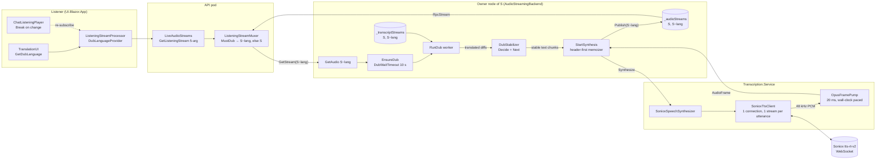

# 12 — Voice dubbing

A listener with **Translated voice** on hears, in a live session, every
speaker of another language dubbed into the listener's translation
language by a stock Soniox TTS voice. The dub is a derived audio stream
that rides the fan-out described in [doc 06](./06-server-fanout-and-replay.md):
no new stream type crosses the wire, the listening muxer just asks for a
different stream id.

This doc covers the server-side dub pipeline, the muxer substitution for
live listening, dubbing of replayed (historical) playback, and the
client settings that request both. See [Not yet](#not-yet) for what is
deliberately missing.

## Stream ids: `S` and `S~lang`

A live audio stream `S` already has a transcript stream under the same id
and a translated transcript under `S~lang` (`StreamId.Language`, delimiter
`~`, file: `src/dotnet/Api/Identifiers/StreamId.cs`). `GetTranscript(S~lang)`
starts the translation lazily on first request. Dubbing reuses the same
key: `GetAudio(S~lang)` starts the dub lazily and publishes it into the
same `StreamStore<AudioFrame>` as `S`, on the node that owns `S`. Every
dub-related lookup goes through `BaseStreamId`, which strips the language
suffix, so the chat id, author id and expiry of `S~lang` are those of `S`.

## Data flow



## Synthesis — `ISpeechSynthesizer`

File: `src/dotnet/Transcription.Contracts/ISpeechSynthesizer.cs`.

```csharp
Task Synthesize(string streamId, ChannelReader<string> text,
    SpeechSynthesisOptions options, ChannelWriter<AudioFrame> output,
    CancellationToken cancellationToken = default);
```

Text chunks in, 20 ms Opus `AudioFrame`s (48 kHz mono) out, emitted at
wall-clock pace with contiguous offsets from zero; a gap between chunks
comes out as silence. `SpeechSynthesisOptions(Language, VoiceId)` — the
voice defaults to `TranscriptionSettings.SonioxTtsVoice` (`"Adrian"`).

Two implementations, both in `src/dotnet/Transcription.Service/Synthesis/`,
registered by `TranscriptionServiceModule`: `FakeSpeechSynthesizer` when
`UseFakeTranscriber` is set (one silent frame per four characters, so
tests get real pacing), otherwise `SonioxSpeechSynthesizer` — only when
`CoreSettings:SonioxKey` is configured. With neither, `EnsureDub` sees no
synthesizer and serves the original.

### `SonioxTtsClient` — one connection and one stream per utterance

File: `src/dotnet/Transcription.Service/Transcribers/SonioxTtsClient.cs`.

`SonioxSpeechSynthesizer` composes the client and the pump with
`TranscriberHelper.WhenPushAndRead`, the same push/read pairing the
transcribers use. One `Run` opens one `wss://tts-rt.soniox.com/tts-websocket`
connection, lazily on the first chunk, and keeps it for the whole
utterance; a reader task per connection demultiplexes responses (base64
PCM goes to the pump's channel; `terminated` and `error_code` complete
the stream they name — audio messages carry no `stream_id`, so they go to
the one open stream). A stream is opened with the config (`tts-rt-v2`,
`pcm_s16le`, 48 000 Hz, the language, the voice and a fresh `stream_id`)
on the first chunk, and every further chunk is sent at once as
`{ text, text_end: false }` — with a trailing space appended when the
chunk doesn't end in whitespace, since chunks are transcript increments
that may stop right before the next word and Soniox tokenizes on
whitespace. Soniox synthesizes a sentence once it sees the text after
it (lookahead for prosody), so one stream per utterance is what keeps
sentence-final intonation and the ~1–1.5 s inter-fragment gaps of the
old chunk-per-stream model out of the dub. The stream ends with
`{ text: "", text_end: true }` (accepted, verified live) and a read
until `terminated`, then the socket is closed normally.

Two things force a stream to end early, both at a chunk boundary and both
followed by a new stream on the same connection for the next chunk:

- **Idle rollover** — no new chunk for
  `Constants.Transcription.Soniox.TtsIdleFlush` (2.5 s). Soniox kills a
  stream after ~3–4 s without output (`408 Stream killed: output audio
  rate below minimum`) and loses the text it hasn't synthesized, so the
  client ends the stream first; the text held for lookahead gets spoken
  by the `text_end`.
- **Duration rollover** — a stream older than
  `Constants.Transcription.Soniox.TtsStreamRollover` (100 s). Soniox caps
  a stream at 2 min (not raisable) while an utterance runs to
  `Chat.MaxEntryDuration` (3 min).

Errors: a stream `error_code` is logged at Warning and treated as the end
of that stream; on a 408 the chunks sent since the last audio message
(the cheap approximation of what was never spoken) are re-sent on the
next stream, once — a re-sent chunk is never re-sent again. A connection
that dies under a stream is reconnected once per run (the dead stream's
unspoken chunks move to the new one); a second loss fails the run. A
connection Soniox closed between streams is simply replaced before the
next stream opens. `TtsChunkTimeout` (30 s) bounds how long an open
stream may go without any message from Soniox. Measured live: a
connection stays open for at least 20 s with no stream on it, streams
reuse the connection (the client caps it at 5 per connection, Soniox's
documented limit), first audio arrives ~1.5 s after the first chunk when
a second chunk follows within a second, and ~2.8 s (idle flush + ~0.3 s)
for a lone chunk.

### `OpusFramePump` — PCM to paced frames

File: `src/dotnet/Transcription.Service/Synthesis/OpusFramePump.cs`.

Encodes 48 kHz mono PCM with OpusSharp (`OPUS_APPLICATION_VOIP`,
`Constants.Audio.Bitrate` = 32 kbps, VBR, voice signal) into
`FrameLength` = 960-sample (20 ms, `Constants.Audio.OpusFrameDurationMs`)
frames. The loop drains whatever PCM is queued, takes one frame's worth
— or, when the buffer is short, encodes a frame of silence — and writes
frame `i` (offset `20 ms × i`) no earlier than `startedAt + 20 ms × (i + 1)`,
the end of its slot, so frame `Offset`s are contiguous from 0 and the
stream advances at real time regardless of how bursty Soniox's output is. Once the input completes, a
partial tail frame is zero-padded and the loop ends. PCM arrives as byte
chunks that need not be sample-aligned: a lone trailing byte waits for
the next chunk to pair up with, unless it is the last byte of the stream.

## The dub worker — `AudioStreamingBackend.Dubbing.cs`

File: `src/dotnet/Streaming.Service/Backend/AudioStreamingBackend.Dubbing.cs`
(the `GetAudio` hook, `GetOrStartTranslation` and the author map are in
`AudioStreamingBackend.cs`).

### `GetAudio(S~lang)` → `EnsureDub`

When the requested id carries a language and `_audioStreams` has no such
stream, `GetAudio` calls `EnsureDub` before the normal lookup. `EnsureDub`
adds a `DubEntry` (a `FuncWorker` running `RunDub` + a `WhenDecided` task)
to `_dubs` once per dub id, starts it, and waits for the decision with
`Constants.Audio.DubWaitTimeout` (10 s). `true` means the dub stream is
published and the lookup proceeds; `false` (decided "no dub", failed, or
timed out — logged as a warning) makes `GetAudio` return `null`, which is
the muxer's cue to serve the original. The worker itself keeps running
past the timeout: a slow-to-decide dub can still be picked up by a later
request.

Two cool-downs make `EnsureDub` answer `false` at once, so the muxer
serves the original without the hold:

- a timed-out decision cools the `(authorId, language)` key down for
  `Constants.Audio.DubCooldown` (30 s), logged once per cool-down;
- a synthesis failure marks the synthesizer down for every dub for
  `Constants.Audio.DubSynthesizerDownDelay` (60 s) — a Soniox outage
  costs one warning per utterance, not a hold plus a failure each.

A dub that is already published is served regardless: the cool-down only
skips the wait.

### `RunDub`

1. **Wait for the source transcript.** The source transcript is published
   on the first STT result, which can trail the audio by more than the
   store's `ShareWaitDelay`, so `WaitForSourceTranscript` keeps re-asking
   `_transcriptStreams` for as long as `_audioStreams.Has(S)`. A miss is
   not a decision: the worker removes its own entry from `_dubs` so the
   next `GetAudio` retries instead of inheriting it.
2. **Start or join the translation** with `GetOrStartTranslation(S~lang)`
   — the same code `GetTranscript` uses, so a listener with captions on
   and one with dubbing on share one `TranslationsBackend_TranslateStream`.
   `ProcessAudio` creates the text entry the translation is keyed by
   ~100 ms *after* it publishes the transcript, so the dub's first request
   usually lands in that window: `GetOrStartTranslation` releases its
   `_translatingStreams` latch when the command starts nothing (or nothing
   gets published within `ShareWaitDelay`), and `WaitForTranslation`
   retries every `Constants.Audio.DubTranslationRetryDelay` (250 ms) for as
   long as the source transcript is live. A latch that outlived the miss
   used to make every later caller — the caption reader included — wait
   for a stream nobody published.
3. **Decide, then feed.** For every translated diff, the worker folds the
   running `Transcript` and, while undecided, calls
   `DubStabilizer.Decide(Fold(source), translated, language)`. `NoDub`
   ends the worker (logged "already in {Language}"); `Dub` calls
   `StartSynthesis`. Once dubbing, each `DubStabilizer.Next(translated)`
   chunk is written to the text channel. A stream that ends `Undecided`
   is logged "too short to decide" and not dubbed.
   **Late listener.** If, when the dub was requested, the source
   transcript already covered more than `Constants.Audio.DubBacklogThreshold`
   (5 s) of audio, the listener joined mid-utterance: at the moment the
   decision becomes `Dub` the translation present so far is handed to
   `DubStabilizer.Skip`, so only what is said after that point is spoken
   rather than the whole backlog read out first.
   **End.** The translated stream stays open until the entry is finalized,
   which waits for the re-transcription; the dub reads it only until the
   source transcript has ended *and* the whole of it is translated
   (`ReadTranslation`): the translated transcript is stable and its time map
   reaches the source's end — the translator scales each increment's time
   map from the source's, so the ends line up. A stable diff alone is not
   enough: with progressive finals one lands while the last increment is
   still with the translator. The check is re-asked once the source has
   actually ended, since the source can grow after the translation last
   caught up with it. Nothing more is spoken after that, and the author's
   next dub is chained behind this one.
4. `finally`: the decision defaults to `false`, the text channel is
   completed (with the error, if any), and the synthesis task is awaited.

### `DubStabilizer`

File: `src/dotnet/Streaming.Service/Audio/DubStabilizer.cs`. Pure; depends
only on `Transcript`.

`Next(translated)` returns the text the TTS may speak now, or `null`. It
ignores unstable transcripts (`!IsStable`), then returns whatever extends
`SentText`. If the stable text no longer starts with `SentText` — the
translator revised something already spoken — the chunk restarts from the
common prefix, i.e. the divergent tail is re-spoken; there is no way to
un-say audio. Whitespace-only chunks are skipped. `Skip(translated)` sets
`SentText` without speaking, for the late-listener case above.

Stability reaches the dub through the translated diffs:
`TranslationsBackend.TranslateTranscriptStream` writes every diff off a
transcript that carries `IsStable`, and promotes the stable prefix even
when the newly stable text is unchanged — an empty diff with
`IsStable = true` folds to a stable transcript on the reader side. Before
that, no translated diff on the wire was ever stable and a dub had
nothing it could speak.

Where the stability comes from: Soniox streams `is_final` tokens
progressively (3–5 s behind the tail, and immediately at every pause with
endpoint detection on), and `SonioxTranscriptBuilder.Update` turns each
message that brings new finals into a stable finals-only transcript
followed, if there is a tail, by the unstable finals+tail one
(`src/dotnet/Transcription.Service/Transcribers/SonioxTranscriptBuilder.cs`).
Waiting for `is_final` alone put the first dubbed chunk 6–9 s behind the
speaker, past the muxer's hold, so the builder also **promotes by age**:
the leading non-final tokens that ended more than
`Constants.Transcription.Soniox.StableTokenAge` (2.5 s) before the
message's `total_audio_proc_ms` are appended to the finals as if they were
final — Soniox practically never revises a tail token older than ~1 s. A
promoted span is settled: the tail Soniox re-sends on every message and
the eventual `is_final` tokens for that span are dropped (any token
starting before the promoted end), so nothing is appended twice, and a
late revision of a promoted word is lost — offline re-transcription
fixes the stored text afterwards. A token straddling the age boundary
stays in the tail. This applies everywhere the transcript goes (captions,
stored text, translation, dub), not only to the dub.
The throttle passes stable transcripts through untouched, the translator
promotes per increment, and the dub speaks per increment — one TTS request
per stable phrase. Deepgram and Google mark their final results stable
the same way. Manual `finalize` is not used: endpoints give the phrase
granularity and forcing finals early degrades accuracy.

`Decide(source, translated, target)`:

| Condition | Result |
|---|---|
| Source transcript carries `Languages` and ≥ 10 chars of text | `NoDub` if any of them matches `target` by ISO code, else `Dub` |

The detected languages ride on the diffs: `TranscriptDiff.Languages`
(null = unchanged) is what lets the folded source transcript carry them —
a text diff alone never did, and the first row was dead on the real path.
| Otherwise, translated transcript not yet stable | `Undecided` |
| Normalized translated text < 10 chars | `Undecided` |
| Normalized source text starts with normalized translated text | `NoDub` |
| Else | `Dub` |

The last two rows are the verbatim-translation heuristic: the translator
hands the source back unchanged when nothing needs translating.
"Normalized" = whitespace collapsed, trimmed, lower-cased.

### `StartSynthesis` and the per-voice chain

`StartSynthesis` builds the dub stream **header-first**: an
`ActualOpusStreamHeader(ServerClock.Now, AudioSource.DefaultFormat)` frame
at `Offset = -1 ms` prepended to the frame channel, memoized, and
published into `_audioStreams` under `S~lang` — that publish is what
`WhenDecided = true` means, so the muxer's `GetStream(S~lang)` can
succeed seconds before the first audio frame exists. If the id is already
published the memoizer is disposed and the call throws.

The synthesis runs as a background task. Before calling
`ISpeechSynthesizer.Synthesize` it awaits the previous dub of the same
`(authorId, language)` — `ChainDub` swaps `_dubChains[$"{authorId}~{lang}"]`
atomically, the author coming from `_authorIdByStream`, filled by
`ProcessAudio` via `RememberAuthorId`. A dub outlives its source by the
translation lag plus the spoken length, so without the chain an author's
next utterance would talk over their still-draining previous one.

A synthesis failure completes the frame channel with the error (the
muxer falls back to the original, see below), marks the synthesizer down
for `DubSynthesizerDownDelay`, and is logged once as a warning. A failure
that arrives through the text channel — the translation errored, or the
language said "dub" but no stable translation ever came, so nothing was
spoken — ends the dub the same way for the muxer but does not touch the
synthesizer-down flag: only the provider's own failures cool every dub
down. The late-listener case is the exception: a dub that skipped its
backlog may legitimately have nothing left to say.

### Lifetime

`_transcriptStreams` expires entries after
`AudioSettings.StreamExpirationDelay` (60 s); its `OnStreamExpire` calls
`ForgetDubs`, which only drops the `_dubs` entries whose base id matches
— the worker ends on its own, since the transcript expires 60 s after it
completes while its dub may still be draining — and `ForgetChatIdIfUnused`,
which drops the chat/author maps once neither store holds the base
stream. The dub's own audio memoizer expires like any published stream,
`StreamExpirationDelay` after it completes.

The dub is **not** registered in `LiveAudioBackend` and **not** persisted:
the registry's records carry `DubLanguage = null`, no blob and no
`ChatEntry` field exist for it, and replay never sees it — a replay dub
is a separate, independently stored `Media`, made on demand; see
[Replay](#replay).

## Muxer substitution — `ListeningStreamMuxer`

File: `src/dotnet/Streaming.Service/Services/ListeningStreamMuxer.cs`.

`ILiveAudioStreams.GetListeningStream` gained a 5-argument overload with
`Language? dubLanguage` (`src/dotnet/Api.Contracts/Streaming/ILiveAudioStreams.cs`);
the 4-argument one stays for older clients and forwards `null`.
`LiveAudioStreams` validates the language, canonicalizes it and passes it
into the muxer's constructor.

- **Validation.** A dub is a TTS stream per (source stream, language), so
  `LiveAudioStreams` serves one only in a language the listener reads or
  hears the chat in: the spoken languages of `UserLanguageSettings`, the
  chat's `ChatUserSettings.TranslationTargetLanguage` or its `Language`,
  matched by ISO code and read off `UserSettingsUI(session)` (a thread
  uses its outermost parent's settings, as `TranslationUI` does). The
  listening stream treats a mismatch as no dub (logged as a warning); a
  direct `GetStream("S~lang")` returns `null`. The language is then
  folded onto its canonical variant by `Languages.GetCanonical` — the
  `Languages.All` entry with the same ISO code that carries
  `LanguageSupport.UI`, else the first match — so `en-GB` and `en-US`
  listeners share one translation and one TTS stream. `IsTextOnly`
  compares the base stream id, so a dub of a JustText author is refused
  like the author's own stream is.
- **`MustDub(streamInfo, dubLanguage)`** decides per stream when its
  registry entry is first seen: dub only if a language was requested, the
  speaker's `LiveAudioStreamInfo.Languages` is non-empty, and none of them
  matches the listener's language by ISO code (`MaySpeak`). `Languages` is
  filled in `ProcessAudio`: the chat language if the chat has one, else
  the speaker's spoken languages from `UserLanguageSettings.ListSpoken()`
  — and left empty when the speaker isn't transcribed (JustVoice), since
  there is nothing to translate. An empty list means "never dub".
- **Stale backlog streams.** Before starting a dubbed entry the scanner
  checks whether a strictly fresher stream of the same author is listed
  or being processed; if so the entry is excluded outright, the way a
  merge loser is. A recorder reconnect flushing several streams would
  otherwise start a dub of each, and they would play in full, serialized,
  before the live one.
- **`GetStream`** for a dubbed entry asks `LiveAudioStreams.GetStream`
  for `S~lang` (the id carries the owner's `NodeRef`, so the request
  reaches the owner node's `GetAudio` locally or through
  `RemoteAudioStreamCache` exactly like `S`). `null` — no synthesizer,
  `NoDub`, a cool-down, or the 10 s wait ran out — falls back to `S`, and
  so does a request that throws (the source is remembered in
  `_undubbedStreamIds`). A successful dub returns the **source's** info
  `with { DubLanguage }`; nothing else in the start item changes.
- **Dub failure mid-relay.** When a dub track errors after its start item
  was emitted, the end item is emitted, the source goes into
  `_undubbedStreamIds`, and the same entry is retried at once with the
  original from the live edge (a fresh entry with a new index, marked
  resumed). The source's own retry counters are never touched by a dub
  failure, so a TTS outage cannot exclude a speaker.
- **Header held, timestamps re-stamped.** The dub's first frame is the
  header, published long before any audio. `ProcessStream` holds it, and
  when the first data frame arrives stamps `BeginsAt = SourceBeginsAt =
  ServerClock.Now − frame.Offset` on the start info (`StampDubStart`),
  emits `MuxedAudioStreamStart`, then the held header, then the frame. So
  the start item's time is the dub's timeline origin: for a listener
  joining at the start it is when dubbed audio actually started, and for
  one joining mid-dub (`SkipToLive`, first frame at a non-zero offset)
  `BeginsAt + Offset` is still now.
- **Merge exemption.** `TryRegister` runs after `GetStream` and skips the
  per-author merge for dub start infos: the author's next original
  utterance must not evict a dub that is still draining, and the backend
  chain above already serialises one voice. A dubbed entry that fell back
  to the original merges as usual.

## Client — requesting a dub language

- **Settings.** `UserLanguageSettings.IsTranslatedVoiceEnabled` (user
  level, the toggle under "Translated voice" in
  `Components/Settings/TranscriptionSettings.razor`) and
  `ChatUserSettings.IsTranslatedVoiceEnabled` (per chat, `bool?`, `null`
  = follow the user-level setting).
- **`TranslationUI.GetDubLanguage(chatId)`**
  (`Services/TranslationUI/TranslationUI.cs`, compute method): `null`
  unless translation is enabled for the chat and the effective flag —
  the per-chat override if set, else the user-level one — is on; then the
  chat's translation language (`GetTranslationLanguage`).
- **Listening.** `ChatListeningPlayer` gives `ListeningStreamProcessor` a
  `DubLanguageProvider` that calls `GetDubLanguage`; the processor's
  `ResilientStream` provider re-reads it on every (re)connect and passes
  it to the 5-arg `GetListeningStream`. `ChatListeningPlayer` also watches
  the computed `GetDubLanguage` and calls `streamProcessor.Break()` when
  the value changes, so a toggle mid-session re-subscribes with the new
  language (a dub already running at that moment is served from its live
  edge, like any pre-existing stream).
- **Per-chat chip.** `LiveConversationHeaderView.razor` shows a
  translated-voice chip only while the conversation is live, translation
  is on for the chat and the user-level flag is on; it reflects
  `GetDubLanguage != null`. Clicking the chip while it is on writes the
  per-chat override `false` (`TranslationUI.SetTranslatedVoice`); clicking
  it while it is off writes `null`, i.e. back to inheriting the user-level
  setting.

## Replay

A listener with the same "Translated voice" setting hears replayed voice
entries spoken in their language too. Unlike the live dub, a replay dub
is generated once, stored on the translation, and reused forever after —
there is no per-connection worker, no stabilizer and no chaining: the
whole entry's text is already known, so it is spoken in one request.

### Data model

`Translation` (`src/dotnet/Api/Chat/Translation.cs`) carries two more
fields, appended as keys 7 and 8 (array-form MessagePack — never
renumber): `DubMediaId` (`MediaId?`, `null` = not generated) and
`DubContentHash` (`HashString`, the hash of the `Content` the audio was
made from). `TranslationDiff` mirrors them as `Option<MediaId?>` and
`HashString?`. `TranslationDubExt.HasValidDub()`
(`src/dotnet/Chat.Contracts/TranslationDubExt.cs`) — an extension method,
not a property — is `true` iff `DubMediaId != null` and
`DubContentHash` equals the hash of the *current* `Content`; a
translation whose content changed after the dub was made reads as
having no dub, without touching the fields.

`DbTranslation` gets matching `dub_media_id`/`dub_content_hash` columns
via migration `Add_Translation_Dub`
(`src/dotnet/Chat.Service.Migration/Migrations/20260914133717_Add_Translation_Dub.cs`).
`TranslationsBackend.OnChange`'s `ApplyDiff`
(`src/dotnet/Chat.Service/TranslationsBackend.cs:108-196`) clears both
fields to `null`/`HashString.None` whenever the diff carries a `Content`
different from the current one — a re-translation invalidates the dub
without a separate cleanup step. After the write, if the previous
`DubMediaId` is no longer the current one, `OnChange` deletes the
orphaned media with a nested `Commander.Call(new MediaBackend_Change(orphan,
null, Change.Remove<MediaFull>()))`.

The dub media is an ordinary `MediaFull` (`ContentType = "audio/webm"`)
with a blob under `BlobScope.AudioRecord`, path
`BlobPath.Format(BlobScope.AudioRecord, mediaId.LocalId, "<lang>.webm")`
— keyed by the dub's own new `MediaId`, not the entry's stream id.
`BeginsAt = default` and `EndsAt = default + audio.Duration`: the media
only records how long the dub is: replay derives where an entry plays
from the muxer's own timeline (below), not from the media's timestamps.

### `ReplayDubs` — get-or-create

File: `src/dotnet/Streaming.Service/Services/ReplayDubs.cs`. A plain
in-process singleton (not an RPC-exposed backend): it only composes
`ITranslationsBackend`, `IMediaBackend`, `ISpeechSynthesizer` and
`AudioSegmentSaver`, and the muxer that needs it always runs on the same
node.

`GetOrCreate(entry, language, cancellationToken)` returns a `ReplayDub?`
— `record ReplayDub(Media? Stored, AudioSource? Live)` — or `null` for
"no dub, serve the original". `Stored` is the media of a dub that already
exists; `Live` is a dub being synthesized *right now*: an `AudioSource`
whose frames arrive as Soniox produces them; `ReplayDub.Pending` (both
`null`, `IsPending`) is what a caller gets when its own wait ran out
before the work decided anything — unlike `null`, it says nothing about
the dub, so the muxer asks again at the entry's turn (below).
Soniox's REST TTS streams its audio back at roughly the pace it is spoken
(28 s of speech over ~23 s), so waiting for the whole synthesis + upload
before serving anything would leave every entry longer than the caller's
wait undubbed on its first replay; `Live` lets the first replay play the
dub while the same frames are being stored for the next one.

The method dedupes concurrent callers for the same `(ChatEntryId, Language)`
with a `ConcurrentDictionary<key, Task<ReplayDub?>>` plus a
`TaskCompletionSource`: whichever caller's task is the one that lands in
the map (`ReferenceEquals` check, safe even if the work completes
synchronously) runs the work; every other caller just awaits the same task.

The wait and the work run on two independent budgets. Every caller waits
at most `Constants.Audio.ReplayDubTimeout` (20 s) — `dubTask.WaitAsync
(ReplayDubTimeout, cancellationToken)` — before giving up and returning
`ReplayDub.Pending`; since the task completes as soon as the synthesis has
*started*, that wait only spans the translation wait, the reuse lookup and
the time to acquire the synthesis slot, never the synthesis itself. The
work is not touched by that wait timing out; it keeps running on a token
linked to the host's shutdown (`IHostApplicationLifetime`) and capped by
the much longer `Constants.Audio.ReplayDubSynthesisTimeout` (5 min),
armed twice: once at the start, covering the translation wait and the
wait for a synthesis slot, and again — `CancelAfter` resets the timer —
the moment the slot is acquired, so the whole budget covers synthesis +
upload + stamp (synthesis runs at about spoken pace, so it has to clear
`Chat.MaxEntryDuration`, 3 min, with room for the upload) even when the
entry queued behind two other long ones first. So a slow entry that a
caller has already stopped waiting for still finishes, gets stored, and is
reused by the *next* replay instead of being re-synthesized every time. A genuine
cancellation of the caller's own `cancellationToken` still propagates as
`OperationCanceledException`, same as before. Inside `Run()`, a
cancellation/timeout of the work's own token is logged at Information
(message only, no exception object); any other failure is logged at
Warning with the exception; the message says whether the original is
served or whether a dub that was already streaming to its listeners just
won't be stored. The in-flight map entry is removed only after the whole
run — store, guard and stamp included — so a caller that finds no entry
re-reads the stamped translation and gets `Stored`; a caller that joins a
run past its `Live` hand-off gets that same `Live` source and replays it
from the start (below).

Inside, in order:

1. **Skip rules.** No dub without `entry.Audio`/`BlobId`, or when
   `!entry.SupportsTranslation(false)` (system entries, still-streaming
   content — the same guard `TranslationsBackend` uses to decide what to
   auto-translate). No dub when the entry's own detected languages
   (`IChatEntryLanguagesBackend.GetTile`, keyed by
   `Constants.Chat.EntryIdTiles`) already contain the listener's language
   by ISO code.
2. **The translation.** `Translations.Get(id, translateIfMissing: true)`
   kicks off translation if none exists; then
   `Computed.Capture(() => Translations.Get(id, translateIfMissing: false))`
   + `computed.When(t => t is { IsStreaming: false })` waits for it —
   `TranslationsBackend_Change`'s invalidation wakes this the moment the
   write lands, so it is a wait, not a poll. `null` or
   `translation.MatchesOriginal(entry.Content)` → no dub.
3. **Reuse.** `translation.HasValidDub()` → look the media up with
   `MediaBackend.Get`; if it is still there, return it. If the record was
   deleted, fall through and make a new one (the comment in code: *"The
   media is gone; fall through and make it again"*).
4. **Synthesize, under the concurrency cap, and hand out `Live`.** A
   process-wide `SemaphoreSlim` sized
   `Constants.Audio.ReplayDubMaxConcurrentSynthesis` (2) is held from
   synthesis start until the upload finishes — not around the translation
   wait or the reuse lookup above — so at most that many entries synthesize
   at once, leaving headroom in Soniox's 3-concurrent-stream quota for live
   dubbing. `Synthesizer.Synthesize(translation.Content, new
   SpeechSynthesisOptions(language), ct)` (the one-shot overload, below)
   returns an `AudioSource` whose frames are still arriving. The moment it
   does, the in-flight `TaskCompletionSource` is completed with
   `ReplayDub(null, Live: synthesized)`, so every waiting caller gets the
   dub as it is spoken. No extra tee is needed: `AudioSource` (via
   `MediaSource`) already memoizes its frames in an `AsyncMemoizer`, so
   each `GetFrames` call — the saver's, and every caller's — is an
   independent replay from the first frame. The memoizer is never disposed
   explicitly: it completes when the synthesis does, and the buffered chain
   is garbage-collected once the in-flight entry is dropped and the last
   replayer lets go of the source, so a late replayer can never see a
   truncated or detached stream. A fresh `MediaId.New(entry.ChatId.Value)`
   is minted *before* saving — so a losing racer's cleanup (next point)
   can never delete a blob a winner still depends on — and
   `AudioSegmentSaver.SaveAndCreateMedia(synthesized, mediaId, blobId, ct)`
   writes the webm blob as the frames come in and creates the `MediaFull`
   once the duration is known. If the synthesized `AudioSource.Duration`
   comes back zero (e.g. an empty translation), the just-created media is
   deleted the same way as the lost-race case below and the run ends
   without ever stamping the translation (the `Live` callers saw an empty
   source and fell back to the original themselves).
5. **Stamp, or lose the race.** `TranslationsBackend_Change` updates
   `DubMediaId`/`DubContentHash`, pinned to the `Version` read in step 2.
   A concurrent re-translation makes this throw
   `VersionMismatchException` (caught, treated as "lost"), or simply
   stamps a different `Translation` (its own newer dub raced in first).
   Either way, when the stamped `DubMediaId` isn't the one just created,
   the just-created media is deleted
   (`MediaBackend_Change(mediaId, null, Change.Remove<MediaFull>())`) and
   the run ends with `null` — the callers that got `Live` already played
   what was spoken; a later request picks up the winner's dub through
   step 3. Both cleanup steps run on the same long-budget work token as
   the rest of `GetOrCreateImpl`, so — unlike with the old shared 20 s
   timeout — a slow stamp landing after a caller gave up does not leave
   the media orphaned: the window between `SaveAndCreateMedia` and the
   stamp is milliseconds against a 5-minute budget, not a race the
   timeout can realistically land in.

### One-shot synthesis

`ISpeechSynthesizer` (`src/dotnet/Transcription.Contracts/ISpeechSynthesizer.cs`)
gains a second method next to the streaming one used by live:

```csharp
Task<AudioSource> Synthesize(string text, SpeechSynthesisOptions options,
    CancellationToken cancellationToken = default);
```

`SpeechSynthesizerExt.ToAudioSource`
(`src/dotnet/Transcription.Service/Synthesis/SpeechSynthesizerExt.cs`) is
the shared tail both implementations use: it runs an `OpusFramePump`
constructed with `isPaced: false` over an internal PCM channel fed by a
caller-supplied producer, and wraps the frames it emits as an
`AudioSource` whose duration becomes known once the producer finishes. An
unpaced pump (`OpusFramePump(clock, isPaced: false)`) writes frames as
fast as PCM arrives instead of sleeping until each frame's real-time
slot — a dub isn't played back in real time while it's made, so nothing
should throttle it. `SonioxSpeechSynthesizer`'s one-shot overload plugs
`SonioxTtsClient.Generate` in as the producer; `FakeSpeechSynthesizer`'s
plugs in the same one-silent-frame-per-4-characters rule the streaming
fake uses, so tests still get real, non-zero durations without Soniox.

`SonioxTtsClient.Generate` (`src/dotnet/Transcription.Service/Transcribers/SonioxTtsClient.cs`)
is a REST call, not the live path's WebSocket: one `POST
https://tts-rt.soniox.com/tts` per chunk (same model, `pcm_s16le`,
48 000 Hz and voice as the live config). The response body is raw PCM
and Soniox streams it back at about the pace it is spoken, so the call
is sent with `HttpCompletionOption.ResponseHeadersRead` and the body is
read in 32 KB pieces, each written to the pcm channel as soon as it
arrives rather than after the whole body is buffered.
`Constants.Transcription.Soniox.TtsChunkTimeout` (30 s) is an
*inactivity* deadline here — re-armed after every piece read — not a
total budget: a 3-minute entry legitimately takes minutes, while 30 s
without a single byte is an error (`StandardError.External`), same as a
stalled live chunk. Text over 5000
characters is split by `SplitText`, greedily, at the last sentence-ending
punctuation (`.`, `!`, `?`, `\n`) within the limit, falling back to the
last space and then to a hard cut — so a long entry becomes several
requests whose audio is concatenated in order.

`tests/Testing.Host/RecordingSpeechSynthesizer.cs` records the exact text
spoken per one-shot call, keyed by `OneShotStreamId(language, text)`, so
`ReplayDubsTest`/`ReplayDubbingTest` can assert a dub was made from the
translation's own content. Its test-only `OneShotGate`
(`Func<string, Task>?`) holds a one-shot synthesis's frames until the
returned task completes, which is how the tests observe a dub that is
still being made. `tests/Testing.Host/ReplayDubOperations.cs`'s
`WhenReplayDubStored` waits for the other end of that run: the
translation stamped *and* `ReplayDubs.InFlightCount` back to zero.

### `ReplayStreamMuxer` — blob swap, timeline stretch, lookahead

File: `src/dotnet/Streaming.Service/Services/ReplayStreamMuxer.cs`,
`ReplayTimeline.cs`.

`ILiveAudioStreams.GetReplayStream` gains a 7-arg overload with
`Language? dubLanguage`; the 6-arg one stays for older clients and
forwards `null`. `LiveAudioStreams.GetReplayStream` resolves it with the
same `IsDubLanguageAllowed` helper `GetListeningStream` uses (the
language must be one the listener speaks, or the chat's translation
target/chat language, matched by ISO code) and canonicalizes it with
`Languages.GetCanonical`; a disallowed language is dropped to `null` with
a warning, same as live.

- **Lookahead.** Entries are read through `WithDubLookahead`, which keeps
  a queue of `Constants.Audio.ReplayDubLookahead` (2) entries: every time
  an entry is enqueued, `Dubs.GetOrCreate` is started for it right away
  (only while `DubLanguage != null`) into a per-run
  `Dictionary<ChatEntryId, Task<ReplayDub?>>`, so a dub is usually already
  synthesizing by the time its entry's turn to stream comes up — and a
  `Live` result for a lookahead entry simply buffers in its source's
  memoizer until that turn, which is exactly the head start wanted.
  `GetDub` takes the pre-started task if one exists, else starts a fresh
  one (a cold path, e.g. if lookahead was never reached for that entry);
  a pre-started call whose 20 s wait ran out (`ReplayDub.Pending`) is
  re-asked at the entry's turn — the in-flight run is usually `Live` or
  stored by then — and only a second `Pending` is served undubbed.
  Entries before the resolved start position are filtered out before
  lookahead ever sees them, as they were before dubbing existed.
- **Timeline stretch.** A dub's spoken length rarely matches the
  source's. `ReplayTimeline.PlaysAt(timelinePlaysAt, notBefore,
  stretchTimeline)` clamps an entry's play time to no earlier than
  `notBefore` — the end of the previously emitted entry's *played*
  duration — but only `stretchTimeline: true` when `DubLanguage != null`;
  an undubbed replay keeps concurrent speakers concurrent exactly as
  before. After each entry, `notBefore` is pinned to that entry's own
  `playsAt` plus its played duration divided by `Speed`
  (`notBefore = playsAt + playedDuration / Speed`). For a `Stored` dub
  (or an undubbed entry) the played duration is known up front — the
  media's (or the source's) duration minus whatever was skipped — and
  the entry is started as a concurrent `ProcessEntry` task, as before.
  For a `Live` dub it cannot be: the muxer **awaits that entry's
  `ProcessEntry` before moving to the next entry** and uses what was
  actually streamed — `ProcessEntry` returns the last frame's end offset
  (before any speed-up frame drops, so the same `/ Speed` applies). Soniox
  paces at about 1×, so this holds the replay loop for roughly the dub's
  own length, which is where it would have to wait anyway.
- **`ScaleSkip`.** Seeking into a `Stored` dub (`skipTo` into the source)
  is rescaled to the dub's own length:
  `ReplayTimeline.ScaleSkip(skipTo, entryDuration, dubDuration) = skipTo *
  (dubDuration / entryDuration)`, zero when either the source duration or
  the requested skip is zero or unknown. A `Live` dub has no known length
  to scale by, so `skipTo` is applied as-is via `AudioSource.SkipTo` —
  assuming the dub runs at the source's pace — which means the first
  frame comes out once the synthesis has passed `skipTo` (at about 1×,
  that is about `skipTo` of wall-clock time after the synthesis started,
  minus whatever lookahead already covered). The position is kept rather
  than restarting the entry from its beginning.
- **Audio swap and fallback.** `ProcessEntry` opens the dub via
  `TryOpenDub` instead of the entry's own blob when a dub was returned.
  `Stored` → `AudioSourceDownloader.TryDownload(dub.Stored.BlobId,
  dubSkipTo)` (`src/dotnet/Core.Server/Blobs/AudioSourceDownloader.cs`),
  which returns `null` — rather than an empty, silently-playing
  `AudioSource` — when the blob is gone; `Download` (used everywhere else)
  keeps the old empty-source behavior by falling back to `TryDownload`
  returning `null`. `Live` → `live.SkipTo(skipTo)` and a peek at its
  first frame (`GetFrames(...).AnyAsync()` — free, since the source
  memoizes and the next `GetFrames` replays from the start): a synthesis
  that faults or produces nothing shows up right there. Either a `null`
  return, no first frame, or an exception drops `dub` (logged at
  Information) and downloads the original blob at the original `skipTo`
  — the entry still plays, just undubbed, for that one replay. A `Live`
  source that fails *after* its first frame is handled like any other
  mid-stream error: Warning + end marker, no restart. The emitted
  `LiveAudioStreamInfo` picks
  up `DubLanguage` via `with { DubLanguage }` only when a dub was used;
  `StreamId`/`BeginsAt`/`SourceBeginsAt` stay the entry's own — the client
  reads the same `DubLanguage` field live listening already sets, so no
  new client-side plumbing was needed to show the chip.
- **Leftover lookahead tasks.** If the replay stops (or errors) while a
  lookahead dub is still in flight, `OnRun`'s `finally` awaits every
  outstanding task in `dubTasks` with `SilentAwait(false)` so a raced-past
  dub can never fault unobserved.

### Client

`ReplayStreamProcessor.DubLanguageProvider`
(`src/dotnet/UI.Blazor.App/Services/Audio/ReplayStreamProcessor.cs`), a
`Func<CancellationToken, Task<Language?>>`, is set by `ChatReplayPlayer`
(`src/dotnet/UI.Blazor.App/Services/Playback/ChatReplayPlayer.cs`) to
`Hub.TranslationUI.GetDubLanguage(ChatId, ct)` — the same compute method
that drives the live chip. Unlike `ListeningStreamProcessor`,
`ReplayStreamProcessor` has no reconnect loop: the provider is read
exactly once, at the top of `OnRun`, before the RPC call, and whichever
`GetReplayStream` overload matches (7-arg when it resolved a language,
6-arg otherwise) is used for the whole replay. Toggling "Translated
voice" mid-replay is picked up only the next time replay starts fresh.

### Out of scope / follow-ups

- **Voice cloning.** Stock voice only, same as live — Soniox caps custom
  voices at 20 per organization. A separate capacity note: Soniox's
  default TTS quota is 3 concurrent streams and 100 requests/minute,
  raisable in the Soniox console — relevant once replay dubbing adds
  request volume of its own.
- **Eager generation.** A dub is made lazily, on the first replay request
  that needs it, never ahead of time off translation completion.
- **Re-subscribing on a mid-replay toggle.** See Client above — a toggle
  applies starting with the next replay, not the current one.
- **A dub media with a missing blob** falls back to the original for
  that one replay (see `ProcessEntry` above) but is *not* cleared from
  the translation — only the media *record's* absence, not the blob's,
  makes `ReplayDubs` regenerate it. A blob lost without its media record
  being deleted keeps falling back on every replay until either is fixed.
- **Retention.** A dub's `MediaFull`/blob is never purged when the entry
  it dubs is deleted — nothing walks `Translation.DubMediaId` from an
  entry-deletion path today.

## Constants

| Constant | Value | Role |
|---|---|---|
| `Constants.Audio.DubWaitTimeout` | 10 s | How long `EnsureDub` (and so the muxer) waits for a decision before serving the original; sized so the first stable chunk (age promotion + translation + first TTS audio) usually lands inside it |
| `Constants.Audio.DubTranslationRetryDelay` | 250 ms | Between attempts to start the translation while the source transcript is live |
| `Constants.Audio.DubCooldown` | 30 s | After a timed-out decision, how long that `(author, language)` skips the hold |
| `Constants.Audio.DubSynthesizerDownDelay` | 60 s | After a synthesis failure, how long every dub is skipped |
| `Constants.Audio.DubBacklogThreshold` | 5 s | Audio already transcribed when a dub is requested beyond which the listener counts as late |
| `Constants.Audio.ReplayDubTimeout` | 20 s | How long a `ReplayDubs.GetOrCreate` caller waits for a stored dub or for synthesis to *start* before serving the original; the work keeps running past this |
| `Constants.Audio.ReplayDubSynthesisTimeout` | 5 min | Upper bound on synthesis + upload + stamp counted from slot acquisition (the translation wait + slot wait before that get the same budget separately), linked to host shutdown; synthesis streams at spoken pace, so it must clear `Chat.MaxEntryDuration` (3 min) |
| `Constants.Audio.ReplayDubLookahead` | 2 | Entries the replay muxer keeps synthesizing ahead of the one currently streaming |
| `Constants.Audio.ReplayDubMaxConcurrentSynthesis` | 2 | Caps concurrent replay-dub syntheses; shares Soniox's 3-stream quota with live dubbing |
| `Constants.Transcription.Soniox.TtsChunkTimeout` | 30 s | Live WebSocket: the longest an open stream may go without any message from Soniox; replay's REST `Generate`: inactivity between body pieces. Exceeded = error, not hang |
| `Constants.Transcription.Soniox.TtsIdleFlush` | 2.5 s | Live WebSocket: no new chunk for this long ends the stream (`text_end`) before Soniox kills it for low output and loses its unsynthesized text |
| `Constants.Transcription.Soniox.TtsStreamRollover` | 100 s | Live WebSocket: a stream this old is ended at the next chunk and the rest goes to a new stream, under Soniox's 2 min stream cap |
| `AudioSettings.StreamExpirationDelay` | 60 s | Store expiry; bounds the transcript wait via `_audioStreams.Has` and triggers `ForgetDubs` |
| `OpusFramePump.FrameLength` / `FrameByteLength` | 960 samples / 1920 bytes | One 20 ms frame at 48 kHz, 16-bit mono |
| `DubStabilizer.MinDecisionLength` | 10 chars | Minimum text before `Decide` commits |
| `Constants.Transcription.Soniox.StableTokenAge` | 2.5 s | A non-final token that ended this long before `total_audio_proc_ms` is promoted to stable by `SonioxTranscriptBuilder` |
| `TranscriptionSettings.SonioxTtsVoice` | `"Adrian"` | Stock voice until cloned voices exist |

## Tests

`tests/Transcription.UnitTests/OpusFramePumpTest.cs`,
`tests/Transcription.UnitTests/TranscriptDiffTest.cs` (languages and
stability through a diff), `tests/Streaming.UnitTests/DubStabilizerTest.cs`,
`tests/Streaming.UnitTests/ListeningStreamMuxerTest.cs` (`MustDub`, the
re-stamp, the fallback and the merge exemption),
`tests/Streaming.UnitTests/ListeningStreamMuxerRelayTest.cs` (a real
muxer over fake stream services: the dub-error fallback, the stale
backlog skip), `tests/Streaming.IntegrationTests/DubbingTest.cs`
(backend-level: `GetAudio(S~lang)` with the fake synthesizer and
hand-made translated diffs, no muxer),
`tests/Chat.IntegrationTests/DubbingTranslationFlowTest.cs` (the real
`TranslationsBackend` stream with a recording synthesizer: the spoken
text, the entry-after-transcript ordering, the late listener, the end of
the dub), `tests/Core.UnitTests/Identifiers/CanonicalLanguageTest.cs`,
and the two Soniox spikes `tests/Transcription.IntegrationTests/SonioxTtsClientTest.cs` /
`SonioxSpeechSynthesizerTest.cs`, which self-skip without
`CoreSettings__SonioxKey`.

Replay: `tests/Chat.UnitTests/TranslationDubTest.cs` and
`tests/Chat.IntegrationTests/TranslationDubTest.cs` (`HasValidDub`, the
dub cleared on a new `Content`, the orphaned media deleted),
`tests/Streaming.UnitTests/ReplayTimelineTest.cs` (`PlaysAt` stretching,
`stretchTimeline: false` for an undubbed replay, `ScaleSkip`),
`tests/Chat.IntegrationTests/ReplayDubsTest.cs` (`ReplayDubs` against the
real `TranslationsBackend` with `RecordingSpeechSynthesizer`: create then
reuse as `Stored`, the first request gets `Live` while the gated
synthesis is still held and a request after the store gets `Stored` with
the stamped media, the listener's own language is skipped, a
re-translation regenerates, an in-flight entry is forgotten after
completion), `tests/Chat.IntegrationTests/ReplayDubbingTest.cs` (end to
end through `GetReplayStream`: a Russian entry replayed for an English
listener comes back with `DubLanguage = English` and the recorded dub's
frames; a replay started while the synthesis is gated waits and still
carries `DubLanguage = English` with frames once the gate opens; without
a dub language the replay is unchanged; a dub whose blob was deleted
falls back to the undubbed original with non-empty frames), and
`tests/Transcription.UnitTests/SonioxTtsClientTest.cs`
(`GenerateShouldWritePcmAsTheResponseArrives`: against a fake HTTP
handler serving the body through a `Pipe`, the first PCM chunk is written
before the body is complete and a body larger than the read buffer
arrives as several chunks; the `Run*` tests drive `Run` against a fake
`WebSocket` with shortened `IdleFlush`/`StreamRollover`: steady chunks
share one stream, the idle flush and the duration rollover each end the
stream and open the next on the same connection, a 408 re-sends the
unspoken chunks on a new stream, a dropped connection is reconnected
once and a second drop fails the run).

## Not yet

- A "translated" marker on the speaking indicator — the client ignores
  `DubLanguage` on the start item today.
- A "translating…" cue while the muxer holds a speaker's original.
- Switching to a dub mid-utterance for mixed-language speakers: the
  decision is made once per stream.
- Cloned voices (phase 2) and the recorded-sample UI (phase 3);
  `SpeechSynthesisOptions.VoiceId` is the hook.
- Replay-specific gaps are listed under [Replay → Out of scope /
  follow-ups](#out-of-scope--follow-ups).
- The remaining latency lever: serving the original at once and
  switching to the dub once its first chunk is ready, instead of holding
  the original for `DubWaitTimeout`.
- While a stream drains after `text_end` (an idle or duration rollover),
  chunks that arrive queue for the next stream; the pump keeps playing
  the drained audio meanwhile, so nothing starves, but the next stream's
  first audio lands only after `terminated`.
- Soniox in-stream translation (the STT session translating as it
  transcribes) was rejected: one target language per STT session, while
  the listeners of one speaker need N languages.
- Client-side catch-up: the dub plays at natural pace and is never cut;
  a receiver-side speed-up to shrink the lag is a later lever.
