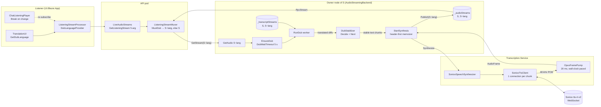

# 12 — Voice dubbing

A listener with **Translated voice** on hears, in a live session, every
speaker of another language dubbed into the listener's translation
language by a stock Soniox TTS voice. The dub is a derived audio stream
that rides the fan-out described in [doc 06](./06-server-fanout-and-replay.md):
nothing new crosses the wire, the listening muxer just asks for a
different stream id.

This doc covers the server-side dub pipeline, the muxer substitution,
and the client settings that request it. Phase 1 only — see
[Not yet](#not-yet) for what is deliberately missing.

## Stream ids: `S` and `S~lang`

A live audio stream `S` already has a transcript stream under the same id
and a translated transcript under `S~lang` (`StreamId.Language`, delimiter
`~`, file: `src/dotnet/Api/Identifiers/StreamId.cs`). `GetTranscript(S~lang)`
starts the translation lazily on first request. Dubbing reuses the same
key: `GetAudio(S~lang)` starts the dub lazily and publishes it into the
same `StreamStore<AudioFrame>` as `S`, on the node that owns `S`. Every
dub-related lookup goes through `BaseStreamId`, which strips the language
suffix, so the chat id, author id and expiry of `S~lang` are those of `S`.

## Data flow



## Synthesis — `ISpeechSynthesizer`

File: `src/dotnet/Transcription.Contracts/ISpeechSynthesizer.cs`.

```csharp
Task Synthesize(string streamId, ChannelReader<string> text,
    SpeechSynthesisOptions options, ChannelWriter<AudioFrame> output,
    CancellationToken cancellationToken = default);
```

Text chunks in, 20 ms Opus `AudioFrame`s (48 kHz mono) out, emitted at
wall-clock pace with contiguous offsets from zero; a gap between chunks
comes out as silence. `SpeechSynthesisOptions(Language, VoiceId)` — the
voice defaults to `TranscriptionSettings.SonioxTtsVoice` (`"Adrian"`).

Two implementations, both in `src/dotnet/Transcription.Service/Synthesis/`,
registered by `TranscriptionServiceModule`: `FakeSpeechSynthesizer` when
`UseFakeTranscriber` is set (one silent frame per four characters, so
tests get real pacing), otherwise `SonioxSpeechSynthesizer` — only when
`CoreSettings:SonioxKey` is configured. With neither, `EnsureDub` sees no
synthesizer and serves the original.

### `SonioxTtsClient` — one connection per chunk

File: `src/dotnet/Transcription.Service/Transcribers/SonioxTtsClient.cs`.

`SonioxSpeechSynthesizer` composes the client and the pump with
`TranscriberHelper.WhenPushAndRead`, the same push/read pairing the
transcribers use. The client reads the text channel sequentially and, for
**each** chunk, opens a fresh `wss://tts-rt.soniox.com/tts-websocket`
connection, sends the config (`tts-rt-v2`, `pcm_s16le`, 48 000 Hz, the
language and voice), sends the chunk as one `{ text, text_end: true }`
message, reads responses until `terminated` (base64 PCM goes to the pump's
channel), then closes. A `Close` frame before `terminated` or an
`error_code` in a response is a hard error, and the whole connect + read
runs under `Constants.Transcription.Soniox.TtsChunkTimeout` (30 s) so a
wedged chunk becomes an error instead of a hang.

Why nothing stays open between chunks: `tts-rt-v2` holds synthesis until
it sees `text_end`, answers an idle open stream with `408 Request
timeout`, closes a connection that gets no config within ~10 s and one
that produces no audio for ~3 min. The dub producer emits a chunk only
every few seconds, so a long-lived stream cannot be kept fed. The
measured cost is ~0.95 s to first audio per chunk plus ~0.1–0.3 s of
handshake; the pump's silence fill absorbs both.

### `OpusFramePump` — PCM to paced frames

File: `src/dotnet/Transcription.Service/Synthesis/OpusFramePump.cs`.

Encodes 48 kHz mono PCM with OpusSharp (`OPUS_APPLICATION_VOIP`,
`Constants.Audio.Bitrate` = 32 kbps, VBR, voice signal) into
`FrameLength` = 960-sample (20 ms, `Constants.Audio.OpusFrameDurationMs`)
frames. The loop drains whatever PCM is queued, takes one frame's worth
— or, when the buffer is short, encodes a frame of silence — and waits
until `startedAt + 20 ms × frameIndex` before writing it, so frame
`Offset`s are contiguous from 0 and the stream advances at real time
regardless of how bursty Soniox's output is. Once the input completes, a
partial tail frame is zero-padded and the loop ends. PCM arrives as byte
chunks that need not be sample-aligned: a lone trailing byte waits for
the next chunk to pair up with, unless it is the last byte of the stream.

## The dub worker — `AudioStreamingBackend.Dubbing.cs`

File: `src/dotnet/Streaming.Service/Backend/AudioStreamingBackend.Dubbing.cs`
(the `GetAudio` hook, `GetOrStartTranslation` and the author map are in
`AudioStreamingBackend.cs`).

### `GetAudio(S~lang)` → `EnsureDub`

When the requested id carries a language and `_audioStreams` has no such
stream, `GetAudio` calls `EnsureDub` before the normal lookup. `EnsureDub`
adds a `DubEntry` (a `FuncWorker` running `RunDub` + a `WhenDecided` task)
to `_dubs` once per dub id, starts it, and waits for the decision with
`Constants.Audio.DubWaitTimeout` (5 s). `true` means the dub stream is
published and the lookup proceeds; `false` (decided "no dub", failed, or
timed out — logged as a warning) makes `GetAudio` return `null`, which is
the muxer's cue to serve the original. The worker itself keeps running
past the timeout: a slow-to-decide dub can still be picked up by a later
request.

### `RunDub`

1. **Wait for the source transcript.** The source transcript is published
   on the first STT result, which can trail the audio by more than the
   store's `ShareWaitDelay`, so `WaitForSourceTranscript` keeps re-asking
   `_transcriptStreams` for as long as `_audioStreams.Has(S)`. A miss is
   not a decision: the entry is removed from `_dubs` so the next
   `GetAudio` retries instead of inheriting it.
2. **Start or join the translation** with `GetOrStartTranslation(S~lang)`
   — the same code `GetTranscript` uses, so a listener with captions on
   and one with dubbing on share one `TranslationsBackend_TranslateStream`.
3. **Decide, then feed.** For every translated diff, the worker folds the
   running `Transcript` and, while undecided, calls
   `DubStabilizer.Decide(Fold(source), translated, language)`. `NoDub`
   ends the worker (logged "already in {Language}"); `Dub` calls
   `StartSynthesis`. Once dubbing, each `DubStabilizer.Next(translated)`
   chunk is written to the text channel. A stream that ends `Undecided`
   is logged "too short to decide" and not dubbed.
4. `finally`: the decision defaults to `false`, the text channel is
   completed (with the error, if any), and the synthesis task is awaited.

### `DubStabilizer`

File: `src/dotnet/Streaming.Service/Audio/DubStabilizer.cs`. Pure; depends
only on `Transcript`.

`Next(translated)` returns the text the TTS may speak now, or `null`. It
ignores unstable transcripts (`!IsStable`), then returns whatever extends
`SentText`. If the stable text no longer starts with `SentText` — the
translator revised something already spoken — the chunk restarts from the
common prefix, i.e. the divergent tail is re-spoken; there is no way to
un-say audio. Whitespace-only chunks are skipped.

`Decide(source, translated, target)`:

| Condition | Result |
|---|---|
| Source transcript carries `Languages` and ≥ 10 chars of text | `NoDub` if any of them matches `target` by ISO code, else `Dub` |
| Otherwise, translated transcript not yet stable | `Undecided` |
| Normalized translated text < 10 chars | `Undecided` |
| Normalized source text starts with normalized translated text | `NoDub` |
| Else | `Dub` |

The last two rows are the verbatim-translation heuristic: the translator
hands the source back unchanged when nothing needs translating.
"Normalized" = whitespace collapsed, trimmed, lower-cased.

### `StartSynthesis` and the per-voice chain

`StartSynthesis` builds the dub stream **header-first**: an
`ActualOpusStreamHeader(ServerClock.Now, AudioSource.DefaultFormat)` frame
at `Offset = -1 ms` prepended to the frame channel, memoized, and
published into `_audioStreams` under `S~lang` — that publish is what
`WhenDecided = true` means, so the muxer's `GetStream(S~lang)` can
succeed seconds before the first audio frame exists. If the id is already
published the memoizer is disposed and the call throws.

The synthesis runs as a background task. Before calling
`ISpeechSynthesizer.Synthesize` it awaits the previous dub of the same
`(authorId, language)` — `ChainDub` keeps `_dubChains[$"{authorId}~{lang}"]`,
the author coming from `_authorIdByStream`, filled by `ProcessAudio` via
`RememberAuthorId`. A dub outlives its source by the translation lag plus
the spoken length, so without the chain an author's next utterance would
talk over their still-draining previous one.

### Lifetime

`_transcriptStreams` expires entries after
`AudioSettings.StreamExpirationDelay` (60 s); its `OnStreamExpire` calls
`ForgetDubs`, which removes and disposes every `DubEntry` whose base id
matches, and `ForgetChatIdIfUnused`, which drops the chat/author maps once
neither store holds the base stream. The dub's own audio memoizer expires
on the same schedule as any published stream.

The dub is **not** registered in `LiveAudioBackend` and **not** persisted:
the registry's records carry `DubLanguage = null`, no blob and no
`ChatEntry` field exist for it, and replay never sees it (phase 4).

## Muxer substitution — `ListeningStreamMuxer`

File: `src/dotnet/Streaming.Service/Services/ListeningStreamMuxer.cs`.

`ILiveAudioStreams.GetListeningStream` gained a 5-argument overload with
`Language? dubLanguage` (`src/dotnet/Api.Contracts/Streaming/ILiveAudioStreams.cs`);
the 4-argument one stays for older clients and forwards `null`.
`LiveAudioStreams` passes the language into the muxer's constructor.

- **`MustDub(streamInfo, dubLanguage)`** decides per speaker when the
  registry entry is first seen: dub only if a language was requested, the
  speaker's `LiveAudioStreamInfo.Languages` is non-empty, and none of them
  matches the listener's language by ISO code (`MaySpeak`). `Languages` is
  filled in `ProcessAudio`: the chat language if the chat has one, else
  the speaker's spoken languages from `UserLanguageSettings.ListSpoken()`.
  An empty list means "don't know" and is never dubbed.
- **`GetStream`** for a dubbed entry asks `LiveAudioStreams.GetStream`
  for `S~lang` (the id carries the owner's `NodeRef`, so the request
  reaches the owner node's `GetAudio` locally or through
  `RemoteAudioStreamCache` exactly like `S`). `null` — no synthesizer,
  `NoDub`, or the 5 s wait ran out — falls back to `S`. A successful dub
  returns the **source's** info `with { DubLanguage }`; nothing else in
  the start item changes.
- **Header held, timestamps re-stamped.** The dub's first frame is the
  header, published long before any audio. `ProcessStream` holds it, and
  when the first data frame arrives stamps `BeginsAt = SourceBeginsAt =
  ServerClock.Now` on the start info, emits `MuxedAudioStreamStart`, then
  the held header, then the frame. So the start item's time is the time
  dubbed audio actually started, not when the worker published its header.
- **Merge exemption.** `TryRegister` runs after `GetStream` and skips the
  per-author merge for dub start infos: the author's next original
  utterance must not evict a dub that is still draining, and the backend
  chain above already serialises one voice. A dubbed entry that fell back
  to the original merges as usual.

## Client — requesting a dub language

- **Settings.** `UserLanguageSettings.IsTranslatedVoiceEnabled` (user
  level, the toggle under "Translated voice" in
  `Components/Settings/TranscriptionSettings.razor`) and
  `ChatUserSettings.IsTranslatedVoiceEnabled` (per chat, `bool?`, `null`
  = follow the user-level setting).
- **`TranslationUI.GetDubLanguage(chatId)`**
  (`Services/TranslationUI/TranslationUI.cs`, compute method): `null`
  unless translation is enabled for the chat and the effective flag —
  the per-chat override if set, else the user-level one — is on; then the
  chat's translation language (`GetTranslationLanguage`).
- **Listening.** `ChatListeningPlayer` gives `ListeningStreamProcessor` a
  `DubLanguageProvider` that calls `GetDubLanguage`; the processor's
  `ResilientStream` provider re-reads it on every (re)connect and passes
  it to the 5-arg `GetListeningStream`. `ChatListeningPlayer` also watches
  the computed `GetDubLanguage` and calls `streamProcessor.Break()` when
  the value changes, so a toggle mid-session re-subscribes with the new
  language (a dub already running at that moment is served from its live
  edge, like any pre-existing stream).
- **Per-chat chip.** `LiveConversationHeaderView.razor` shows a
  translated-voice chip only while the conversation is live, translation
  is on for the chat and the user-level flag is on; it reflects
  `GetDubLanguage != null`. Clicking it on writes the per-chat override
  `false` (`TranslationUI.SetTranslatedVoice`); clicking it off writes
  `null`, i.e. back to inheriting the user-level setting.

## Constants

| Constant | Value | Role |
|---|---|---|
| `Constants.Audio.DubWaitTimeout` | 5 s | How long `EnsureDub` (and so the muxer) waits for a decision before serving the original |
| `Constants.Transcription.Soniox.TtsChunkTimeout` | 30 s | Connect + synthesis of one text chunk; exceeded = error, not hang |
| `AudioSettings.StreamExpirationDelay` | 60 s | Store expiry; bounds the transcript wait via `_audioStreams.Has` and triggers `ForgetDubs` |
| `OpusFramePump.FrameLength` / `FrameByteLength` | 960 samples / 1920 bytes | One 20 ms frame at 48 kHz, 16-bit mono |
| `DubStabilizer.MinDecisionLength` | 10 chars | Minimum text before `Decide` commits |
| `TranscriptionSettings.SonioxTtsVoice` | `"Adrian"` | Stock voice until cloned voices exist |

## Tests

`tests/Transcription.UnitTests/OpusFramePumpTest.cs`,
`tests/Streaming.UnitTests/DubStabilizerTest.cs`,
`tests/Streaming.UnitTests/ListeningStreamMuxerTest.cs` (`MustDub`, the
fallback and the merge exemption), `tests/Streaming.IntegrationTests/DubbingTest.cs`
(end to end with the fake synthesizer), and the two Soniox spikes
`tests/Transcription.IntegrationTests/SonioxTtsClientTest.cs` /
`SonioxSpeechSynthesizerTest.cs`, which self-skip without
`CoreSettings__SonioxKey`.

## Not yet

- A "translated" marker on the speaking indicator — the client ignores
  `DubLanguage` on the start item today.
- A "translating…" cue while the muxer holds a speaker's original.
- Switching to a dub mid-utterance for mixed-language speakers: the
  decision is made once per stream.
- Cloned voices (phase 2) and the recorded-sample UI (phase 3);
  `SpeechSynthesisOptions.VoiceId` is the hook.
- Replay and persistence of the dub (phase 4): no blob, no
  `ChatEntry` field, nothing in `LiveAudioBackend`.
- Soniox connection reuse across chunks — today every chunk pays the
  handshake.
- Client-side catch-up: the dub plays at natural pace and is never cut;
  a receiver-side speed-up to shrink the lag is a later lever.
