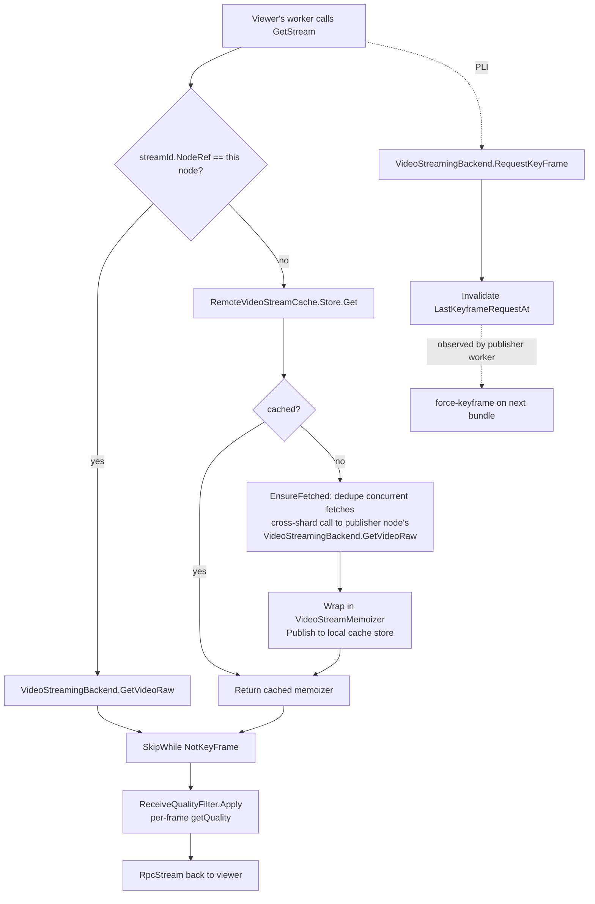

# 06 — Server fan-out and chat state

The publish path ends with a `VideoStreamMemoizer` registered in a
`StreamStore<VideoFrame>` on the publisher's backend shard. This doc covers
how that memoizer reaches viewers — including viewers connected to different
API or backend pods.

## Three services, three roles

| Service | Where | Purpose |
|---|---|---|
| `ILiveVideoStreams` | API pod | Auth, RPC façade for clients (`PushStream`, `GetStream`, …) |
| `IVideoStreamingBackend` | Backend pod (sharded by `ChatId` via `LiveBackend`) | Per-node `StreamStore` + memoizers |
| `ILiveVideoBackend` | Backend pod (sharded by `ChatId`) | Chat-wide registry (active streams, members, codec negotiation), Redis-backed |

Files:

- API: `src/dotnet/Streaming.Service/Services/LiveVideoStreams.cs`
- Backend stream: `…/Backend/VideoStreamingBackend.cs`
- Backend chat state: `…/Backend/LiveVideoBackend.cs`, `LiveVideoBackend.ChatState.cs`
- Cross-shard cache: `…/Services/RemoteStreamCaches.cs`, `…/Services/StreamStore.cs`

## The chat registry — `LiveVideoBackend`

`ILiveVideoBackend` is a Fusion compute service (sharded). It owns two
Redis-backed registries plus a per-node `ChatState` cache:

```
RedisMultiHashMap<VideoStreamInfo>      key="live-video:streams"  ttl=6 min
RedisMultiHashMap<VideoStreamMemberInfo> key="live-video:members"  ttl=6 min
ConcurrentDictionary<ChatId, ExpiringEntry<ChatState>>            ttl=5 min
```

### `Register(chatId, streamInfo)`

Called by `VideoStreamingBackend.PushVideo` at start, periodically (every
2.5 min) as a heartbeat, and whenever a layer's first keyframe is seen
(via the heartbeat path).

Behaviour:

- **Heartbeat fast-path**: if the record-equal `VideoStreamInfo` is already
  there, just `Touch` the Redis hash TTL and return. No invalidation cycle
  triggered for an unchanged entry.
- **Single screencast per chat**: rejects a second screencast (different
  author) with `InvalidOperationException`. The same author **can** replace
  their own prior screencast — every reconnect or pipeline restart mints a
  fresh `StreamId` and the same-author/same-kind loop below evicts the
  stale entry.
- **Camera limit**: max `Constants.Video.MaxCameraStreamsPerChat = 8`. Going
  over throws `VideoStreamLimitExceededException` (which propagates to the
  client and is surfaced in the UI).
- **Stale-stream eviction**: if the same author registers a new stream of
  the same kind, the older `StreamId` is removed (handles camera reconnects).

`List(chatId)` is `[ComputeMethod]` — invalidated by `Register`/`Unregister`
via `_listRawPrimer.Prime(...)`, so subscribers' UI can react to new streams
without polling. `WhereAlive` further filters out streams whose owning node
has dropped out of the mesh.

### Member registry — codec negotiation

`RegisterMember(session, chatId, supportedDecoderCodecs)` is called by every
*viewer* every 30 s (the timer in `VideoTrackPlayer.razor`). It writes a
`VideoStreamMemberInfo { SupportedDecoderCodecs, RegisteredAt }` row.

`GetSupportedCodecs(chatId)` (also `[ComputeMethod]`) recomputes the
intersection across all members via `ChatState.RecomputeCodecs(activeMembers)`
on every call, then returns the cached result. Senders use it to pick the
best mutually-supported codec.

Hysteresis (`ChatState.cs`):

- Upgrades (e.g. all viewers now have AV1) are delayed by
  `Constants.Video.CodecSwitchHysteresisWindow = 10 s`.
- Downgrades (e.g. a Safari user joins, can only do H.264) apply immediately.

Stale members (no update in `MemberStalenessThreshold = 90 s`) are filtered
on every call, with a fire-and-forget Redis cleanup for dropped entries.

## Per-node fan-out — `StreamStore`

File: `Services/StreamStore.cs`.

Each backend pod has a single `StreamStore<VideoFrame> _videoStreams`. The
store:

- Maps `StreamId → ExpiringEntry<AsyncMemoizer<VideoFrame>>`.
- `Publish(streamId, memoizer)` — atomic; loser of a race must dispose.
- `Get(streamId, [waitForShare], ct)` — returns the memoizer's shared
  `IAsyncEnumerable<VideoFrame>` (multiple consumers are joined onto the
  same stream).
- `ExpirationDelay = 30 s` — tears down the entry once the last consumer
  detaches.
- `ReplayTailSize = Constants.Video.ServerReplayTailSize` (360, derived).
- `OnStreamExpire` decrements `AppMeters.VideoStreamCount`.

`StreamId.NodeRef` lets every node figure out who owns a given stream. The
publisher's backend shard has the only authoritative memoizer; everyone else
talks to it via cross-shard RPC.

## Cross-shard fan-out — `RemoteVideoStreamCache`

File: `Services/RemoteStreamCaches.cs`.

When a viewer is on **API pod B** and the publisher's backend shard is
**node A**, simply forwarding viewer-by-viewer would cost N concurrent
cross-shard RPCs. The cache prevents that with two layers of dedupe:

1. A node-local `StreamStore<VideoFrame>` that holds a memoizer-on-top of
   the cross-shard pull — so viewers on this pod that arrive after the
   first one share the same memoizer.
2. An `_inflight: ConcurrentDictionary<StreamId, Task<bool>>` map that
   coalesces concurrent first-fetchers onto one cross-shard RPC.

The validator throws if a `StreamId` whose `NodeRef` matches this node
reaches the remote cache — local streams must always go through the
backend's `StreamStore`.

### `LiveVideoStreams.GetStream` flow

```csharp
var isLocal = streamId.NodeRef == MeshWatcher.ThisNode.Ref;
var rawStream = isLocal
    ? await VideoStreamingBackend.GetVideoRaw(streamId, ct)            // direct
    : await GetOrFetchRemoteVideo(streamId, ct);                       // cached + deduped
if (rawStream is null) return null;

// Defense in depth: prime a fresh KF in parallel for cold-cache joiners.
// CT.None deliberately — a viewer disconnect must not void a PLI other
// viewers are about to benefit from.
_ = VideoStreamingBackend.RequestKeyFrame(streamId, CancellationToken.None);

var filtered = ReceiveQualityFilter.Apply(rawStream,
    () => GetReceiveQuality(session, streamIdValue), Log, ct);

// Diagnostic: time from GetStream entry to first yielded frame.
return new RpcStream<VideoFrame>(LogFirstFrame(filtered)) {
    AllowReconnect = false,
    AckPeriod  = Constants.Video.RpcStreamAckPeriod,   // 5
    AckAdvance = Constants.Video.RpcStreamAckAdvance,  // 16
};
```

### `GetOrFetchRemoteVideo`

```csharp
var store = RemoteVideoCache.Store;

// Fast path: someone already cached it.
var stream = await store.Get(streamId, false, ct);
if (stream != null) return stream.SkipWhile(f => !f.IsKeyFrame);

// Slow path: dedupe concurrent fetches.
var fetched = await RemoteVideoCache.EnsureFetched(streamId, FetchAndPublish);
if (!fetched) return null;

return (await store.Get(streamId, true, ct))?.SkipWhile(f => !f.IsKeyFrame);

async Task<bool> FetchAndPublish(StreamId sid) {
    // CT.None on the cross-shard RPC: detaches the cached source from any
    // single viewer's lifetime.
    var rawRpcStream = await VideoStreamingBackend.GetVideoRaw(sid, CancellationToken.None);
    if (rawRpcStream == null) return false;
    var memoizer = new VideoStreamMemoizer(rawRpcStream,
        Constants.Video.ServerReplayTailDuration, CancellationToken.None);
    if (!store.Publish(sid, memoizer)) await memoizer.DisposeAsync();
    return true;
}
```

Three properties matter:

1. **One cross-shard RPC per stream per consumer-node**, regardless of how
   many viewers on that node — guaranteed by `EnsureFetched`'s in-flight
   map (`StreamCacheFetchDeduper.Run`), which makes concurrent first-fetchers
   share the same `Task<bool>`.
2. **`CancellationToken.None` on the cross-shard RPC**: the cached memoizer
   survives the first viewer disconnecting; later viewers benefit from the
   already-warm replay tail.
3. **Same memoizer policy as the publisher node** (~3.3 s tail), so cached
   streams have the same late-join properties locally.

The cache entry idle-expires after 30 s (`StreamStore.ExpirationDelay`) once
no viewers remain.

## Permission and discovery flow



### `RequestKeyFrame` and `LastKeyframeRequestAt`

`VideoStreamingBackend.RequestKeyFrame(streamId)`:

```csharp
var elapsed = now - await LastKeyframeRequestAt(streamId, ct);
if (elapsed < Constants.Video.KeyFrameRequestCooldown) return;       // 1 s
using (Invalidation.Begin())
    _ = LastKeyframeRequestAt(streamId, default);                    // bump compute method
```

`LastKeyframeRequestAt` is a Fusion compute method on the publisher's
backend shard. Its result is just `Clocks.SystemClock.Now`, but invalidation
is what matters: the publisher worker's RPC client subscribes to it and
forces the next bundle as a keyframe when it changes.

PLI fires on:

- Every `GetStream` call (collapsed by the 1 s cooldown into one PLI per
  burst of new joiners).
- Every `ChangePlaybackQuality` whose desired `MaxLayerId` or
  `MaxTemporalLayerId` for some stream **upgrades** (downgrades skip the
  request — see [08](./08-quality-control.md)).
- Direct client invocation: `ILiveVideoStreams.RequestKeyFrame(session, streamId)`
  is exposed as a fire-and-forget RPC for diagnostic / fallback paths.

## Stream limit and chat-side errors

`VideoStreamLimitExceededException` (`Api/Video/`) is thrown when:

- A 9th camera tries to register in one chat
  (`MaxCameraStreamsPerChat = 8`).
- A second author tries to start a screencast while another is active.

The exception propagates from `LiveVideoBackend.Register` up through
`VideoStreamingBackend.PushVideo` to `LiveVideoStreams.PushStream` and out
to the client, where the recorder treats it as a fatal start-up error and
surfaces a UI message ("ScreenCastAlreadyActiveModal" for the screencast
case).

## Module wiring

File: `Streaming.Service/Module/StreamingServiceModule.cs`.

- API pods register: `LiveVideoStreams`, `RemoteVideoStreamCache`.
- Backend pods register: `VideoStreamingBackend`, `LiveVideoBackend`, the
  Redis client.

The same process can play both roles depending on `HostInfo.Roles` — in
single-node dev, every backend service is local and the cross-shard cache
hot-path collapses to "is local? yes, direct".

## Where to look next

`ReceiveQualityFilter` is the per-consumer gate that turns a memoizer's
all-layer all-temporal stream into a viewer's specific layer/temporal
subset; it's covered in [08-quality-control.md](./08-quality-control.md).
The receiver-side player that drinks the resulting `RpcStream` is in
[07-receiver.md](./07-receiver.md).
