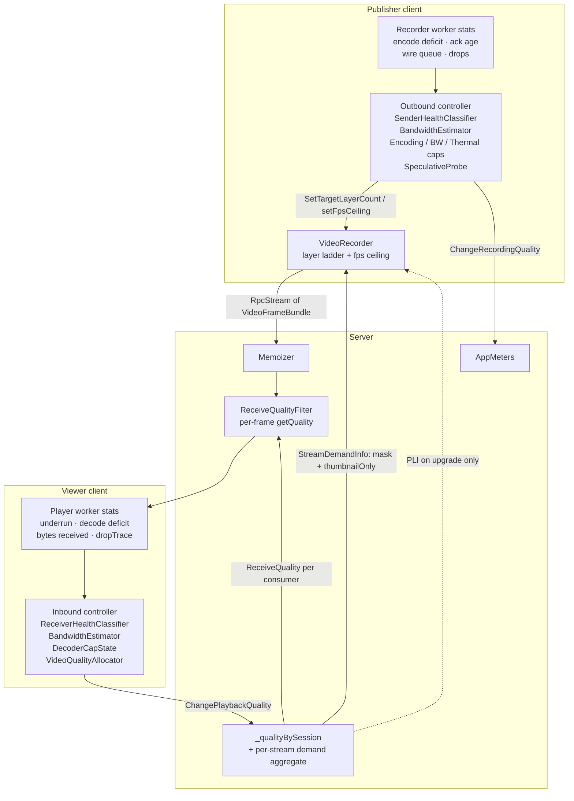

# 08 — Quality control

Two control loops, one on each end:

- A **sender** loop on the publisher's main thread that adjusts how many
  simulcast layers to encode for camera and screencast, treating them as
  shares of one shared upstream pipe.
- A **receiver** loop on every viewer's main thread that decides — for
  each stream that viewer subscribes to — which spatial layer
  (`ReceiveQuality.LayerId`) to ask for, anchored on one shared
  downstream pipe.

Plus a third, much simpler path that closes the circle: the server
aggregates what every viewer asked for and hands it back to the sender as
**demand**, so the sender stops encoding tiers nobody is watching.

The server doesn't make policy decisions; it carries the state, aggregates
demand, and enforces the per-consumer envelope via `ReceiveQualityFilter`
and `RequestKeyFrame`.

## Files

- Controllers (both sides) — `src/dotnet/UI.Blazor.App/Services/VideoQualityUI.cs`,
  split across the `.Recording`, `.Playback` and `.Debug` partials
- Shared adaptive controller — `src/dotnet/Core/Bandwidth/BandwidthEstimator.cs`
  (namespace `ActualChat.Bandwidth`)
- Health classification — same `Services/` folder:
  `HealthStreakState.cs`, `SenderHealthClassifier.cs`, `ReceiverHealthClassifier.cs`
- Caps, probe, allocator — same folder: `LayerCap.cs`, `EncodingCap.cs`,
  `BandwidthCap.cs`, `ThermalCap.cs`, `SpeculativeProbe.cs`,
  `DecoderCapState.cs`, `VideoQualityAllocator.cs`
- Layer ladder — `src/dotnet/Core/Media/VideoLayerDef.cs`
- RPC connection epoch — `src/dotnet/Core/Rpc/RpcConnectionInfo.cs`
  (consumed by ConnectivityUI; ConnectionInfo nullable until first connect)
- Wire types — `src/dotnet/Api.Contracts/Streaming/Quality/`
- RPC endpoints — `src/dotnet/Api.Contracts/Streaming/ILiveVideoStreams.cs`
- Server-side filter — `src/dotnet/Streaming.Service/Services/ReceiveQualityFilter.cs`
- Server-side demand + PLI — `src/dotnet/Streaming.Service/Services/LiveVideoStreams.cs`,
  `src/dotnet/Streaming.Service/Backend/VideoStreamingBackend.cs`
- Sender-side application of all of it —
  `src/dotnet/UI.Blazor.App/Services/VideoRecorder.cs` and
  `Components/VideoPanel/video-recorder.ts`

## The ladder

```csharp
CameraLayers    = [W320 @ 312.5 kbps, W640 @ 1250 kbps, W1280 @ 4000 kbps]
ScreenCastLayers = [W960 @ 4375 kbps, W1920 @ 11375 kbps]
```

Base bitrates are H.264-referenced; `VideoLayerDef.GetBitrateKbps(codec)`
divides by the codec's efficiency factor. Layer ids are **canonical**: `LayerId
= n` always means the same rung, whether or not the sender is currently
encoding it. That's what lets the sender drop a tier mid-stream without
renumbering anything.

## The wire types

```csharp
public sealed partial record ReceiveQuality
{
    public static readonly ReceiveQuality Paused = new(-1);
    public static readonly ReceiveQuality Lowest = new(0);
    public static readonly ReceiveQuality Default = new(1);

    public int LayerId { get; init; }     // inclusive max spatial layer kept
    public bool IsThumbnail { get; init; } // display role, not a bandwidth ask
}
```

`LayerId` is a single number, not a `(spatial, temporal)` pair — there is no
temporal-layer dimension on the wire. `-1` pauses the stream outright; the
server filter then drops every frame for that consumer, which is how a hidden
panel or a backgrounded tab stops costing downstream bandwidth.

`IsThumbnail` is the **display role**, and it is deliberately independent of
`LayerId`: a large tile clamped to L0 by a bad link must not read as a
thumbnail. It exists only to feed the sender's fps shed (below).

Around it:

- `PlaybackQualityInfo` — estimated capacity, aggregate health, reason,
  per-stream `PlaybackStreamInfo`, and a `StallNote` that carries receiver-side
  stalls into the server logs (the client console isn't collectable in the field).
- `RecordingQualityState` / `RecordingQualityInfo` — target vs. effective layer
  count, drop ratio, ack age, thermal level, hardware-acceleration flag. Server
  telemetry only; no decision is made from it.
- `StreamDemandInfo(Mask, ThumbnailViewersOnly)` — the per-stream viewer-demand
  aggregate the sender subscribes to.
- `PlaybackStats` / `RecorderStats` — **client-local**, never serialized. These
  carry the actual QC inputs.

## Shared building blocks

### Health verdicts and streak hysteresis

Both legs classify raw stats into `HealthVerdict` (`Unknown` / `Good` /
`Marginal` / `Bad`) before anything acts on them. One `HealthStreakState` per
signal owns the hysteresis:

- `isBad` for `BadStreakRequired` consecutive ticks ⇒ latch `Bad`.
- `isGood` for `GoodStreakRequired` consecutive ticks ⇒ latch `Good`.
- Neither ⇒ `Marginal`, and both streaks reset.
- **Bad-free decay**: a latched `Bad` relaxes to `Marginal` once
  `BadFreeStreak ≥ 2 × GoodStreakRequired`. Without it, a signal whose steady
  state sits between the two thresholds can never reach `Good` again and stays
  `Bad` forever.

`HealthVerdictExt.Combine` takes the **worst** verdict, ignoring `Unknown`.

The classifiers also report *attribution* — which named signals were `Bad`, and
how far the worst one is from its bad-free decay. That string is what shows up
in the diagnostics modal's decision log.

### `BandwidthEstimator` (Core)

The same algorithm runs on both sides, one instance per direction. It
tracks a single number — `CeilingBps` — its best estimate of the
available bandwidth on the current RPC connection. Updated each tick
from a fused `signalLevel ∈ [0, 1]` plus the observed `currentBandwidthBps`:

| `signalLevel` | Meaning | Estimator response |
|---|---|---|
| `1.0` | perfect | raise `CeilingBps` if we're pushing the limit |
| `0.5` | "real cap is ~half of what I just used" | drift `CeilingBps` toward `currentBps × 0.5` |
| `0.0` | catastrophic | drift hard down |

Magnitude of each move scales with `(1 − signalLevel)`, the consecutive
negative streak, and an age-decay factor (older, more-stable connections
move in smaller steps).

Both callers feed it a **binary** signal today: `VerdictToSignal` maps
`Bad → 0.0` and everything else → `1.0`. The smoothing that used to live in a
continuous penalty ramp now lives in the classifiers' streak counters, so the
estimator sees a clean edge rather than an averaged one.

**Measured-capacity anchor.** `ApplyMeasuredCapacity(measuredBps, producedBps, now)`
re-anchors the ceiling from an observed drain rate. The sender calls it only
while the wire queue is backlogged (`WireQueueDepthEma ≥ 2` bundles), because
that is exactly when the acked-bytes rate *is* the link capacity. The estimator
rejects the anchor when the drain rate isn't lagging production
(`MeasuredCapacityLagRatio = 0.9`) — a backlog draining at the produce rate is a
credit-window or RTT stall, not a bottleneck.

**Probe back-off.** When a lift→drop cycle happens (we tried to push the
ceiling and got slapped down), `ProbeFailures` increments and the next
upward probe is suppressed for
`min(MaxProbeCooldownSec, BaseProbeCooldownSec × ProbeCooldownGrowth^ProbeFailures)`
— `5 s`, growing `×1.7`, capped at `120 s`. A sustained calm period
(`CalmTicks ≥ ProbeFailureResetStreak = 20`) resets it, and
`ResetProbeBackoff()` clears it outright when something invalidates the prior
evidence rather than the health picture (the receiver calls it when render
demand grows).

**Connection epoch.** Each new RPC connection
(`ConnectivityUI.ConnectionInfo.Value.Index` change) resets `CeilingBps`
to `config.InitialCeilingBps` — `375 kB/s` (~3 Mbps) outbound, `1 MB/s`
(~8 Mbps) inbound — and clears all streaks / probe state / history. There's no
cross-epoch carry: the estimator re-learns the new connection's ceiling within
seconds, while the caller's last target keeps the user-visible quality steady.

### `RpcConnectionInfo` (Core)

```csharp
public sealed record RpcConnectionInfo(int Index, Moment ConnectedAt);
```

`Index` is monotonic across the process lifetime; `null` on
`ConnectivityUI.ConnectionInfo` means "not currently connected".

### `ThermalCap`

One instance shared by both directions, fed from `ThermalTracker.Level`. It
converts thermal pressure into hard limits *before* the OS throttles the whole
device:

| `ThermalLevel` | Camera layers | Screencast layers | Max fps | Inbound budget × | Max playback layers |
|---|---|---|---|---|---|
| Nominal / Fair | device cap | device cap | 0 (no ceiling) | 1.0 | unbounded |
| Serious | `deviceCap − 1` | device cap | 15 | 0.5 | 2 |
| Critical | 1 | 1 | 10 | 0.25 | 1 |

Escalation applies on the tick it's observed; **relaxing waits
`RecoveryDelaySeconds = 15` of sustained lower level**, because re-heating is
much faster than cooling and an eager step-up just re-trips the throttle.
`Tick` is called from three independent chains (the thermal watcher, the
outbound tick, the playback recompute) and is lock-serialized for that reason.
A level change from the watcher also sets `_forceOutboundEval`, so the encoder
clamps now rather than at the next 5 s interval.

## Sender side — outbound

### What composes the layer count

1. **`EncodingCap`** — driven by `RecorderStats.EncodeDeficitEma`, the
   *throughput deficit* `1 − bundlesEncodedPerSec / framesOfferedPerSec`
   (`0` = the encoder keeps pace, `1` = it emits nothing). The denominator is
   frames *offered* to the encoder, not captured, so deliberate fps pacing does
   not read as falling behind; and ticks before the encoder's first output are
   exempt for a bounded grace period, since an encoder still starting up scores
   a full `1` (see `EncodeDeficitTicker`). Deficit above
   `EncBadDeficit = 0.20` for 2 ticks demotes; below `EncOkDeficit = 0.05` for
   5 ticks promotes. In between is a **dead band**: the bad streak clears but
   the good streak only *decays by one*, so a single transient excursion can't
   wipe ramp progress and pin the encoder at one layer. Independent of bandwidth.
   Note this is throughput, not saturation — a queue-full encoder still emitting
   at source rate is healthy.
2. **`BandwidthCap`** — driven by `BandwidthEstimator`'s `NegativeStreak` (≥2 ⇒
   reduce) and `PositiveStreak` (≥5 ⇒ increase), the latter gated on confirmed
   headroom: `LastCurrentBps ≥ CeilingBps × ConfirmRatio`. Streak watermarks are
   *consumed*, so one streak can't walk the cap down twice.
3. **`ThermalCap`** — the table above, applied last.
4. **Device-class cap** — at construction:
   ```csharp
   var isMobile = BrowserInfo.IsMobile || HostInfo.AppKind.IsMobile();
   deviceCameraCap = isMobile ? Math.Min(2, VideoLayerDef.CameraLayers.Length)
                              : VideoLayerDef.CameraLayers.Length;
   screencastCap   = VideoLayerDef.ScreenCastLayers.Length;
   ```
   Mobile drops camera L2 (W1280); screencast always gets its full ladder.

`EncodingCap` and `BandwidthCap` each own their **own** `LayerCap` instance, so
the two pressures are tracked separately and the effective target is their
minimum. Within one `LayerCap`, `Reduce()` gives up **camera first** and
`Increase()` restores **screencast first** — screencast is the thing you're
actually reading, camera is the thing you can afford to blur.

Both cap objects seed their camera count at `SoftStartCameraLayers = 3`, clamped
to the device cap, so the ramp — not the first frame — earns the top tier. With
today's 3-rung camera ladder that seed equals the ceiling on desktop and the cap
on mobile, so the soft start is currently a no-op; it starts biting the day a
fourth rung is added.

Effective target per kind:

```
effCamera     = min(deviceCameraCap, min(encCam, bwCam) + probeExtra, thermalCam)
effScreencast = min(encScreencast, bwScreencast, thermalScreencast)
```

then floored at 1 and pushed to the recorder as `SetTargetLayerCount`, alongside
`setFpsCeiling(thermalCap.MaxFps)`.

### Health classification

Two independent verdicts per tick, each driving exactly one thing — **encoder
pressure never leaks into the bandwidth estimator**, which is the whole point of
the split:

| | Inputs | Drives |
|---|---|---|
| `ClassifyEncoder` | encode deficit (`>0.15` fg / `>0.30` bg ⇒ bad, `<0.03` ⇒ good), encoder queue depth (`>4.5` / `<1.0`), encoder restarts in 60 s (`≥2` ⇒ bad, `0` ⇒ good, else marginal), encode-path drop ratio (`>0.1`) | diagnostics + attribution |
| `ClassifyUplink` | wire ack age (`>2000 ms` / `<500 ms`), wire queue depth (`>4` / `<1` bundles), flood-gate skips/sec (`>0.5` / `0`), peer reconnect streak (`≥1`), wire-path drop ratio (`>0.1`) | `signalLevel` into the outbound `BandwidthEstimator` |

Defaults live in `SenderHealthThresholds`; `BadStreakRequired = 2`,
`GoodStreakRequired = 5`. The `EncodeDeficit` bad threshold is looser when the
tab is backgrounded, because the tab itself is throttled and the source rate is
naturally lower.

`EncodingCap` reads the raw deficit rather than the encoder verdict — the
classifier verdict exists for observability and for the eventual
background/foreground threshold switch.

Stats are fused across active kinds before classification (worst-of: `Max` for
every penalty-like input, `Min` for min-RTT).

### `SpeculativeProbe`

The drain-rate anchor above only works under backlog. An **idle** wire offers
nothing to measure, so a link that quietly got faster would never be
discovered. The probe covers exactly that case.

Arming conditions, all required:

- *(caller)* bandwidth is the binding cap and below the device ceiling
  (`min(encCam, bwCam) == bwCam < deviceCameraCap`), and the wire is not
  backlogged (`WireQueueDepthEma < 2` bundles),
- *(probe)* ack age is at or below
  `max(HealthyAckAgeMs, minRtt + HealthyAckSlackMs)` — `120 ms`, or RTT +
  `60 ms` on links whose propagation delay alone exceeds it,
- *(probe)* wire queue ≤ `ShallowQueueBundles = 1.5` bundles,
- *(probe)* no cooldown pending.

It then transmits **one** extra camera layer for `WindowTicks = 2` and watches
ack age. Ack-age inflation past `AckAgeInflationMs = 150` (or the queue
doubling past the shallow gate) aborts the probe and grows the cooldown
(`BaseCooldownTicks = 6`, `×1.7` per failure, capped at `60`). Surviving the
whole window commits the climb via `BandwidthCap.Layers.Increase()` and resets
the failure count.

The committed climb only raises the *health* ceiling. What actually goes on the
wire long-term is still gated by viewer demand, so a passed probe costs nothing
once its window ends.

### Outbound per-tick (gated by `IsEvaluationDue`, forced on thermal change)

```
 1. Fuse RecorderStats across kinds (worst-of per signal)
 2. encoderHealth = ClassifyEncoder(...);  uplinkHealth = ClassifyUplink(...)
 3. bwEstimator.Tick(connection, now, totalBytesPerSec, VerdictToSignal(uplink))
 4. if wire backlogged: bwEstimator.ApplyMeasuredCapacity(ackedBytesPerSec, ...)
 5. encodingCap.Tick(fusedEncodeDeficit)
 6. bwCap.Tick(bwEstimator)
 7. probeExtra = speculativeProbe.Tick(...)        // 0 or 1 camera layer
 8. thermalCap.Tick(now, thermalLevel)
 9. effCamera / effScreencast = min(...) as above, floored at 1
10. per kind: SetTargetLayerCount(target) if changed; setFpsCeiling(thermalCap.MaxFps)
11. ChangeRecordingQuality(state, info)            // server-side telemetry only
12. Append one QualityDecisionEntry to the outbound decision log
```

**Restart cooldown.** A recorder worker restart zeroes `RecorderStats`'
monotonic counters. The controller detects the counters going backwards,
re-baselines the byte samples, and skips `RunOutboundTick` for
`RestartCooldownTicks = 2` — otherwise the transient `bytes/sec = 0` reads as a
bad signal and cascades into demote → restart → demote. Streaks on the
estimator, both caps and the probe are reset at the same time; the
`SenderHealthClassifier` itself is not recreated.

## Receiver side — inbound

### Per-stream health classification

One `ReceiverHealthClassifier` per stream, pruned when the stream goes away.

**`ClassifyDownlink`** combines only *direct delivery failures*:

- **buffer underrun ratio** — `>0.30` for 2 ticks ⇒ bad, `<0.05` for 5 ⇒ good.
- **server-path drop ratio** — `>0.1` ⇒ bad, no streak.

Deliberately **excluded** from the combine, though both stay on the record for
diagnostics: server→receiver latency (high RTT with healthy throughput is no
reason to lower bitrate) and incoming byte-rate deficit (actual-vs-predicted is
a codec/scene-variance artifact, not a delivery problem).

The drop ratio counts **only `FrameDropStage.ReceiverPull` (61)** — the gap
detector on the raw arrival sequence. The other receiver stages are benign and
burst at join: `ReceiverEncodedBuffer` (62) keyframe-gating, `ReceiverDecode`
(63) decoder warmup, `ReceiverPresent` (64) present-pacer catch-up,
`ReceiverSkipToLive` (65). Counting them spiked the ratio to ~0.5 on localhost
at join and ratcheted the ceiling down for no reason.

**`ClassifyDecoder`** combines:

- **decode deficit** `1 − framesDecoded/chunksArrived` — `>0.10` for 2 ticks ⇒
  bad, `<0.03` for 5 ⇒ good.
- **decoder hangs in 60 s** — `≥1` ⇒ bad.
- **decode-path drop ratio** — `>0.1` ⇒ bad.

`DecodeRatioEma`, `RecoveryStreak` and `PresentSkipRatio` remain on the record
but no longer drive the verdict: `DecodeRatioEma` conflates per-frame work with
queue wait, and the other two were noisy enough to demote healthy streams.

The worst per-stream verdict on each leg becomes the session aggregate.

`PlaybackRateEma` — source-clock ms drained per wall-clock ms at the present
stage, clamped to `[0, 1]` so catching up earns no credit, maintained in
`frame-envelopes.ts → updatePlaybackRateEma()` and byte-weighted across streams
here — is still computed and reported, but it is a **diagnostic** today, not a
controller input.

### Decoder cap (`DecoderCapState`)

A slow decoder is a local problem, so it must demote **its own viewer's stream**
without dragging the shared downlink estimate down with it.

- On a **Good→Bad edge** (edge, not every bad tick — walking down per tick
  overshot), cap that stream at `currentLayer − 1`.
- Release is stepwise: every `GoodTicksPerRaise = 3` consecutive `Good`
  verdicts raise the cap by one tier; when the cap reaches the requested layer
  it is dropped entirely. A one-shot release re-triggered the stall and
  oscillated cap↔uncap on a ~1 min cadence.
- `Marginal` / `Unknown` hold the cap and reset the raise streak.

The allocator applies it as `LayerCountCap ← min(LayerCountCap, cap + 1)`.

**Keyframe rescue.** A decoder stuck waiting for a keyframe drops every delta
and reads as `Bad` with a deficit near 1. When the verdict is `Bad` *and*
`DecodeDeficitEma > 0.5`, the receiver sends `RequestKeyFrame` (per-stream
cooldown 1 s), bounding the stall to the server's PLI cooldown instead of a full
~3 s keyframe interval.

### Capacity, and the receiver's probe

The receiver has the opposite problem to the sender: it is fed
supply-limited goodput as "current bandwidth", so a ceiling once ratcheted down
to L0 can never *measure* enough to climb back. The only way to learn real
downlink capacity is to ask for more and watch it arrive.

```
estimatedCapacity = inboundBwEstimator.CeilingBps
                  × debugBandwidthMultiplier
                  × thermalCap.InboundBudgetMultiplier
```

Two probes sit on top of that, in `GetAllocationCapacity`:

- **Startup probe** — while `!HasSeenBadSignal`, capacity is
  `max(estimated, Σ maxRate(primaries) + Σ floorRate(secondaries))`, or
  `Σ maxRate(secondaries)` when there is no primary at all. This runs before the
  first bad signal ever arrives.
- **Re-probe** — after the fact, gated by `ShouldReprobe`: aggregate downlink
  `Good`, decoder not `Bad`, `CalmTicks ≥ ReprobeCalmStreak = 3`, and the
  estimator's exponential probe cooldown elapsed since the last ceiling-down.
  Every *healthy* stream may then climb to its requested cap; unhealthy ones
  stay at floor.

A failed probe demotes through the normal path, which grows the cooldown. When
render demand grows (a tile the user just enlarged), `ResetProbeBackoff()`
clears the cooldown — the earlier failures were earned at a lower requested
rate and say nothing about the rate now being asked for. First sight of a
stream only seeds the demand map; it never counts as growth, or a congested
link that keeps flapping streams would collapse the back-off every tick.

### Priority allocator (`VideoQualityAllocator`)

Spatial layers only. Per tick:

```
1. Apply the decoder cap to every request
2. floorBudget   = Σ over secondaries of predictedRate(layer 0)
3. primaryBudget = max(0, budget − floorBudget)
4. for each primary: largest layer whose predicted rate fits the remaining primary budget
5. remaining = budget − primariesUsed
6. for each secondary:
       share = remaining × renderArea(s) / Σ renderArea(*)   (equal split if no areas)
       share = max(share, floorRate(s))
       largest layer that fits, never below layer 0
7. ReceiveQuality(LayerId = layers − 1)
```

Predicted rates come from the static ladder at the stream's codec, with one
exception: the *requested* rung's rate is raised to the observed peak byte rate
when the encoder is genuinely over-delivering, capped at
`ObservedRateCapMultiplier = 1.5×` the ladder value and decayed at
`0.80/second` so a keyframe burst at join can't pin L2 as "too expensive" for
long.

`RenderArea` is `(cssLongSide × dpr)²`. A stream that doesn't fit even at floor
is omitted from the result and the caller maps it to `ReceiveQuality.Lowest`.

After allocation, panel mode overrides everything: `Hidden` (or a hidden
tab / backgrounded app) pauses **every** stream; `Collapsed` pauses every
secondary. `IsThumbnail` is then stamped from the *pure* render demand
(`RequestedLayerCount ≤ 1` on a secondary), never from the clamped result.

### `RenderVideoSize` → per-stream layer cap

`GetBestLayerFor(sourceKind, desiredSize)` uses the standard ABR rule:
**smallest ladder layer with `Width ≥ desiredWidth`**, falling back to the
largest available. The older "nearest by absolute distance" rule biased toward
the lower layer when the desired size sat between two rungs — with screencast's
two far-apart rungs (W960, W1920) a typical modal-sized tile rounded down, which
is the historical "screencast always presents L0" bug.

The viewport pushes `RenderCssLongSide` / `RenderDevicePixelRatio` through
`PlaybackStats`; a primary stream with no layout information yet requests the
top size rather than guessing small.

### Cadence

`IsEvaluationDue` is shared by both legs — the outbound tick measures the
recording run's age, the inbound one measures each stream's age.

- `QcStartupCooldown = 3 s` — unconditional, even for forced evaluations:
  layer requests during the keyframe wait and the EMA ramp-up are based on
  noisy signals.
- `QcSettlingInterval = 3 s` until stream age `QcSettlingDuration = 10 s`.
- `QcSteadyInterval = 5 s` thereafter.
- `PlaybackHealthTtl = 10 s` — a stream whose stats go silent for that long is
  pruned, and its silence is reported as a `stats-silent` stall (pruning also
  removes its bytes from the estimator input, so the ceiling would otherwise
  stop tracking reality).
- `PlaybackQualityKeepAlivePeriod = 1 min` — heartbeat so the server's
  `_qualityBySession` and the backend's demand retention don't go stale.
- `ColdStartTicks = 2` suppresses the first two outbound ticks **after a
  reconnect** (it is not armed at process start).

A stream's first stats tick always emits an allocation, so a new tile gets a
sensible envelope immediately. Manual paths — debug override, keep-alive,
panel-mode and thermal changes — bypass the cadence gate and recompute directly.
The recompute is serialized behind a semaphore: triggers race in from six
independent watchers and it mutates plain dictionaries across awaits.

### Inbound per-tick

```
1. Prune stale streams; classify Downlink + Decoder per stream
2. Aggregate worst verdict per leg; update DecoderCapState
3. inboundBwEstimator.Tick(connection, now, sumIncomingBytesPerSec, VerdictToSignal(downlink))
4. thermalCap.Tick(now, thermalLevel)
5. capacity = GetAllocationCapacity(estimated, ..., startup/re-probe)
6. Build StreamAllocationRequests (predicted rates, LayerCountCap, RenderArea)
7. VideoQualityAllocator.Allocate(capacity, primaries, secondaries, decoderCaps)
8. Apply panel-mode pauses; stamp IsThumbnail
9. ChangePlaybackQuality(session, requestedMap, info)
10. Append one QualityDecisionEntry to the inbound decision log
```

## Viewer demand → sender

`ChangePlaybackQuality` forwards each viewer's per-stream `LayerId` to the
stream's owning node, which aggregates it into
`StreamDemandInfo(Mask, ThumbnailViewersOnly)`. `Mask` is the OR of every
subscriber's requested layer bits; `ThumbnailViewersOnly` is true when every
active viewer displays this stream as a thumbnail.

`VideoRecorder` subscribes to that aggregate (with a periodic re-assert, since
invalidation is edge-only) and pushes it into the worker:

- **`setDemandedLayers(mask)`** sets `receiverLayerCap`, and
  `applyEffectiveLayers()` takes `min(fullLadder, healthLayerCap,
  receiverLayerCap)`. Demand can only *narrow* the ladder — it never pulls in a
  tier the sender's own health cap hasn't cleared. Notably it can also drop
  **lower** tiers: a focused 1:1 call collapses to the top rung alone.
- `mask == 0` means nobody is subscribed or everyone is paused. A brief zero
  keeps the current ladder (the next joiner pays no restart cost); a sustained
  zero arms an **idle collapse** to the bottom tier only — the expensive upper
  tiers stop encoding, L0 keeps the wire alive. fps is untouched, because the
  local self-preview taps after the pacer.
- **`setThumbnailOnly(flag)`** arms an fps shed after a delay, disarms
  instantly, and is camera-only — screencast never sheds fps. Layer demand
  deliberately does *not* drive fps: it is a resolution signal, and small
  screens or receiver clamps lower it for reasons that have nothing to do with
  motion.

Ladder changes hot-apply through `worker.reconfigureLayers()` when the codec and
source dimensions are unchanged; a full pipeline restart is only the fallback
path when that fails or the ladder is empty.

## Server enforcement — `ReceiveQualityFilter`

Per-consumer state:

```
consumerLayerId   ← ReceiveQuality.LayerId   (init -1)
selectedLayer     ← -1
lastKeyFrameNumber← -1
skipping          ← true
```

For each incoming frame:

```
q = getQuality()
if q.LayerId != consumerLayerId:
    consumerLayerId = q.LayerId
    if q.IsPaused: skipping = true; selectedLayer = -1
if consumerLayerId < 0: continue                  # paused

desiredLayer = SelectLayer(consumerLayerId, frame.EffectiveLayerMask)
if desiredLayer < 0: continue                     # producer encodes nothing

if frame.IsKeyFrame:
    if frame.LayerId == desiredLayer:
        selectedLayer = desiredLayer
        lastKeyFrameNumber = frame.KeyFrameIndex
        skipping = false
        yield frame
    continue                                      # other layers' KFs

else (delta frame):
    if skipping || selectedLayer < 0: continue
    if (layerMask & (1 << selectedLayer)) == 0:   # producer dropped the tier mid-GOP
        skipping = true; continue
    if frame.LayerId != selectedLayer: continue
    if frame.KeyFrameIndex != lastKeyFrameNumber: # gap detected
        skipping = true; continue
    yield frame
```

`SelectLayer(requested, mask)` resolves the request against what the producer is
*currently* encoding: the largest available id **≤ requested** (never exceed the
asked-for bandwidth), else the smallest one above it. For a legacy contiguous
mask this reduces to `min(requested, count − 1)`.

Three behaviours fall out:

1. **Layer switches only on a keyframe.** Asking for a different `LayerId` is
   cheap; the new layer locks in when its next keyframe arrives. Combined with
   the server-issued PLI on upgrade, that's typically < 50 ms.
2. **Pausing is instant and total.** `LayerId = -1` drops every frame for that
   consumer, which is what makes a hidden panel actually stop costing bandwidth.
3. **Gap detection via `KeyFrameIndex`.** Memoizer eviction mid-GOP flips the
   filter back to `skipping` until the next matching keyframe.

**Stream count cap.** `ApplyStreamCountCap` allows at most **9** above-Lowest
streams per session; beyond that it demotes to `Lowest`, secondaries before
primaries, preserving request order within a rank. UI clients should therefore
set stream priority correctly on subscribe.

## Late joiners and PLI

A new viewer's `GetStream` call:

1. Always fires `RequestKeyFrame(streamId)` — rate-limited to
   `KeyFrameRequestCooldown` per stream on the backend, so concurrent joiners
   collapse to one PLI. The token is `None`: one viewer disconnecting must not
   void a PLI other viewers benefit from.
2. Falls into the memoizer's `Replay`, which starts from the preserved keyframe
   anchor — most of the time a usable keyframe for the desired layer is already
   in the prefix.
3. If not, the PLI forces a fresh keyframe ≤ 1 s away and the filter locks on.

**PLI on upgrade only.** `ChangePlaybackQuality` requests a keyframe for every
stream whose `LayerId` went *up*. On downgrades it deliberately doesn't: keeping
the higher layer a little longer is fine, and burning the cooldown on a
downgrade would block the next upgrade's keyframe. A stream that merely
*re-appears* (a stats-silent prune flap, not a real upgrade) is additionally
cooldown-gated per `(session, stream)`, after a 2026-07-24 incident where flaps
keyframe-flooded the sender.

## End-to-end signal flow



Both controllers also append one `QualityDecisionEntry` per tick to a 10-row
ring buffer per direction — verdicts, the cap that moved, the dominant reason,
and the raw numbers behind them. `VideoDiagnosticsModal` renders those two
buffers as its decision log (`AppendDecisionLog`); the rest of the diagnostic
surface is in `09-diagnostics.md`.

## Known limits and trade-offs

- **Probing is one layer wide on the sender and all-or-nothing on the
  receiver.** `SpeculativeProbe` adds a single camera tier for two ticks; the
  receiver's re-probe lifts *every* healthy stream to its requested cap at once.
  Neither is a WebRTC-style padded bandwidth ramp — there is no synthetic
  traffic, only real layers requested speculatively.
- **The two legs share one `ThermalCap` but not one estimator.** Uplink and
  downlink ceilings are learned independently, which is right for asymmetric
  links but means a device saturating its uplink learns nothing about its
  downlink.
- **Decoder health caps a stream, downlink health caps the session.** That split
  is deliberate (a slow decoder mustn't ratchet the shared ceiling down), but it
  means a viewer whose device is the bottleneck on *every* stream walks each one
  down separately, three good ticks per tier at a time.
- **Stream count cap is 9 above-Lowest.** Above that, the server demotes by
  priority then registration order.
- **No cross-epoch carry on the estimator.** Each reconnect re-learns the
  ceiling from `InitialCeilingBps`. User-visible quality stays steady because
  the caller's last target resumes immediately — the estimator just needs a
  couple of seconds of good signal to walk back up.
- **Several `Constants.Video` penalty thresholds are vestigial.**
  `DropOkSender`, `DropBadSender`, `DropOkReceiver`, `DropBadReceiver`,
  `PlaybackRateOk`, `PlaybackRateBad`, `AckOkMs`, `AckBadMs`, `LastAckBadMs`,
  `LastAckGoodMs` and `BufferDurationTooLowMs` date from the earlier
  continuous-penalty `signalLevel` and have no consumers today — the live
  thresholds are the classifier defaults. Read them as history, not as
  configuration.
