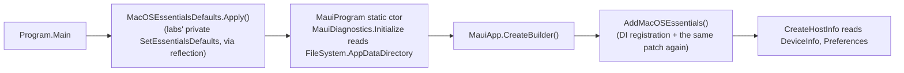

# macOS AppKit backend
The Mac app runs on the experimental AppKit backend from
[dotnet/maui-labs](https://github.com/dotnet/maui-labs) (`net11.0-macos`), so Voxt is a
native AppKit process with a WKWebView inside, not a Mac Catalyst app. Mac Catalyst is kept
intact as a second Mac target; "mac" or "macos" without a qualifier means AppKit everywhere
in the tooling, Catalyst is always named explicitly.

[[toc]]

## Building and running

| What | How |
|---|---|
| Enable the target | `-p:EnableMacOSAppKit=true`, or the `-p:TargetFrameworks="net11.0-macos;net11.0"` override that the scripts use; needs `sudo dotnet workload install macos` |
| Run the app | `./b.cmd app run mac` ([run-mac.sh](https://github.com/Actual-Chat/actual-chat/blob/main/scripts/run-mac.sh)), or `/mac-run` |
| Run Mac Catalyst instead | `./b.cmd app run mac --catalyst` |
| Package for TestFlight | `./b.cmd app pack mac`, `--universal` for an arm64 + x64 bundle; see [Build tool](./build-tool.md) |
| Logs | `~/Library/Logs/ActualChat.log` |

The labs packages are pinned in
[Directory.Packages.props](https://github.com/Actual-Chat/actual-chat/blob/main/Directory.Packages.props):
`Microsoft.Maui.Platforms.MacOS`, `.Essentials` and `.BlazorWebView`. They are built against
MAUI 10 and consumed from the .NET 11 / MAUI 11 preview build, which works in practice but is
not a supported combination.

## Workarounds to remove when the backend is officially supported

The labs packages are a preview: the BlazorWebView handler has no extension points, Essentials
is implemented by patching MAUI's static facades through reflection, and several Essentials
areas are not implemented at all. Every place where Voxt works around that is marked
`TODO(maui-labs)` in the source, so the full list is always one search away:

```bash
git grep -n "TODO(maui-labs)"
```

This is the same list, grouped by what has to change upstream for each item to go.

### The labs BlazorWebView handler has no hooks

The official `BlazorWebView` raises `BlazorWebViewInitializing` with the WKWebView
configuration before the view is built, plus `BlazorWebViewInitialized` and `UrlLoading`. The
labs `MacOSBlazorWebView` raises nothing, and its handler builds the configuration from private
members. WebKit accepts extra URL scheme handlers only before the WKWebView exists, so the
`content://` handler for local-file previews can only be added by rebuilding the configuration.

| Workaround | Goes away when |
|---|---|
| [MacOSCustomBlazorWebViewHandler.CreatePlatformView](https://github.com/Actual-Chat/actual-chat/blob/main/src/dotnet/App.Maui/Platforms/MacOS/MacOSCustomBlazorWebViewHandler.cs) replays the base handler's three config lines (`webwindowinterop` message handler, Blazor init script, `app://` scheme handler) and adds `content://`, autoplay and `__useWebAudio` | the labs handler raises `BlazorWebViewInitializing`; the config then moves back to `MauiWebView.MaciOS.OnInitializing` |
| [LabsBlazorWebViewHandlerExt](https://github.com/Actual-Chat/actual-chat/blob/main/src/dotnet/App.Maui/Platforms/MacOS/LabsBlazorWebViewHandlerExt.cs) reaches the private `BlazorInitScript`, `WebViewScriptMessageHandler`, `SchemeHandler` and `MessageReceived` by reflection, failing fast on a rename | same as above |
| `LayoutInvalidatingWKWebView` in the same file sets `Superview.NeedsLayout` on attach, because the labs `ContentPageHandler` adds content without invalidating layout and a late-attached WebView keeps a zero frame | the labs page handler invalidates layout |
| The `#if MACOS` branch in [MauiWebView.cs](https://github.com/Actual-Chat/actual-chat/blob/main/src/dotnet/App.Maui/WebView/MauiWebView.cs) builds the view without event subscriptions | `MacOSBlazorWebView` gets the three events |
| [MauiWebView.MacOS.cs](https://github.com/Actual-Chat/actual-chat/blob/main/src/dotnet/App.Maui/WebView/MauiWebView.MacOS.cs) attaches its own `WKNavigationDelegate` and `WKUIDelegate` as the stand-in for `UrlLoading` | same |

Each of the three replayed config lines was verified by removing it and running the app: no
message handler leaves the loading skeleton and a JS error on the first message; no init
script leaves `Blazor` loaded but never started, silently; no `app://` handler leaves the
WebView on `about:blank`.

### Essentials is patched in, not implemented

There is no official Essentials build for `net-macos`, so the neutral
`Microsoft.Maui.Essentials.dll` ships, and every platform member in it throws
`NotImplementedInReferenceAssemblyException`. Labs' `AddMacOSEssentials()` registers its own
implementations in DI and swaps them into the static facades by reflection, but only once a
`MauiAppBuilder` exists.



| Workaround | Goes away when |
|---|---|
| [MacOSEssentialsDefaults](https://github.com/Actual-Chat/actual-chat/blob/main/src/dotnet/App.Maui/Platforms/MacOS/MacOSEssentialsDefaults.cs), called from [Program.Main](https://github.com/Actual-Chat/actual-chat/blob/main/src/dotnet/App.Maui/Platforms/MacOS/Program.cs) before any managed code | labs exposes a public entry point, or Essentials ships a macos implementation |
| The `AddMacOSEssentials()` call ahead of `CreateHostInfo` in [MauiProgram.cs](https://github.com/Actual-Chat/actual-chat/blob/main/src/dotnet/App.Maui/MauiProgram.cs) | same |
| [MacOSMainThread](https://github.com/Actual-Chat/actual-chat/blob/main/src/dotnet/App.Maui/Platforms/MacOS/MacOSMainThread.cs), aliased as `MainThread` in [AppServicesAccessor.cs](https://github.com/Actual-Chat/actual-chat/blob/main/src/dotnet/App.Maui/AppServicesAccessor.cs) | Essentials' `MainThread` works on the macos TFM |
| The `MacOS*PermissionHandler` classes in [Platforms/MacOS](https://github.com/Actual-Chat/actual-chat/tree/main/src/dotnet/App.Maui/Platforms/MacOS), AppKit twins of the `Maui*` ones on the same `AVCaptureDevice`, `CLLocationManager` and `CNContactStore` calls Essentials makes on iOS; [MacOSMediaCapture](https://github.com/Actual-Chat/actual-chat/blob/main/src/dotnet/App.Maui/Platforms/MacOS/MacOSMediaCapture.cs) holds the microphone/camera pair the WebKit media-capture delegate reads too | labs implements Permissions |
| [MacOSContacts](https://github.com/Actual-Chat/actual-chat/blob/main/src/dotnet/App.Maui/Platforms/MacOS/MacOSContacts.cs) enumerates `CNContactStore` into the `MauiContacts` mapping, with a per-install device id from `MauiPreferences.DeviceId` because the vendor-id plugin has no macos build | labs implements Contacts and the plugin gains a macos build |

::: warning Known labs quirks that are not worked around
- `FileSystem.AppDataDirectory` is `~/Library` and `CacheDirectory` is `~/Library/Caches`, with
  no bundle-id subfolder. Release builds are sandboxed, so there the paths land inside the app
  container; unsandboxed Debug builds write straight into `~/Library`.
- The statics patch runs twice (from `Main` and from `AddMacOSEssentials`), and each run calls
  `VersionTracking.Track()` on a fresh instance, so `IsFirstLaunchForCurrentVersion` reads
  false even on a genuine first launch. Voxt does not use `VersionTracking`.
:::

### Diagnostics

| Workaround | Goes away when |
|---|---|
| The `MACOS` branch of [MauiDiagnostics.AddPlatformLoggerSinks](https://github.com/Actual-Chat/actual-chat/blob/main/src/dotnet/Maui/MauiDiagnostics.cs) writes a plain file, mirroring Windows, with the matching `Serilog.Sinks.File` reference in [Maui.csproj](https://github.com/Actual-Chat/actual-chat/blob/main/src/dotnet/Maui/Maui.csproj). The `MaciOS` Apple unified-log sink is not compiled for the macos TFM, and Sentry's native crash capture does not cover it; the managed Sentry sink does run | the sinks are shared with Catalyst and native Sentry covers AppKit |

### Build and packaging

| Workaround | Goes away when |
|---|---|
| `net11.0-macos` is opt-in via `EnableMacOSAppKit` in [App.Maui.csproj](https://github.com/Actual-Chat/actual-chat/blob/main/src/dotnet/App.Maui/App.Maui.csproj), so machines without the `macos` workload still restore | the backend is a regular MAUI target |
| The `NBGV_SetVersionForMacOS` target in the same file stamps the version, because Nerdbank.GitVersioning covers the ios and maccatalyst TPIs only | NBGV covers the macos TPI |
| A pre-rendered `appicon_macos.png` replaces `appicon.svg`, because the labs icon target feeds `MauiIcon` straight to `sips`, which cannot rasterize SVG | the macos icon target rasterizes SVG like the other platforms |
| The labs package pins in [Directory.Packages.props](https://github.com/Actual-Chat/actual-chat/blob/main/Directory.Packages.props) | macOS ships in the regular `Microsoft.Maui.*` packages |

## What is deliberately not ported yet

These are Voxt decisions rather than labs limitations, and they carry their own `TODO(FC)`
markers:

- **Audio** runs on the web pipeline the browser app uses (`BrowserInfo.useWebAudio`), with
  `WebRecorderEngine`, the JS playback engine and a no-op VAD. Tunes go the same way through
  `WebTuneUI`: `AppleTuneUI` plays on the shared AVAudioEngine and the AVAudioSession-based
  focus stack, and `MauiTuneUI` on `Plugin.Maui.Audio`, which has no macos TFM. The native port
  needs an AVAudioSession-free audio session, a macos build of the Opus codec and the CoreML VAD
  model.
- **Notifications** are pull-based through `NotificationReconciler` and delivered only while the
  app runs; there is no APNs-for-Mac push path.

## Behaviour worth knowing

- **Sign-in** uses the Windows-style flow: the default browser plus a `voxt-dev://` callback
  registered in `Info.plist` (a prod-flavour build needs `voxt` there). `ASWebAuthenticationSession` was tried and dropped, its
  handoff stalls in Chromium browsers and its ephemeral session forces a separate Google login.
- **Downloads** go through `MacOSFileSaver` (an `NSSavePanel`, or a folder picker for several
  files). The JavaScript `<a download>` fallback that Windows relies on does not work in a
  WKWebView: it navigates the main frame to the `blob:` URL and replaces the app shell.
- **Local-file previews** (`content://files/<key>`) load as `` and `<video>` sources.
  `fetch` of such a URL is blocked as cross-origin, the same as on iOS and Catalyst.
- **Permissions are attributed to the launcher when the binary is run from a shell.** macOS
  charges TCC decisions of a process started directly from a terminal to that terminal's
  responsible app, so contacts read as denied and the microphone as whatever the terminal was
  granted, and no prompt ever appears. `run-mac.sh` therefore launches through LaunchServices
  (`open`), which makes the app its own TCC principal; do the same when starting it by hand.
- **Link navigation** is fail-closed: any `http(s)` URL that is not the app's own origin or an
  allowed host opens in the default browser and is cancelled in the WebView, including
  `window.open` and `target=_blank`.
