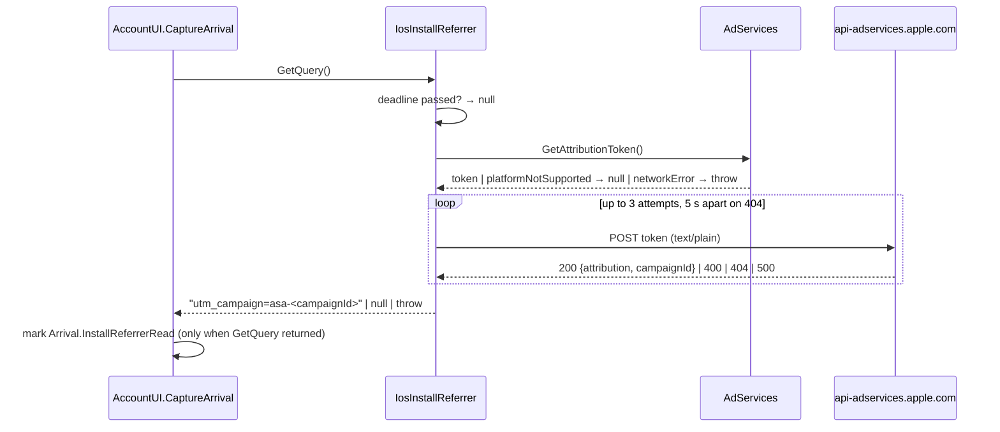

# Apple Ads attribution on iOS — count Apple Ads installs as a campaign arrival (#4915)

> Status: planned (2026-09-29), branch `feat/4915-read-apple-ad-attribution`.

## TL;DR

- **Problem.** Since #4877 a sign-up records how the user arrived. Android reads the Play
  install referrer, so a Play campaign install becomes `campaign:<id>`. iOS reads nothing, so
  every App Store install is `store`, and the walkie-talkie acquisition experiment (Apple Search
  Ads, marketing plan `plans/2026-10-06-acquisition-experiments.md`, task M51) cannot be measured.
- **Fix.** One new platform class, `IosInstallReferrer`, behind the existing
  [`IInstallReferrer`](https://github.com/Actual-Chat/actual-chat/blob/main/src/dotnet/UI.Blazor/Services/IInstallReferrer.cs)
  seam, registered in `MauiProgram.iOS.cs` exactly like `AndroidInstallReferrer`. It asks
  AdServices for the attribution token (`AAAttribution.GetAttributionToken`, iOS 14.3+, no App
  Tracking Transparency prompt), resolves it **from the app** with a `POST` to
  `https://api-adservices.apple.com/api/v1/` (Apple's 3 × 5 s retry on `404`), and returns
  `utm_campaign=asa-<campaignId>` when the answer is `attribution: true`. Everything else
  (`attribution: false`, unsupported platform, invalid token) returns `null`, so the fallback
  stays `store`.
- **Nothing changes** in `AccountUI`, `ArrivalInfo`, the server or the DB: `asa-542370539` is
  already a valid campaign id, and the once-per-install and never-fail-a-flow rules are the
  seam's, not the platform's. Transient failures (offline, Apple `500`) are *thrown*, which the
  existing `ReadInstallReferrer` already turns into "try again at the next start" because it
  marks the referrer read only after `GetQuery` returns; a 24-hour deadline kept in
  `MauiPreferences` stops that retry, because Apple's tokens and records live 24 hours.
- **Developer Mode trap.** On a device with Developer Mode on, Apple returns a fixed *test*
  payload (`campaignId: 1234567890`) for every install. It is reported as `asa-test`, which
  keeps team devices out of the real campaign's numbers and gives an end-to-end check that
  needs no live campaign.
- **Done when** a TestFlight or store install from an Apple Ads test campaign records
  `SignUp` with `source_id = campaign:asa-<campaignId>`, an organic install still records
  `store`, and a Developer Mode device records `campaign:asa-test`.
- **Size.** One ~120-line file, one registration line, one docs paragraph, one unit-test case.
  No new shared abstractions.

## Goal

An iPhone install that came from an Apple Ads tap (or view) must sign up with the arrival
`campaign:asa-<campaignId>`, so the activation report in `docs-internal/docs/arrival-funnel.md`
can compare Apple Ads users with organic `store` users. An install Apple cannot attribute must
keep the `store` fallback. Reading the attribution must never delay or fail sign-in, and must
happen once per install, like the Play referrer.

## Current behavior

- [`AccountUI.Arrival.cs`](https://github.com/Actual-Chat/actual-chat/blob/main/src/dotnet/UI.Blazor/Services/AccountUI/AccountUI.Arrival.cs)
  captures the arrival at start-up while the user is a guest: a kept arrival wins, then the
  landing URL (`utm_campaign` / `c`), then the install referrer. `ReadInstallReferrer` resolves
  `IInstallReferrer` from DI; when none is registered it returns `null`. It reads
  `Arrival.InstallReferrerRead` from local storage first, calls `GetQuery`, **then** writes the
  marker. An exception from `GetQuery` propagates to `CaptureArrival`, is logged as a warning,
  and leaves the marker unset, so the next start reads again. A `null` query is a final answer.
- `ArrivalInfo.FromQuery` turns the query into `ArrivalInfo(Campaign, id)`; the id must be 1–64
  chars of `[A-Za-z0-9_.@-]` ([`ArrivalInfo.cs`](https://github.com/Actual-Chat/actual-chat/blob/main/src/dotnet/Api/Users/Usage/ArrivalInfo.cs)).
- The formatted arrival goes to the server as the `c.Arrival` session temporal, re-sent every
  5 minutes; [`AccountsBackend.RecordSignInUsage`](https://github.com/Actual-Chat/actual-chat/blob/main/src/dotnet/Users.Service/AccountsBackend.cs)
  consumes it on sign-in and writes the `SignUp` usage event, falling back to
  `ArrivalInfo.Fallback(appKind)` (`store` for MAUI apps).
- Only Android implements the seam:
  [`AndroidInstallReferrer`](https://github.com/Actual-Chat/actual-chat/blob/main/src/dotnet/App.Maui/Platforms/Android/AndroidInstallReferrer.cs),
  registered as scoped in
  [`MauiProgram.Android.cs`](https://github.com/Actual-Chat/actual-chat/blob/main/src/dotnet/App.Maui/MauiProgram.Android.cs).
  [`MauiProgram.iOS.cs`](https://github.com/Actual-Chat/actual-chat/blob/main/src/dotnet/App.Maui/MauiProgram.iOS.cs)
  registers no `IInstallReferrer`.

## What Apple provides

From the AdServices documentation
([`attributionToken()`](https://developer.apple.com/documentation/adservices/aaattribution/attributiontoken()),
[`AAAttributionError`](https://developer.apple.com/documentation/adservices/aaattributionerror)):

| Fact | Consequence for us |
|---|---|
| `AAAttribution.attributionToken()` is available on iOS 14.3+, macCatalyst 14.3+; the app's minimum is iOS 16.4. | No availability check needed on iOS. |
| The `.NET for iOS` binding exists: `AdServices.AAAttribution.GetAttributionToken(out NSError)` (verified in `Microsoft.iOS.Ref net10.0_26.1`). | No native binding work. |
| The token is Base64, valid 24 hours. Generating it needs the network (`networkError`), and fails with `platformNotSupported` (simulator, unsupported OS) or `internalError`. | `networkError` → retry at a later start; the other two → `null`, final. |
| Resolve with `POST https://api-adservices.apple.com/api/v1/`, `Content-Type: text/plain`, the token as the body. | One `HttpClient` call from the app. |
| `200` with `attribution: true` carries `campaignId` (long), plus `orgId`, `adGroupId`, `keywordId`, `adId`, `claimType` (`Click` / `Impression`), `conversionType` (`Download` / `Redownload` / `PreOrder`), `countryOrRegion`, `supplyPlacement`. `200` with `attribution: false` means "not ours" (also for age/gender-targeted ad groups). | Only `campaignId` is used; `attribution: false` → `null`. |
| `400` = invalid token; `404` = record not found — Apple says this happens when the call is too soon after the token was issued, or after the 24-hour TTL; retry 3 times, 5 s apart. `500` = Apple down, retry later. | `400` → `null`; `404` after the retries → `null`; `500` → throw (retry next start). |
| With **Developer Mode** on, the API returns a *test* payload: `attribution: true`, `orgId`, `campaignId`, `adGroupId` all `1234567890`, `keywordId 123222`, `adId 542317136`. | Every team device would count as campaign `asa-1234567890`. Map it to `asa-test`. |
| Standard attribution needs no App Tracking Transparency prompt, no entitlement, and AdServices is not on the privacy-manifest "required reason" API list. | No `Info.plist`, entitlement or `PrivacyInfo.xcprivacy` change. |

Apple Ads run only on the iOS App Store, so Mac Catalyst does not need the referrer even
though the framework exists there.

## Design

### App-side resolution, behind the existing seam

The token is generated on the device, and the arrival flow is client-driven: the client formats
the arrival string and re-sends it until an account exists. Resolving on the server would need
a new session temporal or command carrying the token, a new server-side HTTP integration with
its own retry, and a way to rewrite `c.Arrival` from the resolved result — new shared plumbing
for a single consumer. Resolving in the app is one HTTP call inside the `GetQuery` the seam
already gives us, and it needs no new abstraction. The app keeps it.

The sequence at a guest's start-up on iOS:



### `IosInstallReferrer` (`src/dotnet/App.Maui/Platforms/iOS/IosInstallReferrer.cs`)

`public sealed class IosInstallReferrer(UIHub hub) : UIServiceBase<UIHub>(hub), IInstallReferrer`,
following `AppleFileSaver`. It uses `Hub.HttpClientFactory.CreateClient(nameof(IosInstallReferrer))`
and `Hub.Clocks.SystemClock`.

`GetQuery(cancellationToken)`:

1. **Deadline.** `MauiPreferences` gets a key `AppleAttributionFirstTryAt` (ticks). Unset → set
   to now. If more than 24 hours old → return `null`. This bounds the "throw → retry next start"
   loop to Apple's TTL, so a guest who never signs up does not pay one Apple round trip per
   launch forever. The existing `Arrival.InstallReferrerRead` marker keeps the once-per-install
   rule; this key only caps the retries before that marker is set.
2. **Token.** `AAAttribution.GetAttributionToken(out var error)` on a thread-pool thread
   (`Task.Run`), because it may touch the network. `error` is mapped via
   `AAAttributionErrorCode`: `NetworkError` → throw (transient); anything else → `null`.
3. **Resolve.** `POST` the token as `StringContent(token, "text/plain")`. Up to 3 attempts,
   5 s apart, while the status is `404`. Response handling:
   - `200` → parse with `System.Text.Json` (`JsonDocument`): `attribution` false → `null`;
     true → `campaignId`.
   - `400`, or `404` after the third attempt → `null`.
   - `500` or any other status → `EnsureSuccessStatusCode()` throws → retry at a later start.
4. **Map.** `campaignId == 1234567890` (Apple's Developer Mode test payload) → `asa-test`;
   otherwise `asa-<campaignId>`. Return `$"utm_campaign={id}"`, the same shape the Play
   referrer produces, so `ArrivalInfo.FromQuery` needs no change.

Logging: one `LogInformation` with the outcome (`attribution`, `claimType`, `conversionType`,
the campaign id), one `LogWarning` on the transient path. Nothing user-visible; nothing
awaited by the UI.

Registration, in `MauiProgram.iOS.cs` next to `IAppReviewer`:

```csharp
services.AddScoped<IInstallReferrer>(c => new IosInstallReferrer(c.UIHub()));
```

### What stays as it is

- `AccountUI.Arrival.cs` — the read-once marker, the lock, the fallback order and the
  exception → retry behavior are exactly what the iOS referrer needs.
- `ArrivalInfo` — `asa-<long>` and `asa-test` pass the id regex, so no new `ArrivalKind`.
- Server, DB, report SQL — the arrival arrives as `campaign:asa-<id>`, indistinguishable in
  shape from a web `utm_campaign`. The report can filter `campaign:asa-%` for Apple Ads and
  exclude `campaign:asa-test`.

### Alternatives considered

- **Resolve on the server.** Rejected above: new temporal/command, new server HTTP client,
  new retry, for one consumer.
- **Report the Developer Mode test payload as `asa-1234567890`.** Honest but it would credit
  every team device to a "campaign" and the number looks real in a report. `asa-test` is
  unmistakable and equally verifiable. Dropping the test payload altogether (→ `store`) was
  rejected because it removes the only end-to-end check that works without a live campaign.
- **Carry `adGroupId` / `keywordId`.** The id could be `asa-<campaign>.<adGroup>` — still a
  valid id — but the experiment is measured per campaign and the report joins by campaign.
  Not now; the id format leaves room for it.
- **Retry inside one launch with a longer backoff** (e.g. wait a minute for Apple's `500`).
  The next start is a better retry point: it costs nothing while the app is closed, and
  `CaptureArrival` runs at every start anyway.

## Reuse

**Existing abstractions to reuse**

- `IInstallReferrer` + `AccountUI.ReadInstallReferrer` — the seam, its once-per-install marker
  and its exception → retry semantics.
- `ArrivalInfo.FromQuery` — parses the `utm_campaign` query; no change.
- `UIServiceBase<UIHub>`, `UIHub.HttpClientFactory`, `UIHub.Clocks` — the per-scope service
  shape and the app's configured `HttpClient` (`MauiHttpClientFactory`).
- `MauiPreferences` (`src/dotnet/Maui/MauiPreferences.cs`) — small persisted per-install values;
  the deadline key joins `MinReportableClientVersion` and friends.
- `AdServices.AAAttribution` from `Microsoft.iOS` — the binding is already in the SDK.
- `System.Text.Json` `JsonDocument` — two fields from a small payload; no DTO type.
- `RetryDelaySeq` (ActualLab) was considered for the 3 × 5 s loop; a `for` loop with
  `Clock.Delay` is shorter for three fixed attempts and reads better.

**Reusability of new components**

- `IosInstallReferrer` is iOS-only by nature (AdServices, Apple Ads) and lives in
  `App.Maui/Platforms/iOS`, next to the other iOS services. No shared placement makes sense.
- The response parser is ~10 lines. Placing it in a shared project only to unit-test it
  would add a shared type for one consumer; it stays private to the class and is verified on
  a device (see Testing). If a second Apple platform ever needs it, promote then.

## Implementation steps

1. `IosInstallReferrer.cs` in `App.Maui/Platforms/iOS/` as designed; `MauiPreferences` key.
2. Register it in `MauiProgram.iOS.cs`.
3. `ArrivalInfoTest`: add `utm_campaign=asa-542370539` → `campaign:asa-542370539` and
   `asa-test` round-trip cases (cheap pin on the id format).
4. `docs/usage-metrics.md`, "Adding a way in": the Android Play install referrer line becomes
   "the Android Play install referrer and, on iOS, Apple Ads attribution (`asa-<campaignId>`,
   `asa-test` on a Developer Mode device)". Mention the `campaign:asa-%` filter for the report.
5. Build `net11.0-ios` (`/ios-run`), verify on device, then `/create-pr`.

## Testing

- **Unit:** `Users.UnitTests` `ArrivalInfoTest` cases above.
- **Device, Developer Mode on (any dev iPhone, dev server):** fresh install via `/ios-run`,
  stay a guest, check the app log for the AdServices outcome line, sign up with a new account,
  then `SELECT kind, source_id FROM usage_events WHERE user_id = '<id>'` shows
  `SignUp` / `campaign:asa-test`. Sign out and sign up again: the second account gets `store`
  (marker set, once per install).
- **Device, Developer Mode off, organic TestFlight install:** `store`.
- **Offline first start:** turn Wi-Fi off before the first launch, launch, go online, relaunch:
  the attribution is read at the second start (no marker after the throw), the warning is
  logged once.
- **Real campaign (the Done-when):** a TestFlight or store install from the Apple Ads test
  campaign on a Developer Mode *off* device records `campaign:asa-<campaignId>`; the
  `campaignId` must match the campaign in Apple Ads Advanced. This needs the campaign from
  M51 to exist; until then the Developer Mode path is the end-to-end proof.
- **Simulator:** `platformNotSupported` → `null` → `store`, no exception in the log.

## Risks and open questions

- **Apple's `404` noise.** Developer forum reports (e.g. thread 749538) show sustained `404`s
  for valid tokens for some apps in 2024, with no Apple answer. Our handling treats a `404`
  that survives the retries as "not attributed", which under-counts rather than blocks. If
  the experiment sees far fewer `asa-` arrivals than Apple Ads reports installs, compare
  against Apple Ads' own install count before suspecting our side.
- **Redownloads.** `conversionType: Redownload` also comes back `attribution: true`. A user who
  reinstalls after an ad tap is still an Apple Ads user for the experiment, and the
  once-per-install marker is per install anyway, so it is counted. Noted, not filtered.
- **`asa-test` on TestFlight testers' devices with Developer Mode on.** Rare outside the team;
  accepted, and visible in the data.
- **Marketing plan path.** `plans/2026-10-06-acquisition-experiments.md` is in the marketing
  repo, not in this one; the id prefix `asa-` should be confirmed there before the campaign
  launches so the report and the ads dashboard agree.
