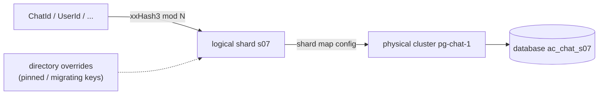
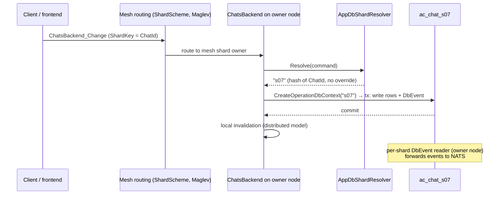

# Database sharding for backend services

## Overview

The largest databases — `ac_chat` and `ac_users` — must eventually outgrow a single
PostgreSQL instance. This plan evaluates the options for sharding them (and, with the
same machinery, every other backend DB) so that each service picks a DB shard based on
its natural key: `ChatId` for Chat, `UserId` for Users, `OwnerId` for Contacts, etc.

Key context that shapes the plan:

- Fusion's `ActualLab.Fusion.EntityFramework` already ships a complete app-level
  sharding subsystem (shard registry, shard resolver, per-shard `DbContext` factories,
  per-shard log readers/workers). ActualChat runs it in single-shard mode today.
- ActualChat already computes shard keys for every relevant entity — for *mesh routing*
  ([ShardKeyResolvers.cs](https://github.com/Actual-Chat/actual-chat/blob/main/src/dotnet/Core.Server/Sharding/ShardKeyResolvers.cs)):
  `ChatId`, `ChatEntryId`, `AuthorId` → chat; `UserId` → user; `ContactId` → owner.
- Chat/Users are still `ServiceMode.Server` (single backend node); only `IFlowBackend`
  runs in `ServiceMode.Distributed`. The plan assumes services migrate to the
  distributed (Flows-like) model **before** their DBs are sharded, and that the
  Operations Framework's `DbOperation` log + NOTIFY-based invalidation are retired as
  part of that migration. The `DbEvent` transactional outbox stays.

### Decisions already made

| Question | Decision |
|---|---|
| Shard topology | Many logical shards, few physical clusters; per-service DB shard schemes, independent of mesh `ShardScheme` |
| Sequencing | `Server` → `Distributed` migration first, DB sharding second |
| Key → shard mapping | Hash by default, plus a directory/API that supports overrides and suspending access to a shard during migration |
| Existing data | Offline bulk resharding (maintenance window) |
| Outbox | Keep `DbEvent` as per-shard transactional outbox; drop `DbOperation` + NOTIFY |
| Placement of new code | Build in ActualChat first (`Core.Server` / `Db`); upstream proven parts to Fusion later |
| Scope | All backend DBs except OpenSearch-backed search; the design must accommodate search once it moves to PostgreSQL |

## Current state

### One database per service, single shard

`DbModule.AddDbContextServices<TDbContext>`
([DbModule.cs](https://github.com/Actual-Chat/actual-chat/blob/main/src/dotnet/Db/Module/DbModule.cs))
resolves the connection string from `DbSettings.DefaultDb`
(`postgresql:...Database=ac_{instance_}{context}...`), so each `DbContext` gets its own
database (`ac_chat`, `ac_users`, ...). Within a service, everything runs on Fusion's
`DbShard.Single` (`""`): every `CreateDbContext` / `CreateOperationDbContext` call and
`DbInitializer` hardcode it.

### Three unrelated "shard" concepts today

1. **Fusion `DbShard`** — a plain `string` selecting a physical DB within one
   `DbContext` type. Unused (always `""`). This is the hook this plan engages.
2. **Mesh `ShardScheme`**
   ([ShardScheme.cs](https://github.com/Actual-Chat/actual-chat/blob/main/src/dotnet/Backend/Sharding/ShardScheme.cs)) —
   routes backend RPC calls to the mesh node owning `xxHash3(key) mod ShardCount`
   (N=12) via Maglev-based `ShardMap`. Says nothing about DBs.
3. **`DbShardLocalIdGenerator`** — Redis-backed per-chat `LocalId` sequences; "shard"
   here means the id scope (a chat), not a database. Unaffected by this plan.

### What Fusion.EntityFramework already provides

| Piece | What it does |
|---|---|
| `DbShard` | Shard is a `string`; `""` = single, `"__template"` = schema-only pseudo-shard for migrations/model reflection |
| `IDbShardRegistry<TDbContext>` | Reactive shard set (`Shards`, `UsedShards`, `EventProcessorShards` + `EventProcessorShardFilter`); `Add`/`Remove`/`CanUse` |
| `IDbShardResolver<TDbContext>` | `Resolve(object source)` → shard; understands `IHasShard`, `Session` tags, `ISessionCommand`; virtual, easy to subclass |
| `ShardDbContextFactory<TDbContext>` | One pooled `IDbContextFactory` per shard, built by a `(services, shard, optionsBuilder)` callback — the per-shard connection string goes here; evicts factories when shards are removed |
| `DbHub<TDbContext>` | `CreateDbContext(shard, ...)` / `CreateOperationDbContext(shard, ...)` overloads |
| `DbShardWorkerBase<TDbContext>` | Runs one worker task per (used) shard, reacting to registry changes |
| `DbEntityResolver` | Already shard-aware: one batch processor per shard, `Get(shard, key, ct)` |
| Log processing | `DbEventLogReader`/trimmers fan out per shard; `EventProcessorShards` lets a host process events for only the shards it owns |

Hard constraint: **`DbOperationScope` is single-shard** — enrolling `DbContext`s from
two shards in one operation throws. There are no cross-shard transactions, by design.

### Data model fit

Primary keys are composite strings whose prefix is the shard-relevant id, and the id is
also duplicated into an indexed column — so the shard key is available on every row:

| DB | Shard key | Fit |
|---|---|---|
| `ac_chat` | `ChatId` | Clean. `DbChatEntry` (the hottest table) is only ever queried as `ChatId + Kind + LocalId` range; `DbChat`, `DbReaction`, `DbMention`, `DbRole`, attachments, conversations all carry `ChatId` |
| `ac_users` | `UserId` | Mostly clean: `DbAccount`, `DbAvatar`, `DbKvasEntry`, `DbChatPosition`, `DbChatUsage`, `DbUserPresence` key by user. **Exception: `DbSessionInfo`/`DbUserSession` are looked up by session id before the user is known** (see open questions) |
| `ac_contacts` | `OwnerId` (a `UserId`) | Clean — already how `ContactId` resolves its mesh shard key |
| `ac_notification` | `UserId` | Clean |
| `ac_media` | `MediaId` scope / `ChatId` | Mostly chat-scoped; verify `GetByBlobId`-style lookups |
| `ac_flows` | `FlowId.Arguments` | Clean; single table |
| Search (future PG) | `ChatId` | Per-chat indexes shard cleanly; global/user-scoped search needs scatter-gather |

Cross-axis friction points (queried by a key other than their shard key):

- **`DbAuthor`** (in `ac_chat`, sharded by `ChatId`) has a `(UserId, AvatarId)` index —
  "all authors of user X across chats" becomes a cross-shard query.
- **Enumeration paths** (admin jobs, search backfills) that walk a whole table.
- **Places**: place-wide queries touch many chats; `PlaceId`-rooted chats hash to
  different shards (see open questions).

## Approaches considered

### A. Application-level sharding on Fusion `DbShard` — preferred

Engage the machinery that already exists: register N logical shards per `DbContext`,
give `ShardDbContextFactory` a per-shard connection string, resolve the shard from the
command/id the service already has, and pass it to `CreateDbContext(shard)`.

- **Pros**: the framework layer is already built and per-shard-aware end to end
  (contexts, entity resolvers, event log readers, workers); shard = separate database,
  so shards can be moved between clusters with plain dump/restore; aligns 1:1 with the
  distributed service model (the mesh owner of a key talks to that key's DB shard);
  no new infrastructure.
- **Cons**: every write path must resolve a shard (call-site audit); cross-shard
  queries become explicit scatter-gather; migrations/backup/monitoring multiply by the
  shard count; no cross-shard transactions (already true across services today —
  the `DbEvent` → NATS pattern covers it).

### B. PostgreSQL declarative partitioning — complementary, not a substitute

Hash-partitioning `chat_entries` by `chat_id` inside one database gives smaller
per-partition B-trees, parallel autovacuum, and better cache locality — but it does
**not** scale writes, storage, or connections beyond one server, which is the actual
goal. It also forces the partition key into every PK/unique index (`chat_entries` PK
would become `(chat_id, id)`).

Verdict: keep as an *optional, per-table* optimization **inside** a logical shard if a
single shard's `chat_entries` grows painful again. Orthogonal to this plan; no design
work needed now.

### C. Citus (distributed PostgreSQL) — rejected

Transparent cross-shard SQL is Citus's selling point, but this codebase doesn't need
it: queries are already single-key, routing keys are already computed in the app, and
the distributed service model deliberately gives each shard a single owner. In
exchange, Citus would add a coordinator bottleneck, a self-managed extension on GCP
(no first-party managed offering there), EF Core migration quirks, and a much harder
"move one shard elsewhere" story than database-per-shard.

### D. Vertical scaling + read replicas — rejected as the end state

Bigger hardware plus replicas defers the problem but keeps single-writer limits,
ever-growing autovacuum/backup/failover times, and a single blast radius. It remains
the fallback for *small* services that never opt into sharding (the design below makes
sharding per-service opt-in with `LogicalShardCount = 1` as a no-op).

### E. DB shard count == mesh shard count — rejected

Coupling DB shards to `ShardScheme.ShardCount` (12) would make the two rebalance
together and force a DB reshard whenever mesh topology math changes. Decision: DB
shard schemes are separate entities with their own (larger) logical shard counts.

## Proposed design

### Topology: logical shards over physical clusters



- **Logical shard** = one PostgreSQL *database* (e.g. `ac_chat_s07`), the unit of
  resharding: it can be moved between clusters with dump/restore, and Fusion's
  `DbShard` string names it.
- **Physical cluster** = a PostgreSQL instance hosting many logical shards. Initially
  all logical shards of a service live on the cluster that hosts today's DB.
- **Logical shard count is fixed per scheme** at sharding time (changing it is a
  full reshard, hence "many logical" up front). Proposal: 60 for `ac_chat` and
  `ac_users` (divisible by 2, 3, 4, 5, 6, 10, 12, 15, 20, 30 — flexible N:1 packing
  onto clusters), 12 for mid-size services, 1 (= unsharded, no-op) for small ones.

### New components

All new code lands in ActualChat first — `src/dotnet/Db` for DB-layer pieces,
`src/dotnet/Core.Server` for pieces that touch mesh/backend concepts. Names below are
proposals.

1. **`DbShardScheme`** (`Db`) — per-`DbContext` sharding descriptor: `LogicalShardCount`,
   shard name format (`s00`..`s59`), and the key-hash function (same xxHash3-of-string
   the mesh uses). `LogicalShardCount == 1` ⇒ single-shard mode, nothing changes for
   that service.

2. **`ShardMapBackend`** (the shard manager, `Core.Server` + its own tiny service) —
   the single authority for the logical→physical map, per-shard state
   (`Active`/`ReadOnly`/`Suspended`), and directory overrides. Detailed in
   [The shard map](#the-shard-map-authority-storage-and-propagation) below.

3. **`DbShardMapTracker`** (`Db`, one per host per scheme) — the host-side reactive
   view of the shard map: watches the manager's compute methods, exposes
   `Use(shard)` which waits out suspensions and fails closed when the local view
   goes stale. Also detailed below.

4. **`AppDbShardResolver<TDbContext>`** (`Db`) — subclass of Fusion's
   `DbShardResolver<TDbContext>`: resolves typed ids (`ChatId`, `UserId`, ...) and
   `IHasShardKey<T>` commands to a logical shard via the scheme's hash + catalog
   overrides. Reuses the same key normalization as
   `ShardKeyResolvers` so mesh routing and DB sharding always agree on "the key".

5. **`DbModule` extensions** (`Db`) — teach `DbSettings`/`DbInfo` a per-context shard
   section (logical count + physical map with a `{shard}` token in connection
   strings), and wire `AddShardRegistry` / `AddPooledShardDbContextFactory` /
   `AddShardResolver` when `LogicalShardCount > 1`. Also: fan `DbInitializer`
   (schema create/migrate/verify) across all logical shards; keep `DbShard.Template`
   pointing at an empty template DB for EF migration generation.

6. **`DbShardEnumerator` / scatter-gather helper** (`Db`) — the sanctioned way to run
   a query across all shards of a scheme (admin jobs, backfills, the rare cross-axis
   read): sequential or bounded-parallel enumeration over `ShardRegistry.Shards` with
   per-shard `DbContext`s.

7. **Reshard tool** (new host role or `dotnet run` tool, `Db` + service metadata) —
   offline bulk resharding: for each table, split rows by `hash(shard key column)`
   into per-shard databases (`COPY` out/in, then index build). Needs one piece of
   per-entity metadata: which column is the shard key (`ChatId`, `UserId`, ...).
   Also used for later shard *moves* (whole-DB dump/restore) and, if ever needed,
   shard splits.

### The shard map: authority, storage, and propagation

Remapping and suspension only work if there is exactly one authority for "where is
shard `s07` and may I use it", and if every host provably converges to the latest
answer before a migration proceeds. The proposal: a small dedicated backend service —
the **shard manager** — plus a host-side tracker, glued by the same Fusion
reactivity every other backend already uses.

#### Authority: `ShardMapBackend`

An ordinary backend service (its `ShardScheme` has `ShardCount = 1`, like
`InviteBackend`; `ServiceMode.Distributed`, so exactly one node owns it and serves
the map — the Flows single-owner pattern). All map changes are commands; all reads
are compute methods, so every host observes changes reactively through the standard
backend RPC client, with no polling and no extra pub/sub channel.

Approximate API (serialization attributes omitted):

```csharp
public enum DbShardState { Active, ReadOnly, Suspended }

public sealed record DbShardInfo(
    string Shard,               // "s07"
    DbShardState State,
    string PhysicalRef,         // named physical cluster + database, e.g. "pg-chat-1/ac_chat_s07"
    string? Comment = null);    // "migrating to pg-chat-2", operator notes

public sealed record DbShardMap(
    Symbol SchemeId,            // "Chat", "Users", ...
    long Version,               // epoch: bumped on every change, strictly monotonic
    int LogicalShardCount,
    ApiArray<DbShardInfo> Shards);

public interface IShardMapBackend : IComputeService, IBackendService
{
    [ComputeMethod]
    Task<DbShardMap> Get(Symbol schemeId, CancellationToken cancellationToken);
    [ComputeMethod]
    Task<ApiMap<string, string>> GetOverrides(Symbol schemeId, CancellationToken cancellationToken);

    [CommandHandler]
    Task OnSuspend(ShardMapBackend_Suspend command, CancellationToken cancellationToken);
    [CommandHandler]
    Task OnResume(ShardMapBackend_Resume command, CancellationToken cancellationToken);
    [CommandHandler]
    Task OnSetState(ShardMapBackend_SetState command, CancellationToken cancellationToken);       // e.g. → ReadOnly
    [CommandHandler]
    Task OnSetOverride(ShardMapBackend_SetOverride command, CancellationToken cancellationToken); // pin key → shard, null = remove
}

public sealed record ShardMapBackend_Suspend(Symbol SchemeId, string Shard)
    : ICommand<Unit>, IBackendCommand;
public sealed record ShardMapBackend_Resume(Symbol SchemeId, string Shard, string? NewPhysicalRef)
    : ICommand<Unit>, IBackendCommand;
```

Notes:

- `Get` returns the whole map for a scheme — it changes rarely, and one computed per
  scheme keeps the invalidation story trivial. Overrides live in a separate compute
  method so pinning a key doesn't re-publish the map itself.
- `Resume` optionally carries a new `PhysicalRef` — that *is* the remap operation.
- `PhysicalRef` is a symbolic name resolved to a connection string via host
  configuration/secrets, so credentials never pass through the map service.

#### Where to store the map

| Store | Assessment |
|---|---|
| **Dedicated tiny DB (`ac_shardmap`, own `ShardMapDbContext`) — recommended** | Authoritative, transactional, versioned rows + append-only audit table for every state change; standard `DbModule`/migration tooling; owned by the shard manager like every service owns its DB. Never sharded itself; its connection string is plain static config, so there is no bootstrap circularity |
| `InfrastructureDbContext` table | Works, avoids a new DB, but couples migrations/lifecycle of a critical control-plane store to unrelated infra tables. Acceptable fallback |
| Redis | Fast, already deployed — but not a comfortable *authority* (persistence/backup semantics); Fusion reactivity already covers the "fast propagation" part, so Redis adds nothing as a cache either |
| NATS KV / JetStream | Durable KV with watch, but introduces a second source of truth outside PostgreSQL and a second propagation path competing with Fusion invalidation |
| Config only | Not dynamic — kept as the *seed* (initial map on first run) and the break-glass override if the manager is down |

The size is trivial (dozens of rows), so the choice is about operational trust, not
performance — hence PostgreSQL.

#### Host side: `DbShardMapTracker`

Each host runs one tracker per scheme. It is a plain Fusion client of
`IShardMapBackend.Get` (an `IState<DbShardMap>` over the compute method), so updates
arrive by invalidation push over the existing backend RPC connection; reconnects
re-subscribe automatically.

```csharp
public sealed class DbShardMapTracker
{
    public IState<DbShardMap> Map { get; }
    public Moment LastConfirmedAt { get; }         // last time the map was known-current
    public bool IsFresh { get; }                   // LastConfirmedAt + LeaseTtl > now

    // Waits while the shard is Suspended; throws a retryable error if !IsFresh
    // or the shard is unknown. The lease pins "this host is using shard X at epoch N"
    // until disposed, which bounds local draining.
    public ValueTask<DbShardLease> Use(string shard, CancellationToken cancellationToken);
}
```

Integration points:

- The `ShardDbContextFactoryBuilder` callback (per-shard connection string) resolves
  `PhysicalRef` through the tracker's current map.
- `DbHub.CreateDbContext(shard)` call sites go through `Use(shard)` (via a thin
  `DbHub` wrapper or the factory itself), so suspension pauses new work on that shard
  instead of failing it, and a resumed map transparently points waiters at the new
  physical location. Since `ShardDbContextFactory` caches one pooled factory per
  shard string, a remap must also evict that shard's factory — the tracker does this
  on every `PhysicalRef` change (Fusion's registry already evicts on shard removal;
  remap-in-place eviction is one of the small pieces we add).

#### Correctness: epochs, leases, fencing

The failure to defend against: a host with a stale map writes to the *old* physical
database after the shard was copied away. Three layers, cheapest first:

1. **Epoch + lease (fail closed)**. Every map carries `Version` (epoch). A tracker
   that hasn't been able to confirm its map within `LeaseTtl` (say, 15–30 s; it is
   confirmed continuously for free while the RPC subscription is healthy) declares
   itself stale: `Use` starts throwing retryable errors, so a partitioned host stops
   writing on its own. The manager's suspend barrier is therefore: *all live mesh
   nodes acked epoch N* (fast path — the mesh node registry already exists), with
   *`LeaseTtl` + max-transaction grace* as the timeout fallback for unresponsive
   nodes.
2. **Draining**. `DbShardLease` gives each host a local in-flight count per shard;
   after the epoch barrier the manager waits for leases to drain (hosts report
   per-shard counts via a compute method or the ack call), bounded by the same grace
   period.
3. **PostgreSQL-level fence (the backstop)**. Before copying, the migration runs
   `ALTER DATABASE ac_chat_s07 CONNECTION LIMIT 0` and terminates remaining backends
   on the old cluster. Any writer that slipped through layers 1–2 gets a connection
   error — which is retryable, and the retry re-resolves through the (by then
   updated) map. Fencing makes the barrier *safe* even if the barrier logic has a
   bug; layers 1–2 make it *graceful*.

#### Migration walkthrough

```mermaid
sequenceDiagram
    participant Op as Reshard tool / operator
    participant SM as ShardMapBackend (owner node)
    participant H as All hosts (DbShardMapTracker)
    participant PG1 as pg-chat-1 (old)
    participant PG2 as pg-chat-2 (new)

    Op->>SM: ShardMapBackend_Suspend("Chat", "s07")
    SM->>SM: Version++ → Get("Chat") invalidated
    H-->>SM: reactive refetch + epoch ack
    Note over H: new Use("s07") calls wait;<br/>in-flight leases drain
    SM-->>Op: barrier reached (acks + drained, or grace elapsed)
    Op->>PG1: fence ac_chat_s07 (connection limit 0, terminate backends)
    Op->>PG2: dump/restore ac_chat_s07
    Op->>SM: ShardMapBackend_Resume("Chat", "s07", "pg-chat-2/ac_chat_s07")
    SM->>SM: Version++ → invalidated
    H-->>SM: refetch; factory for "s07" evicted & rebuilt
    Note over H: waiters proceed against pg-chat-2
```

If the shard manager itself is down, nothing moves — hosts keep serving from their
last-confirmed map until `LeaseTtl` expires, then fail closed for that scheme's
writes. Since the manager is a stock distributed backend, mesh failover re-homes it
like any other single-shard service; `LeaseTtl` just needs to comfortably exceed the
failover time.

### How a call flows after sharding



Mesh shard (of 12) and DB shard (of 60) are computed from the same key hash but are
independent; a node that owns mesh shard 3 will touch the DB shards its keys hash to.
The `DbEvent` outbox is per logical shard; Fusion's `EventProcessorShardFilter` is
wired to mesh shard ownership so exactly one node drains each shard's events.

### Operations, invalidation, and the outbox

Per the Distributed-first decision, by the time a service's DB is sharded:

- `DbOperation` log and NOTIFY watchers are gone for that service — invalidation is
  local to the single owner node (the `FlowBackend` pattern:
  `Operation.MustStore(false)` + completion-handler priming).
- `DbEvent` remains, written in the same per-shard transaction as the data — the
  outbox that feeds NATS. Fusion's `DbEventLogReader` already runs per shard and
  already supports restricting processing to owned shards.
- A command touches exactly one shard. Anything cross-shard (e.g. chat creation
  touching Users-side state) is already cross-service today and keeps using events.

### Cross-axis reads

- **`DbAuthor` by `UserId`**: prefer deriving "user's chats" from `ac_contacts`
  (already sharded by owner and already the user-axis source of truth); fall back to
  scatter-gather via `DbShardEnumerator` for admin paths. Decide per call site during
  the audit phase.
- **Full-table enumerations** (backfills, search indexing): `DbShardEnumerator`.
- **Sessions** (`ac_users`): resolved by session id before the user is known — see
  open questions.

### Rollout phases

1. **Phase 0 — prerequisite (separate plan)**: Chat/Users → `ServiceMode.Distributed`,
   op-log retirement, `DbEvent`-only outbox. Sharding work below starts once a
   service is distributed.
2. **Phase 1 — infrastructure, no-op rollout**: `DbShardScheme`, catalog, resolver,
   `DbModule`/`DbInitializer` wiring, shipped with `LogicalShardCount = 1` everywhere.
   Behavior identical; the shard plumbing is live and tested.
3. **Phase 2 — call-site audit per service**: make every `CreateDbContext` /
   `CreateOperationDbContext` / entity-resolver call pass a resolved shard; inventory
   and fix cross-axis reads; add scatter-gather where legitimate. Verifiable while
   still on 1 shard (assert shard is always resolved, never defaulted).
4. **Phase 3 — reshard `ac_chat`**: build the reshard tool, rehearse on staging with a
   prod snapshot, then a maintenance-window offline split to 60 logical shards on the
   existing cluster. Then `ac_users`, then the rest by size.
5. **Phase 4 — physical spread**: move logical shards to additional clusters as load
   dictates (suspend → dump/restore → repoint → resume via the catalog API).
   Optionally partition hot tables inside a shard (approach B) if ever needed.

## Reuse

### Existing abstractions to reuse

From `ActualLab.Fusion.EntityFramework` (no framework changes needed to start):
`DbShard` (+ `Template`), `IDbShardRegistry<T>` / `DbShardRegistry<T>`,
`IDbShardResolver<T>` / `DbShardResolver<T>` (subclassed),
`ShardDbContextFactory<T>` + `ShardDbContextBuilder<T>.AddShardRegistry` /
`AddPooledShardDbContextFactory` / `AddShardResolver`, `DbHub<T>.CreateDbContext(shard)`
/ `CreateOperationDbContext(shard)`, `DbShardWorkerBase<T>`, per-shard
`DbEntityResolver`, `DbEventLogReader` + `EventProcessorShardFilter`.

From ActualChat: `ShardKeyResolvers` (key normalization/hash), `ShardScheme` /
`ShardMap` / `MeshRef` / `ShardOwner` (mesh side, for wiring event processing to
ownership), `ShardedDbServiceBase<T>`, `DbModule` / `DbSettings` / `DbInfo` /
`DbInitializer` (extended, not replaced), `DbShardLocalIdGenerator` (unchanged),
`IHasShardKey<T>` on commands.

From `ActualLab.Core`: `ShardMap<TNode>` / Maglev — available if logical→physical
placement ever becomes dynamic; for now a static config map is deliberately simpler.

Not found / gaps: Fusion has no shard *suspension* semantics (registry supports only
add/remove), no logical→physical indirection, no directory overrides, and no reshard
tooling — these are exactly the new components above.

### Reusability of new components

| Component | Local vs shared | Recommendation |
|---|---|---|
| `DbShardScheme` | Generic — nothing ActualChat-specific except config shape | `src/dotnet/Db` now; upstream candidate for `ActualLab.Fusion.EntityFramework` |
| `ShardMapBackend` + `ShardMapDbContext` (map authority, suspend/resume, overrides) | Service shell is ActualChat's backend pattern; the map model + state machine are generic | ActualChat service; the map model and suspendable-registry semantics are **prime upstream candidates** for Fusion once proven |
| `DbShardMapTracker` (+ lease/fencing glue, remap-in-place factory eviction) | Generic over Fusion's registry/factory | `src/dotnet/Db`; upstream candidate |
| `AppDbShardResolver<T>` | Key types are ActualChat's | `src/dotnet/Db` (references `Core` id types); stays local |
| `DbModule` shard config + `DbInitializer` fan-out | ActualChat's module system | `src/dotnet/Db`; the fan-out pattern could inform a Fusion `DbInitializer` counterpart later |
| `DbShardEnumerator` (scatter-gather) | Generic over `DbHub`/registry | `src/dotnet/Db`; upstream candidate |
| Reshard tool | Generic mechanics, per-entity shard-key metadata is local | Tool in ActualChat; if the shard-key-column metadata lives on entity config, the mechanics could upstream |

Per the placement decision, everything starts in ActualChat; upstreaming to Fusion is
revisited after the first production reshard.

## Open questions

1. **Exact logical shard counts** — 60 for chat/users is a proposal; confirm against
   current DB sizes and 3–5 year growth before Phase 3 locks it in.
2. **Sessions axis** (`ac_users`): `DbSessionInfo`/`DbUserSession` are read by session
   id during auth, before `UserId` is known. Options: (a) shard those tables by
   hash(session id) within the same logical shard set — fine as long as no transaction
   spans a session row and an account row of different shards (audit needed);
   (b) split session storage into its own small unsharded context; (c) embed a shard
   hint in the session (Fusion's session-tag resolution supports this natively).
   Leaning (b) or (c); decide during the Users call-site audit.
3. **Places**: whether place-rooted chats should co-locate (shard by `PlaceId` for
   place chats) or plain-hash per chat and accept scatter-gather for place-wide
   queries. Co-location helps place queries but skews shard sizes.
4. **Connection budget**: 60 shards × pool of 32 per context is a theoretical
   ceiling far above PostgreSQL defaults. Pools are lazy (`UsedShards`), but Phase 1
   should set per-shard pool sizes and decide whether PgBouncer goes in front of the
   clusters.
5. **Shard-map barrier tuning**: `LeaseTtl` value (must exceed shard-manager failover
   time, but bounds how long a partitioned host keeps writing); ack-based vs
   TTL-only suspend barrier for the first version; whether `ReadOnly` shards keep
   serving reads during a migration's copy phase (nice for near-zero-downtime moves,
   but reads from a half-fenced shard need care) — or whether v1 simply suspends
   reads and writes alike.
6. **Search on PostgreSQL**: when OpenSearch is replaced, per-chat indexes shard by
   `ChatId` with this same machinery; global search will need a fan-out/aggregation
   layer — design belongs to the search-migration plan, but the shard scheme should
   reserve room for it (its own `DbShardScheme`, likely co-counted with `ac_chat`).
