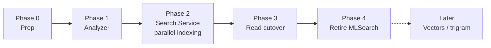

# MLSearch: OpenSearch → PostgreSQL migration

[[toc]]

## Summary

Replace OpenSearch with PostgreSQL full-text search (`tsvector` + GIN) as the engine behind
`ISearch` / `ISearchBackend`. Text analysis (tokenization, stemming, CJK segmentation) moves to the
application level so search works uniformly across a large set of languages (target: top ~50
worldwide) — something neither the current setup nor Postgres' built-in per-language configs
provide. The schema and infrastructure are designed so pgvector-based semantic search can be added
later without another migration.

**Decisions already made** (agreed with Alex, Jul 2026):
- Application-level multilingual analysis from day one (not a parity-first phase).
- Index data lives in the MLSearch database as denormalized tables (not `tsvector` columns in source DBs).
- Chat entries are indexed as **message blocks** — sequences of messages that form one
  conversational "document" (split on longer gaps and similar signals) — not as individual
  messages. See [Entry blocks](#entry-blocks).
- **Delivered as a new `Search.Service`**, built and backfilled alongside the untouched MLSearch
  service; cutover switches reads, then MLSearch is retired wholesale (projects deleted, not
  refactored).
- Vectors: schema-ready, implementation deferred; blocks are the intended embedding unit.
- Korean: CJK character bigrams for now (Lucene.NET has no Nori); revisit only if demand appears.
- `ISearchBackend.OnRefresh` / `SearchBackend_Refresh`: the new backend contract never includes
  it; it disappears entirely when MLSearch is retired.
- Production is AlloyDB, but the design must work on any recent vanilla PostgreSQL —
  only broadly available extensions (`pgvector`, `pg_trgm`, `unaccent`) are allowed; no
  AlloyDB-only features, no ParadeDB/PGroonga/pg_bigm.

## Current state

A survey of the code (Jul 2026) shows the service is simpler than its name and history suggest:

- **No stemming, no language analyzers, no vectors.** All four OpenSearch indices use the default
  standard analyzer. Queries are lexical: `match_bool_prefix`, `match_phrase_prefix`,
  `multi_match`, `terms`, parent/child joins, highlighting. The ML-commons/embeddings Docker setup
  ([services/opensearch/](https://github.com/Actual-Chat/actual-chat/tree/main/services/opensearch),
  [services/embeddings/](https://github.com/Actual-Chat/actual-chat/tree/main/services/embeddings))
  and the `Anthropic.SDK` / `Microsoft.SemanticKernel*` package references in
  [MLSearch.Service.csproj](https://github.com/Actual-Chat/actual-chat/blob/main/src/dotnet/MLSearch.Service/MLSearch.Service.csproj)
  are dead — nothing in the live code path uses them.
- **Four index families**, defined in
  [OpenSearchConfigurator.cs](https://github.com/Actual-Chat/actual-chat/blob/main/src/dotnet/MLSearch.Service/OpenSearchConfigurator.cs):

  | Index | Documents | Searched fields |
  |---|---|---|
  | `entries-v4` | `IndexedEntry` (child) + `IndexedChat` (parent) | `Content`, sorted by `At` |
  | `users-v6` | `IndexedUser` (parent) + `IndexedUserContact` (child) | `Name`, `ExternalContactName` |
  | `chats-v5` | `IndexedGroup` | `Title` |
  | `places-v3` | `IndexedPlace` | `Title` |

- **Indexing pipeline**: domain events (`ChatEntryChangedEvent` etc.) handled in
  [SearchBackend.cs](https://github.com/Actual-Chat/actual-chat/blob/main/src/dotnet/MLSearch.Service/SearchBackend.cs)
  resume durable [Flows](https://github.com/Actual-Chat/actual-chat/tree/main/src/dotnet/Core.Server/Flows)
  (`EntryIndexingFlow` and friends in
  [MLSearch.Service/Flows/](https://github.com/Actual-Chat/actual-chat/tree/main/src/dotnet/MLSearch.Service/Flows)),
  which pull changed rows by version cursor (`ChatsBackend.ListChangedEntries` etc.) and bulk-write
  via [IndexedDocuments.cs](https://github.com/Actual-Chat/actual-chat/blob/main/src/dotnet/MLSearch.Service/Engine/OpenSearch/Indexing/IndexedDocuments.cs).
  Master flows perform full backfill sweeps.
- **Permissions are ID-list pre-filtering, not index ACLs**: allowed chat/place/contact IDs come
  from `ContactsBackend.ListIdsForSearch` / `ListPlaceIds` / `ListIdsForGroupContactSearch` /
  `ListPeerContactIds`, then the search is constrained to those IDs.
- **`MLSearchDbContext` is nearly empty** (only Fusion `_operations`/`_events` tables) — the
  OpenSearch-era MLSearch DB holds flow/event state only, no search data. The new service gets its
  own DbContext/DB following the same pattern, so MLSearch's state is left untouched until
  retirement.

::: info Consequence
"Keep multilingual search intact" means preserving *language-agnostic tokenization + prefix
matching*. The stemming pipeline below is a quality upgrade over the status quo, not a port of
existing behavior. Recall will change (mostly improve); the cutover plan accounts for that.
:::

## Goals

1. Remove OpenSearch (the cluster, the client packages, the configurator, the ops surface) and
   serve all `ISearch`/`ISearchBackend` functionality from PostgreSQL.
2. Multilingual analysis for ~top-50 languages, implemented at the application level (in .NET, or
   as a self-hostable open-source service if .NET coverage proves insufficient).
3. Keep the public API (`ISearch` and its query/result contracts) unchanged for the UI.
4. Replicate the event → flow → cursor-pull indexing pipeline (same base classes, new service),
   with a block-building stage for entries.
5. A schema that admits pgvector semantic search as an additive migration.
6. Works on any recent vanilla PostgreSQL (16+); AlloyDB in production.
7. Zero risk to the running search while the new one is built: MLSearch code is not modified until
   its retirement.

**Non-goals** (this migration): semantic/vector search implementation (blocks are designed as the
future embedding unit, but no embeddings are generated), the interactive search bot from
[Search.md](./Search.md), typo tolerance (listed as a future option), attachment/file content
indexing.

## Delivery strategy: a new Search service

The new engine is built as a **new `Search.Service` project** rather than by rewriting
`MLSearch.Service` in place:

- `Search.Service` gets its own `SearchDbContext` + database (standard `DbModule` wiring), its own
  flows, and its own event handlers. Fusion events fan out to all registered `[EventHandler]`s, so
  both services index concurrently from the same `ChatEntryChangedEvent` / `ChatChangedEvent` /
  etc. stream without touching each other.
- The new backend surface is a **new contract** in `Search.Contracts` (working name
  `ISearchBackendV2`; renamed to `ISearchBackend` once the old one is deleted). It carries the same
  `FindContacts`/`FindEntries` queries and the six event handlers — but no `OnRefresh`, which is
  meaningless on Postgres.
- The `Search` frontend (`ISearch` implementation) moves to `Search.Service` at cutover and routes
  each scope (people/groups/places/entries) to the old or new backend by a setting — per-scope
  cutover without any change to MLSearch.
- Retirement deletes projects wholesale: `MLSearch.Service`, `MLSearch.Service.Migration`,
  `MLSearch`, `MLSearch.Contracts`, plus the OpenSearch infra. No refactoring of dying code.

This trades a short period of double indexing work (two services consuming the same events) for a
clean parallel build, trivially reversible cutover, and a deletion-only cleanup.

## Entry blocks

Messages are indexed as **blocks**: consecutive entries of one chat that plausibly belong to the
same conversation, concatenated into a single indexed document. Rationale:

- **Size**: one row + one tsvector + one GIN entry set per block instead of per message cuts row
  count and index overhead several-fold (chat messages are short; tsvector/GIN per-row overhead is
  proportionally large).
- **Semantic unit**: a block is the natural retrieval unit for conversational content — and the
  intended **embedding unit** for future vector search (this resolves the tiling question from the
  old [Search.md](./Search.md) plan).
- **Ranking**: term co-occurrence within a conversation is captured even when spread across
  adjacent short messages.

**Boundary rules** (pluggable, initial version deliberately simple):
- split on a time gap between consecutive entries above a threshold (initial: ~10–15 min, tune on
  real data);
- hard caps: max entries and max total characters per block (keeps tsvector/highlighting bounded);
- later candidates, same seam: author-run signals, topic shift, explicit thread/reply structure.

**Incremental maintenance**: new entries either extend the chat's tail block or start a new one;
an edited/removed entry rebuilds just its containing block (blocks are identified by
`chat_id + entry local-ID range`, so affected blocks are found by range lookup). The existing
1-minute indexing debounce means active chats rebuild their tail block roughly once a minute, not
per message.

**Mapping results back to entries**: each block stores its entries' character offsets within the
concatenated content. Highlight ranges (from the C#-side highlighter) map through the offset table
to concrete entries, so `FindEntries` still returns `FoundChatEntry` items — the entry containing
the best match, with its `SearchMatch` — and the API stays unchanged.

## Options considered

### Engine

| Option | Verdict | Why |
|---|---|---|
| **PostgreSQL `tsvector` + app-level analysis** | **Chosen** | No extra infrastructure, immediate consistency (no refresh cycle), transactional with flow state, one less failure domain. FTS features (GIN, `tsquery` prefix, positions/phrases) cover current query shapes. |
| Keep OpenSearch, fix analyzers | Rejected | Keeps the cluster ops burden, the eventual-consistency refresh machinery, and a second storage system for what is now plain lexical search. |
| ParadeDB `pg_search` (BM25/Tantivy) | Rejected | Not installable on AlloyDB or other managed Postgres; violates the "any recent PostgreSQL" constraint. Revisit only if ranking quality becomes a real problem *and* we self-host. |
| Meilisearch / Typesense / Vespa | Rejected | Same "separate external engine" cost as OpenSearch; the goal is consolidation onto Postgres. |
| PGroonga / pg_bigm (CJK-native FTS) | Rejected | Not on managed-Postgres allow-lists; CJK is handled app-side instead (see below). |

Ranking note: Postgres `ts_rank_cd` has no global IDF (no corpus statistics), unlike BM25. This is
acceptable here: entry results are sorted by time (`At desc`) today, not by score — parity keeps
that; contact/group/place results rank over short name/title fields where IDF matters little. If
ranking quality ever becomes a problem, options are (a) an approximate-IDF term-frequency side
table, (b) hybrid RRF with vectors (phase 4), (c) self-hosted BM25 — in that order.

### Text analysis: how to cover ~50 languages

Postgres' own per-language configs cover ~15 Snowball languages and require choosing one config per
row/query — a dead end for mixed-language chat. All options below therefore analyze text in the
application and store the resulting lexemes into a `tsvector` built with the `simple` config (which
only lowercases — effectively a pass-through for pre-analyzed lexemes).

| Option | Coverage | Verdict |
|---|---|---|
| **A. Lucene.NET analyzers, in-process** | ~35 languages with real stemming/segmentation: `Lucene.Net.Analysis.Common` (Arabic, Armenian, Basque, Bulgarian, Catalan, Czech, Danish, Dutch, English, Finnish, French, Galician, German, Greek, Hindi, Hungarian, Indonesian, Irish, Italian, Latvian, Norwegian, Persian, Portuguese+Brazilian, Romanian, Russian, Spanish, Swedish, Thai, Turkish, CJK bigram) + `.SmartCn` (Chinese segmentation), `.Kuromoji` (Japanese morphology), `.Stempel` (Polish), `.ICU` (Unicode-correct tokenization for all scripts). Remaining top-50 languages degrade gracefully to ICU tokenization + lowercase + CJK-style fallbacks. | **Chosen.** No network hop, no extra service, same coverage class as OpenSearch's built-in analyzers (which we currently don't even use). Caveat: 4.8 is "perpetual beta" but production-proven at scale. |
| B. Dockerized analysis service (Java Lucene, or a stateless OpenSearch node used only for `_analyze`, or Python `simplemma`/Stanza) | Full modern-Lucene coverage incl. Korean (Nori), Ukrainian | Fallback, not first choice: adds a per-message network hop and an infra component — partially re-creating the ops burden we're removing. The `ITextAnalyzer` abstraction (below) keeps this door open; if Lucene.NET quality/coverage disappoints for a language that matters, that language's analysis can be delegated to such a service without touching anything else. |
| C. Snowball only (`libstemmer.net`) | 29 languages, no CJK segmentation, dormant package | Rejected as the primary — insufficient alone; Lucene.NET already embeds Snowball filters anyway. |
| D. Per-row Postgres config + language detection | ~15 languages | Rejected — per-message language detection is unreliable for short chat text, and code-switching (English terms inside Russian sentences) breaks the one-config-per-row model entirely. |

### Language routing (which analyzers run per message)

Running 50 stemmers per message is wasteful and noisy. Instead:

1. **Split the text into Unicode script runs** (ICU). Script often determines the analyzer
   uniquely: Greek, Hebrew, Thai, Georgian, Armenian, Devanagari→Hindi, Han→SmartCn (+CJK bigrams),
   Kana→Kuromoji, Hangul→CJK bigrams.
2. **For ambiguous scripts (Latin, Cyrillic, Arabic), pick a small candidate set** from hints, and
   run *all candidates*, unioning their lexemes: the chat's known languages (the
  `ChatEntryLanguages` service already detects per-entry languages — reuse it as the hint source),
   the author's/searcher's UI and transcription languages, plus English as a universal candidate
   for Latin script.
3. **Always index the raw tokens too** (lowercased, `unaccent`-folded), alongside the stems. This
   preserves exact matching, keeps prefix search working (see below), and makes results for
   unsupported languages no worse than today.
4. **Query side uses the same routing** (query script runs + searcher/chat language hints), OR-ing
   the stemmed variants.

Per-message statistical language detection (fastText `lid.176` via `Panlingo`, NTextCat) is
deliberately **not** load-bearing: it may later *refine* the candidate set for Latin/Cyrillic runs,
but correctness never depends on it — the raw-token index and multi-candidate union guarantee a
floor.

Every analyzed row records an `analyzer_version`; bumping it makes the existing master flows
re-sweep and re-analyze (same mechanism as OpenSearch index-version bumps today).

### Prefix search (search-as-you-type)

Current behavior is prefix-heavy (`match_bool_prefix`: all terms AND-ed, last term as prefix).
Stemming breaks naive prefix matching (the stem of a partial word isn't a prefix of the full
word's stem), so:

- Completed terms → match stemmed lexemes (AND).
- The trailing (possibly incomplete) term → `:*` prefix `tsquery` against the **raw-token**
  lexemes.
- `match_phrase_prefix` with slop 20 (contact names) approximates to the same AND + trailing
  prefix; positions are preserved in the tsvector if phrase semantics are ever needed
  (`<->` operator).
- Optional later: a `pg_trgm` GIN on the raw text for substring/typo-tolerant fallback when the
  FTS query returns nothing.

### Highlighting

`ts_headline` can't be used: it re-analyzes raw text with a Postgres config, which knows nothing
about our app-level stems, so matches wouldn't line up. Instead, highlights are computed in C#: the
analyzer already produces token offsets, so matching query lexemes map directly to character ranges
in the original content, producing the existing
[`SearchMatch`/`SearchMatchPart`](https://github.com/Actual-Chat/actual-chat/blob/main/src/dotnet/Core/Search/SearchMatch.cs)
structures (the OpenSearch-specific `HighlightsConverter` and its `⫷⩧` marker parsing disappear).
This runs only on the returned page of results (≤ ~20 rows), so cost is negligible.

### Schema

Tables in the new `SearchDbContext` (snake_case via `UseSnakeCaseNaming`, string IDs with
`UseCollation("C")`, same as every other service DB). Parent/child joins are denormalized away:

```
indexed_entry_blocks   id (chat_id + first entry local id, PK), chat_id,
                       first_local_id, last_local_id, at (last entry's timestamp), version,
                       content, entry_offsets (per-entry char offsets, jsonb),
                       search (tsvector), analyzer_version
                       GIN (search); BTREE (chat_id, at DESC); BTREE (chat_id, last_local_id)

indexed_users          id (UserId, PK), version, name, place_ids (text[]),
                       search (tsvector), analyzer_version
                       GIN (search)

indexed_user_contacts  id (ContactId, PK), owner_id, other_user_id, version,
                       name, external_contact_name, search (tsvector), analyzer_version
                       GIN (search); BTREE (owner_id); BTREE (other_user_id)

indexed_groups         id (ChatId, PK), place_id, is_public, version,
                       title, search (tsvector), analyzer_version
                       GIN (search); BTREE (place_id)

indexed_places         id (PlaceId, PK), is_public, version,
                       title, search (tsvector), analyzer_version
                       GIN (search)
```

Notes:
- **`IndexedChat` (the entry-index parent) is dropped entirely.** It existed only to support
  `has_parent` terms filtering; in SQL, `chat_id = ANY(@allowedChatIds)` on the blocks table does
  the same with the ID lists the backend already computes. The `IndexedUser`↔`IndexedUserContact`
  parent/child join becomes a plain SQL join on `other_user_id`.
- **Raw content/titles are stored** — needed for C#-side highlighting, entry-offset mapping, and
  cheap re-analysis on `analyzer_version` bumps (no cross-service re-pull). Block-level indexing
  keeps the duplication overhead several-fold smaller than a per-message index would be.
- The `search` column is a **regular column written by the app** (not a DB-generated column) —
  app-level analysis makes `HasGeneratedTsVectorColumn` unusable by design. Npgsql maps
  `NpgsqlTsVector` natively; queries use LINQ `Matches(EF.Functions.ToTsQuery("simple", …))`.
- Upserts use the existing `ConflictStrategy` annotation
  ([ConflictStrategy.cs](https://github.com/Actual-Chat/actual-chat/blob/main/src/dotnet/Db/ConflictStrategy.cs)
  → `ON CONFLICT DO UPDATE`), replacing OpenSearch bulk upserts.
- **Vector readiness**: adding `embedding halfvec(N)` + an HNSW index later is a plain additive
  migration on `indexed_entry_blocks` — the block is the embedding unit, already sized like a
  retrieval chunk. `Pgvector.EntityFrameworkCore` supports EF Core 10 and `HalfVector`. Nothing is
  added now, but the local dev image bump (below) already includes pgvector, and
  `AddDbContextServices` wiring gains `o.UseVector()` when the time comes.

Scale: GIN-indexed tsvector search is comfortable into the tens of millions of rows, and blocks
divide row count several-fold versus per-message indexing; entry search is always constrained by
`chat_id` lists, which the `(chat_id, at DESC)` index serves well. GIN write amplification is
absorbed by the flow batching that already exists (a `ChangedEntityIndexingDelay`-style ≈ 1 min
debounce is kept, now purely as a batching/block-rebuild optimization).

### Consistency simplifications

Postgres makes several OpenSearch-era mechanisms redundant:
- `SearchBackend_Refresh` / `OnRefresh` and the `RefreshInterval` setting — writes are immediately
  visible; the new backend contract simply doesn't have them (they die with MLSearch's
  retirement).
- `OpenSearchConfigurator` + its `WhenReady` gate + `IMeshLocks` index-creation locking — replaced
  by ordinary EF migrations run by a standard `SearchDbInitializer`.
- Index-name versioning (`OpenSearchNames`) — replaced by `analyzer_version` re-sweeps.

## Reuse

### Existing abstractions to reuse

| Abstraction | Where | Role in this plan |
|---|---|---|
| Per-service DB pattern (`XDbContext` + `XDbInitializer` + `X.Service.Migration`) | e.g. `MLSearch.Service/Db` | Replicated verbatim for `SearchDbContext`/`SearchDbInitializer`/`Search.Service.Migration`. |
| `DbModule.AddDbContextServices`, `DbServiceBase<T>`, `DbHub<T>` | `src/dotnet/Db`, Fusion EF | Standard wiring for the new context; no new DB plumbing. |
| `ModelBuilderExt.UseSnakeCaseNaming`, `UseCollation("C")` conventions | `src/dotnet/Db` | Entity configuration. |
| `ConflictStrategy` + `NpgsqlUpdateSqlGenerator` | `src/dotnet/Db/Npgsql` | Bulk upserts (`ON CONFLICT DO UPDATE`) for index writes. |
| Flows: `BatchedIndexingFlow`, `IndexingMasterFlow`, `IndexingFlowCursor`, `FlowHub` | `Core.Server/Flows` | Same machinery, new flow classes in `Search.Service` (entry flow gains the block-building stage). |
| `ChatsBackend.ListChangedEntries` + other `ListChanged*` cursor pulls | source services | Unchanged read path for indexing. |
| Backend event stream (`ChatEntryChangedEvent` etc.) with multi-handler fan-out | `src/dotnet/Backend/Events` | New service subscribes with its own `[EventHandler]`s; MLSearch's handlers keep running untouched until retirement. |
| `ContactsBackend.ListIdsForSearch` / `ListPlaceIds` / `ListIdsForGroupContactSearch` / `ListPeerContactIds` | Contacts | Authorization pre-filter → `= ANY(@ids)` predicates. |
| `SearchMatch`, `SearchMatchPart` | `ActualChat.Core` (`ActualChat.Search`) | Highlight result model, now produced directly by the analyzer. |
| `ChatEntryLanguages` (per-entry language detection) | Chat service | Language-hint source for analyzer routing. |
| `IEmbeddingsCalculator` | `Chat.ML` | Future embedding generation (phase 4). |
| `IQueues` (NATS) | `Core.Server/Queues` | Stays for flow scheduling; the `Refresh` enqueue is dropped. |
| Npgsql EF FTS support (`NpgsqlTsVector`, `EF.Functions.ToTsQuery`/`Matches`) | Npgsql provider (already referenced) | Query construction without raw SQL. |

No existing abstraction covers app-level text analysis (tokenize/stem/segment) — that is genuinely
new; the closest thing, `MemSearchDocument` word matching in Core, is a client-side prefix matcher,
not an analyzer.

### New components and their placement

| Component | Local option | Shared option | Recommendation |
|---|---|---|---|
| `ITextAnalyzer` + Lucene.NET pipeline (script routing, per-language analyzers, CJK bigrams, offsets) | `MLSearch.Service/Engine/Analysis` | New project `ActualChat.Search.Analysis` (server-side, references Lucene.NET packages) | **Shared project.** Analysis is useful beyond MLSearch (future file/doc indexing, bot search, server-side mention ranking), and isolating the Lucene.NET dependency in its own project keeps it out of `Core.Server` (which every server references). Contracts (`ITextAnalyzer`, `AnalyzedText`, `AnalyzedToken` with offsets) live in the same project. |
| Tsvector/FTS EF helpers (lexeme→`NpgsqlTsVector` builder, prefix-tsquery builder, future RRF SQL helper) | `Search.Service` | `ActualChat.Db` | **Shared (`ActualChat.Db`)** — engine-generic Postgres helpers, exactly what that project is for. |
| `Search.Service` (+ `SearchDbContext`, flows, index writer, `ISearchBackendV2`) | — | — | New service project — the deliverable itself; follows the standard service layout. |
| Block builder (boundary rules, tail-block maintenance, entry-offset map) | `Search.Service` | `ActualChat.Search.Analysis` | **Local (`Search.Service`)** — it's coupled to chat-entry semantics and flow state, not reusable analysis. The boundary rule stays an interface so future signals (topics, threads) plug in. |
| Highlight builder (query lexemes + token offsets → `SearchMatch`) | `Search.Service` | `ActualChat.Search.Analysis` | **Shared project** — it's a pure function of analyzer output, belongs next to the analyzer. |

## Migration plan



MLSearch keeps serving all search traffic, unmodified, through phases 0–2.

**Phase 0 — prep.**
Bump local dev Postgres image (`docker-compose.yml`: `postgres:14.0-alpine` →
`pgvector/pgvector:pg17`) so pgvector is available locally from the start; verify AlloyDB has
`unaccent`/`pg_trgm`/`vector` enabled. Add Lucene.NET analysis packages to
`Directory.Packages.props`.

**Phase 1 — analysis pipeline.**
Build `ActualChat.Search.Analysis`: script-run splitting, analyzer registry, routing, raw+stemmed
lexeme union, offsets. Golden unit tests per language family (Latin/stemmed, Cyrillic, CJK ×3,
Thai, Arabic, Hebrew, mixed-script messages, emoji/URLs/mentions). This phase has zero runtime
impact and can land independently.

**Phase 2 — `Search.Service`, indexing in parallel.**
New service project + `SearchDbContext` + migration + `Search.Service.Migration`; `ISearchBackendV2`
in `Search.Contracts` with its own `[EventHandler]`s and flows (entry flow includes the block
builder); index writer using `ConflictStrategy` upserts. Enable in dev/prod behind
`SearchSettings.IsEnabled`; master flows backfill the full history while MLSearch continues to
serve reads. Verify coverage (row counts vs source cursors) and index sizes on real data.

**Phase 3 — read cutover.**
Implement the four `Find*` query bodies in the new backend; move the `ISearch` frontend to
`Search.Service` with per-scope routing (people/groups/places/entries independently switchable
between old and new backends). Port the search/indexing integration tests to the new service
against Postgres (CI drops the OpenSearch container — faster CI as a side benefit). Optionally run
a result-parity comparison on dev data. Flip scopes one by one; rollback is flipping a setting
back.

**Phase 4 — retire MLSearch.**
Delete the projects wholesale: `MLSearch.Service`, `MLSearch.Service.Migration`, `MLSearch`,
`MLSearch.Contracts`, the old `ISearchBackend` (then rename `ISearchBackendV2` →
`ISearchBackend`), `MLSearch.IntegrationTests`/`UnitTests` (already superseded by the new suites).
Remove infra and config: OpenSearch packages (`OpenSearch.Client`/`.Net`), dead `Anthropic.SDK` /
`SemanticKernel` references, `services/opensearch/`, `services/embeddings/`,
`opensearch-clean-indexes.ps1`, stale appsettings keys (`MLSearchSettings`, `ModelGroup`,
`EmbeddingService`, `Bot`, top-level `EmbeddingSettings`), OpenSearch spin-up in CI workflows.
Decommission the OpenSearch cluster and drop the old MLSearch database.

**Later — vectors and extras** (separate plans when scheduled):
- `embedding halfvec(N)` on `indexed_entry_blocks` (the block is the embedding unit), HNSW index,
  embedding generation in the entry indexing flow via `IEmbeddingsCalculator`, hybrid ranking via
  reciprocal rank fusion in a single SQL query.
- `pg_trgm` substring/typo fallback for empty FTS results.
- Approximate-IDF ranking table if `ts_rank_cd` proves insufficient for contact/group ranking.

## Risks and mitigations

| Risk | Mitigation |
|---|---|
| Recall/precision changes vs OpenSearch (stemming and block scoping are new behavior) | Raw tokens always indexed → term matching is a superset of today's exact/prefix matches; per-scope cutover routing with instant rollback; parity comparison on dev data. |
| Lucene.NET 4.8 beta quality for a specific language | `ITextAnalyzer` seam allows per-language delegation to a dockerized analysis service (option B) without schema or query changes. |
| Tail-block rewrite churn on hot chats (GIN write amplification) | Blocks rebuild at most ~once a minute per chat (indexing debounce); hard size caps bound the rewrite cost; monitor via existing `DbInstruments`. |
| Block boundary rule produces bad splits (too large / too fragmented) | Rule is pluggable and parameterized; `analyzer_version`-style re-sweep rebuilds all blocks cheaply from locally stored content when parameters change. |
| Analyzer changes require re-indexing | `analyzer_version` column + master-flow re-sweep (raw content stored locally, so re-analysis needs no cross-service reads). |
| Entry search latency for users with huge chat-ID lists | `(chat_id, at DESC)` btree + `= ANY(...)` is the same shape other services already use; if needed, a `tsquery`-first GIN scan with chat-ID recheck is a query-plan-level fix, not a schema change. |
| Double indexing load during phases 2–3 (two services consuming the same event stream) | Temporary by design; flows batch reads, and OpenSearch/Postgres sinks don't contend with each other. |

## Open questions

1. **Block boundary parameters**: initial gap threshold and size caps need tuning against real
   chat data during phase 2 (measure block-size distribution on dev/prod history).
2. **Block-level results in the UI**: `FindEntries` keeps returning single entries for now; once
   blocks exist, the UI could present conversation-level results (entry + surrounding context) —
   a product decision for a later iteration, the index already supports it.
3. **Multi-entry matches**: when a query matches several entries within one block, phase 3 returns
   the best-matching entry; whether to surface siblings (or count the block once vs per entry in
   pagination) needs a call during implementation.
