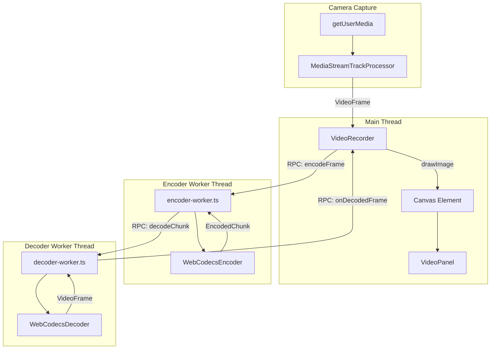

# Video Recording Implementation Plan

## Overview
Implement video recording functionality by combining existing video encoding/decoding services with the VideoPanel UI component. The first stage focuses on rendering captured video after processing through the encode/decode pipeline.

## Current State Analysis

### Existing Video Infrastructure
- **WebCodecsEncoder** ([`webcodecs-encoder.ts`](src/dotnet/UI.Blazor.App/Services/Video/webcodecs-encoder.ts)): Encodes VideoFrames to H.264/HEVC/AV1 chunks
- **WebCodecsDecoder** ([`webcodecs-decoder.ts`](src/dotnet/UI.Blazor.App/Services/Video/webcodecs-decoder.ts)): Decodes chunks back to VideoFrames
- **Encoder Worker** ([`encoder-worker.ts`](src/dotnet/UI.Blazor.App/Services/Video/workers/encoder-worker.ts)): Runs encoding in dedicated thread via RPC
- **Decoder Worker** ([`decoder-worker.ts`](src/dotnet/UI.Blazor.App/Services/Video/workers/decoder-worker.ts)): Runs decoding in dedicated thread via RPC
- **Codec Support** ([`codec-support.ts`](src/dotnet/UI.Blazor.App/Services/Video/codec-support.ts)): Detects supported codecs with hardware acceleration

### VideoPanel Component
- **VideoPanel.razor** ([`VideoPanel.razor`](src/dotnet/UI.Blazor.App/Components/VideoPanel/VideoPanel.razor)): Currently displays static landing video
- **video-panel.ts** ([`video-panel.ts`](src/dotnet/UI.Blazor.App/Components/VideoPanel/video-panel.ts)): Handles expand/collapse UI interactions
- **video-panel.css** ([`video-panel.css`](src/dotnet/UI.Blazor.App/Components/VideoPanel/video-panel.css)): Styling with animations

### RPC Communication Pattern
The project uses a custom RPC framework ([`rpc.ts`](src/nodejs/src/rpc.ts)) for worker communication:
- [`rpcClient()`](src/nodejs/src/rpc.ts:217) - Creates typed proxy for calling worker methods
- [`rpcServer()`](src/nodejs/src/rpc.ts:148) - Sets up message handler in worker
- [`rpcClientServer()`](src/nodejs/src/rpc.ts:299) - Bidirectional communication
- Supports transferable objects like VideoFrame and MessagePort

## Architecture



## Implementation Steps

### Step 1: Create video-recorder-contract.ts
Define TypeScript interfaces for the VideoRecorder service:

```typescript
// Location: src/dotnet/UI.Blazor.App/Services/Video/video-recorder-contract.ts

export interface VideoRecorderConfig {
    width: number;
    height: number;
    frameRate: number;
    codec: string;
    bitrate: number;
}

export interface VideoRecorderState {
    isRecording: boolean;
    hasCamera: boolean;
    error: string | null;
}

export interface VideoRecorder {
    initialize(config: VideoRecorderConfig): Promise<void>;
    start(): Promise<void>;
    stop(): Promise<void>;
    dispose(): void;
    getState(): VideoRecorderState;
}

export interface VideoRecorderCallbacks {
    onFrame(frame: VideoFrame): void;
    onStateChange(state: VideoRecorderState): void;
    onError(error: Error): void;
}
```

### Step 2: Create video-recorder.ts
Main service that orchestrates camera capture and worker communication:

**Key responsibilities:**
1. Request camera access via `navigator.mediaDevices.getUserMedia()`
2. Use `MediaStreamTrackProcessor` to extract VideoFrames from camera stream
3. Create and manage encoder/decoder workers using existing RPC pattern
4. Route frames: Camera → Encoder Worker → Decoder Worker → Canvas
5. Handle lifecycle (start/stop/dispose)

**Frame capture approach:**
```typescript
// Use MediaStreamTrackProcessor for efficient frame extraction
const track = stream.getVideoTracks()[0];
const processor = new MediaStreamTrackProcessor({ track });
const reader = processor.readable.getReader();

// Read frames in a loop
while (recording) {
    const { value: frame, done } = await reader.read();
    if (done) break;
    await encoderClient.encodeFrame(frame); // Transfer frame to worker
}
```

### Step 3: Update video-panel.ts
Integrate VideoRecorder with the panel:

1. Add canvas element reference for rendering decoded frames
2. Create VideoRecorder instance on panel initialization
3. Implement frame rendering callback using `canvas.getContext('2d').drawImage(frame, 0, 0)`
4. Add start/stop methods callable from Blazor
5. Maintain existing expand/collapse functionality

### Step 4: Update VideoPanel.razor
Modify the Blazor component:

1. Replace `<video>` element with `<canvas>` for live preview
2. Add recording control buttons (Start/Stop)
3. Add state indicators (recording status, camera status)
4. Wire up JSInvokable methods for state changes

**Updated markup structure:**
```razor
<div class="video-panel">
    <div class="c-content">
        <div class="video-frame">
            <canvas @ref="CanvasRef" class="call-video"></canvas>
        </div>
        <div class="controls">
            <button @onclick="ToggleRecording">
                @(IsRecording ? "Stop" : "Start")
            </button>
        </div>
        <HeaderButton Class="expand-btn">...</HeaderButton>
    </div>
</div>
```

### Step 5: Update exports.ts
Add exports for new modules:

```typescript
export * from './Services/Video/video-recorder';
export * from './Services/Video/video-recorder-contract';
```

### Step 6: Testing
1. Verify camera permission request works
2. Confirm frames flow through encode/decode pipeline
3. Check decoded video renders correctly on canvas
4. Test start/stop functionality
5. Verify proper cleanup on dispose

## Technical Details

### Codec Configuration
Based on [`codec-support.ts`](src/dotnet/UI.Blazor.App/Services/Video/codec-support.ts), use:
- **Primary**: AV1 with hardware acceleration if available
- **Fallback**: H.264 High profile (avc1.640028)
- **Resolution**: 1280x720 (720p)
- **Bitrate**: 2 Mbps
- **Frame rate**: 30 fps

### Worker Communication
Follow existing pattern from [`encoder-worker.ts`](src/dotnet/UI.Blazor.App/Services/Video/workers/encoder-worker.ts:344):
```typescript
// Main thread creates RPC client
const encoderWorker = new Worker('./workers/encoder-worker.ts');
const encoderClient = rpcClientServer<EncoderWorkerCallbacks>(
    'VideoRecorder.encoder',
    encoderWorker,
    callbacksImpl
);
```

### Memory Management
- Always call `frame.close()` after processing VideoFrames
- Use transferable objects when sending frames to workers
- Properly dispose workers on cleanup

## Files to Create/Modify

| File | Action | Description |
|------|--------|-------------|
| `Services/Video/video-recorder-contract.ts` | Create | Interface definitions |
| `Services/Video/video-recorder.ts` | Create | Main recorder service |
| `Components/VideoPanel/video-panel.ts` | Modify | Integrate recorder, add canvas rendering |
| `Components/VideoPanel/VideoPanel.razor` | Modify | Replace video with canvas, add controls |
| `exports.ts` | Modify | Export new modules |

## Dependencies
- Existing video workers and WebCodecs implementations
- RPC communication framework ([`rpc.ts`](src/nodejs/src/rpc.ts))
- UI.Blazor component infrastructure
- Browser APIs: getUserMedia, MediaStreamTrackProcessor, WebCodecs
