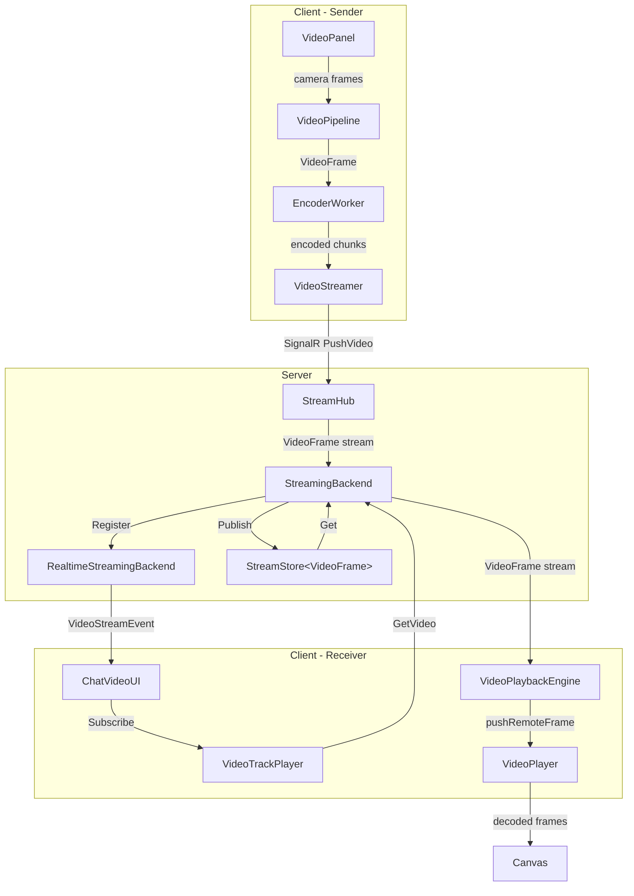
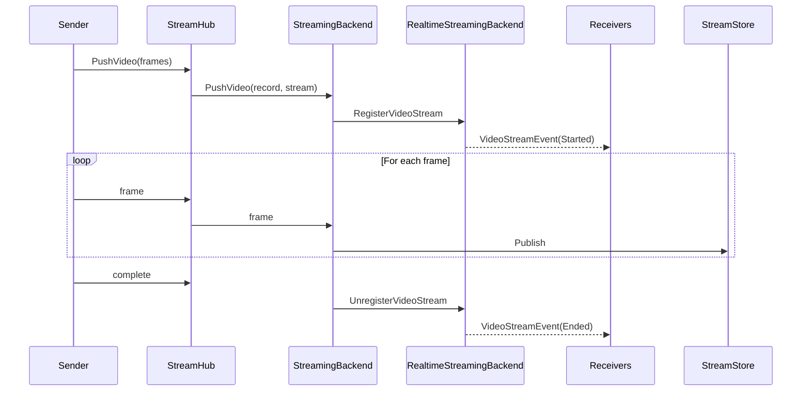

# Video Streaming Implementation Plan

## Overview

Real-time video streaming in chat allowing all participants to view recorded video. This follows the existing audio streaming architecture pattern using SignalR hub and in-memory stream storage with memoization.

## Current Implementation Status

### Completed Components

| Component | Status | Location |
|-----------|--------|----------|
| VideoFrame type | Done | `src/dotnet/Api/Video/VideoFrame.cs` |
| VideoFormat type | Done | `src/dotnet/Api/Video/VideoFormat.cs` |
| VideoSource type | Done | `src/dotnet/Api/Video/VideoSource.cs` |
| VideoRecord contract | Done | `src/dotnet/Streaming.Contracts/VideoRecord.cs` |
| IStreamingBackend video methods | Done | `src/dotnet/Streaming.Contracts/IStreamingBackend.cs` |
| IRealtimeStreamingBackend | Done | `src/dotnet/Streaming.Contracts/IRealtimeStreamingBackend.cs` |
| StreamHub.PushVideo | Done | `src/dotnet/Streaming.Service/Services/StreamHub.cs` |
| StreamingBackend video methods | Done | `src/dotnet/Streaming.Service/Backend/StreamingBackend.cs` |
| RealtimeStreamingBackend | Done | `src/dotnet/Streaming.Service/Backend/RealtimeStreamingBackend.cs` |
| VideoStreamer (client) | Done | `src/dotnet/UI.Blazor.App/Services/Video/video-streamer.ts` |
| VideoPipeline with streaming | Done | `src/dotnet/UI.Blazor.App/Services/Video/services/video-pipeline.ts` |
| VideoPlayer (client) | Done | `src/dotnet/UI.Blazor.App/Services/Video/video-player.ts` |
| VideoPanel component | Done | `src/dotnet/UI.Blazor.App/Components/VideoPanel/` |
| VideoTrackPlayer | Done | `src/dotnet/Streaming.UI.Blazor/Components/VideoPlayer/` |
| VideoPlaybackEngine | Done | `src/dotnet/Streaming.UI.Blazor/Components/VideoPlayer/` |
| ChatVideoUI orchestration | Done | `src/dotnet/Chat.UI.Blazor/Services/` |
| Constants.Video | Done | `src/dotnet/Api/Constants.Video.cs` |

## Architecture

### Video Streaming Flow (Implemented)



### Real-time Signaling Flow



## Key Components

### Server-Side

#### VideoFrame (`src/dotnet/Api/Video/VideoFrame.cs`)

```csharp
public partial class VideoFrame : MediaFrame
{
    public override TimeSpan Offset { get; init; }
    public override TimeSpan Duration { get; init; }
    public override bool IsKeyFrame { get; init; }
    public int Width { get; init; }
    public int Height { get; init; }
    public byte[]? Description { get; init; }  // SPS/PPS for H.264, only on keyframes
}
```

#### VideoFormat (`src/dotnet/Api/Video/VideoFormat.cs`)

```csharp
public sealed partial record VideoFormat : MediaFormat
{
    public string Codec { get; init; } = "avc1";  // H.264 by default
    public int Width { get; init; }
    public int Height { get; init; }
    public string CodecSettings { get; init; } = "";  // Base64 encoded SPS/PPS
}
```

#### VideoRecord (`src/dotnet/Streaming.Contracts/VideoRecord.cs`)

```csharp
public sealed partial record VideoRecord(
    StreamId StreamId,
    Session Session,
    ChatId ChatId,
    double ClientStartOffset,
    VideoFormat Format
) : IHasId<StreamId>, IHasNodeRef;
```

#### IStreamingBackend Video Methods

```csharp
Task<RpcStream<VideoFrame>?> GetVideo(
    StreamId streamId,
    TimeSpan skipTo,
    CancellationToken cancellationToken);

Task PushVideo(
    VideoRecord record,
    RpcStream<VideoFrame> videoStream,
    CancellationToken cancellationToken);
```

#### IRealtimeStreamingBackend

Handles real-time video stream signaling:
- `GetActiveVideoStreams(chatId)` - Returns current streams for a chat
- `SubscribeToVideoStreamEvents(chatId)` - Subscribe to stream start/end events
- `OnRegisterVideoStream` / `OnUnregisterVideoStream` - Commands for tracking

### Client-Side

#### VideoStreamer (`video-streamer.ts`)

- Manages SignalR connection with MessagePack protocol
- Batches frames (up to 10) for efficient transmission
- Sequential streaming via `lastStream.whenDisposed` chaining

#### VideoPipeline (`video-pipeline.ts`)

Unified pipeline with:
- Encoder/Decoder workers via RPC
- Optional background blur via segmentation
- Network simulation for testing
- Streaming integration via VideoStreamer

#### VideoPlayer (`video-player.ts`)

- WebCodecs VideoDecoder API
- H.264 codec description handling (SPS/PPS extraction)
- Frame buffering with low-buffer signaling
- Canvas rendering

## Constants

**File: `src/dotnet/Api/Constants.Video.cs`**

```csharp
public static class Video
{
    public static readonly TimeSpan CancellationDelay = TimeSpan.FromSeconds(5);
    public static readonly TimeSpan StreamExpirationDelay = TimeSpan.FromSeconds(30);
}
```

## Technical Details

### Codec Support

- **Primary**: H.264 (avc1) - widest browser support
- **Future**: AV1 decoder toggle available in pipeline

### Codec Description Handling

H.264 requires SPS/PPS data for decoder configuration:
1. Encoder extracts description from first keyframe
2. Description sent as `codecSettings` (Base64) on stream start
3. Also included in frame `description` field for late joiners
4. VideoPlayer buffers delta frames until keyframe with description arrives

### Frame Batching

Frames are batched in groups of up to 10 for SignalR transmission via `VideoStreamFrameDto[]`.

### Keyframe-Based Seeking

`SkipToKeyFrame()` in StreamingBackend drops frames until reaching a keyframe at or after the requested offset.

### Stream Memoization

- `StreamStore<VideoFrame>` caches frames for late joiners
- 30-second expiration (`Constants.Video.StreamExpirationDelay`)
- Supports replay from memoized history

### Browser Fallbacks

- Canvas-based frame extraction for browsers without Insertable Streams API
- MediaStreamTrackProcessor/Generator when available

## File Summary

### Core Video Types

| File | Description |
|------|-------------|
| `src/dotnet/Api/Video/VideoFrame.cs` | Video frame with codec description |
| `src/dotnet/Api/Video/VideoFormat.cs` | Video format with codec settings |
| `src/dotnet/Api/Video/VideoSource.cs` | Memoizing video source wrapper |
| `src/dotnet/Api/Streaming/VideoStreamEvent.cs` | Stream start/end events |
| `src/dotnet/Api/Streaming/VideoStreamInfo.cs` | Stream metadata |
| `src/dotnet/Api/Streaming/ActiveVideoStreams.cs` | Active streams per chat |
| `src/dotnet/Api/Constants.Video.cs` | Video-related constants |

### Streaming Contracts

| File | Description |
|------|-------------|
| `src/dotnet/Streaming.Contracts/IStreamingBackend.cs` | GetVideo/PushVideo methods |
| `src/dotnet/Streaming.Contracts/IRealtimeStreamingBackend.cs` | Real-time signaling interface |
| `src/dotnet/Streaming.Contracts/VideoRecord.cs` | Video recording metadata |

### Streaming Service

| File | Description |
|------|-------------|
| `src/dotnet/Streaming.Service/Services/StreamHub.cs` | SignalR hub with PushVideo |
| `src/dotnet/Streaming.Service/Backend/StreamingBackend.cs` | Video stream store and methods |
| `src/dotnet/Streaming.Service/Backend/RealtimeStreamingBackend.cs` | Real-time signaling service |
| `src/dotnet/Streaming.Service/VideoStreamHeader.cs` | Wire format for stream header |

### Client-Side (TypeScript)

| File | Description |
|------|-------------|
| `src/dotnet/UI.Blazor.App/Services/Video/video-streamer.ts` | SignalR video streaming |
| `src/dotnet/UI.Blazor.App/Services/Video/services/video-pipeline.ts` | Complete processing pipeline |
| `src/dotnet/UI.Blazor.App/Services/Video/video-player.ts` | WebCodecs playback |
| `src/dotnet/UI.Blazor.App/Services/Video/video-recorder.ts` | Simplified recorder wrapper |
| `src/dotnet/UI.Blazor.App/Components/VideoPanel/video-panel.ts` | UI component coordinator |

### Playback Components

| File | Description |
|------|-------------|
| `src/dotnet/Streaming.UI.Blazor/Components/VideoPlayer/VideoTrackPlayer.cs` | Plays stream from backend |
| `src/dotnet/Streaming.UI.Blazor/Components/VideoPlayer/VideoPlaybackEngine.cs` | Pushes frames to JS |
| `src/dotnet/Chat.UI.Blazor/Services/ChatVideoUI.cs` | Orchestrates playback per chat |

## Future Enhancements

1. **Audio-video synchronization** - VideoRecord has infrastructure for AudioStreamId linking
2. **Blob storage persistence** - Save video chunks for later playback
3. **Adaptive bitrate** - Adjust quality based on network (bitrate params already configurable)
4. **Multiple video streams** - Multi-participant video (foundation in place)
5. **Screen sharing** - Extend to screen capture (uses same pipeline)
6. **AV1 codec** - Better compression when hardware support improves

## Differences from Original Plan

| Planned | Actual Implementation |
|---------|----------------------|
| `VideoFrame.Codec` field | Codec in `VideoFormat`, frame has `Description` |
| `VideoFrame.SequenceNumber` | Not needed - using offset/duration |
| `VideoRecord.AudioStreamId` | Not in current record, can be added |
| Raw `byte[]` streams | Typed `VideoFrame` streams with metadata |
| No real-time signaling | Full `IRealtimeStreamingBackend` for stream events |
| `ProcessVideoChunks` method | `PushVideo` method name |
| Separate `StreamingBackend.PushVideo.cs` | Integrated in main `StreamingBackend.cs` |
| `VideoStreamHeader` for prepending | `VideoStreamHeader` exists but frames carry metadata |
