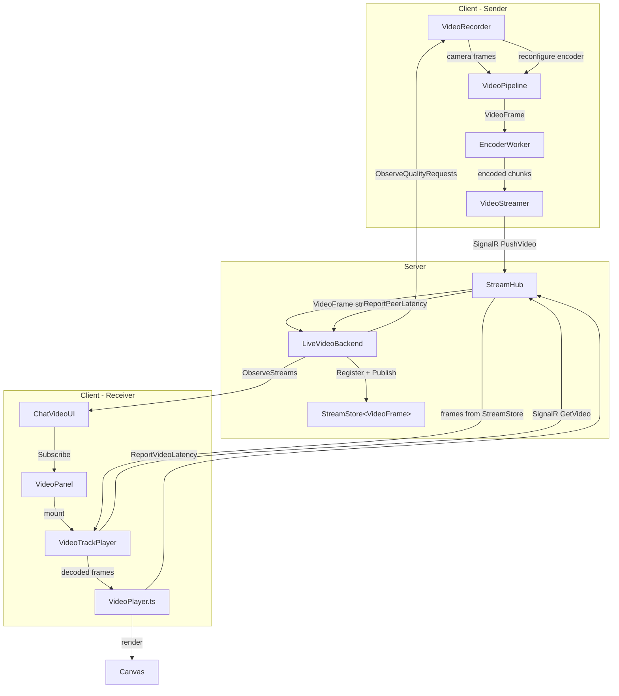
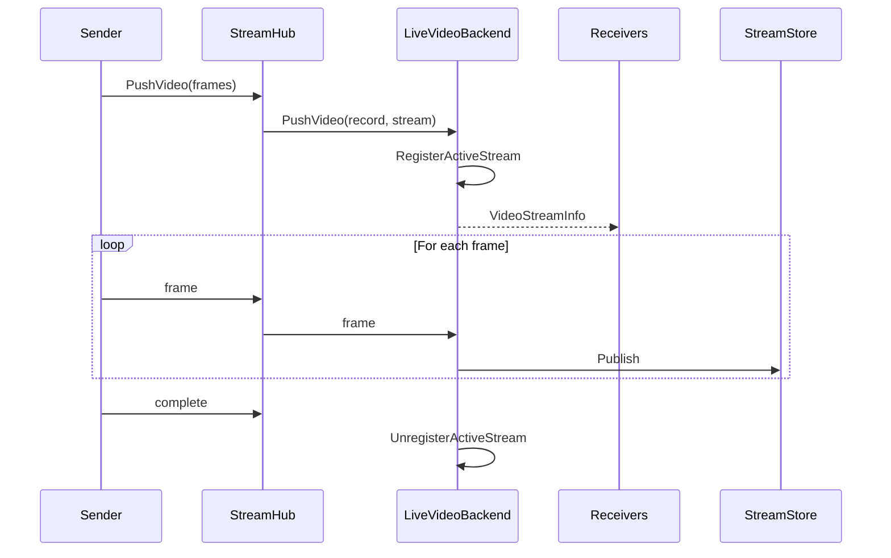

# Video Streaming Implementation Plan

## Overview

Real-time video streaming in chat allowing all participants to view recorded video. This follows the existing audio streaming architecture pattern using SignalR hub and in-memory stream storage with memoization.

## Current Implementation Status

### Completed Components

| Component | Status | Location |
|-----------|--------|----------|
| VideoFrame type | Done | `src/dotnet/Api/Video/VideoFrame.cs` |
| VideoFormat type | Done | `src/dotnet/Api/Video/VideoFormat.cs` |
| VideoSource type | Done | `src/dotnet/Api/Video/VideoSource.cs` |
| VideoQualityPreset | Done | `src/dotnet/Api/Video/VideoQualityPreset.cs` |
| VideoStreamInfo | Done | `src/dotnet/Api/Streaming/VideoStreamInfo.cs` |
| VideoRecord contract | Done | `src/dotnet/Streaming.Contracts/VideoRecord.cs` |
| ILiveVideoBackend | Done | `src/dotnet/Streaming.Contracts/ILiveVideoBackend.cs` |
| StreamHub (PushVideo, GetVideo, ReportVideoLatency) | Done | `src/dotnet/Streaming.Service/Services/StreamHub.cs` |
| LiveVideoBackend (signaling + stream storage) | Done | `src/dotnet/Streaming.Service/Backend/LiveVideoBackend.cs` |
| LiveVideoBackend.ChatState (quality adaptation) | Done | `src/dotnet/Streaming.Service/Backend/LiveVideoBackend.ChatState.cs` |
| LiveVideoStreams (permission-checked frontend) | Done | `src/dotnet/Streaming.Service/Services/LiveVideoStreams.cs` |
| ILiveVideoStreams | Done | `src/dotnet/Api.Contracts/Streaming/ILiveVideoStreams.cs` |
| IStreamClient | Done | `src/dotnet/Api.Contracts/Streaming/IStreamClient.cs` |
| VideoStreamer (client SignalR) | Done | `src/dotnet/UI.Blazor.App/Services/Video/video-streamer.ts` |
| VideoPipeline with streaming | Done | `src/dotnet/UI.Blazor.App/Services/Video/services/video-pipeline.ts` |
| VideoPlayer (client playback) | Done | `src/dotnet/UI.Blazor.App/Components/VideoPanel/video-player.ts` |
| VideoPanel component | Done | `src/dotnet/UI.Blazor.App/Components/VideoPanel/VideoPanel.razor` |
| VideoTrackPlayer | Done | `src/dotnet/UI.Blazor.App/Components/VideoPanel/VideoTrackPlayer.razor` |
| VideoRecorder | Done | `src/dotnet/UI.Blazor.App/Components/VideoPanel/VideoRecorder.razor` |
| IVideoPlayerBackend | Done | `src/dotnet/UI.Blazor.App/Components/VideoPanel/IVideoPlayerBackend.cs` |
| JoinVideoCallModal | Done | `src/dotnet/UI.Blazor.App/Components/JoinVideoCallModal/JoinVideoCallModal.razor` |
| ChatVideoUI orchestration | Done | `src/dotnet/UI.Blazor.App/Services/ChatVideoUI.cs` |
| ChatVideoUI.StateSync | Done | `src/dotnet/UI.Blazor.App/Services/ChatVideoUI.StateSync.cs` |
| ChatVideoState | Done | `src/dotnet/UI.Blazor.App/Services/ChatVideoState.cs` |
| Constants.Video | Done | `src/dotnet/Api/Constants.Video.cs` |

## Architecture

### Video Streaming Flow (Implemented)

### Real-time Signaling Flow

## Key Components

### Server-Side

#### VideoFrame (`src/dotnet/Api/Video/VideoFrame.cs`)

`VideoFrame : MediaFrame` — carries a single encoded video frame with the following properties:
- `Offset: TimeSpan` — frame offset from stream start
- `Duration: TimeSpan` — frame duration
- `IsKeyFrame: bool` — whether this is a keyframe (I-frame)
- `Width: int` — frame width in pixels
- `Height: int` — frame height in pixels
- `Description: byte[]?` — codec-specific data (SPS/PPS for H.264), only on keyframes
- `Codec: string?` — codec identifier (e.g. "avc1"), only on keyframes

Serialized via MemoryPack and MessagePack.

#### VideoFormat (`src/dotnet/Api/Video/VideoFormat.cs`)

`VideoFormat : MediaFormat` — describes the video stream format:
- `Codec: string` — default "avc1" (H.264)
- `Width: int`, `Height: int` — resolution
- `CodecSettings: string` — Base64-encoded SPS/PPS or other codec-specific settings

#### VideoRecord (`src/dotnet/Streaming.Contracts/VideoRecord.cs`)

`VideoRecord(StreamId, Session, ChatId, ClientStartOffset, VideoFormat)` — metadata sent when pushing video. Implements `IHasId<StreamId>`, `IHasNodeRef`.

#### VideoQualityPreset (`src/dotnet/Api/Video/VideoQualityPreset.cs`)

Defines quality levels for adaptive bitrate:
- `Full` — 1920x1080, 8 Mbps
- `High` — 1280x720, 4 Mbps
- `Medium` — 960x540, 2.5 Mbps
- `Low` — 640x360, 1 Mbps

Methods: `ForLevel(level)`, `StepDown(current)`, `StepUp(current)`.

#### ILiveVideoBackend (`src/dotnet/Streaming.Contracts/ILiveVideoBackend.cs`)

Consolidates all video backend logic — real-time signaling, stream storage, push/get, and quality adaptation. Decorated with `[BackendService(HostRole.VideoBackend)]`.

**Stream lifecycle:**
- `PushVideo(VideoRecord, RpcStream<VideoFrame>)` — push video stream, register/unregister active stream
- `GetVideo(StreamId, TimeSpan skipTo, CancellationToken)` — get video stream with keyframe-based seeking
- `GetVideo(StreamId, TimeSpan skipTo, string peerId, CancellationToken)` — per-peer variant with GOP skipping

**Observation:**
- `ListActiveStreams(ChatId)` — returns current streams for a chat (ComputeMethod)
- `ObserveStreams(ChatId)` — observe stream changes via RpcStream
- `ObserveStreamQualityRequests(StreamId)` — observe quality preset changes for sender adaptation

**Quality adaptation:**
- `ReportPeerLatency(StreamId, string peerId, float streamOffsetMs)` — receiver reports its playback latency

**Member tracking:**
- `RegisterActiveStream(ChatId, VideoStreamInfo)` / `UnregisterActiveStream(ChatId, StreamId)` — stream registration
- `RegisterVideoStreamMember(ChatId, string sessionId)` / `UnregisterVideoStreamMember(ChatId, string sessionId)` — viewer registration
- `GetVideoStreamingAuthorIds(ChatId)` — authors currently streaming (ComputeMethod)
- `GetVideoStreamMemberCount(ChatId)` — number of viewers (ComputeMethod)

#### StreamHub — Video Methods (`src/dotnet/Streaming.Service/Services/StreamHub.cs`)

- `PushVideo(sessionToken, chatId, codec, width, height, codecSettings, clientStartOffset, videoStream)` — accepts `IAsyncEnumerable<byte[][]>` batches of MessagePack-encoded VideoFrame objects
- `GetVideo(sessionToken, streamId, skipToMs)` — returns `IAsyncEnumerable<byte[][]>` with MessagePack batches (up to 10 frames per batch), applies per-peer GOP skipping
- `ReportVideoLatency(sessionToken, streamId, streamOffsetMs)` — peer reports its streaming latency, forwarded to `LiveVideoBackend.ReportPeerLatency`

#### LiveVideoBackend.ChatState (`src/dotnet/Streaming.Service/Backend/LiveVideoBackend.ChatState.cs`)

Inner types managing per-chat and per-stream state:

- **ChatState** — tracks active streams, members, and stream latency state per chat
- **StreamLatencyState** — per-stream quality adaptation logic:
  - Evaluates quality every 5s (`QualityDecisionInterval`)
  - Steps down if >50% of peers exceed 500ms latency (`PeerOutlierRatio`)
  - Steps up if all peers under 200ms AND 15s hysteresis window elapsed
  - Publishes `VideoQualityPreset` via `ObserveQualityDirectives()`
- **PeerLatencyState** — per-peer latency tracking:
  - Sliding window of latency samples (`LatencyHistorySize = 6`)
  - Per-peer GOP skipping when latency exceeds 1000ms (`GopSkipThresholdMs`)
  - Recovery when latency drops below 500ms (`GopSkipRecoveryMs`)

### Client-Side

#### VideoStreamer (`video-streamer.ts`)

- Manages SignalR connection with MessagePack protocol
- Batches frames (up to 10) for efficient transmission
- Sequential streaming via `lastStream.whenDisposed` chaining

#### VideoPipeline (`video-pipeline.ts`)

Unified pipeline with:
- Encoder/Decoder workers via RPC
- Optional background blur via segmentation
- Network simulation for testing
- Streaming integration via VideoStreamer

#### VideoPlayer (`src/dotnet/UI.Blazor.App/Components/VideoPanel/video-player.ts`)

Handles remote video playback on the receiver side:
- Initiates SignalR pull subscription via `startPull(streamId, skipToMs)` calling `StreamHub.GetVideo()`
- WebCodecs `VideoDecoder` with hardware acceleration
- H.264 codec description handling — parses avcC to extract profile/level, buffers delta frames until keyframe arrives
- Frame pacing via `requestAnimationFrame` render loop
- Latency measurement: computes stream offset vs. wall-clock time, reports to server every 5s via `StreamHub.ReportVideoLatency()`
- Low-buffer signaling to Blazor backend via `IVideoPlayerBackend.OnPlaying(offset, isBufferLow)`

#### VideoRecorder (`src/dotnet/UI.Blazor.App/Components/VideoPanel/VideoRecorder.razor` + `video-recorder.ts`)

Blazor component + TypeScript controller for video capture:
- Camera enumeration and selection
- Background blur toggle (delegates to VideoPipeline segmentation)
- Recording lifecycle: start/stop with preview rendering to canvas
- Subscribes to quality directives via `IStreamClient.ObserveStreamQualityRequests()` after stream is registered
- Applies quality changes by calling `reconfigure(width, height, bitrate)` on the pipeline

#### VideoTrackPlayer (`src/dotnet/UI.Blazor.App/Components/VideoPanel/VideoTrackPlayer.razor`)

Blazor component for playing a single remote video stream:
- Parameters: `VideoStreamInfo`, `AuthorName`, `FocusedClass`
- Initializes JS `VideoPlayer` via `VideoPlayer.create(canvas, blazorRef, streamId, ...)`
- Calls `PlayAsync()` to initiate SignalR pull
- Registers/unregisters viewer with backend for member counting
- Implements `IVideoPlayerBackend` for JS callbacks (`OnPlaying`, `OnEnded`)

#### ChatVideoUI (`src/dotnet/UI.Blazor.App/Services/ChatVideoUI.cs`)

Orchestrates video state per chat:
- **Compute methods**: `GetState(ChatId)`, `GetRecordingChatId()`, `GetActiveVideoStreams()`, `GetVideoStreamingAuthorIds()`, `IsAnyoneVideoStreaming()`, `GetVideoStreamMemberCount()`, `IsOwnVideoStreaming()`, `GetFocusedSpeakerId()`
- **State mutators**: `SetRecordingChatId()`, `SetSelectedCamera()`, `SetBackgroundBlur()`, `SetError()`, `ResumeRecording()`
- **JS callbacks**: `OnRecordingStarted()`, `OnRecordingStopped()`, `OnRecordingError()`
- **Active speaker sync** (in `ChatVideoUI.StateSync.cs`): monitors chat selection + audio/video streaming, auto-focuses on speaker with video (debounced 1.5s)

#### ChatVideoState (`src/dotnet/UI.Blazor.App/Services/ChatVideoState.cs`)

Immutable record: `ChatVideoState(ChatId?, IsRecording, SelectedCameraDeviceId, IsBackgroundBlurEnabled, HasError, ErrorMessage)`.

## Constants

**File: `src/dotnet/Api/Constants.Video.cs`** — 13 constants:

| Constant | Value | Purpose |
|----------|-------|---------|
| `CancellationDelay` | 5s | Grace period before cancelling stream |
| `StreamExpirationDelay` | 30s | StreamStore retention for late joiners |
| `RetentionBufferSize` | 150 | ~5s at 30fps frame buffer |
| `ConsumerBufferSize` | 300 | ~10s before slow consumer disconnect |
| `LatencyReportInterval` | 5s | How often peers report latency |
| `HighLatencyThresholdMs` | 500 | Latency above this triggers quality step-down |
| `LowLatencyThresholdMs` | 200 | Latency below this allows quality step-up |
| `GopSkipThresholdMs` | 1000 | Per-peer GOP skipping trigger |
| `GopSkipRecoveryMs` | 500 | Per-peer GOP skipping recovery threshold |
| `QualityDecisionInterval` | 5s | How often quality is re-evaluated |
| `QualityHysteresisWindow` | 15s | Cooldown before stepping quality back up |
| `LatencyHistorySize` | 6 | Sliding window samples (~30s at 5s intervals) |
| `PeerOutlierRatio` | 0.5 | Fraction of slow peers that triggers step-down |

## Adaptive Quality & GOP Skipping

The system implements two-level adaptive quality control:

### Sender Quality Stepping

When multiple receivers report high latency, the sender's encoding quality is adjusted:

1. Each receiver's `VideoPlayer` measures playback latency (stream offset vs. wall-clock time)
2. Latency is reported to server every 5s via `StreamHub.ReportVideoLatency()`
3. `LiveVideoBackend` forwards to `StreamLatencyState` which tracks per-peer sliding windows
4. Every `QualityDecisionInterval` (5s), quality is evaluated:
   - **Step down**: if >50% of peers (`PeerOutlierRatio`) have median latency > 500ms (`HighLatencyThresholdMs`)
   - **Step up**: if all peers are below 200ms (`LowLatencyThresholdMs`) AND 15s (`QualityHysteresisWindow`) has elapsed since last change
5. New `VideoQualityPreset` is published via `ObserveStreamQualityRequests()`
6. `VideoRecorder` subscribes and calls `reconfigure(width, height, bitrate)` on the pipeline

### Per-Peer GOP Skipping

For individual slow receivers without penalizing all viewers:

1. `PeerLatencyState` tracks each peer's latency independently
2. If a peer's median latency exceeds 1000ms (`GopSkipThresholdMs`), GOP skipping is activated for that peer
3. `StreamHub.GetVideo()` passes the peerId to `LiveVideoBackend.GetVideo()` which skips GOPs for that peer
4. Skipping recovers when latency drops below 500ms (`GopSkipRecoveryMs`)

Reference files: `LiveVideoBackend.ChatState.cs`, `VideoQualityPreset.cs`, `Constants.Video.cs`

## Technical Details

### Codec Support

- **Primary**: H.264 (avc1) - widest browser support
- **Future**: AV1 decoder toggle available in pipeline

### Codec Description Handling

H.264 requires SPS/PPS data for decoder configuration:
1. Encoder extracts description from first keyframe
2. Description sent as `codecSettings` (Base64) on stream start
3. Also included in frame `description` field for late joiners
4. VideoPlayer buffers delta frames until keyframe with description arrives

### Frame Batching

Frames are batched in groups of up to 10 for SignalR transmission. Both `PushVideo` and `GetVideo` use `byte[][]` batches of MessagePack-encoded frames.

### Keyframe-Based Seeking

`SkipToKeyFrame()` in LiveVideoBackend drops frames until reaching a keyframe at or after the requested offset.

### Stream Memoization

- `StreamStore<VideoFrame>` caches frames for late joiners
- 30-second expiration (`Constants.Video.StreamExpirationDelay`)
- Retention buffer of 150 frames (`RetentionBufferSize`)
- Supports replay from memoized history

### Browser Fallbacks

- Canvas-based frame extraction for browsers without Insertable Streams API
- MediaStreamTrackProcessor/Generator when available

## File Summary

### Core Video Types

| File | Description |
|------|-------------|
| `src/dotnet/Api/Video/VideoFrame.cs` | Video frame with codec description and codec identifier |
| `src/dotnet/Api/Video/VideoFormat.cs` | Video format with codec settings |
| `src/dotnet/Api/Video/VideoSource.cs` | Memoizing video source wrapper with keyframe seeking |
| `src/dotnet/Api/Video/VideoQualityPreset.cs` | Quality levels (Full/High/Medium/Low) with resolution and bitrate |
| `src/dotnet/Api/Streaming/VideoStreamInfo.cs` | Stream metadata (StreamId, ChatId, AuthorId, format, timing) |
| `src/dotnet/Api/Constants.Video.cs` | 13 video-related constants (buffers, latency, quality adaptation) |

### Streaming Contracts

| File | Description |
|------|-------------|
| `src/dotnet/Streaming.Contracts/ILiveVideoBackend.cs` | Video backend interface (14 methods: lifecycle, observation, quality, members) |
| `src/dotnet/Streaming.Contracts/VideoRecord.cs` | Video recording metadata for push |

### API Contracts

| File | Description |
|------|-------------|
| `src/dotnet/Api.Contracts/Streaming/ILiveVideoStreams.cs` | Permission-checked frontend interface for video streams |
| `src/dotnet/Api.Contracts/Streaming/IStreamClient.cs` | Client interface: GetAudio, GetVideo, GetTranscript, ObserveStreamQualityRequests |

### Streaming Service

| File | Description |
|------|-------------|
| `src/dotnet/Streaming.Service/Services/StreamHub.cs` | SignalR hub: PushVideo, GetVideo, ReportVideoLatency |
| `src/dotnet/Streaming.Service/Backend/LiveVideoBackend.cs` | Video backend implementation (signaling, stream store, push/get) |
| `src/dotnet/Streaming.Service/Backend/LiveVideoBackend.ChatState.cs` | Per-chat state, per-stream quality adaptation, per-peer GOP skipping |
| `src/dotnet/Streaming.Service/Services/LiveVideoStreams.cs` | Permission-checked wrapper around ILiveVideoBackend |
| `src/dotnet/Streaming.Service/VideoStreamHeader.cs` | Wire format for stream header |

### Client-Side TypeScript

| File | Description |
|------|-------------|
| `src/dotnet/UI.Blazor.App/Services/Video/video-streamer.ts` | SignalR video streaming (push frames to server) |
| `src/dotnet/UI.Blazor.App/Services/Video/services/video-pipeline.ts` | Complete encode/decode processing pipeline |
| `src/dotnet/UI.Blazor.App/Components/VideoPanel/video-player.ts` | WebCodecs playback, SignalR pull, latency reporting |
| `src/dotnet/UI.Blazor.App/Components/VideoPanel/video-recorder.ts` | Recording controller: camera, blur, quality adaptation |
| `src/dotnet/UI.Blazor.App/Components/VideoPanel/video-panel.ts` | UI component coordinator (expand/collapse) |

### Blazor Components

| File | Description |
|------|-------------|
| `src/dotnet/UI.Blazor.App/Components/VideoPanel/VideoPanel.razor` | Main video panel: recording controls, preview, streams |
| `src/dotnet/UI.Blazor.App/Components/VideoPanel/VideoRecorder.razor` | Recording component with quality directive subscription |
| `src/dotnet/UI.Blazor.App/Components/VideoPanel/VideoTrackPlayer.razor` | Single remote stream player with viewer registration |
| `src/dotnet/UI.Blazor.App/Components/VideoPanel/IVideoPlayerBackend.cs` | Interface for JS→Blazor callbacks (OnPlaying, OnEnded) |
| `src/dotnet/UI.Blazor.App/Components/JoinVideoCallModal/JoinVideoCallModal.razor` | Camera/blur settings modal |
| `src/dotnet/UI.Blazor.App/Components/JoinVideoCallModal/join-video-call-modal.ts` | Modal TypeScript controller |
| `src/dotnet/UI.Blazor.App/Components/JoinVideoCallModal/join-video-call-modal.css` | Modal styles |

### State Services

| File | Description |
|------|-------------|
| `src/dotnet/UI.Blazor.App/Services/ChatVideoUI.cs` | Video state orchestration per chat (compute methods, state mutators) |
| `src/dotnet/UI.Blazor.App/Services/ChatVideoUI.StateSync.cs` | Active speaker sync, auto-focus on streaming speaker |
| `src/dotnet/UI.Blazor.App/Services/ChatVideoState.cs` | Immutable state record (ChatId, IsRecording, camera, blur, error) |

### CSS

| File | Description |
|------|-------------|
| `src/dotnet/UI.Blazor.App/Components/VideoPanel/video-panel.css` | Video panel styles |
| `src/dotnet/UI.Blazor.App/Components/VideoPanel/video-recorder.css` | Recorder styles |

## Future Enhancements

1. **Audio-video synchronization** - VideoRecord has infrastructure for AudioStreamId linking
2. **Blob storage persistence** - Save video chunks for later playback
3. **Adaptive bitrate** - Partially implemented: quality stepping and GOP skipping are active; full ABR with bandwidth estimation is future work
4. **Multiple video streams** - Multi-participant video (foundation in place)
5. **Screen sharing** - Extend to screen capture (uses same pipeline)
6. **AV1 codec** - Better compression when hardware support improves
