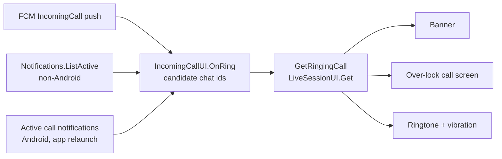

# Incoming-Call UI — Design

Date: 2026-07-07 (revised 2026-07-28 to match the shipped implementation)
Branch: `feat/1xxx-android-calls`
Status: implemented — this document describes what was actually built.

## Context

The server-side call subsystem was already complete when this work started:
`LiveSession` with `Kind=Dialing`/`Call`, `CallInvite`
(`Ringing/Accepted/Declined/Missed`, 40 s ring timeout), the full `ILiveSessions`
ring lifecycle (`StartCall/AcceptCall/DeclineCall/CancelCall/LeaveCall`), and FCM
pushes — `CallNotification` (kind `IncomingCall`) on ring start plus a dismissal
push on ring dismissal.

The client side was missing everything:

- `FirebaseMessagingService` did not special-case `NotificationKind.IncomingCall`
  — a call push rendered as an ordinary chat banner.
- `IncomingCallModal` was a stub (profile-oriented model, no Accept/Decline
  handlers).
- The only working accept flow was the admin-only `VoiceCallTestPage`.
- No call notification channel, no notification actions, no lock-screen path.

## Scope as shipped

The original design split the work into stage B (in-app UI + a plain heads-up
ringer notification) and a future stage A (lock-screen / killed-app experience).
**Both stages shipped together**, and the scope grew in two more directions:

| Area | Planned | Shipped |
|---|---|---|
| In-app ring (banner, modal, computed-driven state) | stage B | yes |
| Ringer notification with Accept/Decline | stage B, plain heads-up | `CallStyle` + full-screen intent |
| Lock-screen ring, over-keyguard call screen | stage A (deferred) | yes |
| Web / desktop in-app ring | non-goal | yes |
| Caller-side ringback + call-button gating | non-goal | yes |
| Peer-call anti-spam gate | non-goal | yes |
| Camera preview in the modal before accepting | stage B | **not implemented** |
| `ConnectionService` / telecom integration | non-goal | still a non-goal |
| Dedicated call foreground service | stage A | not introduced — the existing audio-widget FGS covers in-call audio |

## Approach

**Push is a trigger; the Fusion computed is the source of truth.**

The FCM `IncomingCall` push only wakes the client. The visible ring is derived
from the reactive `ILiveSessions.Get(session, chatId)` (`[RemoteComputeMethod]`,
surfaced via `LiveSessionUI.Get`): the banner / modal / lock-screen view / ringer
live while my `CallInvite` is `Ringing` in a `Dialing` session, and disappear on
any status change — cancel, timeout, decline, or accept on another device — even
if the dismissal push is lost.

On every platform except Android a second, self-healing trigger was added:
`INotifications.ListActive` is itself reactive and carries this user's incoming
rings, so a connected client discovers a ring without waiting on a push. Android
keeps the push path only (it must work with no live Blazor scope).

Rejected alternatives (unchanged): push-only (fragile, cannot self-heal) and a
new server computed `ListIncomingRings(session)` (the existing `ListActive`
turned out to cover the same need for free).

## Architecture

### `IncomingCallUI` (scoped, `UI.Blazor.App/Services/IncomingCallUI.cs`)

Owns all client-side ring state; registered on every platform (inert where
nothing triggers it).

- `OnRing(chatId, showOverLockScreen = false)` — adds a **candidate** ring; the
  candidate list is a `MutableState<ImmutableList<ChatId>>`. Confirmation happens
  in the computed below.
- `[ComputeMethod] GetRingingCall(chatId)` — the confirmation: reads
  `LiveSessionUI.Get(chatId)` and my own author, and returns an `IncomingCall`
  only when `FindRingingCall` matches.
- `static FindRingingCall(live, ownAuthorId)` — pure, unit-tested: the session
  must be `LiveSessionKind.Dialing` (an answered call is promoted to `Call` and
  is no longer *incoming*), I must not be the host, and my invite must be
  `Ringing`.
- `[ComputeMethod] GetIncomingCall()` — the topmost (most recent) confirmed ring;
  what the banner and the ringer follow.
- `Accept` / `Decline` / `GoToChat` / `HangUp` / `OnCallDismissed` — shared by the
  banner, the modal, the over-lock screen, and the notification routing.
- Three background workers (`OnRun`):
  - `SyncRings` — seeds candidates from the platform's still-active call
    notifications on scope start, then follows `GetIncomingCall` to start/stop the
    ringer and prune dead candidates.
  - `SyncActiveCallNotifications` — non-Android only: follows
    `Notifications.ListActive` and feeds `OnRing`.
  - `ResetOverLockScreen` — tears the over-lock screen down when its session ends
    without the user unlocking (cancel, timeout, remote hang-up).

Deviation from the original design: there is **no `AmIInLiveConversation` guard**
on the ring itself. The `Dialing` + own-invite + not-host triple already excludes
a user's own call and their own other device; `AmIInLiveConversation` is used only
to decide the over-lock screen's *in-call* phase.

Tracing: every non-obvious transition logs `CALL_TRACE: …` behind
`Constants.DebugMode.AndroidIncomingCalls` (off by default).

### `IIncomingCallsBridge` (`UI.Blazor.App/Services`)

One platform hook, implemented only by `AndroidIncomingCallsBridge`. When absent,
`IncomingCallUI` falls back to the web ringtone and skips all keyguard work.

| Member | Purpose |
|---|---|
| `StartRinging` / `StopRinging` | the single ring melody + vibration |
| `ListActiveCallChatIds` | reconciliation from live system notifications |
| `DismissCallNotification` | drop the system notification for a handled ring |
| `OnCallHandled(accepted)` | resolve the over-lock UI; on accept dismisses the keyguard and reports whether the app is foreground-ready to start the mic FGS |
| `RevealCallScreen` | bring the app over the keyguard once the call screen has drawn, remove the cold-start cover |
| `MoveBehindLockScreen` | drop the over-keyguard flag and `moveTaskToBack` |

### Ringer: one melody, one source

`IncomingCallRinger` (Android, static) is the single sound/vibration source in
every app state. It uses a looping `MediaPlayer` on the system default ringtone
URI rather than `Ringtone` (whose first `Play()` is unreliable — occasionally
silent), plus a waveform vibration that respects the device ringer mode
(silent → nothing, vibrate → no sound).

Consequences that shaped the rest of the Android code:

- The notification channel is **silent and non-vibrating**
  (`incoming_calls_v2`; the v1 `incoming_calls` channel, which carried its own
  sound, is deleted on first use). Otherwise the channel and the in-app ringer
  would ring on top of each other.
- `AndroidAudioFocusHelper.WarmUpAudioMode` consults `IncomingCallRinger.IsPlaying`
  and aborts: flipping the audio mode to `InCommunication` reroutes `STREAM_RING`
  to the earpiece and audibly drops the ring mid-way.

Everywhere else the ring is the `IncomingCallRingtone` TS module — a looping
`HTMLAudioElement` on the existing `attention_ringtone` asset.

### Android: the call notification

Posted by `IncomingCallNotifications.Show` **in every app state**, including the
foreground (one code path; the sound comes from the in-app ringer either way).

- `NotificationCompat.CallStyle.ForIncomingCall` with a `Person` (caller name +
  avatar) → native Answer/Decline affordances.
- `CATEGORY_CALL`, `PRIORITY_HIGH`, `VisibilityPublic`, `SetOngoing(true)`,
  `SetTimeoutAfter(40 s)` (mirrors `LiveSessionsBackend.RingTimeout`, so the
  notification self-destructs at ring expiry even offline).
- `SetFullScreenIntent(…, true)` + the `USE_FULL_SCREEN_INTENT` permission — this
  is what surfaces the ring over the lock screen / with the screen off; on an
  unlocked screen Android degrades it to a heads-up banner.
- Tag: `call-{chatId}` (`Constants.Notification.CallTagPrefix`), so the ring and
  its dismissal collapse onto a banner of their own and never close the chat's
  message banners. (That server fix landed separately on `dev`.)

Three intents: content tap (navigate), Accept (activity + `AcceptExtraKey`),
Decline (broadcast to `CallActionReceiver`), plus the full-screen intent
(`FullScreenExtraKey`).

### Android: intent routing and the keyguard dance

`IntentHandler` now tells `NotificationHandler.HandleIntent` whether this is a
**cold start**, because the two paths need opposite treatment:

- **Cold start** — the WebView boots to a restored route that would flash on the
  lock screen. The activity is brought over the keyguard eagerly behind an opaque
  splash-colored cover (`MainActivity.ShowCallCover`), and the cover is removed
  only after the call screen has painted.
- **Warm start** — nothing is covered or shown over the keyguard yet; the call
  screen renders behind the keyguard first and `RevealCallScreen` brings it
  forward once drawn.

`IncomingCallUI.OnOverLockScreenRendered` (called from the view's first render)
waits ~200 ms before revealing, because the render callback fires before the
WebView actually paints.

`MainActivity` gained `EnableShowWhenLocked` / `DisableShowWhenLocked`,
`ShowCallCover` / `HideCallCover`, and `DismissKeyguardForCall` (a
`KeyguardManager.KeyguardDismissCallback` that reports whether the screen ended
up unlocked).

### Android: Decline without the app

`CallActionReceiver` prefers the **live Blazor scope** when there is one — the
same RPC client and connection the in-app banner uses, which also ends the in-app
ring. Only when no scope exists (app killed) does it fall back to resolving
`ILiveSessions` from the root container with `MauiSession.ReadStored()`, using
`GoAsync()` to survive the receiver's 10 s budget.

`MauiSession.ReadStored()` is the Blazor-free session read; it is lock-guarded so
the stored session is read exactly once.

### Android: FCM branch

`FirebaseMessagingService.HandleIncomingCall` shows the notification and, when a
Blazor scope is alive, additionally dispatches `IncomingCallUI.OnRing`.
`ClearForegroundCallRings` handles the other direction: a dismissal push whose
tag starts with `call-` reaches `IncomingCallUI.OnCallDismissed` directly, so a
foreground ring (which lives in the banner, not in a system notification) clears
at once instead of waiting for the live-session computed to self-heal.

### Web / desktop

- Service worker: an `IncomingCall` payload posts `INCOMING_CALL` to every open
  window and shows an OS notification; a dismissal payload with a `call-` tag
  posts `INCOMING_CALL_CANCELLED`. Foreground FCM (`onMessage`) does the same via
  `NotificationUI.onIncomingCallPush`.
- `NotificationUI.OnIncomingCall` / `OnIncomingCallCancelled` (`[JSInvokable]`)
  forward to `IncomingCallUI.OnRing` / `OnCallDismissed`.
- Discovery also runs without any push through `SyncActiveCallNotifications`.

## UI components

### `IncomingCallBanner` (`UI.Blazor.App/Components/Banners`)

An always-on component driven by `IncomingCallUI.GetIncomingCall`, **not** a
`BannerUI.Show` / `IBannerView` dynamic banner — the dynamic pipeline's dismiss
semantics don't fit a state-driven call banner. Rendered from `Banners.razor`
(next to `ReconnectBanner`) and, on narrow screens, from `LeftPanelContent` so the
ring is visible outside a chat view too.

Content is deliberately minimal: an `AuthorBadge` for the caller plus **Accept**
and **Decline** buttons. Tapping the badge area opens the modal.

### `IncomingCallModal`

Reworked from the profile stub: `Model(AuthorId CallerId)` is unchanged so old
call sites kept compiling, but the content is now the caller's `Author` plus
Accept/Decline wired to `IncomingCallUI`, and the modal auto-closes when the ring
stops. The dev-only "Show call" stub button in `AuthorModalHeader` was removed.

**Not implemented:** the camera-preview toggle for video calls. Accepting a video
call joins with the camera off; it can be enabled in-call via the existing
`VideoToggle`.

### `IncomingCallOverLockView` (`UI.Blazor.App/Components/IncomingCallModal`)

The lock-screen call screen, rendered from `AlwaysVisibleComponents` whenever
`IncomingCallUI.OverLockChatId` is set. Two phases:

- **Ringing** — chat icon, title, "Incoming call" / "Incoming video call",
  Decline / Accept.
- **InCall** — after accepting over the lock screen: go-to-chat and hang-up.

Accepting over the lock screen deliberately does **not** unlock: the activity is
shown via `SetShowWhenLocked`, which counts as foreground, so the mic foreground
service is allowed to start and audio flows while the phone stays locked. The chat
opens only on go-to-chat, which dismisses the keyguard first (a cancelled PIN
leaves the user on the in-call screen). Hang-up and any remote end drop the
over-keyguard flag and send the app behind the lock screen.

`IncomingCallUI._isAccepting` is held across the accept transition (ring already
ended, audio not yet started) so the over-lock session doesn't momentarily read as
ended and tear the screen down mid-accept.

### Accept flow (shared by all entry points)

1. Re-confirm the ring via `GetRingingCall`; a stale accept yields a "Call ended"
   toast and no join.
2. `LiveSessionUI.AcceptCall(chatId)`.
3. Resolve the platform UI: over-lock accept keeps the screen over the keyguard;
   otherwise `OnCallHandled(true)` dismisses the keyguard and reports whether the
   app is foreground-ready.
4. Navigate to the chat (skipped on the over-lock path).
5. Mic permission → `ChatAudioUI.SetRecordingChatId(chatId)`, or
   `SetListeningState(chatId, true)` when the mic is denied. **This** is what
   actually joins the call — `AcceptCall` alone starts no audio.

## Caller side (added scope)

- `LiveSessionUI.StartCall` catches failures and toasts; only
  `StandardError.Constraint` carries user-facing text.
- `OutgoingCallRingback` — a synthesized European ringback (425 Hz, 1 s on / 4 s
  off, encoded to a WAV blob and looped through an `HTMLAudioElement`) plays for
  as long as the call is dialing. `HTMLAudioElement` rather than a Web Audio graph
  because media playback survives tab backgrounding.
- `ChatHeaderCallButton` is disabled (with an explanatory tooltip) when the peer
  gate blocks the call, and hidden while a call is already dialing — offering it
  again would re-notify every invitee and extend the ring window.
- `ChatActivityUI` gained `IsDialing` and excludes the dialing host from the
  participant count, so a chat that is merely ringing doesn't show "1 · live".

## Server side (added scope)

- `LiveSessions.StartCall` reuses the peer-messaging anti-spam signal: in a peer
  chat a call is refused unless `chat.Rules.CanWriteAudio()` — i.e. the recipient
  stored the caller as a contact or replied, and neither side blocked the other.
- `NotificationsBackend.OnCancelCall` enqueues `NotificationsBackend_Handle`
  instead of a raw `PushDismissal`, so a cancelled ring leaves the active
  notification set (otherwise `ListActive`-based discovery would keep resurrecting
  it) while `ApplyHardUpdate` still emits the dismissal push that closes the
  device banner.

## Edge cases

- **Accept on a stale ring** — every accept path re-checks `GetRingingCall`;
  not `Ringing` → "Call ended" toast, no join. An `AcceptCall` error is the same.
- **Cancel while offline** — `SetTimeoutAfter(40 s)` removes the notification
  locally; the in-app ring dies via the computed once connectivity returns.
- **Second ring during the first** — `IncomingCallUI` keeps a candidate list; the
  most recent live ring is shown, and an earlier still-live one resurfaces when it
  ends. No queueing beyond that.
- **Push lost in the foreground** — on Android the call is missed (accepted
  limitation of push-as-trigger); elsewhere `ListActive` discovery recovers it.
- **Mic denied on accept** — join as listener only.
- **Own call / own other device** — excluded by the host + invite checks.
- **Mic FGS rejected over the keyguard** — `AndroidAudioWidget` and
  `AndroidAudioWidgetForegroundService` log instead of crashing; some OEMs reject
  a microphone FGS started over the lock screen.
- **DND / silent mode** — the ringer respects the device ringer mode; the
  notification relies on channel importance.

## Testing

- **Unit**: `tests/Chat.UI.Blazor.UnitTests/IncomingCallUITest.cs` —
  `FindRingingCall` selection over `LiveSession.Invites`.
- **Integration**:
  - `tests/Chat.IntegrationTests/CallNotificationFlowTest.cs` — a cancelled ring
    leaves the active notification set *and* still pushes the dismissal.
  - `tests/Chat.IntegrationTests/PeerCallGateTest.cs` — non-contact refused,
    allowed after a reply, refused again after a block.
  - `tests/Notifications.IntegrationTests/CallNotificationTagTests.cs` — the
    call-scoped push tag (landed on `dev`).
- **Manual E2E matrix** on a device — see the plan document.
- **No Android UI autotests** (deliberate trade-off).

## Reuse

| Piece | Reused for |
|---|---|
| `ILiveSessions.Get` / `LiveSessionUI.Get` (`[RemoteComputeMethod]`) | reactive source of truth for ring state |
| `LiveSessionUI.AcceptCall/DeclineCall/LeaveCall`, `AmIInLiveConversation` | call actions and the in-call phase |
| `ChatAudioUI.SetRecordingChatId/SetListeningState` | actually joining the call |
| `INotifications.ListActive` | push-free ring discovery off Android |
| `Chat.Rules.CanWriteAudio()` | the peer-call anti-spam gate, client and server |
| `NotificationHelper.CreateViewIntent/RequestCodeProvider`, `attention_ringtone` | call intents, web ringtone asset |
| `ChatAttentionService` action + `AlarmReceiver` pattern | `CallActionReceiver` |
| `AppServicesAccessor` (`TryGetScopedServices`, `DispatchToBlazor`) | FCM → Blazor bridge |
| `NotificationHandler` → `AppNavigationQueue`, `Links.Chat` | notification tap / accept routing |
| `MauiSession` secure storage | Session for the Blazor-less Decline |
| `AudioRecorder.MicrophonePermission` | mic permission on accept |
| `Banner`, `Banners.razor` always-on slot (like `ReconnectBanner`) | banner rendering |

New components and their placement:

- `IncomingCallUI`, `IIncomingCallsBridge`, `IncomingCall` → `UI.Blazor.App/Services`
  (shared: the logic drives Android, web, and desktop alike).
- `IncomingCallBanner` → `UI.Blazor.App/Components/Banners`;
  `IncomingCallOverLockView` → `UI.Blazor.App/Components/IncomingCallModal`.
- `IncomingCallRingtone`, `OutgoingCallRingback` → `UI.Blazor.App/Services/*.ts`
  (component-agnostic, exported from `exports.ts`).
- `IncomingCallNotifications`, `IncomingCallRinger`, `CallActionReceiver`,
  `AndroidIncomingCallsBridge` → `App.Maui/Platforms/Android`.
