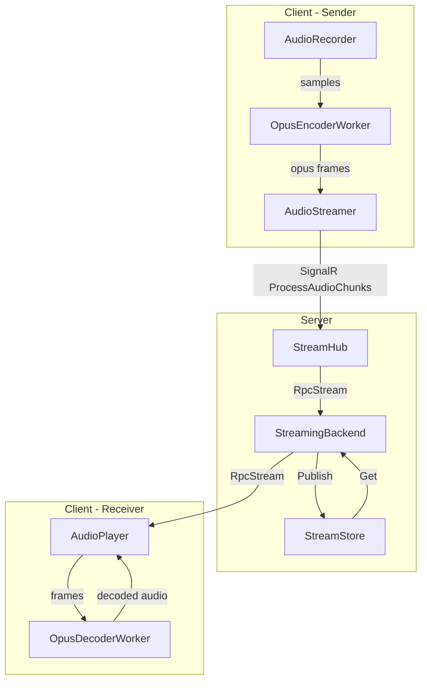
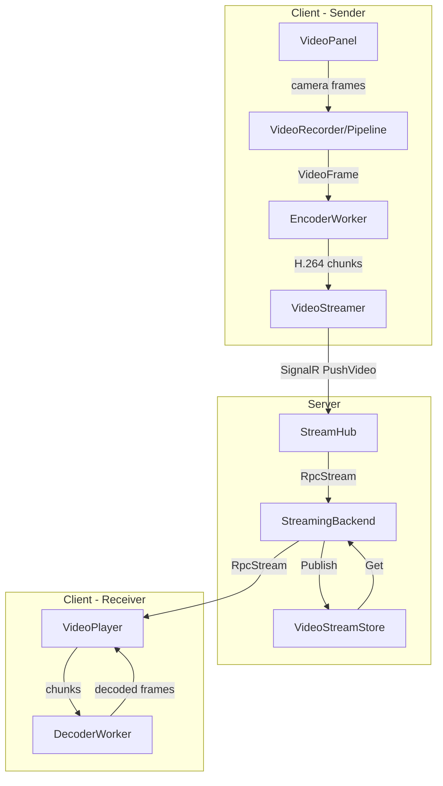

# Video Streaming Implementation Plan

## Overview

Implement real-time video streaming in chat so all participants can view recorded video. This follows the existing audio streaming architecture pattern using SignalR hub and in-memory stream storage with memoization.

## Requirements Summary

- **Real-time video streaming** (like audio) - participants see video live as it's being recorded
- **Separate video entry type** - not mixed with chat entries, but linked via timestamps for audio sync
- **In-memory storage** using StreamStore with memoization (like audio)
- **Timestamps for audio synchronization** - to be implemented later but architecture should support it
- **Blob storage in chunks** - for future persistence (not in first phase)

## Current Architecture Analysis

### Audio Streaming Flow (Reference)



### Proposed Video Streaming Flow



## Implementation Plan

### Phase 1: Server-Side Infrastructure

#### 1.1 Create VideoFrame and VideoRecord Types

**File: `src/dotnet/Api/Video/VideoFrame.cs`** (New)

```csharp
namespace ActualChat.Video;

[DataContract, MemoryPackable]
public partial class VideoFrame : MediaFrame
{
    [DataMember, MemoryPackOrder(4)]
    public override TimeSpan Offset { get; init; }
    
    [DataMember, MemoryPackOrder(5)]
    public override TimeSpan Duration { get; init; }
    
    [DataMember, MemoryPackOrder(6)]
    public override bool IsKeyFrame { get; init; }
    
    [DataMember, MemoryPackOrder(7)]
    public string Codec { get; init; } = "avc1"; // H.264 by default
    
    [DataMember, MemoryPackOrder(8)]
    public int Width { get; init; }
    
    [DataMember, MemoryPackOrder(9)]
    public int Height { get; init; }
    
    [DataMember, MemoryPackOrder(10)]
    public int SequenceNumber { get; init; }
}
```

**File: `src/dotnet/Streaming.Contracts/VideoRecord.cs`** (New)

```csharp
namespace ActualChat.Streaming;

[DataContract, MemoryPackable]
public sealed partial record VideoRecord(
    [property: DataMember, MemoryPackOrder(0)] StreamId StreamId,
    [property: DataMember, MemoryPackOrder(1)] Session Session,
    [property: DataMember, MemoryPackOrder(2)] ChatId ChatId,
    [property: DataMember, MemoryPackOrder(3)] double ClientStartOffset,
    [property: DataMember, MemoryPackOrder(4)] string Codec,
    [property: DataMember, MemoryPackOrder(5)] int Width,
    [property: DataMember, MemoryPackOrder(6)] int Height,
    [property: DataMember, MemoryPackOrder(7)] StreamId? AudioStreamId // For sync
) : IHasId<StreamId>, IHasNodeRef;
```

#### 1.2 Extend IStreamingBackend Interface

**File: `src/dotnet/Streaming.Contracts/IStreamingBackend.cs`** (Modify)

Add video streaming methods:

```csharp
public interface IStreamingBackend : IRpcService, IBackendService
{
    // Existing audio methods...
    
    // New video methods
    Task<RpcStream<byte[]>?> GetVideo(
        StreamId streamId,
        TimeSpan skipTo,
        CancellationToken cancellationToken);
    
    // Simple push - no processing like transcription, just publish for real-time viewing
    Task PushVideo(
        VideoRecord record,
        RpcStream<byte[]> videoStream,
        CancellationToken cancellationToken);
}
```

#### 1.3 Extend StreamHub for Video

**File: `src/dotnet/Streaming.Service/Services/StreamHub.cs`** (Modify)

Add video push method (simpler than audio since no transcription/translation processing):

```csharp
// SignalR hub method for pushing video stream
// Named PushVideo (not ProcessVideoChunks) because we're not processing - just forwarding
public async Task PushVideo(
    string sessionToken,
    string? chatId,
    string codec,
    int width,
    int height,
    double clientStartOffset,
    string? audioStreamId,
    IAsyncEnumerable<byte[]> videoStream)
{
    var chatIdTyped = ChatId.Parse(chatId);
    var audioStreamIdTyped = audioStreamId.IsNullOrEmpty() 
        ? (StreamId?)null 
        : StreamId.Parse(audioStreamId);
    var httpContext = Context.GetHttpContext()!;
    var session = GetSessionFromToken(sessionToken) ?? httpContext.GetSessionFromCookie();

    using var stopCts = CreateStopTokenSource(httpContext);
    if (stopCts.IsCancellationRequested)
        return;

    // Video can be longer than audio
    stopCts.CancelAfter(Constants.Video.MaxEntryDuration + TimeSpan.FromSeconds(5));
    
    var nodes = MeshWatcher.State.Value.LiveNodesByRole[HostRole.VideoBackend];
    if (nodes.Length == 0) {
        Log.LogError("No nodes serving {Role} role!", HostRole.VideoBackend);
        return;
    }

    var nodeRef = _preferThisNode ? MeshWatcher.ThisNode.Ref : nodes.GetRandom().Ref;
    var streamId = StreamId.New(nodeRef);
    var videoRecord = new VideoRecord(
        streamId, session, chatIdTyped, clientStartOffset, 
        codec, width, height, audioStreamIdTyped);
    
    Log.LogInformation("PushVideo: {VideoRecord}", videoRecord);
    
    // Simply forward the raw video stream to backend for publishing
    // No processing like transcription - just publish for real-time viewing
    var stream = videoStream.SuppressCancellation(stopCts.Token);
    var rpcStream = RpcStream.New(stream);
    
    await Backend
        .PushVideo(videoRecord, rpcStream, CancellationToken.None)
        .SilentAwait(false);
}
```

#### 1.4 Implement StreamingBackend Video Methods

**File: `src/dotnet/Streaming.Service/Backend/StreamingBackend.cs`** (Modify)

Add video stream store and methods:

```csharp
public partial class StreamingBackend : IStreamingBackend, IDisposable
{
    private readonly StreamStore<byte[]> _audioStreams;
    private readonly StreamStore<byte[]> _videoStreams; // New
    private readonly StreamStore<TranscriptDiff> _transcriptStreams;
    
    public StreamingBackend(IServiceProvider services)
    {
        // ... existing code ...
        
        _videoStreams = new StreamStore<byte[]> {
            StreamIdValidator = ValidateStreamId,
            StreamCount = AppMeters.VideoStreamCount,
            ExpirationDelay = VideoSettings.StreamExpirationDelay,
            Log = services.LogFor($"{typeFullName}.VideoStreams"),
        };
    }
    
    public virtual async Task<RpcStream<byte[]>?> GetVideo(
        StreamId streamId, 
        TimeSpan skipTo, 
        CancellationToken cancellationToken)
    {
        var stream = await _videoStreams.Get(streamId, cancellationToken).ConfigureAwait(false);
        if (stream == null)
            return null;

        stream = SkipToKeyFrame(stream, skipTo, cancellationToken);
        return RpcStream.New(stream);
    }
}
```

**File: `src/dotnet/Streaming.Service/Backend/StreamingBackend.PushVideo.cs`** (New)

```csharp
namespace ActualChat.Streaming;

public partial class StreamingBackend
{
    // Simple push - no processing like transcription, just publish for real-time viewing
    public virtual async Task PushVideo(
        VideoRecord record,
        RpcStream<byte[]> videoStream,
        CancellationToken cancellationToken)
    {
        ValidateStreamId(record.StreamId);
        Log.LogTrace(nameof(PushVideo) + ": record #{StreamId} = {Record}", record.StreamId, record);
        
        var delayedCts = cancellationToken.CreateDelayedTokenSource(Constants.Video.CancellationDelay);
        var delayedCancellationToken = delayedCts.Token;
        
        try {
            var stream = videoStream.AsAsyncEnumerable();
            await PushVideoInternal(record, stream, delayedCancellationToken)
                .ConfigureAwait(false);
        }
        catch (Exception e) when (e is not OperationCanceledException) {
            Log.LogError(e, "Error pushing video stream {StreamId}", record.StreamId);
            throw;
        }
        finally {
            delayedCts.CancelAndDisposeSilently();
        }
    }
    
    private async Task PushVideoInternal(
        VideoRecord record,
        IAsyncEnumerable<byte[]> videoChunks,
        CancellationToken cancellationToken)
    {
        var beginsAt = Clocks.SystemClock.Now;
        var rules = await Chats.GetRules(record.Session, record.ChatId, cancellationToken)
            .ConfigureAwait(false);
        rules.Require(ChatPermissions.Write);

        var author = await Authors
            .EnsureJoined(record.Session, record.ChatId, cancellationToken)
            .ConfigureAwait(false);

        var recordedAt = default(Moment) + TimeSpan.FromSeconds(record.ClientStartOffset);
        
        // Create video header with codec info
        var header = new VideoStreamHeader(
            beginsAt, 
            record.Codec, 
            record.Width, 
            record.Height,
            record.AudioStreamId);
        
        // Prepend header to video stream
        var streamWithHeader = videoChunks.Prepend(header.Serialize());
        
        // Publish video stream for real-time viewing
        // No processing - just forward to StreamStore for memoization
        await _videoStreams.Publish(record.StreamId, streamWithHeader).ConfigureAwait(false);
        
        // Create video entry in chat (similar to audio entry)
        var videoEntryId = VideoEntryId.New(record.ChatId, 0);
        var command = new ChatsBackend_ChangeEntry(
            videoEntryId,
            null,
            Change.Create(new ChatEntryDiff {
                AuthorId = author.Id,
                Content = "",
                StreamId = record.StreamId.Value,
                BeginsAt = beginsAt,
                ClientSideBeginsAt = recordedAt,
            }));
        
        var videoEntry = await Commander.Call(command, true, cancellationToken)
            .ConfigureAwait(false);
        
        // Wait for stream to complete and finalize entry
        // ... similar to audio finalization
    }
}
```

### Phase 2: Client-Side Video Streaming

#### 2.1 Create VideoStreamer Class

**File: `src/dotnet/UI.Blazor.App/Services/Video/video-streamer.ts`** (New)

Similar to [`audio-streamer.ts`](src/dotnet/UI.Blazor.App/Components/AudioRecorder/workers/audio-streamer.ts):

```typescript
import * as signalR from '@microsoft/signalr';
import { MessagePackHubProtocol } from '@microsoft/signalr-protocol-msgpack';
import { HubConnectionState } from '@microsoft/signalr';
import Denque from 'denque';
import { EventHandlerSet } from 'event-handling';
import { Log } from 'logging';

const { debugLog, infoLog, warnLog, errorLog } = Log.get('VideoStreamer');

export interface VideoStreamConfig {
    codec: string;
    width: number;
    height: number;
    audioStreamId?: string;
}

export class VideoStream {
    private readonly chunks = new Denque<Uint8Array>();
    private readonly chunkAdded = new EventHandlerSet<void>();
    
    public isCompleted = false;
    public isDisposed = false;
    public readonly whenDisposed: Promise<void>;
    
    constructor(
        private readonly sessionToken: string,
        private readonly chatId: string,
        private readonly config: VideoStreamConfig,
        private streamAfter?: Promise<void>,
    ) {
        this.whenDisposed = this.stream();
    }
    
    public addChunk(chunk: Uint8Array): void {
        if (this.isCompleted) return;
        this.chunks.push(chunk);
        this.chunkAdded.trigger();
    }
    
    public complete(): void {
        this.isCompleted = true;
        this.chunkAdded.trigger();
    }
    
    private async stream(): Promise<void> {
        if (this.streamAfter) {
            await this.streamAfter;
        }
        
        let subject: signalR.Subject<Array<Uint8Array>> | null = null;
        const chunksToSend = new Array<Uint8Array>();
        
        while (!this.isDisposed) {
            try {
                if (subject === null || !VideoStreamer.isConnected) {
                    await VideoStreamer.ensureConnected();
                    if (this.isDisposed) return;
                    
                    subject = new signalR.Subject<Array<Uint8Array>>();
                    // Use PushVideo - simple forwarding, no processing
                    await VideoStreamer.connection.send(
                        'PushVideo',
                        this.sessionToken,
                        this.chatId,
                        this.config.codec,
                        this.config.width,
                        this.config.height,
                        Date.now() / 1000,
                        this.config.audioStreamId,
                        subject
                    );
                }
                
                while (VideoStreamer.isConnected && !this.isDisposed) {
                    chunksToSend.length = 0;
                    
                    while (chunksToSend.length < 10) {
                        const chunk = this.chunks.shift();
                        if (chunk) {
                            chunksToSend.push(chunk);
                        } else if (this.isCompleted || chunksToSend.length > 0) {
                            break;
                        } else {
                            await this.chunkAdded.whenNext();
                        }
                    }
                    
                    if (chunksToSend.length > 0) {
                        subject.next(chunksToSend);
                    }
                    
                    if (this.isCompleted && this.chunks.length === 0) {
                        subject.complete();
                        this.isDisposed = true;
                    }
                }
            } catch (error) {
                subject = null;
                warnLog?.log('stream error:', error);
            }
        }
    }
}

export class VideoStreamer {
    public static connection: signalR.HubConnection;
    public static readonly streams = new Array<VideoStream>();
    public static lastStream: VideoStream | null = null;
    
    public static init(hubUrl: string): void {
        if (this.connection) return;
        
        this.connection = new signalR.HubConnectionBuilder()
            .withUrl(hubUrl, {
                skipNegotiation: true,
                transport: signalR.HttpTransportType.WebSockets,
            })
            .withAutomaticReconnect()
            .withHubProtocol(new MessagePackHubProtocol())
            .build();
        
        this.connection.start();
    }
    
    public static get isConnected(): boolean {
        return this.connection?.state === HubConnectionState.Connected;
    }
    
    public static async ensureConnected(): Promise<void> {
        while (!this.isConnected) {
            if (this.connection.state === HubConnectionState.Disconnected) {
                await this.connection.start();
            }
            await new Promise(r => setTimeout(r, 100));
        }
    }
    
    public static addStream(
        sessionToken: string, 
        chatId: string, 
        config: VideoStreamConfig
    ): VideoStream {
        const stream = new VideoStream(
            sessionToken, 
            chatId, 
            config, 
            this.lastStream?.whenDisposed
        );
        this.lastStream = stream;
        this.streams.push(stream);
        return stream;
    }
}
```

#### 2.2 Integrate VideoStreamer with VideoPipeline

**File: `src/dotnet/UI.Blazor.App/Services/Video/services/video-pipeline.ts`** (Modify)

Add streaming capability to the pipeline:

```typescript
// Add to PipelineConfig
export interface PipelineConfig {
    // ... existing config ...
    
    // Streaming configuration
    streaming?: {
        enabled: boolean;
        sessionToken: string;
        chatId: string;
        audioStreamId?: string;
    };
}

// In VideoPipeline class, modify onEncoderEncodedChunk:
private onEncoderEncodedChunk = async (chunkData: EncodedChunkData) => {
    // Existing local transfer/simulation code...
    
    // Stream to server if enabled
    if (this.config.streaming?.enabled && this.videoStream) {
        const chunkBytes = new Uint8Array(chunkData.byteLength);
        chunkData.chunk.copyTo(chunkBytes);
        this.videoStream.addChunk(chunkBytes);
    }
};
```

#### 2.3 Update VideoPanel for Streaming

**File: `src/dotnet/UI.Blazor.App/Components/VideoPanel/video-panel.ts`** (Modify)

Add streaming support:

```typescript
public async startRecording(chatId: string, sessionToken: string): Promise<void> {
    // ... existing code ...
    
    // Configure streaming
    const config: RecordingConfig = {
        // ... existing config ...
        streaming: {
            enabled: true,
            sessionToken,
            chatId,
        }
    };
    
    this.recordingService = new RecordingService(config);
    await this.recordingService.start();
}
```

### Phase 3: Video Playback for Receivers

#### 3.1 Create VideoPlayer Component

**File: `src/dotnet/UI.Blazor.App/Components/VideoPlayer/video-player.ts`** (New)

```typescript
import { Log } from 'logging';
import { rpcClientServer } from 'rpc';
import type { DecoderWorker } from '../../Services/Video/workers/decoder-worker-contract';

export class VideoPlayer {
    private decoderWorker: Worker | null = null;
    private decoder: DecoderWorker | null = null;
    private canvas: HTMLCanvasElement;
    private ctx: CanvasRenderingContext2D;
    
    constructor(canvas: HTMLCanvasElement) {
        this.canvas = canvas;
        this.ctx = canvas.getContext('2d')!;
    }
    
    public async playStream(streamId: string): Promise<void> {
        // Initialize decoder worker
        this.decoderWorker = new Worker('/dist/videoDecoderWorker.js', { type: 'module' });
        this.decoder = rpcClientServer<DecoderWorker>(
            'VideoPlayer.decoder',
            this.decoderWorker,
            {
                onDecodedFrame: async (frame: VideoFrame) => {
                    this.renderFrame(frame);
                    frame.close();
                }
            }
        );
        
        // Fetch video stream from server
        const response = await fetch(`/api/video/stream/${streamId}`);
        const reader = response.body!.getReader();
        
        // Process incoming chunks
        while (true) {
            const { value, done } = await reader.read();
            if (done) break;
            
            // Decode and render
            await this.decoder.decodeChunk({
                chunk: value,
                // ... metadata
            });
        }
    }
    
    private renderFrame(frame: VideoFrame): void {
        this.ctx.drawImage(frame, 0, 0, this.canvas.width, this.canvas.height);
    }
}
```

### Phase 4: Constants and Configuration

#### 4.1 Add Video Constants

**File: `src/dotnet/Api/Constants.Video.cs`** (New)

```csharp
namespace ActualChat;

public static partial class Constants
{
    public static class Video
    {
        public static readonly TimeSpan MaxEntryDuration = TimeSpan.FromMinutes(10);
        public static readonly TimeSpan FrameDuration = TimeSpan.FromMilliseconds(33); // ~30fps
        public static readonly int FrameDurationMs = 33;
        public static readonly TimeSpan CancellationDelay = TimeSpan.FromSeconds(5);
        public static readonly TimeSpan StreamExpirationDelay = TimeSpan.FromSeconds(30);
    }
}
```

## File Changes Summary

### New Files

| File | Description |
|------|-------------|
| `src/dotnet/Api/Video/VideoFrame.cs` | Video frame data structure |
| `src/dotnet/Streaming.Contracts/VideoRecord.cs` | Video recording metadata |
| `src/dotnet/Streaming.Service/Backend/StreamingBackend.ProcessVideo.cs` | Video processing logic |
| `src/dotnet/Api/Constants.Video.cs` | Video-related constants |
| `src/dotnet/UI.Blazor.App/Services/Video/video-streamer.ts` | Client-side video streaming |
| `src/dotnet/UI.Blazor.App/Components/VideoPlayer/video-player.ts` | Video playback component |
| `src/dotnet/UI.Blazor.App/Components/VideoPlayer/VideoPlayer.razor` | Blazor video player |

### Modified Files

| File | Changes |
|------|---------|
| `src/dotnet/Streaming.Contracts/IStreamingBackend.cs` | Add GetVideo and ProcessVideo methods |
| `src/dotnet/Streaming.Service/Services/StreamHub.cs` | Add ProcessVideoChunks method |
| `src/dotnet/Streaming.Service/Backend/StreamingBackend.cs` | Add video stream store |
| `src/dotnet/Api/Media/MediaFrame.cs` | Add VideoFrame to MemoryPackUnion |
| `src/dotnet/UI.Blazor.App/Services/Video/services/video-pipeline.ts` | Add streaming support |
| `src/dotnet/UI.Blazor.App/Services/Video/services/recording-service.ts` | Add streaming config |
| `src/dotnet/UI.Blazor.App/Components/VideoPanel/video-panel.ts` | Integrate streaming |

## Implementation Order

1. **Server-side contracts** - VideoFrame, VideoRecord, IStreamingBackend extensions
2. **Server-side implementation** - StreamHub, StreamingBackend video methods
3. **Client-side streaming** - VideoStreamer class
4. **Pipeline integration** - Connect VideoPipeline to VideoStreamer
5. **VideoPanel updates** - Enable streaming from UI
6. **Video playback** - VideoPlayer for receivers
7. **Testing and refinement**

## Technical Considerations

### Codec Selection
- Primary: H.264 (avc1.640028) - widest browser support
- Future: AV1 for better compression when hardware support improves

### Bandwidth Management
- Target bitrate: 2 Mbps for 720p
- Keyframe interval: 30 frames (1 second)
- Consider adaptive bitrate based on network conditions

### Audio Synchronization
- VideoRecord includes optional AudioStreamId
- Timestamps in VideoFrame.Offset for sync
- Client-side sync logic to be implemented in Phase 2

### Memory Management
- StreamStore expiration: 30 seconds
- Memoization for replay capability
- Proper cleanup on stream completion

## Future Enhancements

1. **Blob storage persistence** - Save video chunks for later playback
2. **Audio-video sync** - Synchronize video with audio streams
3. **Adaptive bitrate** - Adjust quality based on network
4. **Multiple video streams** - Support multiple participants
5. **Screen sharing** - Extend to screen capture
