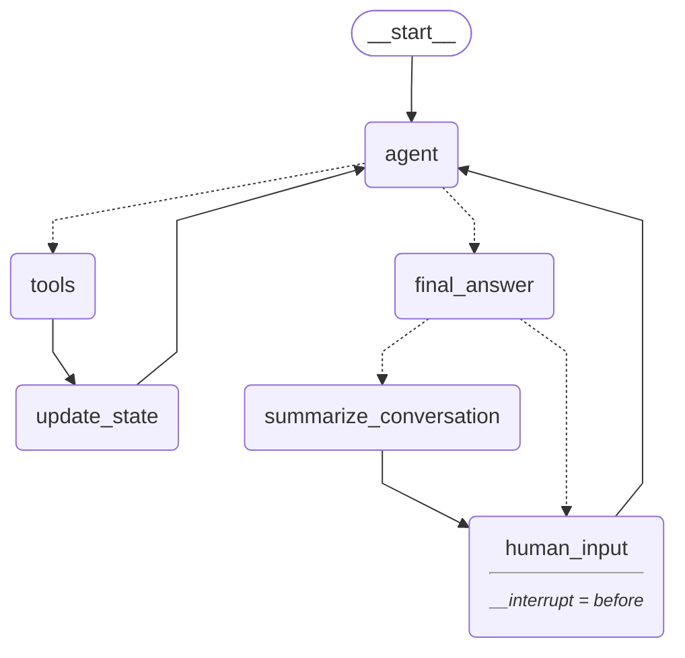

```mermaid
%%{init: {'flowchart': {'curve': 'linear'}}}%%
graph TD;
        __start__([<p>__start__</p>]):::first
        agent(agent)
        tools(tools)
        update_state(update_state)
        summarize_conversation(summarize_conversation)
        final_answer(final_answer)
        human_input(human_input<hr/><small><em>__interrupt = before</em></small>)
        __start__ --> agent;
        human_input --> agent;
        summarize_conversation --> human_input;
        tools --> update_state;
        update_state --> agent;
        agent -.-> tools;
        agent -.-> final_answer;
        final_answer -.-> summarize_conversation;
        final_answer -.-> human_input;
        classDef default fill:#f2f0ff,line-height:1.2
        classDef first fill-opacity:0
        classDef last fill:#bfb6fc
```
