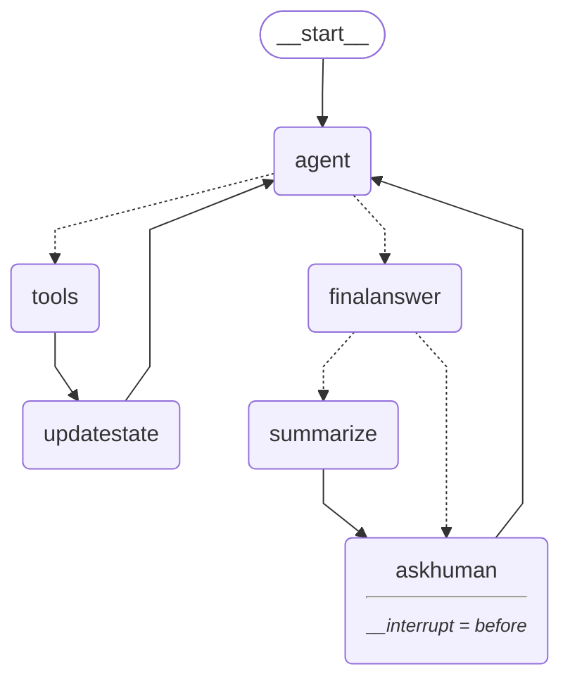

```mermaid
%%{init: {'flowchart': {'curve': 'linear'}}}%%
graph TD;
        __start__([<p>__start__</p>]):::first
        agent(agent)
        tools(tools)
        updatestate(updatestate)
        summarize(summarize)
        finalanswer(finalanswer)
        askhuman(askhuman<hr/><small><em>__interrupt = before</em></small>)
        __start__ --> agent;
        askhuman --> agent;
        summarize --> askhuman;
        tools --> updatestate;
        updatestate --> agent;
        agent -.-> tools;
        agent -.-> finalanswer;
        finalanswer -.-> summarize;
        finalanswer -.-> askhuman;
        classDef default fill:#f2f0ff,line-height:1.2
        classDef first fill-opacity:0
        classDef last fill:#bfb6fc
```
