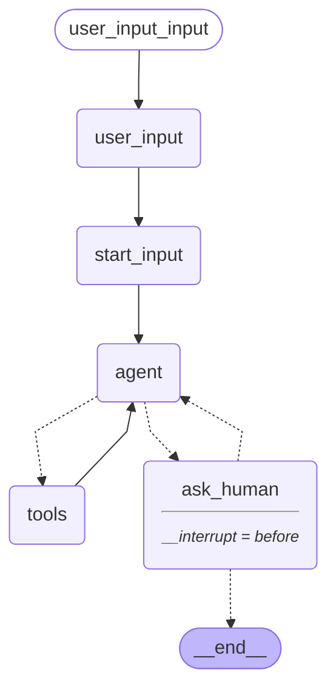

```mermaid
%%{init: {'flowchart': {'curve': 'linear'}}}%%
graph TD;
        user_input_input([user_input_input]):::first
        user_input(user_input)
        agent(agent)
        tools(tools)
        start_input(start_input)
        ask_human(ask_human<hr/><small><em>__interrupt = before</em></small>)
        __end__([<p>__end__</p>]):::last
        user_input_input --> user_input;
        start_input --> agent;
        tools --> agent;
        agent -.-> tools;
        agent -.-> ask_human;
        ask_human -.-> agent;
        ask_human -.-> __end__;
        user_input --> start_input;
        classDef default fill:#f2f0ff,line-height:1.2
        classDef first fill-opacity:0
        classDef last fill:#bfb6fc
```
